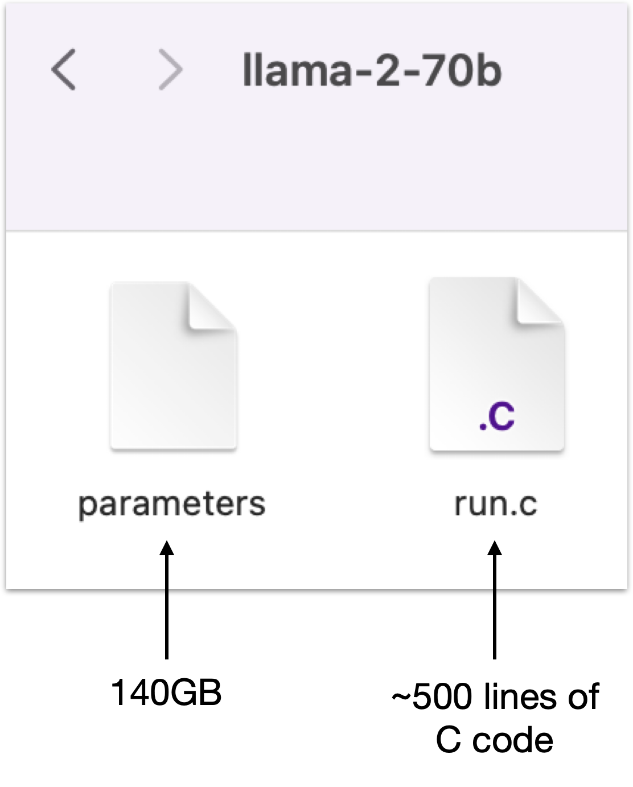
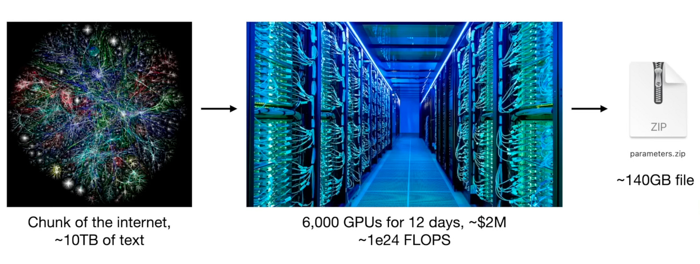
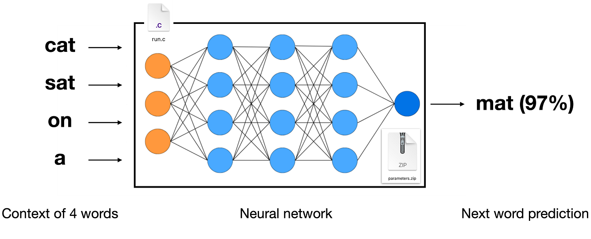

# 0x00. 导读

[为忙碌人士准备的大语言模型（LLM）速览](https://baoyu.io/translations/llm/introduction-to-large-language-models-llms)

# 0x01. 简介

# 0x02. 大语言模型是什么？

大语言模型其实比大家想的还要简单，它本质上就是计算机里的两个文件。

## 2.1 Llama2-70b 模型

例如 Meta AI 的 Llama2-70b 模型。这是 Llama 系列中的一款大语言模型。Llama2-70b 是该系列的第二代产品，它有着高达 700 亿 (70 billion) 个参数。Llama 系列包括多款不同参数量的模型，有 70 亿 (7 billion)，130 亿 (13 billion)，340 亿 (34 billion) 以及 700 亿 (70 billion) 参数的。

Llama2-70b 如此受欢迎，主要是因为它可能是目前公开可用的最强大的模型。Meta AI 不只是发布了这个模型，他们还把模型的权重、架构乃至相关论文都公开了。这种做法与其他一些语言模型（比如 OpenAI 的 ChatGPT）大相径庭。虽然你可以通过网页界面使用 ChatGPT，但你并不能真正接触到模型本身。

Llama2-70b 模型其实只由两个文件组成，存在于你的电脑文件系统中：参数文件和运行文件。参数文件可以说是包含了模型的“大脑”——也就是构成语言模型的神经网络的权重或参数。而 run.c 文件则是一种代码，负责让这些参数发挥作用。

这个模型的每个参数都是用两个字节来储存的，所以整个参数文件的大小高达 140 GB(70,000,000,000 * 2 / 1000 / 1000 / 1000=140GB)。之所以用两个字节，是因为它们是 16 位浮点数（float16）。除了这些参数外，你还需要一些代码来运行这个神经网络，这就是运行文件的用处。这个文件可以是 C 语言文件、Python 文件或者任何其他编程语言的文件，但简单起见，我们假设它是用 C 语言编写的。你大概只需要大约 500 行的 C 语言代码，不依赖于其他任何东西，就能利用这些参数来实现神经网络的架构。

所以，要启动和运行 Llama2-70b 模型，你的电脑上只需要这两个文件——这就是你需要的全部配置，一个完整独立的套件。你不需要连接互联网或其他任何设备。只需编译你的 C 语言代码，生成一个二进制文件，你就可以开始与这个语言模型进行交互了。例如，如果你想测试它的创造力，你可以让它围绕一个特定主题写一首诗。模型会根据你的指示开始生成文本，很快，一首诗就呈现在你面前了。

**模型推理**，也就是运行 run.c 文件里所描述的 Llama2-70b 模型，看起来可能很复杂，但其实意外地简单。run.c 文件包含操作神经网络的代码，涵盖了架构的实施和神经网络的前向传播，这些都是可以通过算法来理解并且开放获取的。但模型的神奇之处真正蕴藏在它的参数里。这些参数赋予了模型理解和生成语言的能力，而获取这些参数才是真正的挑战和复杂之所在。这些参数是通过一种广泛而复杂的过程得到的，那就是**模型训练**。

正是在这个阶段，模型才真正展现出生命力，与模型推理形成鲜明对比。

# 0x03. 训练一个大语言模型

训练像 Llama2-70b 这种大语言模型是一项艰巨的任务，就像是在压缩互联网的一个重要部分。多亏了 Meta AI 对 Llama2-70b 的开放性，我们可以通过他们发布的信息，清楚地了解到训练过程的全貌。

## 3.1 训练的首阶段：预训练

想象一下，训练过程从大约 10 TB（TB = 10 亿 GB）的文本开始，这些文本大多来自于对互联网的全面抓取。想象一下，这就像从无数网站搜集了一座巨大的文本山。

接着，这些数据会被输入到一个 GPU 集群中，这是一组专门用于处理如神经网络训练等高强度计算任务的电脑。以 Llama2-70b 为例，需要约 6000 个 GPU 持续运转约 12 天，耗资约 200 万美元。通过这一过程，我们将这庞大的互联网数据压缩成一个 140 GB 的参数文件，有点像互联网的“zip 文件”，尽管它是有损压缩的。这种压缩的比例大约是 100 倍，但它并非真正的 zip 文件，因为 zip 是无损的。与 zip 文件不同，它不是完美的复制品，这些参数更多地是捕捉我们训练文本的精髓，而不是精确复制。

现代的训练过程可能耗资数千万甚至数亿美元，涉及更大的数据集和计算集群。但一旦拥有了这些参数，运行这些神经网络在计算上就相对便宜了。

## 3.2 神经网络的预测魔力

神经网络到底有何神奇之处呢？它的核心功能是预测文本序列中的下一个词。想象一下，把一串词，比如“cat sat on a（猫坐在一个）”，输入这个网络。这个网络包含了众多参数，由不同方式连接的神经元组成，对输入的词汇进行响应。最终，它会预测出下一个词。例如，在我们的例子中，神经网络可能会以 97% 的概率预测下一个词是“mat（垫子）”。

这就是一个下一个词预测的神经网络：输入一些词，它就会告诉你接下来的词。

这个训练过程带来的成果非常惊人。表面上简单的下一个词预测任务，实则拥有巨大的能力。它促使神经网络吸收大量关于世界的知识，并存储在其参数中。例如，考虑一下关于 Ruth Handler 的网页。为了预测下一个词，神经网络需要理解 Ruth Handler 的各种信息，包括她的生卒年月、身份、成就等等。

通过预测下一个词的方式，神经网络深入学习了关于世界的信息，并将这些知识密集地储存在其参数里。

## 3.3 深入了解神经网络如何运作

神经网络的吸引人之处在于，我们对它们的架构有全面的了解。我们清楚知道在每一个步骤中都会进行哪些精确的数学运算。然而，真正的挑战在于网络中庞大的参数数量——我们谈论的是高达数百亿个的参数。这些参数是网络的核心，尽管我们了解如何逐步调整这些参数来提升网络在下一个词预测上的表现，但它们在整个过程中的具体作用和相互协作仍旧带有一定的神秘色彩。

我们知道如何优化这些参数，并随着时间的推移调整它们以更准确地预测下一个词，但这些参数如何协同作用以达到这一目标，目前仍不十分明了。我们有模型和理论推测，这些参数可能在构建和维护某种类型的知识数据库，但这一点也不是那么直观。这些网络里的知识可能表现得很奇特，且往往是单一维度的。

大语言模型（LLMs）在本质上是一种深不可测的工具，与传统工程领域的其他产物迥然不同。它们并不像汽车那样，每个部件都清楚明了、有序排列。相反，大语言模型是通过长时间的优化过程形成的，我们对它们的内部机制的理解还在不断进化中。有一个专门的领域，被称为可解释性或机械式可解释性，致力于解析神经网络的每一部分是如何工作的。虽然我们能够获得一些洞见，但要完全理解它们，还有很长的路要走。

**目前，我们把这些神经网络当作是基于经验的工具来对待。我们向其输入数据，观察其输出，并根据它们在不同情境下生成的文本来评估它们的表现。**因此，与这些模型的工作需要进行复杂而细致的评估，这是一个逐步探索和理解的过程。

## 0x04. 深入训练，走向实用化的第二阶段

在我们深入了解神经网络的过程中，我们大多关注它们在互联网文档生成方面的作用。但其实，这些模型的能力远不止于此。现在，我们正步入训练的关键第二阶段 —— 精调，这一阶段将把这些网络从简单的内容生成器转变成更具实用性的 AI 助手。

目前为止，我们观察到神经网络能够生成类似互联网上的文本内容，这被称为预训练阶段。但对于许多任务来说，仅仅生成文本是远远不够的。更有价值的是，能够回答问题并基于这些问题提供信息的 AI 助手模型。

开发这类 AI 助手的过程非常有趣。优化过程依然聚焦于下一个单词预测任务，但数据集发生了变化。与其在海量的互联网文档上进行训练，不如转向更为专门且手动收集的数据集。

那么，这些新训练集是如何构建的呢？这需要很多人的参与。通常，公司会组建专门团队来整理这些数据集。这些团队按照详细的标注指引工作，负责提出问题并设计合适的答案。

比如，训练数据可能是这样的：一个用户问，“能否写一段关于经济学中‘垄断性买方市场’重要性的简介？”然后，根据标注指引，有人会编写 AI 助手应给出的理想答案。这些答案的性质和质量都受到了像 OpenAI 或 Anthropic 这样的公司工程师提供的详细指导文件的影响。

在神经网络向 AI 助手演变的过程中，**微调 (fine-tuning)** 是一个关键步骤。这个步骤的核心是改变训练数据集的内容。我们不再使用预训练 (pre-training) 阶段的普通互联网文本，而是转向专注于问答 (Q&A) 文档。正是这种训练材料的改变，让我们得以构建所谓的助手模型。

在微调过程中，神经网络学习如何适应这些新的训练文档格式。微调后的模型会理解它应当以一个助手的身份提供帮助。这种能力非常惊人，尤其是当这个具体问题可能并未出现在其训练集中时。模型能够逐字逐句地生成回答，制造出与问题相匹配的答复。

这些模型如何能够从制造普通互联网内容转变为一个有帮助的助手，这一点仍然充满神奇。它们通过在微调阶段吸收问答文档的风格和结构来实现这种转变。更令人印象深刻的是，它们依然保持并运用了在预训练阶段积累的丰富知识。

简单来说，预训练阶段是在大量互联网数据上进行训练，主要目的是知识积累。而微调阶段则专注于对齐和调整，把模型的输出从普通的互联网文本转变为更具针对性、更像助手的问答格式。

总结来说，打造像 ChatGPT 这样的产品，包含了两个关键阶段。首先是预训练阶段，这时网络被大量互联网文本所充斥。此过程需要用到 GPU 集群，这些专业计算机专为并行处理任务而设计。它们远非日常电脑，而是价格高昂的高端设备。在此阶段，互联网文本被压缩进神经网络的参数中，通常耗资上百万美元。这样，我们就得到了基础模型，一个计算成本极高的过程，通常由公司每年甚至更少频率进行，主要因为涉及的成本。

基础模型开发完毕后，接下来是精调阶段，这个阶段的计算需求相对较低。重点转向如何定义 AI 助理的行为。这包括编写具体的标注指令，并雇用人员制作符合这些指令的文档。例如，可能需要收集 10 万条高质量的理想问答，用于对基础模型进行精调。这个过程不仅成本更低，而且速度更快——可能只需一天，而预训练阶段则需几个月。其成果是一款高效的助理模型。

一旦助理模型准备就绪，它就会经历评估、部署和持续监控。针对每一次不当行为，都会采取相应的纠正措施。这一过程包括对助理给出错误回应的对话进行改写，以正确的回应取代。这些改正后的回应随后纳入训练数据，使得下一轮精调时，模型能在这些特定场景下得到改善。由于精调成本较低，它让公司能够更频繁地迭代更新，使 AI 模型相较于预训练阶段能够更加规律地得到优化。

值得一提的是 Meta 在其 Llama 2 系列中采取的策略。Meta 发布此系列时，不仅包含了基础模型，还有可直接用于问答应用的助理模型。尽管基础模型不适合直接回答问题（它们更多生成问题或无关内容，因为本质上是互联网文档采样器），但它们仍具有重要价值。Meta 承担了开发过程中成本高昂、资源密集的第一阶段，为其他人提供了坚实的基础，进一步精调提供了广阔的自由度。此外，Meta 还发布了可立即用于问答应用的助理模型。

这一不断进步的迭代过程以及微调模型的能力，极大地提高了发展 AI 助手的灵活性和效率。公司通过定期更新和精细化这些模型，可以持续提高 AI 的性能，使其在交互中更加迅速、精准。

# 0x05. 人类反馈驱动的增强学习：训练的新阶段

在预训练和微调之后，我们可以引入一个可选的新阶段：**人类反馈驱动的增强学习（Reinforcement Learning from Human Feedback，简称 RLHF）**，这是 OpenAI 的一项创新做法。这一阶段采用了一种别具一格的方式 —— 运用比较标签 —— 为 AI 模型的提升增添了新的维度。

具体做法是这样的：对于人类标注者而言，比起从零开始创造答案，比较现有的可能答案通常更为简单。例如，让我们设想这样一个任务：编写关于回形针的俳句。对标注者来说，空手起家写一首俳句可能相当具有挑战性。但如果向他们展示几首由第二阶段的助手模型创作的俳句，他们的任务就简化了许多。他们可以评估这些选项，选择最符合标准的一首。这种比较方法是第三阶段微调的核心，它通过在已生成选项之间进行选择，进一步完善模型。

这一新增的微调阶段，通过比较方法，为训练过程增加了新的维度，使得基于人类的判断和偏好，模型得以进行更细致和精准的调整。

# 0x06. AI 语言模型的竞争版图：专有模型对抗开源模型

深入了解 AI 语言模型的世界，我们可以看到不同模型间的竞争态势。在性能榜单的顶端，是那些专有模型。这些模型属于封闭类型，它们的权重数据对外界保密。通常，这些模型只能通过网络界面来使用。OpenAI 的 GPT 系列和 Anthropic 的 Claude 系列便是这类模型的代表。除此之外，还有许多其他公司推出的顶级模型也不容小觑。

紧随其后的是拥有开放权重的模型，这类模型的特点是透明度高，相关信息和研究论文对公众开放。Meta 的 Llama 2 系列就是这一类别的实例。而在这些模型之下，你可能会发现像法国初创公司推出的 Mistral 系列中的 Zephyr 7b beta 这样的模型。

从当前的 AI 生态系统来看，封闭的专有模型在性能上往往占据上风。但它们的局限在于，你无法直接对这些模型进行微调或下载。用户通常只能通过网络界面来使用这些模型。而开源模型及其生态系统则紧随其后。尽管这些模型的表现通常不及封闭模型，但在特定应用场景下，它们或许已足够满足需求。

当前，开源社区正致力于提高性能，以跟上专有模型的发展速度。这一趋势为 AI 行业带来了一个有趣的现象：开源项目持续进化，力图达到专有模型设定的标准。

# 0x07. 大语言模型的多模态革新：从视觉到音频的跨越

ChatGPT 现在不仅能够生成图像，还能理解它们，这标志着它在多模态领域的一大飞跃。多模态不只是把文本和其他媒介结合起来，它在丰富我们与大语言模型的互动方面起着关键作用。比如，ChatGPT 不仅能创造出图像，还能解析这些图像。

# 0x08. 推动大语言模型前进：走向分析性思维和自我提升

我们的目标是创造一种“思维树”，在这个树上，模型能够对问题进行深思、重新考虑和表述，最终以更高的确信度提出答案。理想状态下，当我们在时间（x 轴）与回答准确度（y 轴）之间作图时，我们希望看到一个逐渐上升的函数 —— 这是一种尚未实现但已经引起了广泛关注的能力。

# 0x09. 量身定制语言模型：为特定任务打造专用 AI

在大语言模型的发展中，另一个重要方向是定制化。不同行业中的多样化任务需求表明，这些模型需要变成特定领域的专家。最近，OpenAI 的 Sam Altman 宣布了 ChatGPT 应用商店，这是朝着这个方向迈出的一大步。这一举措意味着为大语言模型增添了一层定制化的选择。

通过 ChatGPT 应用商店，用户可以打造属于他们自己的 GPT 版本。目前的定制选项包括设置特定的指令或通过上传文件来扩展模型的知识库。这些文件启用了“检索增强生成”（RAG）的功能，使得 ChatGPT 能够参考上传的文件中的文本片段来丰富其回答。这就好比 ChatGPT 在浏览这些文件，将它们作为信息获取过程中的参考资料。

