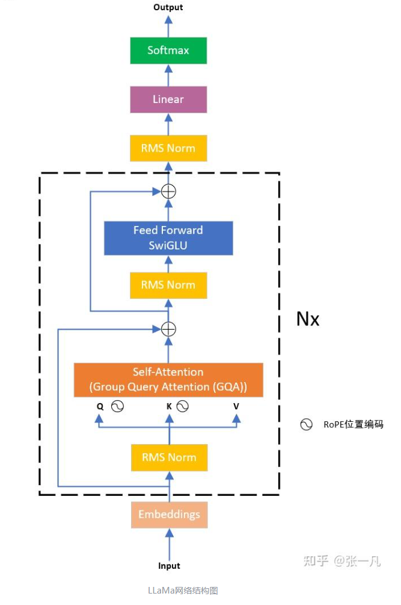

# 0x00. 导读

[一文读懂llama1、llama2、llama3、llama3.1、llama3.2技术细节及实战应用](https://zhuanlan.zhihu.com/p/696571171)

# 0x01. 简介

# 0x02.

Meta 试图证明小模型在足够多的的数据上训练后，效果也能达到甚至超过大模型。

原始的 Transformer 由编码器（Encoder）和解码器（Decoder）两个部分构成。同时 Encoder 和 Decoder 这两部分也可以单独使用，llama 是基于 Transformer Decoder 的架构，在此基础上做了改进。

## 2.1 llama1

- llama 将 layer-norm 改成 RMSNorm(Root Mean square Layer Normalization)，并将其移到 input 层，而不是 output 层。
- 采用SwiGLU激活函数。
- 采用RoPE位置编码。

## 2.2 llama2

- Llama 2 与 Llama 1 的主要结构基本一致同样也是在 transformer decoder 结构上做了 3 大改进：
  - 将 layer-norm 改成 RMSNorm(Root Mean square Layer Normalization)，并将其移到 input 层，而不是 output 层
  - 采用 SwiGLU 激活函数
  - 采用旋转位置嵌入 RoPE。
- Llama 2 上下文长度由之前的 2048 升级到4096，可以理解和生成更长的文本。
- 7B和13B 使用与 LLaMA 相同的架构，34B和70B模型采用分组查询注意力（GQA）。

## 2.3 llama3

Llama 3 中选择了相对标准的纯解码器 decoder-only transformer 架构，总体上与 Llama 2 相比没有重大变化。在 Llama 2 中只有34B,70B使用了分组查询注意 (GQA)，但为了提高模型的推理效率，Llama 3 所有模型都采用 了GQA。

输入上下文长度从 4096（Llama 2）和 2048（Llama 1）增加到 8192。

## 2.4 llama3.1

2024年7月23日，Meta重磅推出Llama 3.1。发布的模型有 8B、70B 和 405B 三个尺寸。其中最受关注的是 Llama 3.1 405B。Meta 表示 Llama 3.1 405B 是目前全球最大、功能最强的公共基础模型，可与 OpenAI 和 Google 开发的顶级模型一争高下。

纯解码器 decoder-only transformer 架构，进行小幅改动以最大化训练稳定性。

## 2.5 llama3.2

Llama 3.2系列涵盖了小型和中型视觉LLM（参数分别为11B和90B）以及适用于边缘和端侧的轻量级纯文本模型（1B和3B），包含了预训练和指令调优版本。（预训练版应该就是基座模型版本，指令调优应该就是对话模型版本）