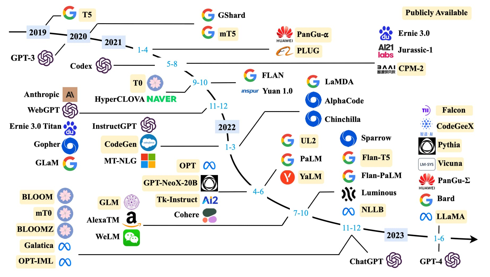
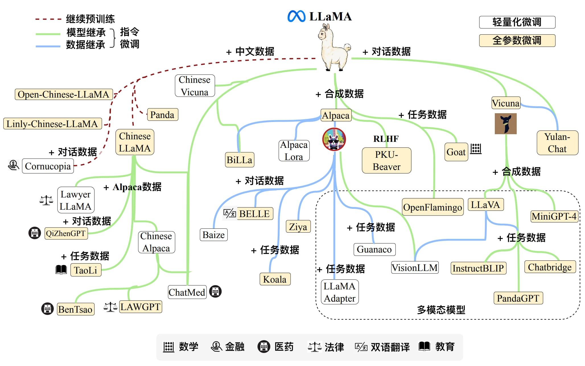
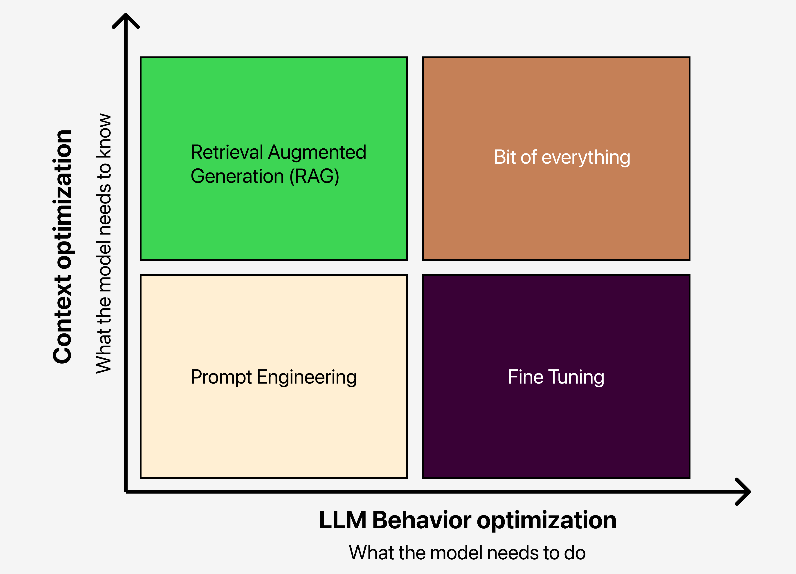

# 0x00. 导读

# 0x01. 简介

NLP = Natural Language Processing, 自然语言处理是人工智能的一个子领域，旨在让计算机理解、生成和操作人类语言。其核心任务包括：

- 基础任务：分词、词性标注、句法分析。
- 应用任务：机器翻译、情感分析、问答系统、文本生成等。
- 终极目标：实现人机自然交互，赋予机器语言智能。
  
NLP 是目标，而统计语言模型和大语言模型是实现这一目标的关键工具。统计语言模型（SLM）是传统方法，基于概率的数学模型，而大语言模型（LLM）是深度学习时代的突破，其通过海量数据和超大参数规模，捕捉语言的深层规律。 LLM 是 SLM 的升级版。

# 0x02. 自然语言处理发展史

自然语言处理的发展大致上可以分为两个阶段：

- 第一阶段：不懂语法怎么理解语言？
- 第二阶段：只要看的足够多，就能处理语言

## 2.1 第一阶段

20 世纪 50 年代到 70 年代，人们对自然语言处理的认识都局限在人类学习语言的方式上，用了二十多年时间苦苦探寻让计算机理解语言的方法，最终却一无所获。

当时的学术界普遍认为，要让计算机处理自然语言必须先让其理解语言，因此分析语句和获取语义成为首要任务，而这主要依靠语言学家人工总结文法规则来实现。特别是 20 世纪 60 年代，基于乔姆斯基形式语言（Chomsky Formal languages）的编译器取得了很大进展，更加鼓舞了研究者通过概括语法规则来处理自然语言的信心。

但是与规范严谨的程序语言不同，自然语言复杂又灵活，是一种上下文有关文法（Context-Sensitive Grammars，CSGs），因此仅靠人工编写文法规则根本无法覆盖，而且随着编写的规则数量越来越多、形式越来越复杂，规则与规则之间还可能会存在矛盾。因此这一阶段自然语言处理的研究可以说进入了误区。

## 2.2 第二阶段

20 世纪 70 年代，随着统计语言学的提出，**基于数学模型和统计方法的自然语言处理方法开始兴起**。当时的代表性方法是 通信系统加隐马尔可夫模型 ，其输入和输出都是一维且保持原有次序的符号序列，可以处理语音识别、词性分析等任务，但是这种方法在面对输出为二维树形结构的句法分析以及符号次序有很大变化的机器翻译等任务时就束手无策了。

20 世纪 80 年代以来，随着硬件计算能力的提高以及海量互联网数据的出现，越来越多的**统计机器学习方法**被应用到自然语言处理领域，例如一些研究者引入基于有向图的统计模型来处理复杂的句法分析任务。2005 年 Google 公司基于统计方法的翻译系统更是全面超过了基于规则的 SysTran 系统。

2006 年，随着辛顿（Hinton）证明深度信念网络（Deep Belief Networks，DBN）可以通过逐层预训练策略有效地进行训练，**基于神经网络和反向传播算法（Back Propagation）的深度学习方法**开始兴起。许多之前由于缺乏数据、计算能力以及有效优化方法而被忽视的神经网络模型得到了复兴。例如 1997 年就已提出的长短时记忆网络（Long Short Term Memory，LSTM）模型在重新被启用后在许多任务上大放异彩。

随着越来越多研究者将注意力转向深度学习方法，诸如卷积神经网络（Convolutional Neural Networks，CNN）等模型被广泛地应用到各种自然语言处理任务中。2017 年，Google 公司提出了 Attention 注意力模型，论文中提出的 Transformer 结构更是引领了后续神经网络语言模型的发展。

得益于抛弃了让计算机简单模仿人类的思路，这一阶段自然语言处理研究出现了蓬勃发展。今天可以说已经没有人再会质疑统计方法在自然语言处理上的可行性。

# 0x03. 统计语言模型

SLM, Statistical Language Models.

要让计算机处理自然语言，首先需要为自然语言建立数学模型，这种模型被称为 **统计语言模型** ，其核心思想是判断一个文字序列是否构成人类能理解并且有意义的句子。统计语言模型是 NLP 的基础，例如，在机器翻译中，统计语言模型用于评估翻译结果的流畅性；在语音识别中，用于选择最可能的词序列。同时 NLP 的需求推动了统计语言模型的改进，从早期的 N-gram 模型到后来的神经网络语言模型（如 RNN、LSTM、Transformer），统计语言模型的性能直接影响 NLP 任务的效果。

## 3.1 马尔可夫假设

20 世纪 70 年代之前，研究者尝试从文字序列是否合乎文法、含义是否正确的角度来建立语言模型。最终，随着人工编写出的规则数量越来越多、形式越来越复杂，对语言模型的研究陷入瓶颈。直到 20 世纪 70 年代中期，IBM 实验室的贾里尼克（Jelinek）为了研究语音识别问题换了一个思路，用一个简单的统计模型就解决了这个问题。

贾里尼克的想法是要判断一个文字序列 $w_1,w_2,…,w_n$ 是否合理，就计算这个句子 $S$ 出现的概率 $P(S)$，出现概率越大句子就越合理：
$$
P(S) = P(w_1,w_2,...,w_n)= P(w_1)P(w_2|w_1)P(w_3|w_1,w_2)...P(w_n|w_1,w_2,...,w_{n-1})\tag{1.1}
$$

其中，词语 $w_n$ 出现的概率取决于：在句子中，出现在它之前的所有词（理论上也可以引入出现在它之后的词语）。但是，随着文本长度的增加，条件概率 $P(w_n\mid w_1,w_2,…,w_{n-1})$ 会变得越来越难以计算，因而在实际计算时会假设每个词语 $w_i$ 仅与它前面的 $N−1$ 个词语有关，即：
$$
P(w_i|w_1,w_2,...,w_{i-1}) = P(w_i|w_{i-N+1},w_{i-N+2},...,w_{i-1})
$$

这种假设被称为马尔可夫（Markov）假设，对应的语言模型被称为 $N$ 元（$N$-gram）模型。例如当 $N=2$ 时，词语 $w_i$ 出现的概率只与它前面的词语 $w_{i−1}$ 有关，被称为二元（Bigram）模型；而 $N=1$ 时，模型实际上就是一个上下文无关模型。由于 $N$ 元模型的空间和时间复杂度都几乎是 $N$ 的指数函数，因此实际应用中比较常见的是取 $N=3$ 的三元模型。

即使是使用三元、四元甚至是更高阶的语言模型，依然无法覆盖所有的语言现象。在自然语言中，上下文之间的关联性可能跨度非常大，例如从一个段落跨到另一个段落，这是马尔可夫假设解决不了的。此时就需要使用 LSTM、Transformer 等模型来捕获词语之间的远距离依赖（Long Distance Dependency）了。

## 3.2 NNLM 模型

神经网络语言模型 (Neural Network Language Model，NNLM) 是使用神经网络建模语言的经典范例。

## 3.3 Word2Vec 模型

真正将神经网络语言模型发扬光大的是 2013 年 Google 公司提出的 Word2Vec 模型。Word2Vec 模型提供的词向量在很长一段时间里都是自然语言处理方法的标配，即使是后来出现的 Glove 模型也难掩它的光芒。

后来自然语言处理的标准流程就是先将 Word2Vec 模型提供的词向量作为模型的输入，然后通过 LSTM、CNN 等模型结合上下文对句子中的词语重新进行编码，以获得包含上下文信息的词语表示。

## 3.4 ELMo 模型

为了更好地解决多义词问题，2018 年研究者提出了 ELMo 模型（Embeddings from Language Models）。与 Word2Vec 模型只能提供静态词向量不同，ELMo 模型会根据上下文动态地调整词语的词向量。

## 3.5 BERT 模型

2018 年底随着 BERT 模型（Bidirectional Encoder Representations from Transformers）的出现，这一阶段神经网络语言模型的发展终于出现了一位集大成者，发布时 BERT 模型在 11 个任务上都取得了最好性能。

## 3.6 大语言模型

除了优化模型结构，研究者发现扩大模型规模也可以提高性能。在保持模型结构以及预训练任务基本不变的情况下，仅仅通过扩大模型规模就可以显著增强模型能力，尤其当规模达到一定程度时，模型甚至展现出了能够解决未见过复杂问题的涌现（Emergent Abilities）能力。例如 175B 规模的 GPT-3 模型只需要在输入中给出几个示例，就能通过上下文学习（In-context Learning）完成各种小样本（Few-Shot）任务，而这是 1.5B 规模的 GPT-2 模型无法做到的。

在规模扩展定律（Scaling Laws）被证明对语言模型有效之后，研究者基于 Transformer 结构不断加深模型深度，构建出了许多大语言模型，如图所示。

优化的双重维度

1. 上下文优化

    上下文优化的核心在于细化模型应掌握的信息。您可以通过以下方式进行：

    - 提示工程（Prompt Engineering）: 在我们的优化矩阵中，提示工程位于左下方象限，是您迅速建立基准的关键。首先微调输入至大语言模型的提示，然后观察性能的变化。
    - 检索增强生成（RAG）: 位于左上方象限的 RAG 增加了更多上下文。可以从简单的检索机制开始，逐步进行微调以实现更细致的优化。
2. 大语言模型行为优化

    深入探讨大语言模型应如何响应的行为优化。主要有两种策略：

    - 微调（Fine-tuning）: 右下象限代表微调，专门针对特定任务调整大语言模型的行为。
    - 综合方法: 有时候，结合所有方法才能达到理想的性能水平。例如，将 HyDE 检索与事实核查步骤相结合。

检索增强生成 (Retrieval-Augmented Generation, RAG) 是指在利用大语言模型回答问题之前，先从外部知识库检索相关信息。RAG 被证明能显著提升答案的准确性，并特别是在知识密集型任务上减少模型的错误输出。通过引用信息来源，用户可以核实答案的准确性，从而增强对模型输出的信任。