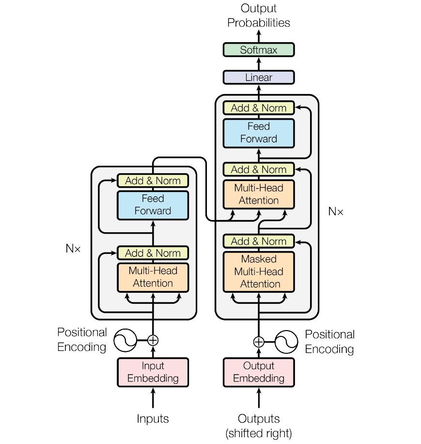
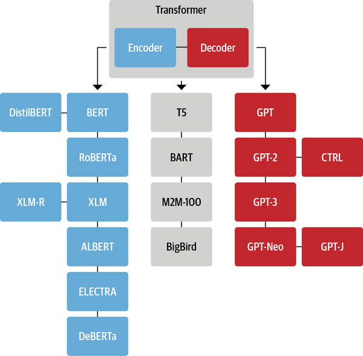

# 0x00. 导读

Transformer架构 已在 TensorFlow、PyTorch 等标准深度学习框架中实现。

Transformers 是由 Hugging Face 制作的一个库，提供基于 Transformer 的架构和预训练模型。

# 0x01. 简介

Transformer 是一种架构，由论文 [Attention is All You Need](https://arxiv.org/abs/1706.03762) 提出，它是现代大语言模型（如 GPT、BERT、PaLM）的核心基础，彻底改变了语言建模的技术范式，Transformer 结构已经替代了循环神经网络 (RNN) 和卷积神经网络 (CNN)，成为了当前 NLP 模型的标配。

transformer: seq2seq model with self-attention.

# 0x02. DeepSeek 的科普

好的！我会用最简单的方式解释 **Transformer**，不涉及复杂数学，只讲核心思想和直观理解。你可以把它想象成一个“超级语言处理工具”，专门用来理解和生成人类语言（比如写文章、翻译、聊天）。

---

### **1. Transformer 是什么？**
- **一句话解释**：Transformer 是一种**神经网络架构**（可以理解为处理语言的“机器结构”），专门设计用来高效处理**序列数据**（比如句子、语音、代码）。
- **它解决了什么问题**：
  - 以前的模型（如 RNN、LSTM）处理长句子时容易“忘记”开头的内容（比如读到第 50 个词时，已经记不清第 1 个词了）。
  - Transformer 能同时关注整个句子的所有词，捕捉词与词之间的关系（比如“它”指代的是前文的“猫”还是“狗”）。

---

### **2. Transformer 的核心思想**
#### **(1) 自注意力机制（Self-Attention）**
- **直观比喻**：读一句话时，你的大脑会自动关注某些关键词，比如“谁在做什么”。Transformer 的“自注意力”就是让机器学会这种“重点关注某些词”的能力。
  - 例子：句子 *“猫追老鼠，它跑得很快”*  
    - 模型需要知道“它”指的是“猫”还是“老鼠”。自注意力机制会让模型自动关联“它”和“猫”（如果上下文是猫在追老鼠）。

#### **(2) 并行处理**
- **传统模型的缺点**：像 RNN 这类模型必须按顺序处理句子（先读第一个词，再读第二个词……速度慢）。
- **Transformer 的优势**：可以同时处理整个句子的所有词，速度快且效率高（类似多人分工合作）。

---

### **3. Transformer 的“工作流程”**
想象你要翻译一句话，Transformer 的工作分两步：

#### **步骤 1：编码（理解句子）**
- **输入句子**：比如“我爱自然语言处理”。
- **编码器（Encoder）**：把每个词转换成“向量”（一种数学表示，包含词的含义和上下文信息）。
  - 通过自注意力机制，模型会知道“自然语言处理”是一个整体概念，而“爱”是表达情感的动词。

#### **步骤 2：解码（生成结果）**
- **解码器（Decoder）**：根据编码器的理解，逐步生成目标语言（比如英文“I love NLP”）。
  - 生成过程中，解码器会不断参考编码器的信息，并关注已生成的部分（比如生成“love”时，需要知道主语是“I”）。

---

### **4. 为什么 Transformer 这么厉害？**
- **优势 1：长距离依赖处理**  
  传统模型像“短期记忆”，只能记住最近的几个词；Transformer 像“长期记忆”，能记住整个句子的所有词。
  
- **优势 2：适合做大模型**  
  Transformer 的并行设计让它能轻松扩展到超大规模（比如 GPT-3 有 1750 亿参数），从而学习更复杂的语言规律。

- **优势 3：通用性强**  
  不仅能处理文本，还能处理代码、图像（比如 DALL·E 生成图片）、语音等，成为多模态 AI 的基础。

---

### **5. Transformer 的日常应用**
- **ChatGPT**：和你聊天的核心就是 Transformer。
- **翻译工具**：谷歌翻译、DeepL 都依赖 Transformer。
- **自动写文章**：比如生成新闻、广告文案。
- **代码助手**：GitHub Copilot 帮你写代码。

---

### **6. 学习建议：新手如何入门？**
1. **先理解核心概念**：注意力机制、编码器-解码器、预训练模型。
2. **可视化工具**：用 [Transformer 动画演示](https://jalammar.github.io/illustrated-transformer/) 直观感受它的工作原理。
3. **动手实践**：  
   - 用现成工具体验效果（比如 [Hugging Face](https://huggingface.co/) 的模型）。  
   - 尝试用 ChatGPT 提问：“用 Transformer 写一首诗”。
4. **延伸学习**（可选）：  
   - 了解 BERT（擅长理解语言）、GPT（擅长生成语言）的区别。  
   - 学习 Word Embedding（词向量）的基础概念。

---

### **一句话总结**  
**Transformer = 自注意力 + 并行处理**，它让机器真正学会了“联系上下文”，成为现代 AI 语言能力的核心引擎。

# 0x03. 细节

Transformer 最开始提出来解决机器翻译任务，因此可以看作是 seq2seq 模型的一种。

Transformer 模型本质上都是预训练语言模型，大都采用自监督学习 (Self-supervised learning) 的方式在大量生语料上进行训练，也就是说，训练这些 Transformer 模型完全不需要人工标注数据。其中 自监督学习 是一种训练目标可以根据模型的输入自动计算的训练方法。

与 RNN 这类神经网络结构相比，Transformer 一个巨大的优点是：**模型在处理序列输入时，可以对整个序列输入进行并行计算，不需要按照时间步循环递归处理输入序列。**

下图先便是 Transformer 整体结构图，模型结构中的左半部分为 编码器（encoder），右半部分为 解码器（decoder）。

标准的 Transformer 模型主要由两个模块构成：

- Encoder（左边）：负责理解输入文本，为每个输入构造对应的语义表示（语义特征）；
- Decoder（右边）：负责生成输出，使用 Encoder 输出的语义表示结合其他输入来生成目标序列。

这两个模块可以根据任务的需求而单独使用：

- 纯 Encoder 模型：适用于只需要理解输入语义的任务，例如句子分类、命名实体识别；
- 纯 Decoder 模型：适用于生成式任务，例如文本生成；
- Encoder-Decoder 模型或 Seq2Seq 模型：适用于需要基于输入的生成式任务，例如翻译、摘要。

## 3.1 迁移学习

前面已经讲过，预训练是一种从头开始训练模型的方式：所有的模型权重都被随机初始化，然后在没有任何先验知识的情况下开始训练。这个过程不仅需要海量的训练数据，而且时间和经济成本都非常高。

因此，大部分情况下，我们都不会从头训练模型，而是将别人预训练好的模型权重通过迁移学习应用到自己的模型中，即使用自己的任务语料对模型进行“二次训练”，通过微调参数使模型适用于新任务。这个微调的过程只需要很少的数据：我们相当于将预训练模型已经获得的知识“迁移”到了新的领域，因此被称为迁移学习。

与从头训练相比，微调模型所需的时间、数据、经济和环境成本都要低得多，并且与完整的预训练相比，微调训练的约束更少，因此迭代尝试不同的微调方案也更快、更容易。实践证明，即使是对于自定义任务，除非你有大量的语料，否则相比训练一个专门的模型，基于预训练模型进行微调会是一个更好的选择。

在绝大部分情况下，我们都应该尝试找到一个尽可能接近我们任务的预训练模型，然后微调它，也就是所谓的“站在巨人的肩膀上”。