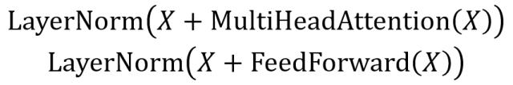

# 0x00. 导读

# 0x01. 简介

# 0x02.

Add & Norm 层由 Add 和 Norm 两部分组成，其计算公式如下：

其中 X 表示 Multi-Head Attention 或者 Feed Forward 的输入，MultiHeadAttention(X) 和 FeedForward(X) 表示输出 (输出与输入 X 维度是一样的，所以可以相加)。

## 2.1 Add

Add 指 X+MultiHeadAttention(X)，是一种残差连接（residule connection），通常用于解决多层网络训练的问题，可以让网络只关注当前差异的部分。

残差连接就是把网络的输入和输出相加，即网络的输出为 F(x)+x 。

想象你在炒菜时，发现盐放多了，但调料已经拌入食材无法补救。此时，Add 层的作用就像偷偷在锅里留了一勺原汤，让你可以直接往成品里倒回一些未调味的食材，抵消过咸的影响。

作用：
- 防止“遗忘”：即使子层（如自注意力）学得不好，也能通过原输入保留一部分原始信息。
- 解决梯度消失：像修高速公路时预留紧急通道，让误差（梯度）能快速从深层传回浅层。

## 2.2 Norm

Norm 即为 Normalization（标准化）模块，就是把输入数据 X，在输送给神经元之前先对其进行平移和伸缩变换，将 X 的分布规范化成在固定区间范围的标准分布，简单的说就是 将数据统一到固定区间内。

Transformer 中采用的是 Layer Normalization（层标准化）方式。常用的标准化方法有 Batch Normalization, Layer Normalization, Group Normalization, Instance Normalization 等。

假设你给不同口味的菜（如川辣、清淡）统一用同一个辣度计，但辣度计的刻度可能因为菜的种类变化而漂移（例如川辣的单位肯定比清淡大多了）。Norm 层的作用就是校准辣度计，确保每一道菜的“辣度值”都在合理范围内。

数学本质：将当前层的数值标准化（均值归零，方差归一），再通过可学习的参数调整（γ 和 β）恢复风味。  
作用：
- 加速训练：像统一菜品的温度，让不同批次的数据更容易融合。
- 稳定模型：避免某些层“突然暴走”（数值过大或过小）。

## 2.3 例子

1. 自注意力层尝试聚焦句子中的关键词（比如“猫”在“猫吃鱼”中关注“鱼”）。
2. Add 层突然发现：“等等！我刚才漏掉了主语‘猫’！” → 把原输入（包含“猫”的信息）加回来。
3. Norm 层检查整体味道是否协调：“现在的结果太偏语法了，加点语义调味剂吧！” → 微调参数 γ 和 β。

就像开车时同时踩油门（Add）和松刹车（Norm），既保证动力又控制速度。