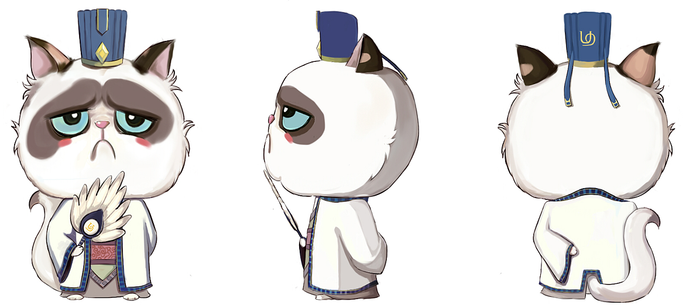
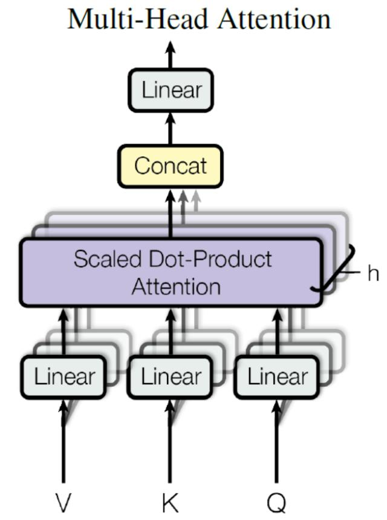
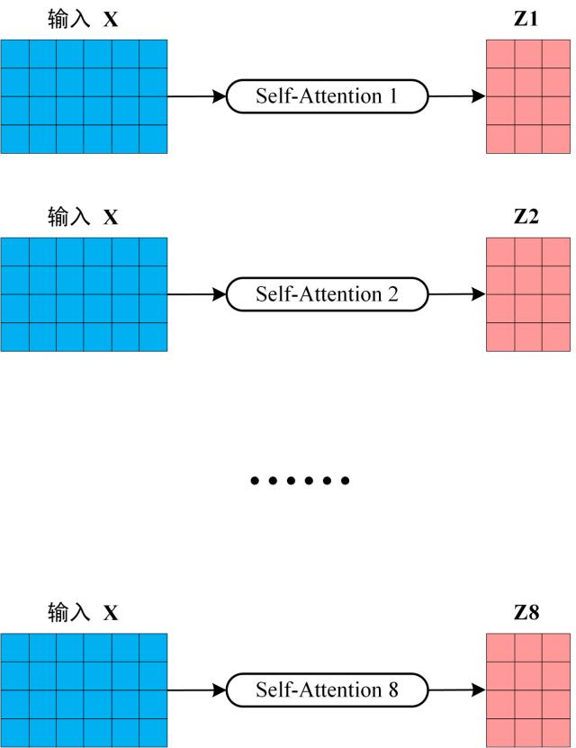
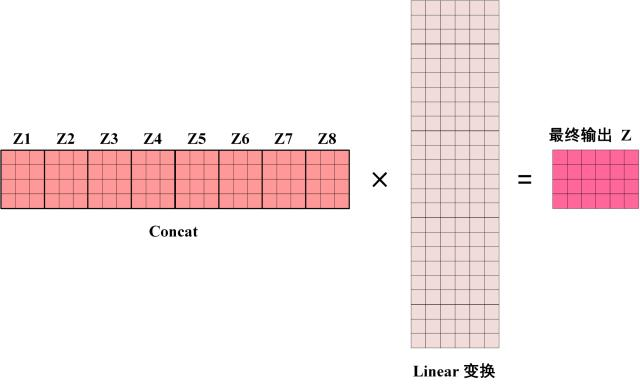

# 0x00. 导读

# 0x01. 简介

通过重复 n 次操作，将输入映射到不同的子空间，以便于提取更多的特征信息，从而提高准确性。

与从不同方位观察物体一样，从前面、侧面、后面看物体，肯定能获取关于这个物体更多的信息对吧，提取更多特征，从而有更深的理解，Multi-Head Attention 的基本思想和这差不多。

# 0x02.

而 Multi-Head Attention 是由多个 Self-Attention 组合形成的，下图是论文中 Multi-Head Attention 的结构图。

从上图可以看到 Multi-Head Attention 包含多个 Self-Attention 层，首先将输入X分别传递到 h 个不同的 Self-Attention 中，计算得到 h 个输出矩阵Z。

得到 8 个输出矩阵 $Z_1$ 到 $Z_8$ 之后，Multi-Head Attention 将它们拼接在一起 (Concat)，然后传入一个 Linear 层，得到 Multi-Head Attention 最终的输出 Z。

可以看到 Multi-Head Attention 输出的矩阵Z与其输入的矩阵X的维度是一样的。