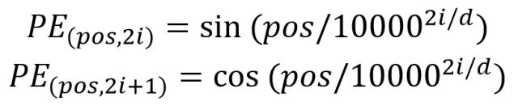

# 0x00. 导读

# 0x01. 简介

# 0x02.

Transformer 中除了单词的 Embedding，还需要使用位置 Embedding 表示单词出现在句子中的位置。Transformer 中使用位置 Embedding 保存单词在序列中的相对或绝对位置。位置 Embedding 用 PE 表示，PE 的维度与 单词Embedding 是一样的。PE 可以通过训练得到，也可以使用某种公式计算得到。在 Transformer 中采用了后者。

其中，pos 表示单词在句子中的位置，d 表示 PE 的维度，2i 表示偶数的维度，2i+1 表示奇数维度。

将单词的 Word Embedding(WE) 和 Position Embedding(PE) 相加，就可以得到单词的表示向量 x，x 就是 Transformer 的输入。