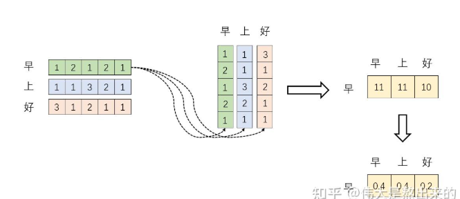

# 0x00. 导读

我想明白这个公式。  


Self-Attention 中文翻译为自注意力机制，论文中叫作 Scale Dot Product Attention.


# 0x01. 简介

注意力机制并不是一个新鲜概念，而且这一概念也不仅仅局限于深度学习领域。

人类利用有限的注意力资源从大量信息中快速筛选出高价值信息，这是人类在长期进化中形成的一种生存机制，人类视觉注意力机制极大地提高了视觉信息处理的效率与准确性。attention 从注意力模型的命名方式看，借鉴了人类的注意力机制。从本质上讲，注意力机制是一种资源分配机制。它通过计算权重来实现资源分配，信息筛选和整合的作用，能够动态地自适应调整权重。

举个例子，如何让计算机理解 “我喜欢踢足球，更喜欢打篮球。” 里面的 更。答案是给与更大的权重值。

人为设计的注意力机制，是非常主观的，而且没有一个准则来评定，这个权重设置为多少才好。所以，如何让模型自己对变量的权重进行自赋值成了一个问题，这个权重自赋值的过程也就是 self-attention。

# 0x02. 基础知识

1. 向量的内积是什么，如何计算，最重要的，其几何意义是什么？
2. 一个矩阵 $W$ 与其自身的转置相乘，得到的结果有什么意义？
3. 什么是 Softmax ?
4. 为什么乘以 $V$ ？
5. 下面的根号是什么？
6. $Q, K, V$ 分别是什么？

## 2.1 向量内积

向量内积（Dot Product）是两个向量之间的一种乘法运算，结果是一个标量（数字）。它的核心思想是：**衡量两个向量在方向上的“相似度”**。

给定两个向量 **a** 和 **b**，它们的内积定义为：  
$$
\mathbf{a} \cdot \mathbf{b} = a_1b_1 + a_2b_2 + \dots + a_nb_n
$$  
其中 $a_i$ 和 $b_i$ 是向量在第 $i$ 维的分量。

矩阵乘法是将两个向量排成行和列，相乘得到一个标量：  
$$
\mathbf{a} \cdot \mathbf{b} = \begin{pmatrix} a_1 & a_2 \\ \end{pmatrix} \begin{pmatrix} b_1 \\ b_2 \end{pmatrix}
$$

### 2.1.1 举例

- 向量 **a** = (1, 2)，向量 **b** = (3, 4)  
- 内积 = $1 * 3 + 2 * 4 = 3 + 8 = 11$

### 2.1.2 内积的几何意义**
1. 投影的放大版

   内积的本质是：**一个向量在另一个向量方向上的投影长度，乘以另一个向量的模长**。  
   - 公式表达：  
     $$
     \mathbf{a} \cdot \mathbf{b} = |\mathbf{a}| \cdot |\mathbf{b}| \cdot \cos\theta
     $$  
      其中 $\theta$ 是两向量的夹角。

2. 几何图形理解

   想象两个向量在二维平面上的位置：  
   - 当两向量方向完全相同（$\theta$=$0^\circ$），$\cos\theta$=1，内积最大。  
   - 当两向量垂直（$\theta=90^\circ$），$\cos\theta=0$，内积为0。  
   - 当两向量反向（$\theta=180^\circ$），$\cos\theta=-1$，内积最小。

   

3. 结论

   1. **内积 > 0**：两向量大致指向同一方向。  
   2. **内积 = 0**：两向量垂直（正交）。  
   3. **内积 < 0**：两向量大致指向相反方向。

### 2.1.3 举个栗子：用几何图形理解内积

   假设向量 **a** = (3, 4)，向量 **b** = (2, 0)：  
   1. 计算内积：$3 \times 2 + 4 \times 0 = 6$  
   2. 计算模长：  
      $|\mathbf{a}| = \sqrt{3^2 + 4^2} = 5$  
      $|\mathbf{b}| = \sqrt{2^2 + 0^2} = 2$  
   3. 计算夹角（看前面点积公式，把右边的乘挪到左边来变成除）：  
      $\cos\theta = 6 / (5 \times 2) = 0.6$ → $\theta ≈ 53.13^\circ$  

   这说明 **a** 在 **b** 方向上的投影长度为 $|\mathbf{a}| \cos\theta = 5 \times 0.6 = 3$，与内积结果一致。

## 2.2 转置矩阵

一个矩阵与其自身的转置相乘（即 **AᵀA** 或 **AAᵀ**）是线性代数中非常常见的操作，它在机器学习、统计学和自然语言处理等领域有广泛的应用。它的结果是一个**对称半正定矩阵**。

### 2.2.1 数学定义

给定一个 **m×n** 的矩阵 **A**，其转置矩阵 **Aᵀ** 是 **n×m** 的矩阵。  
- **AᵀA** 的结果是 **n×n** 对称矩阵。  
- **AAᵀ** 的结果是 **m×m** 对称矩阵。 

### 2.2.2 几何意义

假设 **A** 是以下矩阵：  
$$
A = \begin{pmatrix}
a & b \\
c & d \\
e & f
\end{pmatrix} \quad (3×2 \text{ 矩阵})
$$  
则：  
$$
AᵀA = \begin{pmatrix}
a^2 + b^2 + c^2 + e^2 & ab + bc + de & ac + bd + ef \\
ab + bc + de & b^2 + c^2 + d^2 + f^2 & bc + cd + df \\
ac + bd + ef & bc + cd + df & c^2 + d^2 + e^2 + f^2
\end{pmatrix} \quad (2×2 \text{ 对称矩阵})
$$

#### **1. AᵀA：列向量的内积关系**
- **AᵀA** 的第 **i** 行第 **j** 列元素是 **A 的第 i 列** 和 **A 的第 j 列** 的内积（都是列）。  
- 几何上，它表示两列向量在**高维空间中的投影相似度**。  
- 若两列完全正交（垂直），对应的内积为 **0**；若方向相同，内积最大。

#### **2. AAᵀ：行向量的内积关系**
- **AAᵀ** 的第 **i** 行第 **j** 列元素是 **A 的第 i 行** 和 **A 的第 j 行** 的内积（都是行）。  
- 几何上，它表示两行向量在高维空间中的投影相似度。


假设 **A** 是以下矩阵：  
$$
A = \begin{pmatrix}
1 & 2 \\
3 & 4
\end{pmatrix} \quad (2×2)
$$  
则：  
$$
AᵀA = \begin{pmatrix}
1^2+2^2 & 1×3 + 2×4 \\
3×1 + 4×2 & 3^2+4^2
\end{pmatrix} = \begin{pmatrix}
5 & 11 \\
11 & 25
\end{pmatrix}
$$  
- 对角线元素是各列（或行）的平方和（范数平方）。  
- 非对角线元素是列（或行）之间的内积。

## 2.3 Softmax

也称归一化指数函数。它的核心思想是为每个类别分配一个概率值，表示该样本属于该类别的置信度。输出结果可视为各类别的“置信度”，例如在图像分类中，输出可能是“猫（0.7）、狗（0.2）、鸟（0.1）”。

> 这种把输出值限定在一个目标范围内的函数，被叫做 激活函数（Activation Function）。

Softmax 从字面上来说，可以分成 soft 和 max 两个部分。max 故名思议就是最大值的意思。Softmax 的核心在于 soft，而 soft 有软的含义，与之相对的是 hard 硬。很多场景中需要我们找出数组所有元素中值最大的元素，实质上都是求的 hardmax。

hardmax 最大的特点就是只选出其中一个最大的值，即非黑即白。但是往往在实际中这种方式是不合情理的，比如对于文本分类来说，一篇文章或多或少包含着各种主题信息，我们更期望得到文章对于每个可能的文本类别的概率值。所以此时用到了 soft 的概念，Softmax 的含义就在于不再唯一的确定某一个最大值，而是为每个输出分类的结果都赋予一个概率值，表示属于每个类别的可能性。

### 2.3.1 数学公式

Softmax 函数对输入向量 $Z$ 中的每个元素 $Z_i$ 进行变换：

$$
\text{Softmax}(Z)_i = \frac{e^{Z_i}}{\sum_{j=1}^{K} e^{Z_j}}
$$

其中：
  - $Z = [z_1, z_2, ..., z_K]$ 是神经网络的原始输出（未归一化的logits）。
  - $K$ 是类别总数。
  - $e$ 是自然对数的底数（约等于 2.718）。

步骤拆解：
  1. 对每个元素取指数（$e^{Z_i}$），消除负数并放大差异。
  2. 对所有指数求和作为分母，进行归一化。
  3. 每个元素除以分母，得到概率值。


### 2.3.2. 示例代码（Python）

```python
import numpy as np

# 输入 logits
logits = np.array([2.0, 1.0, -1.0])

# 计算 Softmax
exp_logits = np.exp(logits)
probabilities = exp_logits / np.sum(exp_logits)

print("Softmax 输出:", probabilities)
# 输出: [0.88079708 0.11919477 0.00000815]
```

Softmax 是多分类任务的基石，通过将原始输出转换为概率分布，为模型结果提供直观的解释。

## 2.4 乘以 $V$

为什么必须乘以 A ？
- 权重需要作用于特征：
   - Softmax 后的矩阵 D 仅表示“关注程度”，但本身不含具体特征信息。
   - 乘以 A 是为了将权重应用到原始特征上，生成有意义的上下文感知表示。
- 类比现实场景：
   - 假设你要根据朋友的推荐（权重）选择餐厅（特征），最终决策需要结合推荐强度（权重）和餐厅的具体信息（特征）。

早上好对应的三个向量，先不管是咋来的。

下图是 **X * Xᵀ** ，得到一个新的 3*3 矩阵。结果矩阵的第 (i,j) 元素表示 第 i 个输入向量 与 第 j 个输入向量 的内积（即两者的相似度）。


Softmax 归一化，得到新的 3*3 矩阵。将内积矩阵转换为 概率分布，使得每行的和为 1。**新的矩阵的第 (i,j) 元素表示 第 i 个位置对第 j 个位置的注意力权重，即“i 需要关注 j 的程度”。权重越大，表示 i 需要更多关注 j 的信息。**

假设原始矩阵 $C = A \cdot A^\top$，其元素 $C_{ij} = A_i \cdot A_j$ 表示第 $i$ 个输入向量与第 $j$ 个输入向量的内积（相似度）。  
对 $C$ 的每一行进行 Softmax 归一化后，得到矩阵 $D = \text{Softmax}(C)$，其元素：
$$
D_{ij} = \frac{\exp(C_{ij})}{\sum_{k=1}^n \exp(C_{ik})}
$$
此时：
- 每行的和为 1：$\sum_{j=1}^n D_{ij} = 1$。
- 数值范围在 (0, 1)：所有元素均为非负概率值。




新的早上好对应的三个向量，经过 attention 机制加权求和之后的表示。

第 i 行的输出表示第 i 个位置的最终表示融合了它对其他位置的关注程度。


上图的计算细分一下：0.4 * [1 2 1 2 1] + 0.4 * [1 1 3 2 1] + 0.2 * [3 1 2 1 1] = [0.4 0.8 0.4 0.8 0.4] + [0.4 0.4 1.2 0.8 0.4] + [0.6 0.2 0.4 0.2 0.2] = [ 1.4 1.4 2.0 1.8 1.0 ]

类似于：  


## 2.5 为什么需要除以 $\sqrt {d_k}$

${d_k}$ 是 Q K 矩阵的列数，也就是向量未读。为了防止内积过大，因此除以 $\sqrt {d_k}$ ，使得训练过程中梯度值保持稳定。

## 2.6 总结

Softmax：决定“关注什么”（分配权重）。  
乘以 V：根据权重“获取具体的信息”（从值中提取内容）。  
两者的结合：实现了动态的、可学习的注意力机制，让模型能够灵活地聚焦关键信息。

# 0x03. Q K V 是什么？


- Query（查询）：查询条件，表示询问的问题。
- Key（键）：关键字，是「实际信息」的代表，用于与 Query 进行匹配。通过计算 Query 和 Key 之间的相似度，可以得到一个权重系数。
- Value（值）：表示「实际信息」，是真正要被处理或者被组合的信息内容。

相关度系数就是 Softmax 的值。身高越接近，「相关度系数」越大，所有「相关度系数」加起来等于 1 。

**扩展 Q 和 K**: 只用「身高」预估「体重」不够准确，再加上「腰围」、「腿长」等因素。


**扩展 V:** 不仅能预估「体重」，还能预估「胸围」。


**扩展更多维度**：Q、K、V 均可扩展更多的维度。如：都扩展成一个 512 维的数组。


- 将「数字量问题」替换成「文字描述问题」。
- 计算时，将每一段「文字描述」进行向量化，转换成一个 512 维的数组，再进行计算。转换后和上一个的数据结构是一样的。
- 至此：
  - Q 是一个，对应一个向量，即一个 512 维数组。
  - K 是多个，对应多个向量，即多个 512 维数组。
  - V 是多个，对应多个向量，即多个 512 维数组。


- Q、K、V 都换成一样的，就是自注意力机制。
- 之前每段话转换成一个向量（512维数组），现在将每个字转换成一个向量（512维数组）。
- 通过QKV，计算每个字与所有字之间的关联关系，并得到一组新的向量。
- 如下图 c1 向量，包含了与「中」字相关的含义，其他主要包含了「中秋」两个字的含义，其他字向量虽然也参与了计算，但由于相关度较低，所以其他字的含义会被弱化。
- 自注意力机制的输出，每个向量中，除了包含对应Token的向量数据之外，还加入了上下文中其它所有Token以关联程度为系数的向量数据。
- 自注意力机制，主要是做「信息聚合」。


多层自注意力机制
- 多层QKV，可以捕捉长距离的关联关系。
- 如下图所示：j 只包含了「否」的含义，k 只包含了「认」的含义。
- 经过一层QKV运算后：j1 包含了「否认」的含义，m1 包含了「外遇」的含义。
- 经过两层QKV运算后：j2 包含了「否认外遇」的含义。
- 理解了多层自注意力机制，也就大概理解了 AI 为什么能理解人类的语言。


## 3.1 解释

有了矩阵 X(单词经过 embedding 之后的向量)，还需要基于矩阵 X 创建另外三个矩阵：查询矩阵 Q、键矩阵 K、值矩阵 V，得到这三个矩阵需要训练对应的另外三个权重矩阵，假设分别为 Wq、Wk、Wv，它们也都是通过训练得到的（以随机初始化开始，经过训练就会得到非常好的表现。）。这样，我们就可以计算得到下面三个矩阵：

- Q = X·Wq
- K = X·Wk
- V = X·Wv


