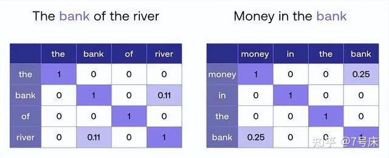

# 0x00. 导读

# 0x01. 简介

Word Embedding 将人类语言转化为了计算机能够读懂的底层数字表达方式，并且通过多维度的空间定位捕捉了各个单词、短语、句子在语义上的细微差别，以及它们之间的逻辑联系。这种底层的数字表达已经跨越了不同的语系语言，成为了全人类共用的最底层语言逻辑，甚至成为了一种世界语—— **AI 世界语**，这对于翻译、搜索和理解不同语言语种具有非常重要的作用。可以说，巴别塔的传说自此解决！！

1. 向量化（Embedding）：指将一个字，或一个词、或一段话，转换成一个向量值。
2. **人能够理解的是语义空间，计算机能够处理的是向量空间。**
3. 一句话要想被计算机处理，需要在向量空间中给它找一个对应的向量。
4. 有专门的大模型来做向量化这个事，并且能够做到，如果两句话意思相近，则对应向量的距离也比较近。关于向量距离如何计算，是另外一个复杂的问题，我们只要理解向量间有距离，并且可以被计算出来，就像“ 1 和 3 的距离，比 1 和 5 的距离更近”一样。
5. “Embedding” 这个词本身有 “嵌入” 的意思。在向量化的语境中，它形象地表示将离散的、符号化的对象（如单词、类别标签等）嵌入到一个连续的向量空间中。

单词的 Embedding 有很多种方式可以获取，例如可以采用 Word2Vec、Glove 等算法预训练得到，也可以在 Transformer 中训练得到。

# 0x02.

人能够理解的是语义空间，计算机能够处理的是向量空间。

## 2.1 One-hot Encoding, 独热编码

假设这个世界上有 100 万个单词，每一个单词，我们都可以用一组 0 和 1 组成的向量（一组数字）来定义的话，那么每一个单词就可以被编码成 100 万个 0 或 1 组成的向量。如下图：

这种单词编码方法叫 One-hot Encoding 。可是这样一维的编码方法将导致向量占用的空间过大，1 个单词用 100 万个单元的向量表达，世界上一共有 100 万个单词，那么就需要 1 万亿（100 万 * 100 万）的体积来把它们表达出来，很明显这种臃肿的结构不利于电脑计算。

但最大的问题还不在于这个体积问题，而是语义联系问题。独热编码使得单词与单词之间完全相互独立，从每个单词所编码成为的 100 万个单元的向量身上，根本看不出它与其他单词有何种语义内涵上的逻辑联系。比如，在这些数字中，我们无法知道 apple 和 bag 属于静物，区别于 cat 和 dog、elephant 属于动物且是哺乳动物，而 cat 和 dog 又属于小动物，且大多数为非野生，区别于 elephant 为大型的野生动物，等等等等，这些单词背后所蕴含的各种内在的逻辑联系和分类关系均无法从独热编码法中知晓。实际上独热编码是传统计算机数据库时代的产物，而在人工智能领域则采用另一种编码法，Word Embedding, 也就是 词嵌入 编码法，如下图：

## 2.2 Word Embedding

Word Embedding 将语义上相近的、有关联的词汇在 Embedding 空间中生成相近的位置定位。相对于 独热编码 超长的一维数据，Embedding 提升了数据的表达维度，它更像是在某一个空间中对词汇进行编码。

如上图（为了在此文章中表达方便，我们仅用二维空间来表达，实际上这个空间的维度很高，至少要在 512 维之上！一维二维三维的空间大家都可以在脑中想象出来对应的画面，但是四维以上以至于 512 维就难以图形化的想象了），在 Embedding 的二维空间中 dog、cat、rabbit 三个向量的坐标点位排布，可以看到三个绿色的点距离很近，是因为他们三个相对于其他来说语义上更接近。tree 和 flower 则离它们较远，但是 cat 会因为在很多语言的文章中都会有 “爬树” 的词汇出现在同一句话中，所以导致 cat 会与 tree 离得较近一些。同时 dog、rabbit 与 tree 的关系就较远。

实际上，在 Embedding 空间中，词与词之间的关系还不仅仅限于语义上的分类所导致的定位远近这么简单。一个词所代表的事物与其他词所代表的事物之间能产生内在联系的往往有成百上千上万种之多。比如 man 和 woman，他们之间的关系还会映射出 king 和 queen 之间的关系。同时，语法也会带来一定的联系，比如在一个三维空间中由 walking 到 walked 的距离与斜率竟然与 swimming 到 swam 的距离与斜率一致（即向量的长度与斜率一致），且距离几乎相等。因为这背后是两组动作单词的现在分词形式和过去分词形式的变化关系。我们可以尽情地想象，凡是事物或概念有逻辑联系的，甚至是逻辑与逻辑之间的联系的，在 Embedding 向量空间中都可以得到远近亲疏的空间表达。只不过这种空间要比我们能想象出的三维空间要高出很多维度。

## 2.3 例子

- 句子 I：The bank(岸边) of the river.
- 句子 II：Money in the bank(银行).

由于  bank 是一个多义词，所以它在 Embedding 空间中的定位本来是有多个 “分身”，我们取其中的两个分身，即 bank1 和 bank2 。那么，我们需要做的就是定位清晰 bank1 和 bank2 这两个单词在空间中到底各自离 river 和 money 的哪个单词更近一些。假如， bank1 离 river 更近，而 bank2 离 money 更近，于是这两句话就变成了：

- 变形后的句子 I：The bank1 of the river.
- 变形后的句子 II：Money in the bank2.

如之前所说，虽然此时机器算法压根也不知道 river 和 money 到底是何物，但它知道在 Embedding 空间中， river 周边有很多和大自然有关的词汇，比如 water 、 tree 、 fish 等等。而 money 周边有许多与金融有关的词汇，比如 currency ,  cash ,  withdraw 等等。于是，机器算法知道了 bank1 代表的是与 river 有关的一个单词，与他们比较近的单词还有 water 、 tree 、 fish 等等。而 bank2 代表的是与 money 有关的一个单词，与他们比较接近的单词还有 currency ,  cash ,  withdraw 等等。这就是 Attention 注意力机制 的工作原理，也就是 Attention 让一个单词在句子中找到与它产生强语义联系的其他单词，并组成一个新的  变体单词 ： bank1 、 bank2 。

数值 1 代表最大权重。