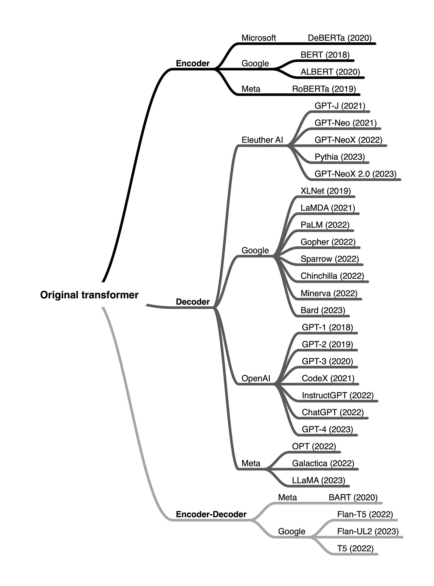

Transformer:
- embedding
  - input embedding
  - position embedding
- encoder
  - Multi-Head Attention
    - Self-Attention
  - 残差连接 Add
  - 归一化 Norm
  - Feed Forward
- decoder
  - Multi-Head Attention
    - Masked Encoder-Decoder Attention
  - Masked Multi-Head Attention
    - Masked Self-Attention
  - Feed Forward
  - 残差连接 Add
  - 归一化 Norm

一个 Encoder 层包含 4 个子层的顺序堆叠：

- Multi-Head Self-Attention 层
- Add & Norm 层
- Feed Forward 层
- Add & Norm 层

一个 Decoder 层包含 6 个子层的顺序堆叠：

- Masked Multi-Head Self-Attention 层
- Add & Norm 层
- Multi-Head Cross-Attention 层
- Add & Norm 层
- Feed Forward 层
- Add & Norm 层

后面基本都是 decoder-only 了。

Transformer架构是一种非常灵活且强大的神经网络结构，已经被广泛应用于各种自然语言处理任务。根据不同的任务需求，Transformer的架构可以分为几种不同的类型，每种类型都有其特定的优点和用途。以下是这几种主要结构的特点：

1. 仅编码器模型（自编码器模型）

     - 主要用途： 仅编码器模型通常用于从输入数据中提取有用的特征信息，进行理解或表示学习。这些模型不需要生成输出，而是侧重于学习输入的上下文和表示。
     - 工作方式： 编码器的作用是将输入的序列通过多层的自注意力机制和前馈神经网络处理，最终将其转化为一个固定长度的向量或一组向量。
     - 应用： 这类模型在需要提取深度特征或做文本分类、情感分析等任务时非常有效。它们不涉及生成过程，而是通过理解和表示输入数据来完成任务。
     - 代表模型：
       - BERT（双向编码器表示模型）： BERT是一种双向编码器，它通过“遮蔽”输入中的某些单词来训练模型，让模型预测这些被遮蔽的单词，从而获得输入文本的深层次理解。BERT的预训练后可以通过微调应用于多种任务，如文本分类、命名实体识别（NER）、问答等。
2. 仅解码器模型（自回归模型）

    - 主要用途： 解码器模型通常用于生成任务，尤其是序列生成任务，如文本生成、对话生成等。这类模型的目标是从给定的输入或上下文中生成连贯的输出。
    - 工作方式： 解码器采用自回归的方式生成序列，它会基于已生成的词或标记不断预测下一个词，直到生成完整的输出。
    - 应用： 解码器模型广泛应用于需要生成连续文本的任务，比如机器翻译、文本生成、代码生成等。
    - 代表模型：
      - GPT：基于Transformer的解码器结构，采用自回归方式生成文本。在训练过程中，它通过大量的文本数据学习语言模式，并通过不断预测下一个词生成连贯的文章。GPT系列（如GPT-3、GPT-4）已经成为文本生成任务中的重要模型。
3. 编码器-解码器模型（序列到序列模型）

    - 主要用途： 编码器-解码器模型适用于需要将一个输入序列映射到一个输出序列的任务，例如机器翻译、文本摘要、图像描述等。这种结构通常包含两个部分：编码器负责理解输入序列，解码器负责生成输出序列。
    - 工作方式： 编码器首先处理输入序列，将其转化为一个中间的表示（通常是一个上下文向量），然后解码器基于该表示生成输出序列。解码器可以使用自回归方式来逐步生成输出。
    - 应用： 这类模型适用于任何需要将一个序列转换为另一个序列的任务，常见的应用场景包括机器翻译、摘要生成、对话生成等。
    - 代表模型：
      - T5：将所有任务统一转换为文本到文本的任务，即输入和输出都是文本形式。它结合了编码器和解码器的结构，可以用于机器翻译、文本摘要、问答等多种任务。
      - BART：一种结合了BERT和GPT优点的模型，使用编码器-解码器架构，既能够进行双向的理解，又能进行自回归的生成。它特别适用于文本生成、序列到序列的转换等任务。

