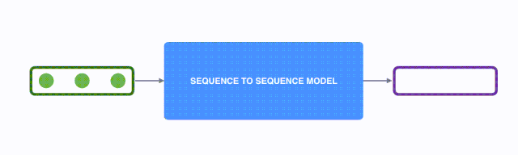
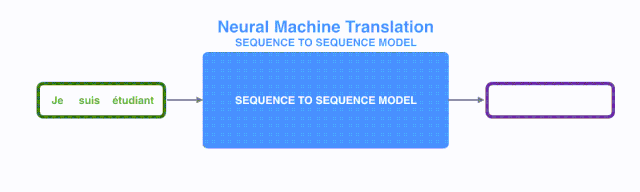
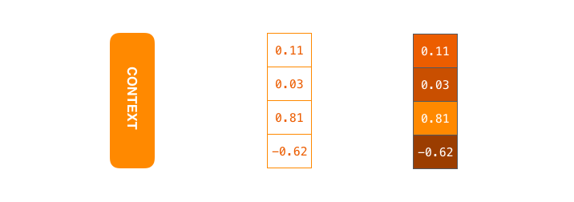

# 0x00. 导读

# 0x01. 简介

# 0x02. seq2seq 框架

seq2seq 是一种常见的 NLP 模型结构，全称是：sequence to sequence，翻译为“序列到序列”。顾名思义：从一个文本序列得到一个新的文本序列。典型的任务有：机器翻译任务，文本摘要任务。

seq2seq 模型的输入可以是一个（单词、字母或者图像特征）序列，输出是另外一个（单词、字母或者图像特征）序列。一个训练好的 seq2seq 模型如下图所示：

以 NLP 中的机器翻译任务为例，序列指的是一连串的单词，输出也是一连串单词：

将上图中蓝色的 seq2seq 模型进行拆解，如下图所示：seq2seq 模型由 编码器（Encoder）和 解码器（Decoder）组成。绿色的编码器会处理输入序列中的每个元素并获得输入信息，这些信息会被转换成为一个黄色的向量（称为 context 向量）。当我们处理完整个输入序列后，编码器把 context向量 发送给紫色的解码器，解码器通过 context向量 中的信息，逐个元素输出新的序列。

 

由于 seq2seq 模型可以用来解决机器翻译任务，因此机器翻译被任务 seq2seq 模型解决过程如下图所示，当作 seq2seq 模型的一个具体例子来学习。

seq2seq 模型中的编码器和解码器一般采用的是 循环神经网络 RNN（Transformer 模型还没出现的过去时代）。编码器将输入的法语单词序列编码成 context向量（在绿色 encoder 和紫色 decoder 中间出现），然后解码器根据 context向量 解码出英语单词序列。

context向量 对应上图中间浮点数向量。

# 0x03. Attention

基于 RNN 的 seq2seq 模型编码器所有信息都编码到了一个 context向量 中，便是这类模型的瓶颈。一方面单个向量很难包含所有文本序列的信息，另一方面 RNN 递归地编码文本序列使得模型在处理长文本时面临非常大的挑战（比如 RNN 处理到第 500 个单词的时候，很难再包含 1-499 个单词中的所有信息了）。

面对以上问题, 2014 年出现一种叫做 attention 的技术。通过 attention 技术， seq2seq 模型极大地提高了机器翻译的质量。归其原因是：attention 机制，使得 seq2seq 模型可以有区分度、有重点地关注输入序列。
