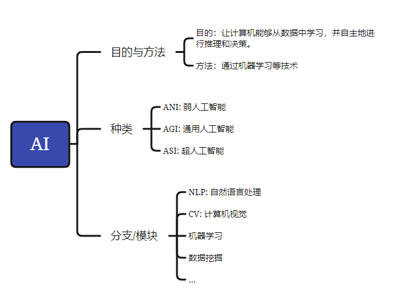
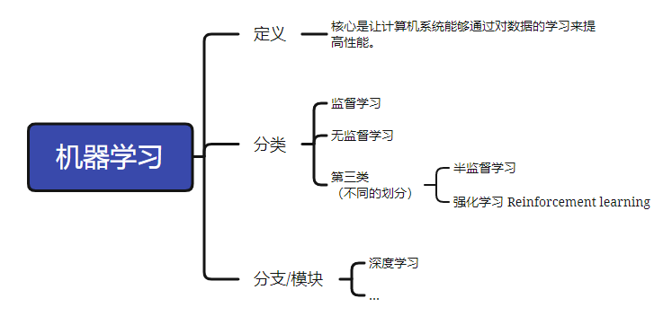
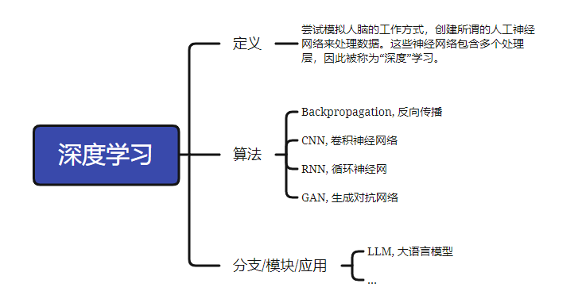

AI的核心目标是通过机器学习等技术，让计算机能够从数据中学习，并自主地进行推理和决策。人工智能包括自然语言处理（NLP）、计算机视觉（CV）、机器学习、深度学习、数据挖掘、机器人技术等**分支**。

根据AI的能力范围和智能化程度，可以将人工智能分为ANI、AGI和ASI三个等级。
- ANI（弱人工智能）主要被编程以执行单一任务，它通常只能针对特定领域或任务展现出类似人类智能的能力。例如，手机地图导航、网购产品推荐等都是ANI的典型应用。
- AGI（通用人工智能）则是在不特定编码知识与应用区域的情况下，应对多种甚至泛化问题的人工智能技术。它拥有推理、计划、解决问题、抽象思考、快速学习和从经验中学习的能力。AGI更像是无所不能的计算机，能够像人类一样应对多种任务和环境。
- ASI（超人工智能）相较AGI，不仅要求具备人类某些能力，还要能够独立思考并解决问题。ASI不仅在智能化程度上超越了AGI，还在应用范围上有所扩展，能够应对更加复杂和多样化的任务。

------------

机器学习是人工智能（AI）的一个子领域，它的核心是让计算机系统能够通过对数据的学习来提高性能。在机器学习中，我们不是直接编程告诉计算机如何完成任务，而是提供大量的数据，让机器通过数据找出隐藏的模式或规律，然后用这些规律来预测新的、未知的数据。

建模过程中，根据数据是否有明确标签，可以把机器学习分为监督学习、无监督学习和半监督学习三种类型：
- 监督学习：从有标签的数据中学习规律和模式，以便在未知数据上进行预测和分类。
- 无监督学习：从无标签的数据中学习规律和模式，以便在未知数据上进行聚类和降维等操作。
- 半监督学习：将监督学习和无监督学习相结合，利用少量有标签的数据和大量无标签的数据进行学习。
- 强化学习 Reinforcement learning：也有将 半监督学习 替换的。

深度学习（Deep learning）是机器学习的一个子领域，它尝试模拟人脑的工作方式，创建所谓的人工神经网络来处理数据。这些神经网络包含多个处理层，因此被称为“深度”学习。深度学习模型能够学习和表示大量复杂的模式，这使它们在诸如图像识别、语音识别和自然语言处理等任务中非常有效。

深度学习常见算法有反向传播（Backpropagation）、卷积神经网络（CNN）、循环神经网络（RNN）、生成对抗网络（GAN）等。

-------------

大语言模型（Large Language Models, LLMs）与深度学习（Deep Learning）之间是应用与技术基础的关系。深度学习是构建大语言模型的核心技术框架，而大语言模型是深度学习在自然语言处理（NLP）领域的一个典型应用和突破性成果。

大语言模型是深度学习在自然语言处理领域的巅峰应用，其成功依赖于深度学习技术（尤其是 Transformer 架构）的突破，同时也反向推动了深度学习理论、算法和硬件的发展。两者共同体现了“数据+算力+算法”驱动人工智能进步的核心逻辑。

[11](https://www.cnblogs.com/luohenyueji/p/18644847)