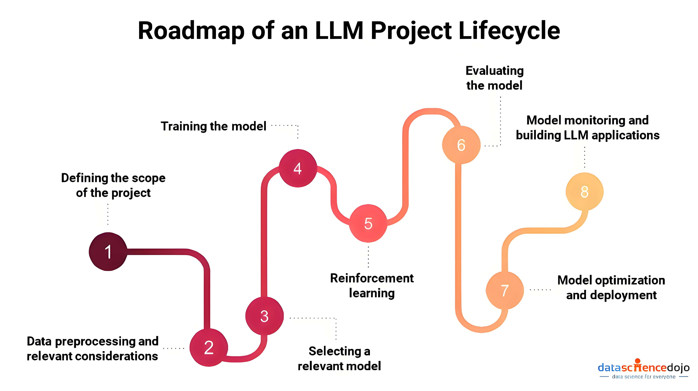

AI的核心目标是通过机器学习等技术，让计算机能够从数据中学习，并自主地进行推理和决策。人工智能包括自然语言处理（NLP）、计算机视觉（CV）、机器学习、数据挖掘等**分支**。

根据AI的能力范围和智能化程度，可以将人工智能分为ANI、AGI和ASI三个等级。
- ANI（弱人工智能）主要被编程以执行单一任务，它通常只能针对特定领域或任务展现出类似人类智能的能力。例如，手机地图导航、网购产品推荐等都是ANI的典型应用。
- AGI（通用人工智能）则是在不特定编码知识与应用区域的情况下，应对多种甚至泛化问题的人工智能技术。它拥有推理、计划、解决问题、抽象思考、快速学习和从经验中学习的能力。AGI更像是无所不能的计算机，能够像人类一样应对多种任务和环境。
- ASI（超人工智能）相较AGI，不仅要求具备人类某些能力，还要能够独立思考并解决问题。ASI不仅在智能化程度上超越了AGI，还在应用范围上有所扩展，能够应对更加复杂和多样化的任务。

------------

机器学习是人工智能（AI）的一个子领域，它的核心是让计算机系统能够通过对数据的学习来提高性能。在机器学习中，我们不是直接编程告诉计算机如何完成任务，而是提供大量的数据，让机器通过数据找出隐藏的模式或规律，然后用这些规律来预测新的、未知的数据。

建模过程中，根据数据是否有明确标签，可以把机器学习分为监督学习、无监督学习和半监督学习三种类型：
- 监督学习：从有标签的数据中学习规律和模式，以便在未知数据上进行预测和分类。
- 无监督学习：从无标签的数据中学习规律和模式，以便在未知数据上进行聚类和降维等操作。
- 半监督学习：将监督学习和无监督学习相结合，利用少量有标签的数据和大量无标签的数据进行学习。
- 强化学习 Reinforcement learning：也有将 半监督学习 替换的。

深度学习（Deep learning）是机器学习的一个子领域，它尝试模拟人脑的工作方式，创建所谓的人工神经网络来处理数据。这些神经网络包含多个处理层，因此被称为“深度”学习。深度学习模型能够学习和表示大量复杂的模式，这使它们在诸如图像识别、语音识别和自然语言处理等任务中非常有效。

深度学习常见算法有反向传播（Backpropagation）、卷积神经网络（CNN）、循环神经网络（RNN）、生成对抗网络（GAN）等。

-------------

大语言模型（Large Language Models, LLMs）与深度学习（Deep Learning）之间是应用与技术基础的关系。深度学习是构建大语言模型的核心技术框架，而大语言模型是深度学习在自然语言处理（NLP）领域的一个典型应用和突破性成果。

大语言模型是深度学习在自然语言处理领域的巅峰应用，其成功依赖于深度学习技术（尤其是 Transformer 架构）的突破，同时也反向推动了深度学习理论、算法和硬件的发展。两者共同体现了“数据+算力+算法”驱动人工智能进步的核心逻辑。

1. LLM 基于 Transformer
2. LLM 的训练
3. LLM 推理

LLM 的训练可分为以下四个关键阶段：

1. 预训练（Unsupervised Pretraining）：构建基座模型。

    - 数据来源：广泛采集的书籍、新闻、科研论文、社交媒体等多领域文本数据，作为模型训练的素材。
    - 学习目标：利用无监督学习技术，使模型能够根据上下文预测下一个词。
    - 训练过程：不依赖标注数据，通过不断优化模型预测与实际结果之间的差异，随着数据量的增加，逐步提升模型的性能。
2. 有监督微调（Supervised Fine-Tuning，SFT）：打造对话模型。

    - 数据来源：采用人工标注的对话数据，以提高模型在对话任务中的表现。
    - 学习目标：通过有针对性的训练，增强模型与用户互动的能力。
    - 训练过程：使用少量但高质量的对话数据进行微调，显著提高模型的对话能力。
3. 奖励模型训练（Reward Model Training）：培养能够评估回答的模型。

    - 数据来源：生成多个候选答案，并依据人工评分和排序进行评估。
    - 学习目标：培养奖励模型，利用评分数据来评估和优化模型生成的答案质量。
    - 训练过程：奖励模型根据人工评分提供反馈，引导模型生成更符合人类预期的答案，这个过程也常被称为人类对齐训练（alignment）。
4. 强化学习训练（Reinforcement Learning with Human Feedback，RLHF）：进一步提升对话模型的回答质量。

    - 数据来源：利用第三步训练好的奖励模型，通过强化学习进一步优化第二步训练好的对话模型。
   - 学习目标：依据奖励模型的反馈调整生成策略，提高模型回答的质量。
    - 训练过程：模型根据奖励评分调整其策略，并结合用户反馈，进一步改进生成答案的质量。

在LLM的训练过程中，主要有两种模型类型：基座模型（Base模型）和对话模型（Chat模型）。两者的工作方式相似，都是通过预测文本的后续内容来进行训练。Base模型经过了预训练，可能进行了部分通用指令的微调；而Chat模型则在Base模型的基础上，进一步通过大量通用数据的微调和人类反馈的训练来优化性能。虽然“指令模型”（Instruction Model）这一术语有时也被提及，但它与Chat模型本质上是相同的，都是通过指令微调和强化学习对Base模型进行优化，以提高其理解和生成能力。

开源LLM的研究机构通常会同时发布Base模型和Chat模型，以满足不同的需求。例如，Llama 2（Base模型）和Llama 2-Chat（Chat模型）。Base模型主要侧重于泛化能力，通常仅经过预训练，具备基本的文本补全功能，但缺乏对话上下文的理解，因此在与人类对话时，回答往往显得较为生硬、感觉在背书。而Chat模型则在Base模型的基础上进行优化和调整，增强了对话能力和自然语言理解，生成的回答更加自然。

LLM的推理部署有多种方式：

- 直接使用PyTorch代码： 对于熟悉PyTorch的用户来说，可以直接利用其提供的接口进行推理。
- 使用专用框架：
    - VLLM: 专为高效处理LLM而设计。
    - XInference: 提供便捷的部署流程，可以快速将模型部署到不同的硬件平台。
    - FastChat: 专注于对话模型的推理和优化。
- 使用C++推理框架：
    - llama.cpp/chatglm.cpp/qwen.cpp: 提供了高性能的C++实现，适合对性能有较高要求的场景。

