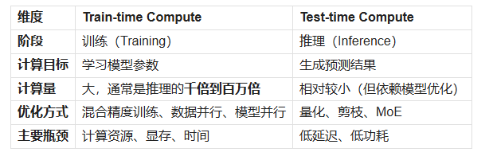
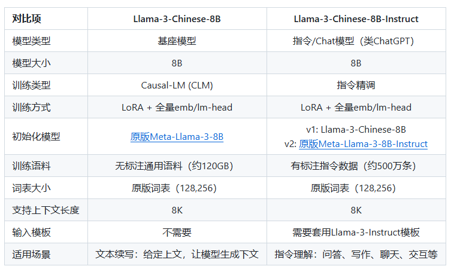

# 0x00. 导读

# 0x01. 简介

# 0x02.

AI, Artificial Intelligence: 人工智能

GPT(Generative Pre-trained Transformer): 是一种基于 Transformer 架构生成式预训练模型。

token: 一个中文文字对应一个 token，比如冰激凌，对应三个token：冰+激+凌；一个英文的字符对应一个 token，比如 ice cream，对应两个token：ice+cream。

175B、60B、540B等: 这些一般指参数的个数，B 是 Billion/十亿 的意思，175B 是 1750亿参数，这是ChatGPT大约的参数规模。

强化学习:（Reinforcement Learning）一种机器学习的方法，通过从外部获得激励来校正学习方向从而获得一种自适应的学习能力。

LLM(Large Language Model，大语言模型)
- 定义：大规模预训练语言模型（Large language model），利用海量文本数据训练的神经网络模型，通过对上下文的理解来预测文本序列的下一词（Token）。
- 本质：
    - 基于深度神经网络（通常是Transformer结构）的统计模型。在海量文本数据上学到了一整套复杂的语义分布和模式。
    - 目标：预测下一个词
    - 原理：结合上下文，找到出现频率最高的词
- 关键特点：
    - 预训练：先在大规模无标签文本上训练，学习通用的语言表示。
    - 微调/指令微调：在下游任务或对话场景进行有监督微调，提高在特定任务上的表现。
    - 多用途：LLM 属于生成式 AI的一种形式。通过获取输入文本并重复预测下一个标记或单词。可广泛应用于文本生成、摘要、翻译、代码生成等多种场景。

涌现，极为宽泛的定义，认为它是一种你未曾明确计划的出乎意料的能力或特性。这个定义的问题在于其极度主观性：不同的人可能会根据他们的期望，在同一个系统中看到或看不到涌现现象。要严肃探讨涌现，我们需要一个更客观的定义。我在此提出一个稍微改进的定义，虽然它也不是完美无缺：如果一个系统显示出的某项属性或能力，在该系统的任何单一组件中都不存在，则这种属性或能力可以被称为 涌现。

RL(reinforcement learning): 强化学习。machine learning 机器学习研究的分支领域，最早由 deep mind 发现。模型通过与环境的交互来学习，以达到最大化奖励或最小化惩罚的目的。这一模型受动物实验中的“关联学习”的启发，动物会观察周围的环境，并从每一次的结果中学习，奖励多的结果会被记住和放大。  
基本过程：在强化学习模型中，agent（智能体，动物或人）与环境不断发生交互，agent采取一个行为，环境给出一个反馈：奖励或惩罚，然后智能体根据反馈来改变他下一轮的学习的状态。

RLHF: 人类反馈强化学习

上下文长度（context length）：LLM 的上下文窗口指的是在语言模型预测下一个整数序列时，能够参考的最大整数序列。换句话说就是模型能够同时处理的最大 token数量，超过这个数量的文本会被模型“忘记”。人类对于一个概念的理解往往取决于它所处的语义和语境，例如 “Model” 在娱乐场景下叫做“模特”，但在深度学习中叫做“模型”。上下文长度是计算机可以“阅读”并且“记住”的最大长度，相当于模型在参考这个长度的上下文之后再来“理解”一个词的语义。所以上下文长度是影响模型理解程度的重要依据。例如，如果一个LLM的上下文窗口大小是4096个标记（tokens），那么它在处理输入和生成输出时，最多只能参考最近的4096个标记的信息。超过这个限制的内容将被“忘记”或无法直接参考。因此，模型在生成长文本时，可能需要在有限的上下文窗口内不断更新和调入新的相关信息，以保持连贯性和相关性。

SFT(Reinforcement Fine-Tuning): 强化微调。是一种将强化学习（Reinforcement Learning, RL）用于模型的后训练阶段微调环节的技术。这一想法是受到 AlphaGo 的启发，利用强化学习的潜力，通过自博弈、自我强化的强化学习。  
强化微调的训练过程：
- 生成思维链：让模型去做大量的推理（就像人类考前做题），生成成百上千个可能的解决方案/CoTchain of thought 思维链，沿着思维链推理，尝试多种解决方案。
- 强化学习：通过自我博弈，最终得出的正确答案会获得奖励。正确的答案会通过 Backpropagation 反向传播算法去优化模型，错误的就不会了。

SFT 将高中水平的 GPT-3LLM 大语言模型 提升到了博士水平的o1推理模型。

Loss function(损失函数): 也叫代价函数 cost function，成本函数。一个预测值与实际值的差距的函数。

gradient descent(梯度下降): 是一种最常用的机器学习优化算法（Optimization），目的是提高模型的准确性。优化的方法是最小化 Loss function 损失函数（cost function），以此来获得最佳预测，实现方法是对网络中的weights 权重沿降低最快的方向进行逐步修改。  
假设你被困在了山里，下山的路是不可见的，你必须必用当地的信息来寻找下山最近的路。 你可以使用梯度下降的方法，该方法涉及查看当前位置山坡的陡度，然后沿着最陡下降的方向（即降低成本函数）前进。使用这种方法，他们最终会找到下山的路，或者可能会陷入某个洞（即局部极小值或鞍点（模型出现错误了）），如山间湖泊。

现有的大语言模型，主要分为三类：
- 一是**基座模型**（Foundation Model，也叫基础模型），一般也是从无到有的预训练模型，基座模型的技术含量最高、工程风险最大、花钱最多、一般只有大厂玩得起，典型的如GPT-3、GPT-4、LLaMA、GLM等。**预训练**阶段得到的模型一般称为基座模型，即只能进行上下文填充的模型，如果想让模型掌握对话能力，则需要对基座模型进行微调。一般是利用少量问答对数据进行训练，通过这部分数据让模型掌握问答对话能力。
- 二是**调优模型**，是在基座模型的基础上，使用模型调优的方式，对基座模型的模型参数进行调整，挖掘和强化基座模型已有的特定的能力，比如对话能力、听从人类指令、与人类三观吻合、减少有毒内容和幻觉等等。
- 三是**垂直模型**，有时也称为行业模型、垂类模型、专业模型，也是目前国内市场上最多的一类模型，在目前国内近百个正式发布的大模型中，90%属于垂直模型。垂直模型一般是使用模型调优的方式，对基座模型或调优模型这两种通用模型进行知识加强和能力调配，主要是知识加强，目的是让大语言模型更加匹配行业知识和数据，更加贴近行业业务，比如医疗大模型、法律大模型、教育大模型、通信行业大模型等等。

推理（Reasoning）模型，顾名思义指具备推理能力的大语言模型。与普通 LLMs 相比，推理型 LLMs 倾向于在回答问题之前将问题分解为更小的步骤（通常称为 推理步骤、思维过程或者思维链(Cot, Chain-of-Thought)）。

system 1&2 : 有一本书叫做《思考快与慢》，内容大致说的是人有两种思考问题的方式：
- system1，本能的，不假思索的，例如 2+2，或 speed chess
- system2，理性的，有逻辑的思考，例如 23x42，比赛时的下棋，需要在脑子中排列出各种可能

目前的LLM，在预测下一个词时更像是使用了 system1，“本能“的给出下一个词。但未来的大模型趋势是构建 system2，让模型学会理性”思考“。也可以尝试引导现在的模型进行有逻辑的一步一步的思考。

模型在提供对外服务的时候，一般有三种主要方式：
- 一是模型开源，我们可以直接从官网或者github、huggingface、modelscope上面直接下载模型参数文件和代码，部署在本机或自己的服务器上，然后直接使用，或通过API接口进行调用，也可以在官网或者github、huggingface、modelscope上的UI界面中试用这些模型。
- 二是模型闭源，只提供API接口，比如OpenAI的GPT-4等主要模型，我们必须在官网或合作伙伴（比如微软的azure就提供了OpenAI的多个常用模型的API访问服务，并且在国内可以直接使用）注册用户并申请访问API的权限，一般需要支付一定的费用。
- 三是模型闭源，不提供API，只提供一些模型访问功能。

主流对话模型基于是 Dense 架构实现的，即典型的 Transformer Decoder-Only 架构, 而 DeepSeek V 系列模型采取了 MoE 架构，主要区别在于把前馈网络替换为专家网络，在推理时仅激活少量的专家，大幅度减少计算量。同时基于多头潜在注意力机制和分块技术，优化了显存占用和计算速度。

大模型有两个流程：**预训练和推理**。
- 预训练是在某种神经网络模型架构上，导入大规模语料数据，通过一系列的神经网络隐藏层的矩阵计算、微分计算等，输出权重，学习率，模型参数等超参数信息。
- 推理是在预训练的成果上，应用超参数文件，基于预训练结果，根据用户的输入信息，推理预测其行为。

训练时计算（**train-time compute**），在 2024 年上半年之前，为了提升大模型在预训练阶段的性能，开发者通常会增加以下几个方面的规模：
- 模型参数（parameters）
- 数据集（tokens ）
- 计算量（FLOPs ）

这三者合称为训练时计算（train-time compute），也就是指机器学习模型在训练阶段中所消耗的计算资源。它体现了预训练数据作为“ AI 燃料”的理念。基本上，预训练投入越大，最终得到的模型就会越出色。训练时计算不仅包括训练期间所需的计算量，还涵盖了微调时所需的计算量。

随着规模的不断扩大，收益也会逐步递减。这就引发了一个问题：“我们是否已经遇到了瓶颈？”当然没有，办法总比困难多嘛，也自然而然的引出了 测试时计算（**Test-time Compute**） 这一技术。

Test-time Compute: 增加训练时计算的高昂成本促使人们转而关注另一种方法——即测试时计算（Test-time Compute）。与不断增加预训练成本不同，测试时计算允许模型在推理过程中“多思考一会儿”。与其让模型直接把所有“算力”都投入到“一次性生成最终答案”，不如在生成答案之前先产生一些中间思考或辅助信息（tokens），再在此基础上输出答案。这样会带来更高质量、更准确的结果，尽管过程看似生成的文本更多、消耗的算力更大，但实际却更高效，因为减少了错误或浅层回答的概率，从而节省了后续反复验证或修改的成本。如 DeepSeek R-1 和 OpenAI-o1 这样推理模型的巨大成功表明，测试时计算不仅仅是“多思考一会儿”这么简单。测试时计算可以涵盖多种技术，包括思维链、修正答案、回溯、采样等等。[（万字长文）图解大模型的推理，理解大模型推理过程，理解什么是测试时计算扩展test-time compute](https://zhuanlan.zhihu.com/p/23556533098)

# 0x0

这些对比项的关键词可以帮助了解大模型。
