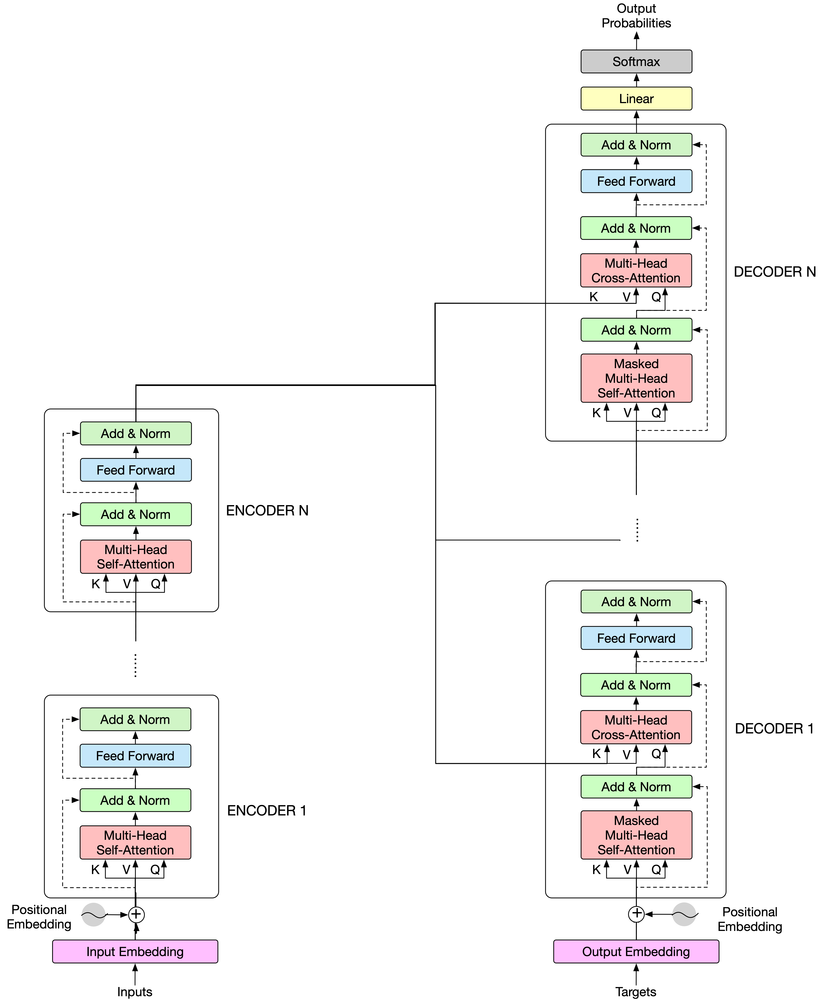

[深度学习 知识树](https://notes.zhuwanyu.com/%F0%9F%97%83%EF%B8%8F+%E5%8D%A1%E7%89%87%E7%9B%92%E5%AD%90/200+-+%E5%AD%A6%E4%B9%A0%E6%88%90%E9%95%BF/%E6%B7%B1%E5%BA%A6%E5%AD%A6%E4%B9%A0/%E6%B7%B1%E5%BA%A6%E5%AD%A6%E4%B9%A0+%E7%9F%A5%E8%AF%86%E6%A0%91)，这个人的学习笔记太对胃口了。

Transformer 是绕不开的，而 Transformer 又好像是 Attention 改进而来的。

一个 Encoder 层包含 4 个子层的顺序堆叠：

- Multi-Head Self-Attention 层
- Add & Norm 层
- Feed Forward 层
- Add & Norm 层

一个 Decoder 层包含 6 个子层的顺序堆叠：

- Masked Multi-Head Self-Attention 层
- Add & Norm 层
- Multi-Head Cross-Attention 层
- Add & Norm 层
- Feed Forward 层
- Add & Norm 层

