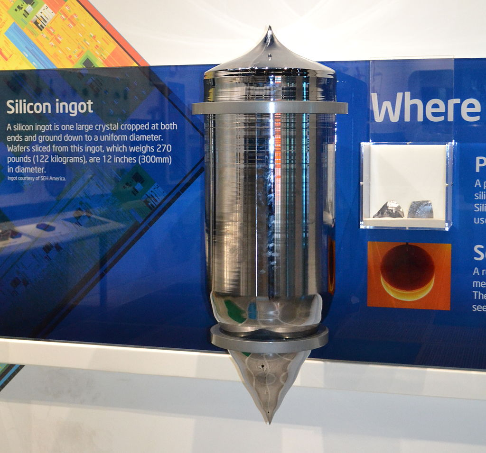
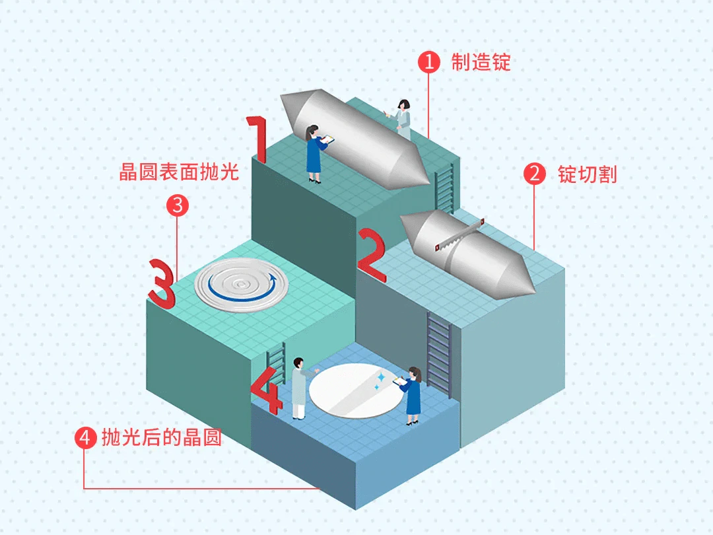
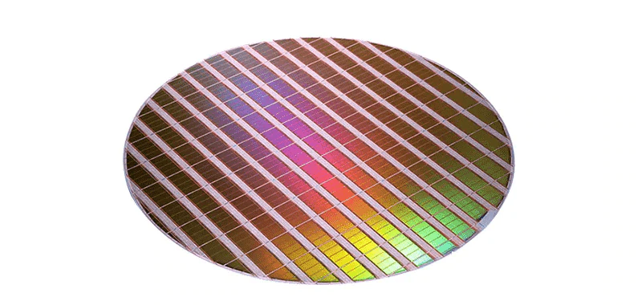
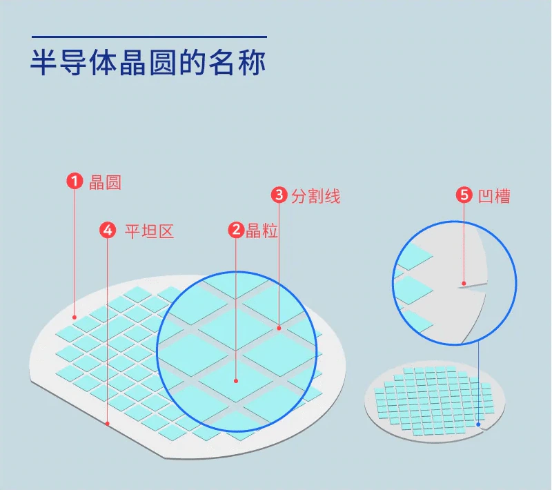
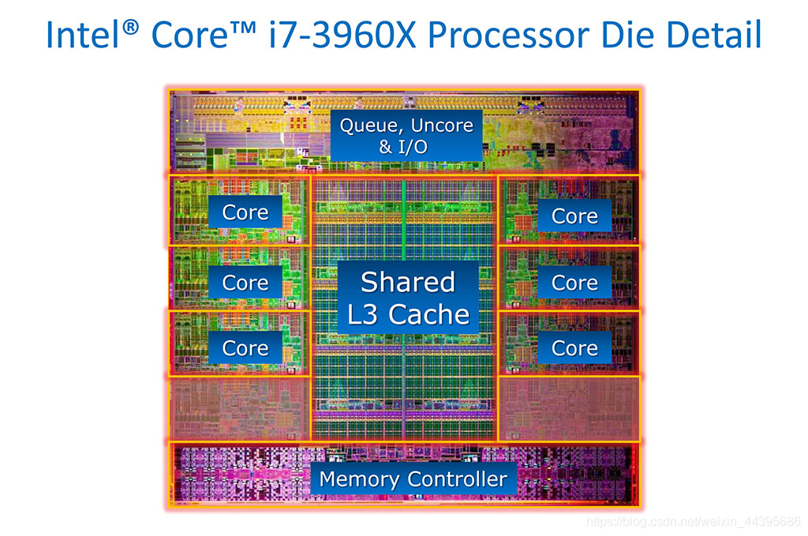
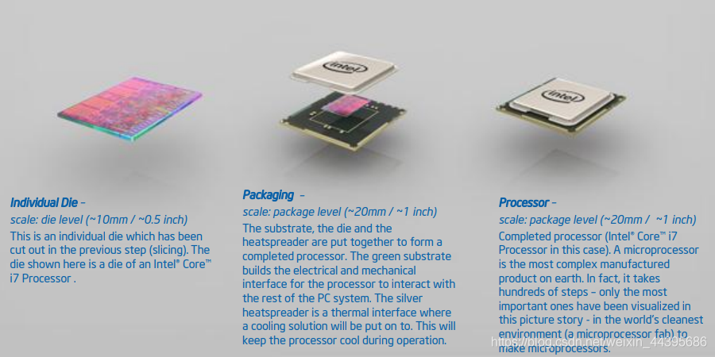
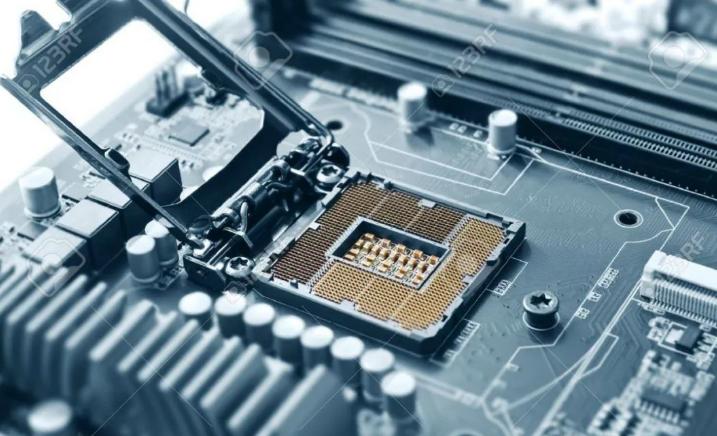

## wafer 晶圆
很简单的说，首先由普通硅砂拉制提炼，经过溶解、提纯、蒸馏一系列措施制成单晶硅棒，单晶硅棒经过切片、抛光之后，就得到了单晶硅圆片，也即单晶硅晶圆。 

**【硅晶棒】**   

**【加工后的晶圆】**   

简略步骤图如下：   

注意，第三阶段，切割后的晶圆需要进行加工,以使其像镜子一样光滑。这是因为刚切割后的晶圆表面有瑕疵 且粗糙,可能会影响电路的精密度,因此需要使用抛光液和抛光设备将晶圆表面研磨光滑。   
加工前的晶圆就像处于没有穿衣服的状态一 样,所以叫做裸晶圆(Bare wafer)。经过物理、 化学多个阶段的加工后,可以在表面形成 IC(Integrated Circuit 集成电路)。 经过加工阶段后,会成为如下形状。

## die 裸晶
也称裸芯片、裸芯片、**晶粒**或裸片，即晶圆被切割切成的小块。   
通常一个 Die 中包含多个 core 、 L3cache 、内存接口、 GPU 等， core 里面又包含了 L1 、 L2cache 。

## package 封装
将一个或多个 Die 封装成一个物理上可以售卖的 CPU 。   

socket: 目前见过最容易理解的解释是 CPU 插槽  

可以用命令 lscpu | grep socket 查看