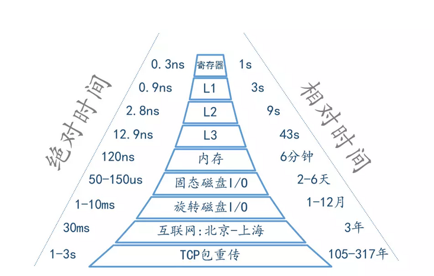

主频是 `2.6G`，也就是说每秒可以执行 `2.6*10^9` 个指令，每个指令只需要 `0.38ns` 。   
- 一级缓存读取时间为 `0.5ns`
- 二级缓存时间就比较久了，大约在 `7ns`
- 分支预测错误需要耗时 `5ns`
- 互斥锁的加锁和解锁时间需要 `25ns`
- 每次内存寻址需要 `100ns`
- 磁盘寻址时间为 `10ms`
- 一次 CPU 上下文切换（系统调用）需要大约 `1500ns`

IPC = instructions per cycle