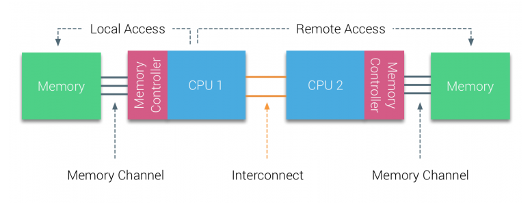

主频是 `2.6G`，也就是说每秒可以执行 `2.6*10^9` 个指令，每个指令只需要 `0.38ns` 。   
- 一级缓存读取时间为 `0.5ns`
- 二级缓存时间就比较久了，大约在 `7ns`
- 分支预测错误需要耗时 `5ns`
- 互斥锁的加锁和解锁时间需要 `25ns`
- 每次内存寻址需要 `100ns`
- 磁盘寻址时间为 `10ms`
- 一次 CPU 上下文切换（系统调用）需要大约 `1500ns`


IPC = instructions per cycle


----------------

一些前提知识：   
针对磁盘操作的优化也非常多，如 零拷贝 、 direct I/O 、 异步 I/O 等等，这些优化的目的都是为了提高系统的吞吐量；   
另外操作系统内核中也有 磁盘高速缓存区 、 PageCache 、 TLB 等，可以有效的减少磁盘的访问次数。

linux I/O 简介   
> Linux offers two modes for file I/O: buffered and direct. Buffered I/O passes through the kernel's page cache; Direct I/O, instead, goes straight between a user-space buffer and the storage device. 

用户数据（User Data）到达磁盘（Disk）的流程如下

stdio buffer: 用户态实现的缓存。此处使用缓存的原因很简单——系统调用总是昂贵的。如果用户代码以较小的size不断的读或写文件的话，stdio库将多次的读或者写操作通过buffer进行聚合是可以提高程序运行效率的。stdio库同时也支持fflush函数来主动的刷新buffer，主动的调用底层的系统调用立即更新buffer里的数据。特别地，setbuf函数可以对stdio库的用户态buffer进行设置，甚至取消buffer的使用。

Kernel buffer cache: 系统调用的read/write和真实的磁盘读写之间也存在一层buffer，这里用术语 **Kernel buffer cache** 来指代这一层缓存。在Linux下，文件的缓存习惯性的称之为 **Page Cache** ，而更低一级的设备的缓存称之为 **Buffer Cache**.    
这两个概念很容易混淆，这里简单的介绍下概念上的区别：
- Page Cache用于缓存文件的内容，和文件系统比较相关。文件的内容需要映射到实际的物理磁盘，这种映射关系由文件系统来完成；
- Buffer Cache用于缓存存储设备块（比如磁盘扇区）的数据，而不关心是否有文件系统的存在（文件系统的元数据缓存在Buffer Cache中）。   


传统的Buffered IO使用read(2)读取文件的过程什么样的？   
假设要去读一个冷文件（Cache中不存在），open打开文件内核后建立了一系列的数据结构，接下来调用read，到达文件系统这一层，发现Page Cache中不存在该位置的磁盘映射，然后创建相应的Page Cache并和相关的扇区关联。然后请求继续到达块设备层，在IO队列里排队，接受一系列的调度后到达设备驱动层，此时一般使用DMA方式读取相应的磁盘扇区到Cache中，然后read(2)拷贝数据到用户提供的用户态buffer中去（read(2)的参数指出的）。

整个过程有几次拷贝？   
从磁盘到Page Cache算第一次的话，从Page Cache到用户态buffer就是第二次了。

mmap 做了什么？   
mmap 直接把 Page Cache 映射到了用户态的地址空间里了，所以 mmap 的方式读文件是没有第二次拷贝过程的。

Direct IO做了什么？   
这个机制更狠，直接让用户态和块 IO 层对接，直接放弃 Page Cache ，从磁盘直接和用户态拷贝数据。好处是什么？写操作直接映射进程的 buffer 到磁盘扇区，以 DMA 的方式传输数据，减少了原本需要到 Page Cache 层的一次拷贝，提升了写的效率。对于读而言，第一次肯定也是快于传统的方式的，但是之后的读就不如传统方式了（当然也可以在用户态自己做Cache，有些商用数据库就是这么做的）。

除了传统的Buffered IO可以比较自由的用偏移+长度的方式读写文件之外，mmap 和 Direct IO 均有数据按页对齐的要求，Direct IO 还限制读写必须是底层存储设备块大小的整数倍（甚至Linux 2.4还要求是文件系统逻辑块的整数倍）。所以接口越来越底层，换来表面上的效率提升的背后，需要在应用程序这一层做更多的事情。所以想用好这些高级特性，除了深刻理解其背后的机制之外，也要在系统设计上下一番功夫。Linux 大神也喷过 O_DIRECT 。

广义上Cache的同步方式有两种: 
- Write Through（写穿）
- Write back（写回）   

对应到 Linux 的 Page Cache 上所谓 Write Through 就是指 write 操作将数据拷贝到 Page Cache 后立即和下层进行同步的写操作，完成下层的更新后才返回。
而 Write back 正好相反，指的是写完 Page Cache 就可以返回了。
Page Cache 到下层的更新操作是异步进行的。   
Linux下Buffered IO默认使用的是 Write back 机制。


一些名词
- DMA   
DMA，全称Direct Memory Access，即直接存储器访问，是为了避免CPU在磁盘操作时承担过多的中断负载而设计的；在磁盘操作中，CPU可将总线控制权交给DMA控制器，由DMA输出读写命令，直接控制RAM与I/O接口进行DMA传输，无需CPU直接控制传输，也没有中断处理方式那样保留现场和恢复现场过程，使得CPU的效率大大提高
- MMU   
Memory Management Unit—内存管理单元，主要实现：
    - 竞争访问保护管理需求：需要严格的访问保护，动态管理哪些内存页/段或区，为哪些应用程序所用。这属于资源的竞争访问管理需求
    - 高效的翻译转换管理需求：需要实现快速高效的映射翻译转换，否则系统的运行效率将会低下
    - 高效的虚实内存交换需求：需要在实际的虚拟内存与物理内存进行内存页/段交换过程中快速高效
- Page Cache   
为了避免每次读写文件时，都需要对硬盘进行读写操作，Linux 内核使用 页缓存（Page Cache） 机制来对文件中的数据进行缓存

此外，由于读取磁盘数据的时候，需要找到数据所在的位置，但是对于机械磁盘来说，就是通过磁头旋转到数据所在的扇区，再开始「顺序」读取数据，但是旋转磁头这个物理动作是非常耗时的，为了降低它的影响，PageCache 使用了「预读功能」
比如，假设 read 方法每次只会读 32 KB 的字节，虽然 read 刚开始只会读 0 ～ 32 KB 的字节，但内核会把其后面的 32～64 KB 也读取到 PageCache 。


**虚拟内存**为每个进程提供了一个一致的、私有且连续完整的内存空间；所有现代操作系统都使用虚拟内存，使用虚拟地址取代物理地址，主要有以下几点好处：   
- 多个虚拟内存可以指向同一个物理地址
- 虚拟内存空间可以远远大于物理内存空间
- 应用层面可管理连续的内存空间，减少出错

利用上述的第一条特性可以优化，可以把内核空间和用户空间的虚拟地址映射到同一个物理地址，这样在 I/O 操作时就不需要来回复制了。


-----------------


在进行 I/O 设备和内存的数据传输的时候，数据搬运的工作全部交给 DMA 控制器，而 CPU 不再参与任何与数据搬运相关的事情，这样 CPU 就可以去处理别的事务。（中间 CPU 列明显空出了蛮多时间）


在有了DMA后，整个数据传输的过程，CPU 不再参与与磁盘交互的数据搬运工作，而是全程由 DMA 完成，但是 CPU 在这个过程中也是必不可少的，因为传输什么数据，从哪里传输到哪里，都需要 CPU 来告诉 DMA 控制器。

即使有了 DMA ，磁盘 I/O 还是很麻烦：
例如将磁盘中的文件读出到内存，再通过网络协议发送给客户端，一般我们会使用两个系统调用：
```c++
read(file, tmp_buf, len)
write(socket, tmp_buf, len)
``` 

1. syscall read(切换上下文)，开始DMA拷贝
2. 从磁盘完成拷贝到内核缓存区
3. CPU拷贝数据到用户缓冲区(切换上下文)
4. syscall write(切换上下文), CPU拷贝数据到socket缓冲区
5. 开始DMA拷贝
6. 从socket缓冲区完成拷贝到网卡
7. write返回(切换上下文)
8. 用户态内核态I/O设备

要想提高文件传输的性能，需要减少用户态与内核态的上下文切换和内存拷贝的次数。   
那么**零拷贝技术**就应运而生了，它就是为了解决我们在上面提到的场景——跨过与用户态交互的过程，直接将数据从文件系统移动到网络接口而产生的技术。  

零拷贝技术实现的方式通常有 3 种：
1. mmap + write   
    read() 系统调用的过程中会把内核缓冲区的数据拷贝到用户的缓冲区里，于是为了省去这一步，我们可以用 mmap() 替换 read() 系统调用函数，伪代码如下：
    ```C++
    buf = mmap(file, len)
    write(sockfd, buf, len)
    ```
    mmap()系统调用函数会在调用进程的虚拟地址空间中创建一个新映射，直接把内核缓冲区里的数据「映射」到用户空间，这样，操作系统内核与用户空间就不需要再进行任何的数据拷贝操作。
    
    具体过程如下：
    - 应用进程调用了 mmap() 后，DMA 会把磁盘的数据拷贝到内核的缓冲区里，应用进程跟操作系统内核「共享」这个缓冲区
    - 应用进程再调用 write() ，操作系统直接将内核缓冲区的数据拷贝到 socket 缓冲区中，这一切都发生在内核态，由 CPU 来搬运数据
    - 最后，把内核的 socket 缓冲区里的数据，拷贝到网卡的缓冲区里，这个过程是由 DMA 搬运的。   
    
    我们可以看到，通过使用 mmap() 来代替 read() ， 可以减少一次数据拷贝的过程 但这还不是最理想的零拷贝，因为仍然需要通过 CPU 把内核缓冲区的数据拷贝到 socket 缓冲区里，且仍然需要 4 次上下文切换，因为系统调用还是 2 次。
2. sendfile   
    在 Linux 内核版本 2.1 中，提供了一个专门发送文件的系统调用函数 sendfile()
    ```c++
    #include <sys/socket.h>
    ssize_t sendfile(int out_fd, int in_fd, off_t *offset, size_t count);
    ```
    首先，它可以替代前面的read()和write()这两个系统调用，这样就可以减少一次系统调用，也就减少了 2 次上下文切换的开销。   
    其次，该系统调用，可以直接把内核缓冲区里的数据拷贝到 socket 缓冲区里，不再拷贝到用户态，这样就只有 2 次上下文切换，和 3 次数据拷贝。
    
    
    Linux 2.4 内核进行了优化，提供了带有 scatter/gather 的 sendfile 操作，这个操作可以把最后一次 CPU COPY 去除。其原理就是在内核空间 Read BUffer 和 Socket Buffer 不做数据复制，而是将 Read Buffer 的内存地址、偏移量记录到相应的 Socket Buffer 中，这样就不需要复制。其本质和虚拟内存的解决方法思路一致，就是内存地址的记录 你可以在你的 Linux 系统通过下面这个命令，查看网卡是否支持 scatter-gather 特性：
    ```bash
    $ ethtool -k eth0 | grep scatter-gather
    scatter-gather: on
    ```
    于是，从 Linux 内核 2.4 版本开始起，对于支持网卡支持 SG-DMA 技术的情况下， sendfile() 系统调用的过程发生了点变化，具体过程如下：
    - 第一步，通过 DMA 将磁盘上的数据拷贝到内核缓冲区里；
    - 第二步，缓冲区描述符和数据长度传到 socket 缓冲区，这样网卡的 SG-DMA 控制器就可以直接将内核缓存中的数据拷贝到网卡的缓冲区里，此过程不需要将数据从操作系统内核缓冲区拷贝到 socket 缓冲区中，这样就减少了一次数据拷贝；

    所以，这个过程之中，只进行了 2 次数据拷贝
    
3. splice   
    ```c++
    #include <fcntl.h> 
    ssize_t splice(int fdin, loff_t *offin, int fdout, loff_t *offout, size_t len, unsigned int flags);
    ```
    splice 调用和 sendfile 非常相似，用户应用程序必须拥有两个已经打开的文件描述符，一个表示输入设备，一个表示输出设备。与 sendfile 不同的是， splice 允许任意两个文件互相连接，而并不只是文件与 socket 进行数据传输。对于从一个文件描述符发送数据到 socket 这种特例来说，一直都是使用 sendfile 系统调用，而 splice 一直以来就只是一种机制，它并不仅限于 sendfile 的功能。也就是说 sendfile 是 splice 的一个子集 splice() 是基于 Linux 的管道缓冲区 ( pipe buffer ) 机制实现的，所以 splice() 的两个入参文件描述符要求必须有一个是管道设备 使用 splice() 完成一次磁盘文件到网卡的读写过程如下：
    - 用户进程调用 pipe() ，从用户态陷入内核态；创建匿名单向管道， pipe() 返回，上下文从内核态切换回用户态
    - 用户进程调用 splice() ，从用户态陷入内核态
    - DMA 控制器将数据从硬盘拷贝到内核缓冲区，从管道的写入端"拷贝"进管道， splice() 返回，上下文从内核态回到用户态
    - 用户进程再次调用 splice() ，从用户态陷入内核态
    - 内核把数据从管道的读取端拷贝到 socket 缓冲区， DMA 控制器将数据从 socket 缓冲区拷贝到网卡
    - splice() 返回，上下文从内核态切换回用户态
    

    在 Linux 2.6.17 版本引入了 splice ，而在 Linux 2.6.23 版本中， sendfile 机制的实现已经没有了，但是其 API 及相应的功能还在，只不过 API 及相应的功能是利用了 splice 机制来实现的 和 sendfile 不同的是， splice 不需要硬件支持.


在大文件传输的场景下，零拷贝技术并不是最优选择；   
因为在零拷贝的任何一种实现中，都会有「DMA将数据从磁盘拷贝到内核缓存区——Page Cache」这一步，但是，在传输大文件（GB 级别的文件）的时候，PageCache 会不起作用，那就白白浪费 DMA 多做的一次数据拷贝，造成性能的降低，即使使用了 PageCache 的零拷贝也会损失性能。   这是因为在大文件传输场景下，每当用户访问这些大文件的时候，内核就会把它们载入 PageCache 中，PageCache 空间很快被这些大文件占满；且由于文件太大，可能某些部分的文件数据被再次访问的概率比较低，这样就会带来 2 个问题：
- PageCache 由于长时间被大文件占据，其他「热点」的小文件可能就无法充分使用到 PageCache，于是这样磁盘读写的性能就会下降了
- PageCache 中的大文件数据，由于没有享受到缓存带来的好处，但却耗费 DMA 多拷贝到 PageCache 一次

答案是使用异步 I/O ，并且异步 I/O 没有涉及到 PageCache；
使用异步 I/O 就意味着要绕开 PageCache，因为填充 PageCache 的过程在内核中必须阻塞 所以异步 I/O 中使用的是 direct I/O （对比使用 PageCache 的 buffer I/O ），这样才能不阻塞进程，立即返回 direct I/O 。其应用场景常见的两种：
- 应用程序已经实现了磁盘数据的缓存，那么可以不需要 PageCache 再次缓存，减少额外的性能损耗。在 MySQL 数据库中，可以通过参数设置开启 direct I/O ，默认是不开启
- 传输大文件的时候，由于大文件难以命中 PageCache 缓存，而且会占满 PageCache 导致「热点」文件无法充分利用缓存，从而增大了性能开销，因此，这时应该使用 direct I/O

当然，由于 direct I/O 绕过了 PageCache，就无法享受内核的这两点的优化：
- 内核的 I/O 调度算法会缓存尽可能多的 I/O 请求在 PageCache 中，最后「合并」成一个更大的 I/O 请求再发给磁盘，这样做是为了减少磁盘的寻址操作
- 内核也会「预读」后续的 I/O 请求放在 PageCache 中，一样是为了减少对磁盘的操作


到目前为止，我们讨论的 zero-copy 技术都是基于减少甚至是避免用户空间和内核空间之间的 CPU 数据拷贝的，大多数都只适用于那些用户进程不需要再处理数据的场景。
如果需要处理数据之后再发送出去，那就只能选择优化用户空间和内核空间数据传输的技术：
- 动态重映射与写时拷贝 ( Copy-on-Write )   
    COW 是一种建立在虚拟内存重映射技术之上的技术，因此它需要 MMU 的硬件支持， MMU 会记录当前哪些内存页被标记成只读，当有进程尝试往这些内存页中写数据的时候， MMU 就会抛一个异常给操作系统内核，内核处理该异常时为该进程分配一份物理内存并复制数据到此内存地址，重新向 MMU 发出执行该进程的写操作。   
    COW 这种零拷贝技术比较适用于那种多读少写从而使得 COW 事件发生较少的场景，而在其它场景下反而可能造成负优化，因为 COW 事件所带来的系统开销要远远高于一次 CPU 拷贝所产生的开销。
- 缓冲区共享 ( Buffer Sharing )
    例如 fbufs ，暂不成熟。


------------------------------

### 远古架构

所有的 CPU 通过 FSB(Front Side Bus) 与北桥相连，北桥是瓶颈。


引入 MC(Memory Controler) 与北桥相连，这样增大了内存带宽以及并发使用内存，但是这样的架构使得北桥内部的带宽成了瓶颈，谁干啥都要通过它。


把 MC 集成到 CPU 内部，把北桥都继承到 CPU 内部！这样就导致了内存不一致。


--------------------------------------

### 从 UMA 到 NUMA

bus-based 系统中，每个 CPU 都可以通过往总线发送请求来获得内存的使用。   
但是这个系统有伸缩性问题：
1. CPU 越多，平均带宽就越少。
2. 并且当 bus-length 增加的时候，又会增加延迟性。   

随着 CPU 性能的增强，内存响应速度与 CPU 所需的速度之间的差距越来越大，于是又引入 memory cache 来解决问题。


为每个 CPU 增加 cache 是会提升性能，但是也带来了 cache-coherency 问题，为了解决这个问题，又引入了 caching snoop protocols 。


-------------------------

Processors of Bus-based multiprocessors that experience the same – uniform – access time to any memory module in the system are often referred to as Uniform Memory Access (UMA) systems or Symmetric Multi-Processors (SMPs).

UMA 中，所有的 CPU 通过 FSB 连接到北桥，北桥包含了 MC ，所有与内存的通信都要经过北桥。
并且所有的 IO 也是和北桥相连，也得通过北桥才能与各 CPU 通信。


--------------------------

Non-Uniform Memory Access organization

1. Non-Uniform Memory Access organization
2. Point-to-Point interconnect topology
3. Scalable cache coherence solutions

内存才用拓扑形式


端到端互联，而不是和之前一样使用总线。
AMD 采用端到端的 HT(HyperTransport) 总线。
Intel 采用 QuickPath ，也就是 QuickPath point-to-point Interconnect (QPI)。
并且，还引入了 Uncore ：
> uncore一词，是英特尔用来描述微处理器中，功能上为非处理器核心（Core）所负担，但是对处理器性能的发挥和维持有必不可少的作用的组成部分。处理器核心（Core）包含的处理器组件都涉及处理器命令的运行，包括算术逻辑单元（ALU）、浮点运算单元（FPU）、一级缓存（L1 Cache）、二级缓存（L2 Cache）。Uncore的功能包括QPI控制器、三级缓存（L3 Cache）、内存一致性监测（snoop agent pipeline）、内存控制器，以及Thunderbolt控制器。至于其余的总线控制器，像是PCI-E、SPI等，则是属于芯片组的一部分。   
英特尔 Uncore 设计根源，来自于北桥芯片。Uncroe 的设计是，将对于处理器核心有关键作用的功能重新组合编排，从物理上使它们更靠近核心（集成至处理器芯片上，而它们有部分原来是位于北桥上），以降低它们的访问延时。而北桥上余下的和处理器核心并无太大关键作用的功能，像是PCI-E控制器或者是电源控制单元（PCU），并没有集成至Uncore部分，而是继续作为芯片组的一部分。   
可以在 ls -d /sys/devices/uncore_* 中查看


Ring Bus实际上是两个环，一个顺时针环和一个逆时针环。各个模块一视同仁的通过 Ring Stop 挂接在Ring Bus上。如此设计带来很多好处：
1. 双环设计可以保证任何两个 ring stop 之间距离不超过Ring Stop总数的一半，延迟较低。
2. 各个模块之间交互方便，不需要 Core 中转。这样一些高级加速技术，如 DCA(Direct Cache Access), Crystal Beach 等等应运而生。
3. 高速的ring bus保证了性能的极大提高。Core to Core latency 只有60ns左右，而带宽则高达数百G(记得Nehalem是192GB/s).
方便灵活。增加一个Core，只要在Ring上面加个新的ring stop就好，不用像以前一样考虑复杂的互联问题。

由于每加一个Core，ring bus就长大一些，延迟就变大一点，很快ring bus性能就随着core的增多而严重下降，多于12个core后会严重拖累系统的整体延迟。

