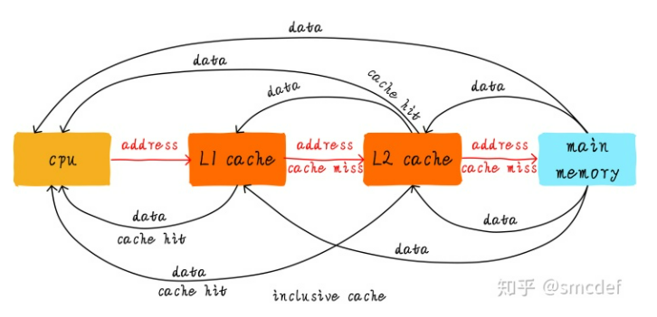
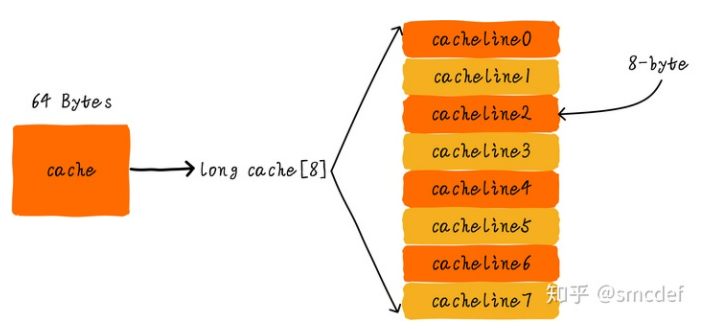
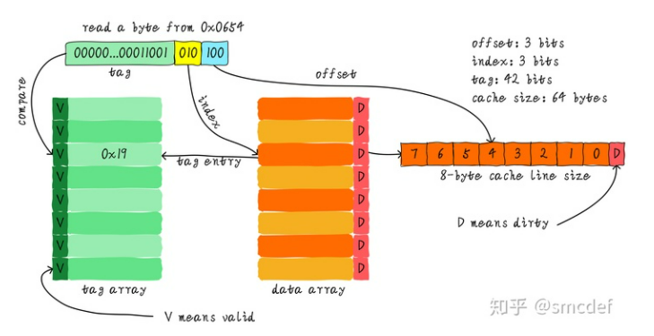
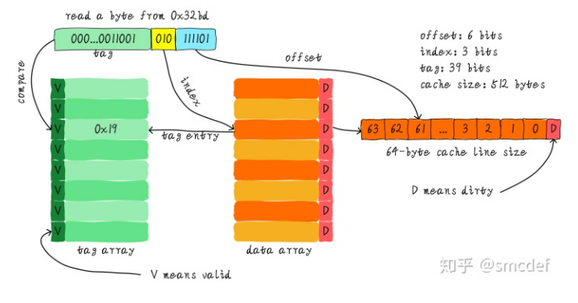
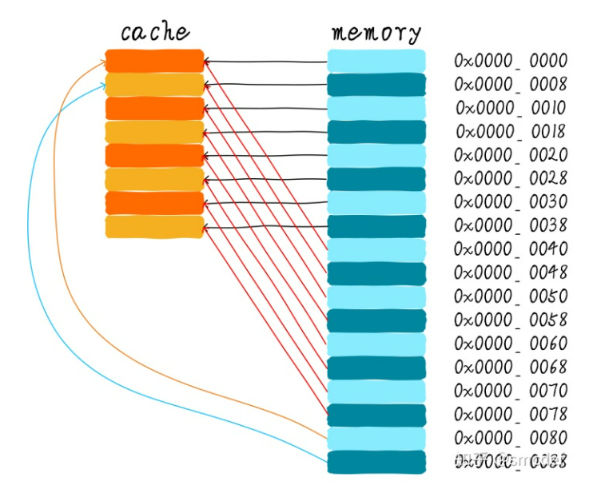
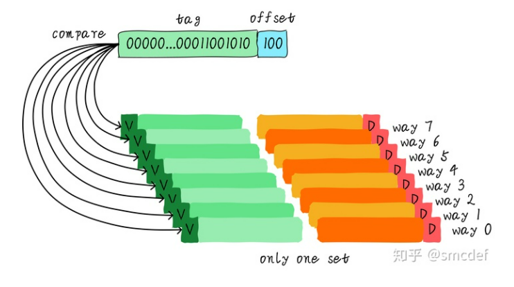
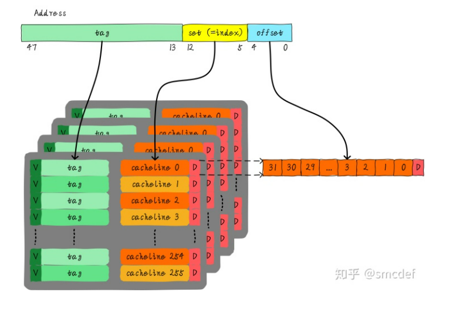
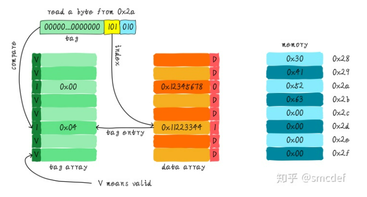
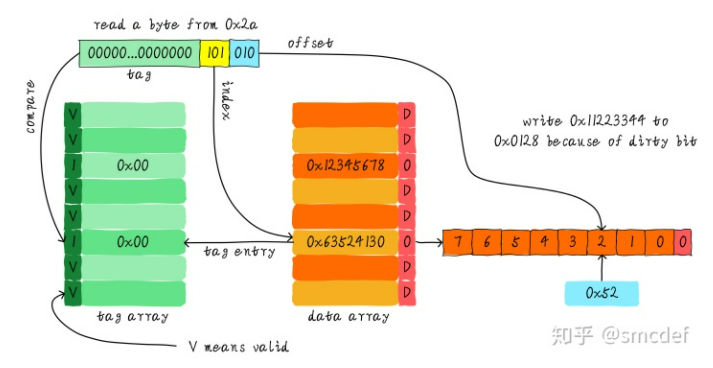

## cache
主要参考知乎专栏 [高速缓存与一致性专栏](https://zhuanlan.zhihu.com/p/136300660) 。

由于CPU通用寄存器的速度和主存之间存在着太大的差异，所以引入 cache ，如图：


当CPU试图从某地址 load 数据时，首先从 L1 cache 中查询是否命中，如果命中则把数据返回给 CPU 。如果 L1 cache 缺失，则继续从 L2 cache 中查找。当 L2 cache 命中时，数据会返回给 L1 cache 以及 CPU 。如果 L2 cache 也缺失，则需要从主存中 load 数据，将数据返回给 L2 cache 、 L1 cache 及 CPU 。

这种多级 cache 的工作方式称之为 **inclusive cache** ，其中某一地址的数据可能存在多级缓存中。与 **inclusive cache** 对应的是 **exclusive cache**，这种 cache 保证某一地址的数据缓存只会存在于多级 cache 其中一级。也就是说，任意地址的数据不可能同时在L1和L2 cache中缓存。

cache 的大小称之为 **cahe size** ，代表 cache 可以缓存最大数据的大小。
我们将 cache 平均分成相等的很多块，每一个块大小称之为 **cache line** ，其大小是 **cache line size** 。

- 例如一个 64 Bytes 大小的 cache 。如果我们将 64 Bytes 平均分成 64 块，那么 cache line 就是 1 字节，总共 64 行 cache line 。
- 如果我们将 64 Bytes 平均分成 8 块，那么 cache line 就是 8 字节，总共 8 行 cache line 。现在的硬件设计中，一般 cache line 的大小是 4-128 Byts。

**cache line 是 cache 和主存之间数据传输的最小单位**。
- 当 CPU 试图 load 一个字节数据的时候，如果 cache 缺失，那么 cache 控制器会从主存中一次性的 load cache line 大小的数据到 cache 中。例如， cache line 大小是 8 字节， CPU 即使读取一个 byte ，在 cache 缺失后， cache 会从主存中 load 8 字节填充整个 cache line 。

```bash
# 查看 cpu cache
> lscpu
```


-----


### **直接映射缓存(Direct mapped cache)**

下面的例子是针对 64 Bytes 大小的 cache ，并且 cache line 大小是 8 字节。我们可以类似把这块 cache 想象成一个数组，数组总共8个元素，每个元素大小是8字节。


假如 CPU 从 0x0654 地址读取一个字节， cache 控制器是如何判断数据是否在 cache 中命中呢？

1. 利用地址 3 bits（如下图地址黄色部分）查找某一行，这部分 bit 称之为 **index**。
2. 利用地址 3 bits（地址蓝色部分）用来寻找这一行中 8 个字节的某一字节，我们称这部分 bit 组合为 **offset**。

这样我们就找到了第 3 行数据的第 5 个字节。

新的问题来了，如果两个不同的地址，其地址的 bit3-bit5 如果完全一样的话，那么这两个地址经过硬件散列之后都会找到同一个 cache line 。注意，这里没有 bit0-bit2 的事。当我们找到 cache line 之后，只代表我们访问的地址对应的数据可能存在这个 cache line 中，但是也有可能是其他地址对应的数据。所以，我们又引入 tag array 区域， tag array 和 data array 一一对应。**每一个 cache line 都对应唯一一个 tag** ， tag 中保存的是整个地址位宽去除 index 和 offset 使用的 bit 剩余部分（如上图地址绿色部分）。 tag 、 index 和 offset 三者组合就可以唯一确定一个地址了。因此，当我们根据地址中 index 位找到 cache line 后，取出当前 cache line 对应的 tag ，然后和地址中的 tag 进行比较，如果相等，这说明 cache 命中。如果不相等，说明当前 cache line 存储的是其他地址的数据，这就是 cache 缺失。在上述图中，我们看到 tag 的值是 0x19 ，和地址中的 tag 部分相等，因此在本次访问会命中。

我们可以从图中看到 tag 旁边还有一个 valid bit ，这个 bit 用来表示 cache line 中数据是否有效（例如：1代表有效；0代表无效）。当系统刚启动时， cache 中的数据都应该是无效的，因为还没有缓存任何数据。 cache 控制器可以根据 valid bit 确认当前 cache line 数据是否有效。所以，上述比较 tag 确认 cache line 是否命中之前还会检查 valid bit 是否有效。只有在有效的情况下，比较 tag 才有意义。如果无效，直接判定 cache 缺失。


再看一个例子：512 Bytes cache size，64 Bytes cache line size。根据之前的地址划分方法，offset、index和tag分别使用6 bits、3 bits和39 bits。



缺点:



| 地址 | 二进制 | index(bit3-bit5) |
| :-----:| :----: | :----: |
| 0x00 | 0000 0000 | 0 |
| 0x08 | 0000 1000 | 1 |
| 0x10 | 0001 0000 | 2 |
| 0x18 | 0001 1000 | 3 |
| 0x20 | 0010 0000 | 4 |
| 0x28 | 0010 1000 | 5 |
| 0x30 | 0011 0000 | 6 |
| 0x38 | 0011 1000 | 7 |
| 0x40 | 0100 0000 | 0 |
| 0x48 | 0100 1000 | 1 |
| 0x50 | 0101 0000 | 2 |
| 0x58 | 0101 1000 | 3 |
| 0x60 | 0110 0000 | 4 |
| 0x68 | 0110 1000 | 5 |
| 0x70 | 0111 0000 | 6 |
| 0x78 | 0111 1000 | 7 |
| 0x80 | 1000 0000 | 0 |
| 0x88 | 1000 1000 | 1 |

我们可以看到，地址 0x00-0x3f 对应的数据可以覆盖整个 cache 。 0x40-0x7f 地址的数据也同样是覆盖整个 cache 。
我们现在思考一个问题，如果一个程序试图依次访问地址 0x00 、 0x40 、 0x80 ， cache 中的数据会发生什么呢？
首先我们应该明白 0x00 、 0x40 、 0x80 地址中 index 部分是一样的。因此，这 3 个地址对应的 cache line 是同一个。所以，当我们访问 0x00 地址时， cache 会缺失，然后数据会从主存中加载到 cache 中第 0 行 cache line 。当我们访问 0x40 地址时，依然索引到 cache 中第 0 行 cache line ，由于此时 cache line 中存储的是地址 0x00 地址对应的数据，所以此时依然会 cache 缺失。然后从主存中加载 0x40 地址数据到第一行 cache line 中。同理，继续访问 0x80 地址，依然会 cache 缺失。这就相当于每次访问数据都要从主存中读取，所以 cache 的存在并没有对性能有什么提升。访问 0x40 地址时，就会把 0x00 地址缓存的数据替换。这种现象叫做 cache 颠簸（cache thrashing）。针对这个问题，我们引入 **多路组相连缓存**。


-----


### **两路组相连缓存(Two-way set associative cache)**

我们依然假设 64 Bytes cache size ， cache line size 是 8 Bytes 。
什么是路（way）的概念。我们将 cache 平均分成多份，每一份就是一路。因此，两路组相连缓存就是将 cache 平均分成 2 份，每份 32 Bytes 。


cache 被分成 2 路，每路包含 4 行 cache line 。我们将所有索引一样的 cache line 组合在一起称之为组。例如，上图中一个组有两个 cache line ，总共 4 个组。我们依然假设从地址 0x0654 地址读取一个字节数据。由于 cache line size 是 8 Bytes，因此 offset 需要 3 bits，这和之前直接映射缓存一样。不一样的地方是 index ，在两路组相连缓存中， index 只需要 2 bits ，因为一路只有 4 行 cache line 。上面的例子根据 index 找到第 3 行 cache line ，第 3 行对应 2 个 cache line ，分别对应 way 0 和 way 1 。因此 index 也可以称作 set index （组索引）。先根据 index 找到 set ，然后将组内的所有 cache line 对应的 tag 取出来和地址中的 tag 部分对比，如果其中一个相等就意味着命中。（注意组(set)和路(way)在图中到底谁是谁）。

对于上一个例子，假如 0x00 被加载到 way0 ，0x40 被加载到 way1 ，这样就降低了颠簸。


---


### **全相连缓存(Full associative cache)**

既然组相连缓存那么好，如果所有的 cache line 都在一个组内。岂不是性能更好。是的，这种缓存就是全相连缓存。我们依然以 64 Byts 大小 cache 为例说明。



由于所有的 cache line 都在一个组内，因此地址中不需要 set index 部分。因为，只有一个组让你选择，间接来说就是你没得选。我们根据地址中的 tag 部分和所有的 cache line 对应的 tag 进行比较（硬件上可能并行比较也可能串行比较）。哪个 tag 比较相等，就意味着命中某个 cache line 。因此，在全相连缓存中，任意地址的数据可以缓存在任意的 cache line 中。所以，这可以最大程度的降低 cache 颠簸的频率。但是硬件成本上也是更高。


-----


### **思考**

考虑这么一个问题，32 KB 大小 4 路组相连 cache ， cache line 大小是 32 Bytes 。请思考以下2个问题：

1. 多少个组？
2. 假设地址宽度是 48 bits ， index 、 offset 以及 tag 分别占用几个 bit ？



答案: 总共 4 路，因此每路大小是 8 KB 。 cache line size 是 32 Bytes ，因此一共有 256 组（ 8 KB / 32 Bytes）。由于 cache line size 是 32 Bytes ，所以 offset 需要 5 位。一共 256 组，所以 index 需要 8 位，剩下的就是 tag 部分，占用 35 位。


----


### cache 策略
- Cache 分配策略( Cache allocation policy ): 指我们什么情况下应该为数据分配 cache line 。 cache 分配策略分为读和写两种情况。
    - 读分配(read allocation)
        - 当 CPU 读数据时，发生 cache 缺失，这种情况下都会分配一个 cache line 缓存从主存读取的数据。默认情况下， cache 都支持读分配。
    - 写分配(write allocation)
        - 当 CPU 写数据发生 cache 缺失时，才会考虑写分配策略。当我们不支持写分配的情况下，写指令只会更新主存数据，然后又有两个选择，刚修改的数据存入 cache 还是不存，如果存就叫 Write-Allocate 。当支持写分配的时候，我们首先从主存中加载数据到 cache line 中（相当于先做个读分配动作，因为 cache line 中没有想要写的地址的，所以先加载，再写），然后会更新 cache line 中的数据。
- Cache更新策略(Cache update policy): 指当发生 cache 命中时，写操作应该如何更新数据。 cache 更新策略分成两种：写直通和回写。
    - 写直通(write through)
        - 当 CPU 执行 store 指令并在 cache 命中时，我们更新 cache 中的数据并且更新主存中的数据。 cache 和主存的数据始终保持一致。
    - 写回(write back)
        - 当 CPU 执行 store 指令并在 cache 命中时，我们只更新 cache 中的数据。并且每个 cache line 中会有一个 bit 位记录数据是否被修改过，称之为 dirty bit （翻翻前面的图片， cache line 旁边有一个D就是 dirty bit ）。我们会将 dirty bit 置位。主存中的数据只会在 cache line 被替换或者显式的 clean 操作时更新。因此，主存中的数据可能是未修改的数据，而修改的数据躺在 cache 中。 cache 和主存的数据可能不一致。

假设我们有一个 64 Bytes 大小直接映射缓存， cache line 大小是 8 Bytes ，采用写分配和写回机制。当 CPU 从地址 0x2a 读取一个字节， cache 中的数据将会如何变化呢？假设当前 cache 状态如下图所示(tag旁边valid一栏的数字1代表合法。0代表非法。后面Dirty的1代表dirty，0代表没有写过数据，即非dirty)。



根据 index 找到对应的 cache line ，对应的 tag 部分 valid bit 是合法的，但是 tag 的值不相等，因此发生缺失。此时我们需要从地址 0x28 （因为 cache 和 memory 之间通信的最小单位是 cache line 。 0x2a 二进制是 101010 ， index 是 101 ，所以从主存中取出地址为 101000~101111 的 8 字节写入 cache line ，而 101000 就是 0x28 从地址 0x2a 处读取数据是 CPU 的想法，从 0x28 读取 8 字节进来是 cache 控制器的做法）地址加载 8 字节数据到该 cache line 中。但是，我们发现当前 cache line 的 dirty bit 置位。因此， cache line 里面的数据不能被简单的丢弃，由于采用写回机制，所以我们需要将 cache 中的数据 0x11223344 写到地址 0x0128 地址（旧数据 tag 是 0x4 ，也就是 100 ， index 是 101 ，加上最后三位 offset 应该是 000 ，因为要将全部 8 字节数据都写回主存，所以旧数据的地址是 1 0010 1000 ）。这个过程如下图所示。



当写回操作完成，我们将主存中0x28地址开始的8个字节加载到该 cache line 中，并清除 dirty bit 。然后根据 offset 找到 0x52 返回给 CPU 。


-----


### Bus Snooping Protocol

当 CPU0 修改自己私有的 Cache 时，硬件就会广播通知到总线上其他所有的 CPU 。对于每个 CPU来说会有特殊的硬件监听广播事件，并检查是否有相同的数据被缓存在自己的 CPU ，这里是指 CPU1 。如果 CPU1 私有 Cache 已经缓存即将修改的数据，那么 CPU1 的私有 Cache 也需要更新对应的 cache line 。这个过程就称作 bus snooping 。

这种 bus snooping 方法简单，但要需要每时每刻监听总线上的一切活动。我们需要明白的一个问题是不管别的 CPU 私有 Cache 是否缓存相同的数据，都需要发出一次广播事件。这在一定程度上加重了总线负载，也增加了读写延迟。针对该问题，提出了一种状态机机制降低带宽压力。这就是 MESI protocol（协议）。简单说就是每个 cache line 都具有状态， cpu cache line 之间通过消息发送与回复通信。

原子操作：当 CPU0 试图执行原子递增操作时。
- a) CPU0 发出 "Read Invalidate" 消息，其他 CPU 将原子变量所在的缓存无效，并从 Cache 返回数据。 CPU0 将 Cache line 置成 Exclusive 状态。然后将该 cache line 标记 **locked**。
- b) 然后 CPU0 读取原子变量，修改，最后写入 cache line 。
- c) 将 cache line 置位 **unlocked**。

借助多核Cache一致性协议可以很方便实现原子操作。


### 伪共享
两个全局变量 A 和 B ，两个进程 P1 和 P2 ，P1 在 CPU0 上运行并修改 A ，P2 在 CPU1 上运行并修改 B ，因为缓存一致性协议，这样会造成 cache 颠簸。 A 和 B 之间就是伪共享关系，实际并没有共享。

既然 A 和 B 由于在同一行cache line导致了伪共享问题，那么解决方案也很显然易见，我们可以让 A 和 B 不落在一个cache line，这样就可以解决问题。不落在同一行cache line的方法很简单，使 A 和 B 的内存地址都按照cache line size对齐，相当于以空间换时间。浪费一部分内存，换来了性能的提升。当我们把 A 和 B 都cache line size对齐后，我们再思考上面的问题。此时CPU0和CPU1分别修改 A 和 B 互不影响。 A 和 B 对应的cache line状态可以一直维持Modified状态。这样MESI协议就不会在两个CPU间不停的发送消息。降低了带宽压力。

在Linux kernel中存在 __cacheline_aligned_in_smp 宏定义用于解决 false sharing 问题。
```
#ifdef CONFIG_SMP
#define __cacheline_aligned_in_smp __cacheline_aligned
#else
#define __cacheline_aligned_in_smp
#endif
```
在单核系统上，宏定义为空。在多核系统下，该宏是L1 cach line size。针对静态定义的全局变量，如果在多核之间竞争比较严重，为了避免影响其他全局变量，可以采用上面的宏使变量cache line对齐，避免false sharing问题。


------


### store buffer
L1 Cache命中的情况下，访问数据一般需要2个指令周期。而且当CPU遭遇写数据cache未命中时，内存访问延迟增加很多（发出 invalidate 消息并等待大家回复 invalidate acknowledge）。硬件工程师为了追求极致的性能，在CPU和L1 Cache之间又加入一级缓存，我们称之为store buffer。store buffer和L1 Cache还有点区别，store buffer只缓存CPU的写操作（因为CPU没必要在那等invalidate acknowledge的回复，浪费时间，叫一个小弟去等就好）。store buffer访问一般只需要1个指令周期，这在一定程度上降低了内存写延迟。不管cache是否命中，CPU都是将数据写入store buffer。store buffer负责后续以FIFO次序写入L1 Cache。

但是，又引入了新的问题
```c++
/*
 * 假设 thread_cpu0 在 CPU0 上执行， thread_cpu1 在 CPU1 上执行。
 * 因为 store buffer ，我们竟然可能得到 r1 = 0, r2 = 0
*/
static int x = 0, y = 0;
static int r1, r2;


static void int thread_cpu0(void)
{
        x = 1;    /* 1) */
        r1 = y;   /* 2) */
}


static void int thread_cpu1(void)
{
        y = 1;    /* 3) */
        r2 = x;   /* 4) */
}


static void check_after_assign(void)
{
        printk("r1 = %d, r2 = %d\n", r1, r2);
}
```
1. 当CPU0执行x = 1时，x的值会被写入CPU0的store buffer。
2. CPU1指令y = 1操作，同样y的值会被写入CPU1的store buffer。
3. r1 = y执行时，CPU0读取y的值，由于y的新值依然在CPU1的store buffer里面，所以CPU0看到y的值依然是0。所以r1的值是0。为什么CPU0看到r1的值是0呢？ **因为硬件MESI协议只会保证Cache一致性，只要值没有被写入Cache(依然躺在store buffer里面)，MESI就管不着。** 同样的道理，r2的值也会是0。此时我们看到了一个意外的结果。

注意：虽然store buffer主要是用来缓存CPU的写操作，但是CPU**读取数据**时也会检查私有store buffer是否命中，如果没有命中才会查找L1 Cache。这主要是为了CPU自己看到自己写进store buffer的值。所以CPU0是可以看到x值更新，但是CPU1不能及时看到x。同样，CPU1可以看到y值更新，但是CPU0不能及时看到y。所以，我们经常说“单核乱序对程序员是透明的，只有其他核才会受到乱序影响”。其实还有 Store Forwarding(CPU可以直接从Store Buffer中加载数据，即支持将CPU存入Store Buffer的数据传递(forwarding)给后续的加载操作，而不经由Cache。) 和 Invalid Queue 。

一致性分为两种，一种是cache一致性，一种是内存一致性。上例出现的问题属于内存一致性范畴。

cache一致性和内存一致性有什么区别呢？
cache一致性关注的是多个CPU看到一个地址的数据是否一致。
内存一致性关注的是多个CPU看到多个地址数据读写的次序。
一个关注的是一个地址，一个关注的是多个地址的顺序。还是有点区别。为什么内存一致性关注的是多个地址的顺序呢？一个地址不会有问题吗？由于store buffer的存在，CPU0对一个地址数据的操作，其他CPU并不能及时看见，但是这又有什么影响呢？顶多相当于CPU0迟一点更新这个地址的数据而已。因此考虑多个地址数据的操作次序才有意义。针对内存一致性问题，我们提出内存模型的概念。为什么需要内存模型呢？我觉得主要是为了方便软件工程师在不理解硬件的情况下，还能理解代码执行是怎么回事，并编写正确的并行代码。


当我们思考内存一致性问题时，我们应该关注的是内存模型。根据内存模型理论，就可以指导我们写出正确的代码。


------------------

## 题目
[出处](https://coolshell.cn/articles/20793.html)

```c++
// 第二个循环要比第一个循环少4倍的计算量，其应该也是要快4倍的。
const int LEN = 64*1024*1024;
int *arr = new int[LEN];

for (int i = 0; i < LEN; i += 2) arr[i] *= i;
for (int i = 0; i < LEN; i += 8) arr[i] *= i;
// 其实相差无几。因为CPU会以一个 Cache Line 64Bytes 最小时单位加载，也就是 16 个 32bits 的整型，所以，无论你步长是2还是8，都差不多。
```

```c++
// size = 横轴 * 纵轴
// increment = 横轴
for (int i = 0; i < 10000000; i++) {
    for (int j = 0; j < size; j += increment) {
        memory[j] += j;
    }
}
/*
| count |   1    |   16  |  512  | 1024  |
------------------------------------------
|     1 |  17539 | 16726 | 15143 | 14477 |
|     2 |  15420 | 14648 | 13552 | 13343 |
|     3 |  14716 | 14463 | 15086 | 17509 |
|     4 |  18976 | 18829 | 18961 | 21645 |
|     5 |  23693 | 23436 | 74349 | 29796 |
|     6 |  23264 | 23707 | 27005 | 44103 |
|     7 |  28574 | 28979 | 33169 | 58759 |
|     8 |  33155 | 34405 | 39339 | 65182 |
|     9 |  37088 | 37788 | 49863 |156745 |
|    10 |  41543 | 42103 | 58533 |215278 |
|    11 |  47638 | 50329 | 66620 |335603 |
|    12 |  49759 | 51228 | 75087 |305075 |
|    13 |  53938 | 53924 | 77790 |366879 |
|    14 |  58422 | 59565 | 90501 |466368 |
|    15 |  62161 | 64129 | 90814 |525780 |
|    16 |  67061 | 66663 | 98734 |440558 |
|    17 |  71132 | 69753 |171203 |506631 |
|    18 |  74102 | 73130 |293947 |550920 |
*/
// 从 [9，1024] 以后，时间显著上升。包括 [17，512] 和 [18,512] 也显著上升。
// 这是因为，我机器的 L1 Cache 是 32KB, 8 Way 的，前面说过，8 Way的有64组，每组8个Cache Line，当for-loop步长超过1024个整型，也就是正好 4096 Bytes时，也就是导致内存地址的变化是变化在高位的24bits上，而低位的12bits变化不大，尤其是中间6bits没有变化，导致全部命中同一组set，导致大量的cache 冲突，导致性能下降，时间上升。而 [16, 512]也是一样的，其中的几步开始导致L1 Cache开始冲突失效。
```

```c++
const int row = 1024;
const int col = 512
int matrix[row][col];

//逐行遍历
int sum_row=0;
for(int _r=0; _r<row; _r++) {
    for(int _c=0; _c<col; _c++){
        sum_row += matrix[_r][_c];
    }
}

//逐列遍历
int sum_col=0;
for(int _c=0; _c<col; _c++) {
    for(int _r=0; _r<row; _r++){
        sum_col += matrix[_r][_c];
    }
}
// 执行时间有十几倍的差距。其中的原因，就是逐列遍历对于CPU Cache 的运作方式并不友好，所以，付出巨大的代价。
```

```c++
void fn (int* data) {
    for(int i = 0; i < 10*1024*1024; ++i)
        *data += rand();
}

int p[32];

int *p1 = &p[0];
int *p2 = &p[1]; // int *p2 = &p[30];

thread t1(fn, p1);
thread t2(fn, p2);
// 因为 p[0] 和 p[1] 在同一条 Cache Line 上，而 p[0] 和 p[30] 则不可能在同一条Cache Line 上 ，CPU的缓存最小的更新单位是Cache Line，所以，这导致虽然两个线程在写不同的数据，但是因为这两个数据在同一条Cache Line上，就会导致缓存需要不断进在两个CPU的L1/L2中进行同步，从而导致了5倍的时间差异。
```

```c++
int total_size = 16 * 1024 * 1024; //数组长度
int* test_data = new test_data[total_size]; //数组
int nthread = 6; //线程数（因为我的机器是6核的）
int result[nthread]; //收集结果的数组

void thread_func (int id) {
    result[id] = 0;
    int chunk_size = total_size / nthread + 1;
    int start = id * chunk_size;
    int end = min(start + chunk_size, total_size);

    for ( int i = start; i < end; ++i ) {
        if (test_data[i] % 2 != 0 ) ++result[id];
    }
}
```
在执行过程中，你会发现，6个线程居然跑不过1个线程。因为根据上面的例子你知道 result[] 这个数组中的数据在一个Cache Line中，所以，所有的线程都会对这个 Cache Line 进行写操作，导致所有的线程都在不断地重新同步 result[] 所在的 Cache Line，所以，导致 6 个线程还跑不过一个线程的结果。这叫 False Sharing。
改进如下，使用一个线程内的变量。
```c++
void thread_func (int id) {
    result[id] = 0;
    int chunk_size = total_size / nthread + 1;
    int start = id * chunk_size;
    int end = min(start + chunk_size, total_size);

    int c = 0; //使用临时变量，没有cache line的同步了
    for ( int i = start; i < end; ++i ) {
        if (test_data[i] % 2 != 0 ) ++c;
    }
    result[id] = c;
}
```