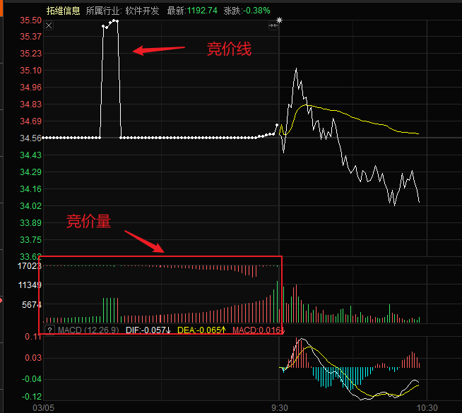

# 0x00. 导读

# 0x01. 简介

# 0x02. 规则

```
09:15 - 09:20 可挂可撤
09:20 - 09:25 可挂不可撤
09:25 的时候统一成交，从而确定开盘价。开盘价的确认是统一在 9点25分 按照价格匹配的最大成交量进行成交。符合竞价的撮合结果，竞价结束后成交，不符合竞价撮合结果的，开盘之后继续参与连续竞价。
根据 **价格优先原则** ：
    高于开盘价的买单全部成交
    低于开盘价的卖单全部成交
    等于开盘价的根据 **时间优先原则** 成交

连续竞价

14:57 - 15:00 深市的股票在这个阶段进行集合竞价形成收盘价，这个时间只能接受买进和卖出申报，不能撤单
```

集合竞价阶段也不受价格笼子限制，因此，如果你是小资金的股票玩家的话：
- 当你想要在集合竞价的阶段买入一只股票的话，可以在 9:15-9:25 这段时间内，直接挂当日的涨停价申报，竞价结束后最终会在 9点25分 统一以开盘价（并非是涨停价）撮合成交
- 相反的，当你想要在集合竞价的阶段卖出一只股票的话，可以在9:15-9:25这段时间内，直接挂当日的跌停价申报，竞价结束后最终会在 9点25分 统一以开盘价（并非是跌停价）撮合成交。

## 2.1 竞价量能图

竞价线：即竞价期间的价格变化线，也叫匹配价。

竞价量：包含匹配量与未匹配量；匹配量是竞价图下方的柱子，未匹配量是竞价图上方的柱子。

红色的量柱代表买入委托撮合成交，此时买盘大于卖盘，绿色的柱子代表卖出委托撮合成交，此时买盘小于卖盘。



竞价线表现：抢筹（价格向上，有资金看好）；横盘（价格不动）；砸盘（价格向下，有资金看空）。

竞价量表现：稀疏（主力资金竞价关注程度欠佳）；密集（主力资金竞价关注程度较高）；红多绿少为佳。