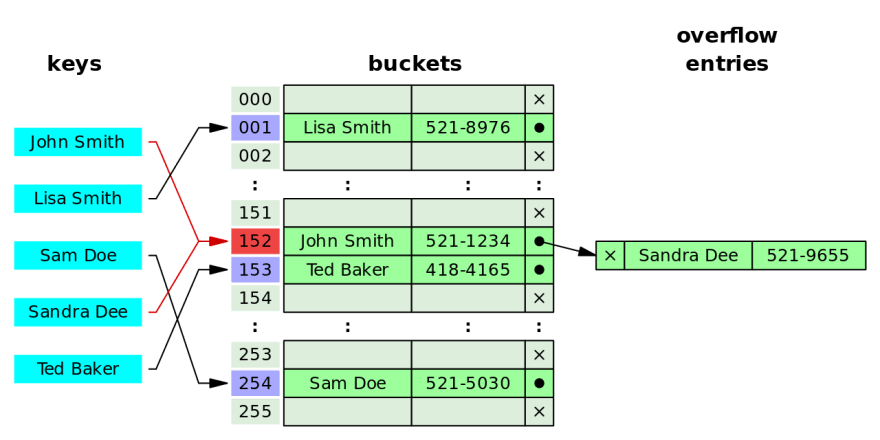
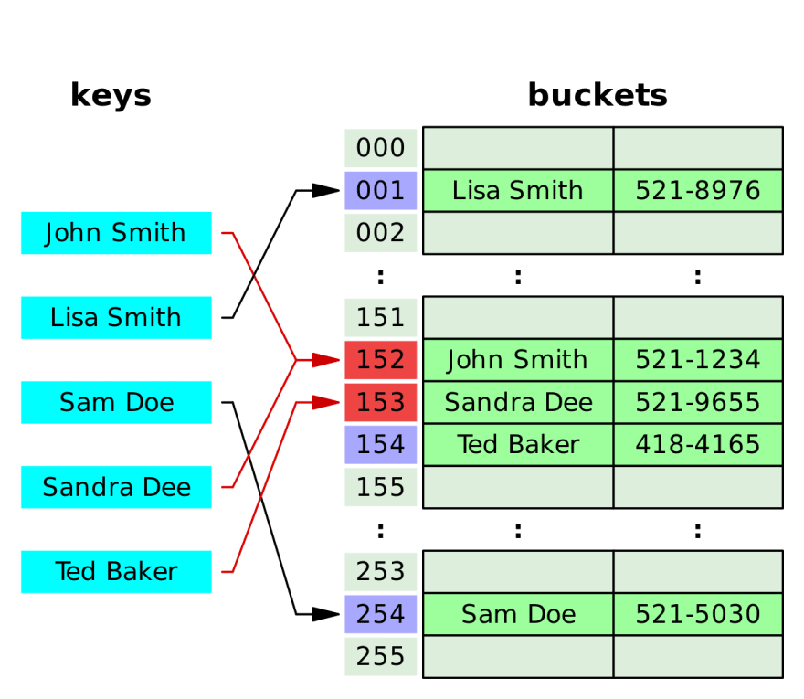

# 0x00. 导读

介绍哈希表。

# 0x01. 简介

给定表 M, 存在函数 f, 对任意给定的 key, 代入函数后若能得到包含该 key 的记录在表中的地址，则称表 M 为哈希 (Hash) 表，函数 f(key) 为哈希 (Hash) 函数。

对不同的 key 可能得到同一散列地址，即 k1≠k2, 而 f(k1)=f(k2), 这种现象称为冲突（Collision）。

# 0x02. 冲突解决

现了解一下 负载因子(load factor) 的概念：  
负载因子衡量哈希表的填充程度，它等于 m / n, m 是表中元素个数，n 是表的大小。

当我们增加哈希表中的元素数量时，负载因子就会增加，为了帮助我们保持惊人的访问速度，需要定义一个负载因子阈值，当超过该阈值时，将触发 rehash。

## 2.1 open hashing/closed addressing

如果两个元素的哈希值是相同的，那么我们就会把后插入的元素加入在它哈希值对应的那个链表的最后。这种处理哈希碰撞的办法我们一般叫做 open hashing, 或者叫做 closed addressing, 还有种称呼叫做 拉链法 。

## 2.2 closed hashing/open addressing

在两个元素的哈希值相同时，与其我们把后插入的这个元素放在一个链表中，我们可以找到一个还没有被使用的 cell，那么我们就可以把后插入的元素放在这个空的 cell 当中。至于怎么找这个 cell，一般使用的办法有三种：

- linear probing: 线性探测，在哈希表中顺序搜索。这个位置被占了，看看下一个位置...
- quadratic probing: 二次探测，在哈希表中进行二次搜索。这个位置被占了，再帮我算一个位置，带入一个变量，例如次数。
- double hash probing: 双重散列探测，通过对一个键进行两次散列来在散列表中进行搜索。这个位置被占了，换一个哈希函数，再来算一个位置。

Google 开源的 abesil flat hash map 用的就是 linear probing, 因为 缓存友好。

