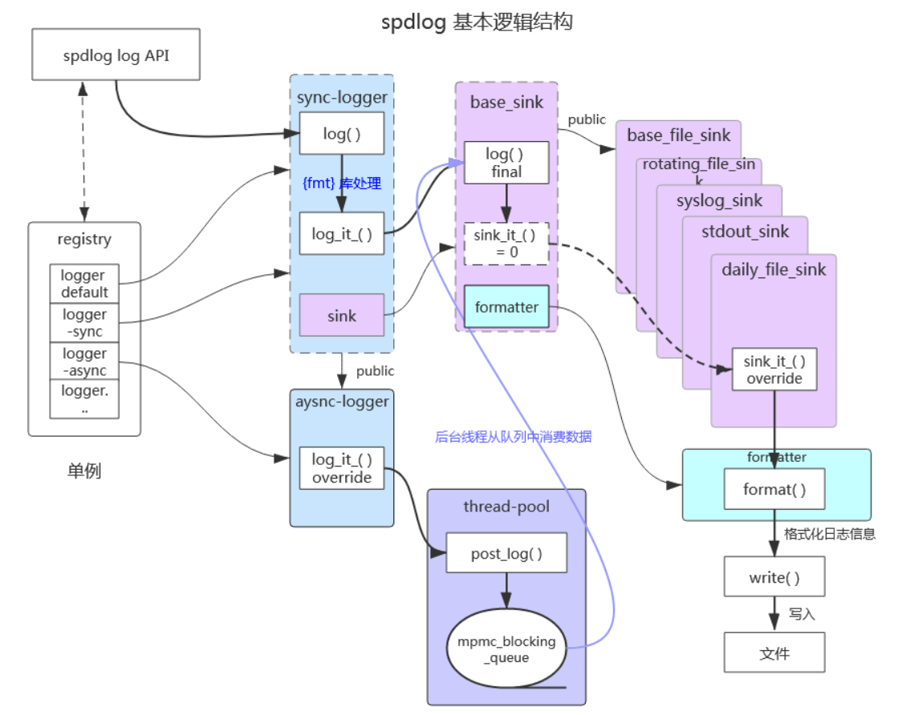

# 0x00. 导读

spdlog 简介

# 0x01. 简介

- spdlog log API —— 是建立在logger之上的，只是对logger使用的封装，目的只是为了能够像官网给的示例代码 `spdlog::info("Welcome to spdlog!");` 那样，让用户能够以最简单的方式使用spdlog打印出log。这是一种从用户使用维度出发的程序设计思想。

- logger —— 是spdlog开始处理日志的入口。sync-logger主要负责日志信息的整理，将格式化（通过第三方库fmt）后的日志内容、日志等级、日志时间等信息“整理”到一个名为log_msg结构体的对象中，然后再交给下游的sink进行处理。而对于async-logger，则是在将整理后的log_msg对象交给线程池，让线程池去处理后续的工作。

- sink —— 接收log_msg对象，并通过formatter将对象中所含有的信息转换成字符串，最后将字符串输出到指定的地方，例如控制台、文件等，甚至通过tcp/udp将字符串发送到指定的地方。sink译为“下沉”，扩展一下可以理解为“落笔”，做的是把日志真正记录下来的事情。

- formatter —— 负责将log_msg对象中的信息转换成字符串，例如将等级、时间、实际内容等。时间的格式和精度、等级输出显示的颜色等都是由formatter决定的。支持用户自动以格式。registry —— 负责管理所有的logger，包括创建、销毁、获取等。通过registry用户还可以对所有的logger进行一些全局设置，例如设置日志等级。

# 0x02. 