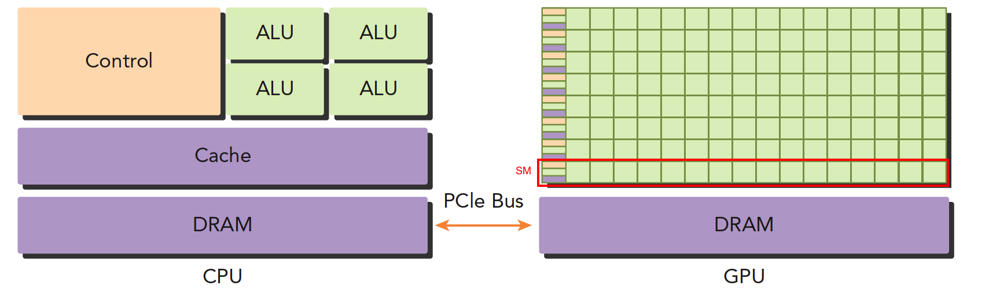
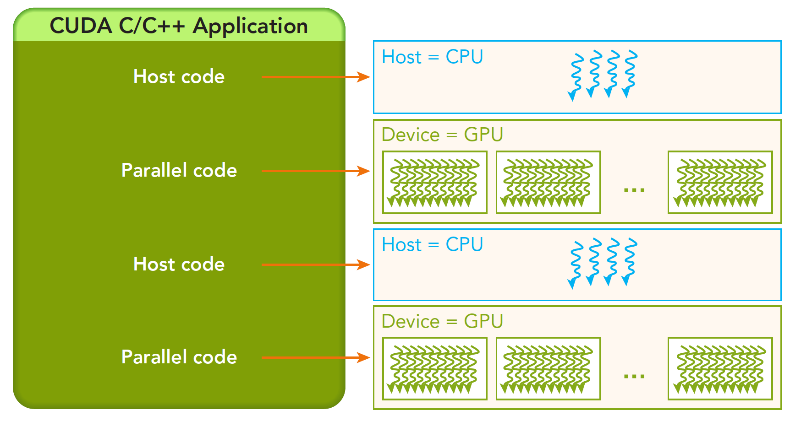
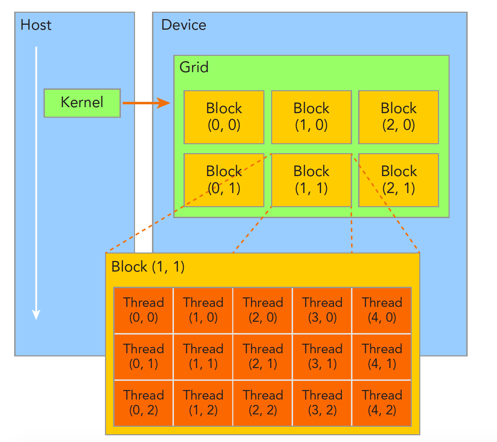

1. 并行分两种：数据并行和指令并行。 cuda 适合数据并行。

2. 数据并行程序设计，第一步就是把数据依据线程进行划分：
    1. 块划分，把一整块数据切成小块，每个小块随机的划分给一个线程，每个块的执行顺序随机。
    2. 周期划分，线程按照顺序处理相邻的数据块，每个线程处理多个数据块，比如我们有五个线程，线程1执行块1，线程2执行块2…..线程5执行块5，线程1执行块6

3. 不同的数据划分严重影响程序性能。

4. 划分不同计算机结构的方法有很多，广泛使用的一种被称为佛林分类法Flynn’s Taxonomy，他根据指令和数据进入CPU的方式分类，分为以下四类：
    - 单指令单数据SISD（传统串行计算机，386）
    - 单指令多数据SIMD（并行架构，比如向量机，所有核心指令唯一，但是数据不同，现在CPU基本都有这类的向量指令）
    - 多指令单数据MISD（少见，多个指令围殴一个数据）
    - 多指令多数据MIMD（并行架构，多核心，多指令，异步处理多个数据流，从而实现空间上的并行，MIMD多数情况下包含SIMD，就是MIMD有很多计算核，计算核支持SIMD）

5. 并行的目的是：
    - 降低延迟：延迟是指操作从开始到结束所需要的时间，一般用微秒计算。
    - 提高带宽：带宽是单位时间内处理的数据量，一般用MB/s或者GB/s表示。
    - 提高吞吐量：带宽是单位时间内处理的数据量，一般用MB/s或者GB/s表示。

6. CPU适合执行复杂的逻辑，比如多分支，其核心比较重（复杂）。GPU适合执行简单的逻辑，大量的数据计算，其吞吐量更高，但是核心比较轻（结构简单）。

7. 什么是异构，不同的计算机架构就是异构。x86 CPU+GPU的这种异构应该是最常见的，也有CPU+FPGA，CPU+DSP等各种各样的组合，CPU+GPU在每个笔记本或者台式机上都能找到。

8. CPU 我们可以把它看做一个指挥者，主机端，host，而完成大量计算的GPU是我们的计算设备，device。举个例子：



- 左图：一个四核CPU一般有四个ALU，ALU是完成逻辑计算的核心，也是我们平时说四核八核的核，控制单元，缓存也在片上，DRAM是内存，一般不在片上，CPU通过总线访问内存。
- 右图：GPU，绿色小方块是ALU，我们注意红色框内的部分SM，这一组ALU公用一个Control单元和Cache，这个部分相当于一个完整的多核CPU，但是不同的是ALU多了，control部分变小，可见计算能力提升了，控制能力减弱了，所以对于控制（逻辑）复杂的程序，一个GPU的SM是没办法和CPU比较的，但是对了逻辑简单，数据量大的任务，GPU更高效，并且，注意，一个GPU有好多个SM，而且越来越多。

9. CPU 和 GPU之间通过 PCIe 总线连接，用于传递指令和数据，这是性能瓶颈之一。因为一个异构应用包含两种以上架构，所以代码也包括不止一部分：
    - 主机代码
    - 设备代码

10. 主机代码在主机端运行，被编译成主机架构的机器码，设备端的在设备上执行，被编译成设备架构的机器码，所以主机端的机器码和设备端的机器码是隔离的，自己执行自己的，没办法交换执行。

    主机端代码主要是控制设备，完成数据传输等控制类工作，设备端主要的任务就是计算。
因为当没有GPU的时候CPU也能完成这些计算，只是速度会慢很多，所以可以把GPU看成CPU的一个加速设备。

    低并行逻辑复杂的程序适合用CPU，高并行逻辑简单的大数据计算适合GPU。

11. NVIDIA目前的计算平台（不是架构）有如下，每个平太针对不同的应用场景，比如Tegra用于嵌入式，Geforce是我们平时打游戏用到，Tesla主要用于计算。：
    - Tegra
    - Geforce
    - Quadro
    - Tesla

12. CPU和GPU线程的区别：
    - CPU线程是重量级实体，操作系统交替执行线程，线程上下文切换花销很大
    - GPU线程是轻量级的，GPU应用一般包含成千上万的线程，多数在排队状态，线程之间切换基本没有开销。
    - CPU的核被设计用来尽可能减少一个或两个线程运行时间的延迟，而GPU核则是大量线程，最大幅度提高吞吐量

13. CUDA 是一种异构计算平台，建立在Nvidia GPU之上，并扩展出多语言支持。例如 CUDA C 是标准ANSI C语言的扩展，扩展出一些语法和关键字来编写设备端代码，而且CUDA库本身提供了大量API来操作设备完成计算。

    对于API也有两种不同的层次，一种相对较高层（CUDA运行时API，使用简单，其实现基于驱动API），一种相对底层（CUDA驱动API，使用相对困难）。

14. 一个CUDA应用通常可以分解为两部分，
    - CPU 主机端代码
    - GPU 设备端代码


--------------

```c
/*
 * 一般CUDA程序分成下面这些步骤：
 *  1. 分配GPU内存
 *  2. 拷贝内存到设备
 *  3. 调用CUDA内核函数来执行计算
 *  4. 把计算完成数据拷贝回主机端
 *  5. 内存销毁
 *
 * 下面的程序只到第三步，没有内存交换。
*/
#include<stdio.h>
__global__ void hello_world(void)   // __global__ 是告诉编译器这个是个可以在设备上执行的核函数
{
  printf("GPU: Hello world!\n");
}
int main(int argc,char **argv)
{
  printf("CPU: Hello world!\n");
  hello_world<<<1,10>>>();      // CUDA扩展出来的部分。
  /*
   * 这句话包含了隐式同步，GPU和CPU执行程序是异步的，核函数调用后成立刻会到主机线程继续，
   * 而不管GPU端核函数是否执行完毕，所以上面的程序就是GPU刚开始执行，CPU已经退出程序了，
   * 所以我们要等GPU执行完了，再退出主机线程。
  */
  cudaDeviceReset();
  return 0;
}
```


-----------------------

1. 


从host的串行到调用核函数（核函数被调用后控制马上归还主机线程，也就是在第一个并行代码执行时，很有可能第二段host代码已经开始同步执行了）。

2. 内存管理在传统串行程序是非常常见的，寄存器空间，栈空间内的内存由机器自己管理，堆空间由用户控制分配和释放，CUDA程序同样，只是CUDA提供的API可以管理设备上的内存，也可以管理主机上的内存。

    | 标准 C 函数 | CUDA C 函数 | 说明 |
    | :-----: | :----: | :----: |
    | malloc | cudaMalloc | 内存分配 |
    | memcpy | cudaMemcpy | 内存拷贝 |
    | memset | cudaMemset | 内存设置 |
    | free | cudaFree | 内存释放 |

    其中 `cudaMemcpy = cudaMemcpyHostToHost + cudaMemcpyHostToDevice + cudaMemcpyDeviceToHost + cudaMemcpyDeviceToDevice`

3. 一个核函数只能有一个grid，一个grid可以有很多个块，每个块可以有很多的线程：



4. 一个线程块block中的线程可以完成下述协作：
    - 同步
    - 共享内存

    **不同块内线程不能相互影响！他们是物理隔离的！**

5. 线程标识：
    - blockIdx（线程块在线程网格内的位置索引）
    - threadIdx（线程在线程块内的位置索引）
    - blockDim（线程块的大小）

    两个数据的类型都是 uint3 

6. 核函数就是在CUDA模型上诸多线程中运行的那段串行代码，这段代码在设备上运行，用NVCC编译，产生的机器码是GPU的机器码，所以我们写CUDA程序就是写核函数，第一步我们要确保核函数能正确的运行产生正切的结果，第二优化CUDA程序的部分，无论是优化算法，还是调整内存结构或者线程结构都是要调整核函数内的代码，来完成这些优化的。

    启动核函数，通过的以下的ANSI C 扩展出的CUDA C指令：   
    `kernel_name<<<grid,block>>>(argument list);`
    其标准C的原型就是C语言函数调用：   
    `function_name(argument list);`

7. 通过指定grid和block的维度，我们可以配置：
    - 内核中线程的数目
    - 内核中使用的线程布局

    例如   
    `kernel_name<<<4,8>>>(argument list);`

    

8. 强调一下，**所有CUDA核函数的启动都是异步的，这点与C语言是完全不同的。**

9. 
    | 限定符 | 执行 | 调用 | 备注 |
    | :-----: | :----: | :----: | :----: |
    | __global__ | 设备端执行 | 可以从主机调用也可以从计算能力3以上的设备调用 | 必须有一个void的返回类型 |
    | __device__ | 设备端执行 | 设备端调用 |  |
    | __host__ | 主机端执行 | 主机端调用 |  |

    有些函数可以同时定义为 device 和 host ，这种函数可以同时被设备和主机端的代码调用，主机端代码调用函数很正常，设备端调用函数与C语言一致，但是要声明成设备端代码，告诉nvcc编译成设备机器码，同时声明主机端设备端函数，那么就要告诉编译器，生成两份不同设备的机器码。

10. nvprof 命令可以详细分析 cuda 程序的执行时间。

11. 可以通过函数，例如 cudaGetDeviceProperties ，返回 GPU 信息，也可以通过命令 nvidia-smi ，它是nvidia驱动程序内带的一个工具，可以返回当前环境的设备信息。


----------------------


1. GPU架构是围绕一个流式多处理器（SM，Streaming-Multiprocessor）的扩展阵列搭建的。通过复制这种结构来实现GPU的硬件并行。

下图是 Fermi 的 SM ，包括
- CUDA核心
- 共享内存/一级缓存
- 寄存器文件
- 加载/存储单元
- 特殊功能单元（SFU）
- 线程束调度器


下图是 Fermi 架构的 GPU ，具体数据如下:
- 512个加速核心，CUDA核
- 每个CUDA核心都有一个全流水线的整数算数逻辑单元ALU，和一个浮点数运算单元FPU
- CUDA核被组织到16个SM上
- 6个384-bits的GDDR5 的内存接口
- 支持6G的全局机栽内存
- GigaThread疫情，分配线程块到SM线程束调度器上
- 768KB的二级缓存，被所有SM共享


2. GPU中每个SM都能支持数百个线程并发执行，每个GPU通常有多个SM，当一个核函数的网格被启动的时候，多个block会被同时分配给可用的SM上执行。
当一个blcok被分配给一个SM后，他就只能在这个SM上执行了，不可能重新分配到其他SM上了，多个线程块可以被分配到同一个SM上。
在SM上同一个块内的多个线程进行线程级别并行，而同一线程内，指令利用指令级并行将单个线程处理成流水线。

3. CUDA 采用单指令多线程SIMT架构管理执行线程，不同设备有不同的线程束大小，但是到目前为止基本所有设备都是维持在32，也就是说每个SM上有多个block，一个block有多个线程（可以是几百个，但不会超过某个最大值），但是从机器的角度，在某时刻T，SM上只执行一个线程束，也就是32个线程在同时同步执行，线程束中的每个线程执行同一条指令，包括有分支的部分。
简单一点说，就是一个SM上在某一个时刻，有32个线程在执行同一条指令，这32个线程可以选择性执行，虽然有些可以不执行，但是他也不能执行别的指令，需要另外需要执行这条指令的线程执行完，然后再继续下一条。

4. 单指令多数据的执行属于向量机，比如我们有四个数字要加上四个数字，那么我们可以用这种单指令多数据的指令来一次完成本来要做四次的运算。这种机制的问题就是过于死板，不允许每个分支有不同的操作，所有分支必须同时执行相同的指令，必须执行没有例外。
相比之下单指令多线程SIMT就更加灵活了，虽然两者都是将相同指令广播给多个执行单元，但是SIMT的某些线程可以选择不执行，也就是说同一时刻所有线程被分配给相同的指令，SIMD规定所有人必须执行，而SIMT则规定有些人可以根据需要不执行，这样SIMT就保证了线程级别的并行，而SIMD更像是指令级别的并行。
SIMT包括以下SIMD不具有的关键特性：
    - 每个线程都有自己的指令地址计数器
    - 每个线程都有自己的寄存器状态
    - 每个线程可以有一个独立的执行路径   

    而上面这三个特性在编程模型可用的方式就是给每个线程一个唯一的标号（blckIdx,threadIdx），并且这三个特性保证了各线程之间的独立。

5. SM中共享内存，和寄存器是关键的资源，线程块中线程通过共享内存和寄存器相互通信协调。

6. 因为SM有限，虽然我们的编程模型层面看所有线程都是并行执行的，但是在微观上看，所有线程块也是分批次的在物理层面的机器上执行，线程块里不同的线程可能进度都不一样，但是同一个线程束内的线程拥有相同的进度。
并行就会引起竞争，多线程以未定义的顺序访问同一个数据，就导致了不可预测的行为，CUDA只提供了一种块内同步的方式，块之间没办法同步！
同一个SM上可以有不止一个常驻的线程束，有些在执行，有些在等待，他们之间状态的转换是不需要开销的。

7. 每个多处理器SM有16个加载/存储单元所以每个时钟周期内有16个线程（半个线程束）计算源地址和目的地址。
特殊功能单元SFU执行固有指令，如正弦，余弦，平方根和插值，SFU在每个时钟周期内的每个线程上执行一个固有指令。
每个SM有两个线程束调度器，和两个指令调度单元，当一个线程块被指定给一个SM时，线程块内的所有线程被分成线程束，两个线程束调度器选择其中两个线程束，在用指令调度器存储两个线程束要执行的指令，每16个CUDA核心为一个组，还有16个加载/存储单元或4个特殊功能单元。当某个线程块被分配到一个SM上的时候，会被分成多个线程束，线程束在SM上交替执行：


8. 每个线程束在同一时间执行同一指令，同一个块内的线程束互相切换是没有时间消耗的。
Fermi上支持同时并发执行内核。并发执行内核允许执行一些小的内核程序来充分利用GPU，如图：


9. 性能分析工具：
- nvvp
- nvprof

10. 线程束是 SM 中基本的执行单元（也就是说，单指令通过指令调度器广播给某线程束的全部线程，这些线程同一时刻执行同一命令），当一个 grid 启动（ grid 启动，等价于一个内核启动，每个内核对应于自己的网格），grid 中包含 block ， block 被分配到某一个 SM 上以后，将分为多个 warp ，每个 warp 一般是32个线程，在一个 warp 中，所有线程按照单指令多线程 SIMT 的方式执行，每一步执行相同的指令，但是处理的数据为私有的数据。

11. 同一个线程束中的线程，执行不同的指令（喂的是同样的指令，只是因为逻辑判断导致各自执行不同的指令了），这叫做线程束的分化。当线程束内有分歧产生分支的时候，性能才会急剧下降。因为当一部分 condition 成立的时候，执行 if 块内的代码，有一部分线程 condition 不成立，那么他们怎么办？继续执行 else ？不可能的，因为分配命令的调度器就一个，所以这些 condition 不成立的线程等待，等大家执行完了，再进行下一个指令。（现在处理器都采用分支预测技术，而 CPU 的这项技术相对于 gpu 来说高级了不止一点点）

```c++
// 低效
__global__ void mathKernel1(float *c)
{
	int tid = blockIdx.x* blockDim.x + threadIdx.x;

	float a = 0.0;
	float b = 0.0;
	if (tid % 2 == 0)
	{
		a = 100.0f;
	}
	else
	{
		b = 200.0f;
	}
	c[tid] = a + b;
}

// 高效
__global__ void mathKernel2(float *c)
{
	int tid = blockIdx.x* blockDim.x + threadIdx.x;
	float a = 0.0;
	float b = 0.0;
    // 第一个线程束内的线程编号 tid 从 0 到 31 ， tid/warpSize 都等于 0 ，那么就都执行 if 语句。
    // 第二个线程束内的线程编号 tid 从 32 到 63 ， tid/warpSize 都等于 1 ，执行 else 语句。
	if ((tid/warpSize) == 0)
	{
		a = 100.0f;
	}
	else
	{
		b = 200.0f;
	}
	c[tid] = a + b;
}
```

12. 当寄存器和共享内存分配给了线程块，这个线程块处于活跃状态，所包含的线程束称为活跃线程束。又分为三类：
- 选定的线程束
- 阻塞的线程束
- 符合条件的线程束

    当SM要执行某个线程束的时候，执行的这个线程束叫做选定的线程束，准备要执行的叫符合条件的线程束，如果线程束不符合条件还没准备好就是阻塞的线程束。

    满足下面的要求，线程束才算是符合条件的：
    - 32个CUDA核心可以用于执行
    - 执行所需要的资源全部就位

13. 线程块内同步，`__syncthread();` 使得同一个块内的线程会同时停止在某个设定的位置，这个函数只能同步同一个块内的线程，不能同步不同块内的线程，想要同步不同块内的线程，就只能让核函数执行完成，控制程序交换主机，这种方式来同步所有线程。


-----------------


工厂生产，我们可以通过优化工厂内部流水线，工人分配，工人质量，来提高生产速度，但是如果你把工厂开到珠穆朗玛峰顶，你的提供原料的车（我们目前关心产量不关心出货量，所以不关心如何将成品运出）一年来一辆，那整个工厂的生产效率也是非常低的，因为工人，流水线，都在等待，等待原料进来。这就是典型的一个GPU或者CPU的效率模型。内存带宽，速度，也是影响了吞吐量的重要因素。


-----------------

1. GPU上的内存设备有：
- 寄存器
- 共享内存
- 本地内存
- 常量内存
- 纹理内存
- 全局内存

    各自都有自己的作用域，生命周期和缓存行为。