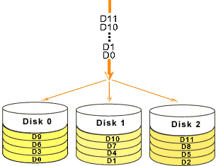

# 0x00. 导读

# 0x01. 简介

独立冗余磁盘阵列，也就是大家常说的 RAID，英文全称是：Redundant Array of Independent Disks，使用该技术，可以大幅提高硬盘设备的 IO 读写速度，还存在数种数据冗余备份机制提供用户选择，能够降低用户数据盘损坏带来的数据丢失的风险。

RAID 技术通过把多个硬盘设备组合成一个容量更大、安全性更好的磁盘阵列，并把数据切割成多个区段后分别存放在各个不同的物理硬盘设备上，然后利用分散读写技术来提升磁盘阵列整体的性能，同时把多个重要数据的副本同步到不同的物理硬盘设备上，从而起到了非常好的数据冗余备份效果。

# 0x02. 模式详解

常用的几种 RAID 模式有 RAID0、RAID1、RAID5 和 RAID10。

## 2.1 RAID0

RAID 0 技术把多块物理硬盘设备通过硬件或软件的方式串联在一起，组成一个大的卷组，并将数据依次写入各个物理硬盘中。这样一来，在最理想的状态下，硬盘设备的读写性能会提升数倍，但是若任意一块硬盘发生故障，将导致整个系统的数据都受到破坏。通俗来说，RAID 0 技术能够有效地提升硬盘数据的吞吐速度，但是不具备数据误修复能力。



至少 2 块盘。  
容量：所有硬盘之和。

## 2.2 RAID1

RAID1 模式又称为镜像(Mirroring)，一个具有全冗余的模式。RAID 1 可以用于两个或 2xN 个磁盘，每次写数据时会同时写入镜像盘。

至少 2 块盘。  
容量：所有硬盘之和的一半。

## 2.3 RAID5

RAID5 技术是把硬盘设备的数据奇偶校验信息保存到其他硬盘设备中。RAID 5 磁盘阵列中数据的奇偶校验信息并不是单独保存到某一块硬盘设备中，而是存储到除自身以外的其他每一块硬盘设备上。这样的好处是，其中任何一设备损坏后都可以依赖其它几块设备重建丢失的这块硬盘数据。

根据校验和存放的位置不一样，它会是不同的RAID模式：如果将所有的校验和都放到一个硬盘中，那这个RAID模式就是 RAID3 ；如果将校验和分块存储到每个硬盘中，那就是 RAID5 了，可以说 RAID5 是 RAID3 的升级版。因为如果校验和都放到一个硬盘中，那只要存一条数据，就都要写一次校验和到校验和盘，那这个专门存放校验和的硬盘肯定容易坏。

```
D1	    D2	    D3
数据1	数据2	校验和1
校验和2	数据3	数据4
数据5	校验和3	数据6

假如 D2 突然坏了，通过 D1 和 D3 就能恢复 D2.
```

至少 2 块盘。  
容量：所有硬盘之和减 1。

## 2.4 RAID10

RAID10 的叫法是 RAID一零 ，而非 RAID十，RAID 10 技术是 RAID 1+RAID 0 技术的一个“组合体”。

RAID10 技术需要至少 4 块硬盘来组建，其中先分别两两制作成 RAID 1 磁盘阵列，以保证数据的安全性；然后再对两个 RAID 1 磁盘阵列实施 RAID 0 技术，进一步提高硬盘设备的读写速度。

这样从理论上来讲，只要坏的不是同一阵列中的所有硬盘，那么最多可以损坏 50%的硬盘设备而不丢失数据。由于 RAID 10 技术继承了 RAID 0 的高读写速度和 RAID 1 的数据安全性，在不考虑成本的情况下 RAID 10 的性能也超过了 RAID 5，因此当前成为广泛使用的一种存储技术。

```
D1	    D2	    D3	    D4
数据1	数据1	数据2	数据2
数据3	数据3	数据4	数据4

D1、D2组成一个阵列Raid1，其中D1是数据盘，D2是备份盘；
D3、D4也组成一个Raid1，其中D3是数据盘,D4是备份盘；
在这个基础上将D1、D2作为一个整体，将D3、D4也作为一个整体，这两个整体之间再组成一个Raid0阵列。
```

至少 4 块盘。  
容量：所有硬盘之和的一半。

# 0x03. 例子

创建 RAID10，假设我们已经有了 /dev/sdb、/dev/sdc、/dev/sdd、/dev/sde 四个硬盘，大小都为 20G，创建名称为 /dev/md0
```bash
$ mdadm -Cv /dev/md0 -n 4 -l 10 /dev/sdb /dev/sdc /dev/sdd /dev/sde

# -Cv：创建磁盘阵列并显示过程
# -n 4：该磁盘阵列有4个磁盘
# -l 10：创建的磁盘阵列类型是RAID10

# 创建完磁盘阵列完成后，需要将磁盘阵列格式化之后才能使用，格式化命令还是 mkfs 命令
$ sudo mkfs.ext4 /dev/md0

# 创建文件夹，然后挂载使用
$ mount /dev/md0 /raid
```

查看
```bash
# 查看全部的 raid 信息
$ sudo cat /proc/mdstat
Personalities : [raid1] 
md126 : active raid1 sda[1] sdb[0]
      890806272 blocks super external:/md127/0 [2/2] [UU]
      
md127 : inactive sdb[1](S) sda[0](S)
      10402 blocks super external:imsm
       
unused devices: <none>

# 查看 raid 信息
$ sudo mdadm -D /dev/md126
/dev/md126:
         Container : /dev/md/imsm0, member 0
        Raid Level : raid1
        Array Size : 890806272 (849.54 GiB 912.19 GB)
     Used Dev Size : 890806272 (849.54 GiB 912.19 GB)
      Raid Devices : 2
     Total Devices : 2

             State : active 
    Active Devices : 2
   Working Devices : 2
    Failed Devices : 0
     Spare Devices : 0

Consistency Policy : resync


              UUID : 92087ff9:48e0b741:504d29b1:2e3b2344
    Number   Major   Minor   RaidDevice State
       1       8        0        0      active sync   /dev/sda
       0       8       16        1      active sync   /dev/sdb
```

检修替换，在使用磁盘阵列的过程中，不可避免的，总有一天会有硬盘损坏，在RAID10磁盘阵列中，最多同时允许坏掉50%的硬盘，这个容错率是相当大了，那如果有一块硬盘损坏了，如何更换这块坏掉的硬盘呢？假设 /dev/sdb 这块硬盘坏了
```bash
# 先将这块硬盘标志为不可用
$ mdadm /dev/md0 -f /dev/sdb

# 从 raid 成员中删除
$ mdadm /dev/md0 -r /dev/sdb

# 硬盘替换好了之后，使用命令 -a 将其添加到磁盘阵列中
$ mdadm /dev/md0 -a /dev/sdx # 向 md0 中增加新成员 sdx
```