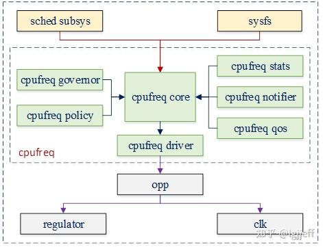

# 0x00. 导读

# 0x01. 简介

根据系统的负载情况，动态调整 CPU 频率和电压，就能减少这部分功率消耗。 CPUFreq 就是内核为支持这种能力而定义的一套管理框架。

CPUFreq 主要功能为动态调节 CPU 的频率和电压，为了达到这一目标，该框架需要考虑以下几个问题：
1. 确定每个 CPU 的频率调节范围，包括硬件支持的最大频率、最小频率，以及软件可调节的最大频率和最小频率等。在 CPUFreq 中它可通过 **Policy** 来管理

2. 在当前负载下，确定 CPU 应该工作于哪个频率，例如简单地使 CPU 工作在最高频率以提供最高性能，或者使其工作在最低频率以降低功耗。但系统的负载是动态变化的，因此 CPUFreq 还支持通过特定算法，在负载变化时动态调节 CPU 的频率。它可通过 **Governor** 组件实现

3. 确定 CPU 频率调节的周期及触发时机，以使其既不对系统有太大影响，又能较快地跟踪系统的负载变化。它是通过 **内核调度器** 和 CPUFreq 模块共同完成的

4. 当待调节频率确定后，如何调用频率设置接口，实现实际的频率调节工作。它是通过其 **driver** 组件实现的

除此以外，CPUFreq 还包含 **CPUFreq stats**，**CPUFreq qos**，**CPUFreq notifier** 等辅助模块，其主要功能如下：
1. CPUFreq stats: 用于搜集 CPUFreq 的一些统计数据，如 CPU 在每个频点下的运行时间，总的切频次数等。

2. CPUFreq qos: 该模块用于在 CPUFreq 频率限制值发生改变时，向 CPUFreq 模块发送一个通知，使其能及时调整到新的值

3. CPUFreq notifier: 那些对 CPU 频率切换，或者对 policy 对应的 governor 发生改变感兴趣的模块，可以向 CPUFreq 注册一个通知。当以上事件发生时，CPUFreq 将会向其发送相关通知

最后由于 CPU 的工作电压越高，其功耗也越大，因此我们希望 CPU 在切换到某一频率时，其电压也相应地切换到其可稳定工作的最低电压。为了得到电压和频率的关系，一般 SoC(System on a chip) 都会提供一些频点组合，CPUFreq 只会在这些规定的频点中切换。这些系统预置的频点叫做 **operation performance points(opp)**

# 0x02. governor 和 driver 简介

CPUFreq Governor 的主要功能是根据其相应的控制策略，为 CPU 选择一个合适的运行频率。

cpufreq_governor 会根据 governor 特定的策略，计算得到 cpu 待设置频率对应的频点，而频率设置流程需要 cpufreq dreiver 完成。

## 2.1 governor

cpufreq governor 主要功能是根据特定的 governor 算法，为 CPU 选择一个合适的运行频率。当前内核支持 performance、powersave、userspace、ondemand、conservative 和 schedutil 六种 governor 。

performance governor 直接将 cpu 频率设置为最高值，powersave governor 将频率设置为最低值，而 userspace governor 则将其设置为用户空间传入的频率值。

其它三种 governor 都会根据负载变化，动态调节cpu的频率，其特点分别如下：  
（1）ondemand：当负载超过80%时，会将cpu的频率调到最高。否则就会按负载比例调节频率。它的调频方式比较激进，如负载升高时能快速升频，而频率负载降低时也会较快的降频。因此其可能导致cpu频繁进行升降频操作，造成性能抖动

（2）conservative：这种方式相对于ondemand，其调频方式更加柔和。它当负载超过80%时会以5%的幅度升频，而只有当负载低于20%时，才会以5%的幅度降频。因此其调频幅度较平滑，且降频时留有足够的缓冲，cpu不会频繁执行升降频操作。但它也使得cpu频率对负载的跟踪不够及时，特别是降频流程比较保守，从而可能会影响节电效果

（3）schedutil：以上两种方式中，负载都是由cpufreq模块自己计算的，它计算的主要依据为cpu idle时间。而实际上cpu在不同时间段idle时间，对当前负载的贡献是不同的，如1s前的负载显然比10s前负载贡献更大。

而实际上调度器本身就会跟踪cpu的负载，而且其负载跟踪算法（pelt）更加准确。因此若将调度器的负载值用作cpu调频依据，则不仅使cpu调频更加准确，而且还减少了cpufreq governor的负载计算流程，提高调频效率。schedutil就是使用这种方式实现调频的。

## 2.2 driver

cpufreq_governor 会根据 governor 特定的策略，计算得到 cpu 待设置频率对应的频点，而频率设置流程需要 cpufreq dreiver 完成。

# 0x03. sysfs 接口

所有与 CPUFreq 相关的 sysfs 接口都位于: `/sys/devices/system/cpu`.