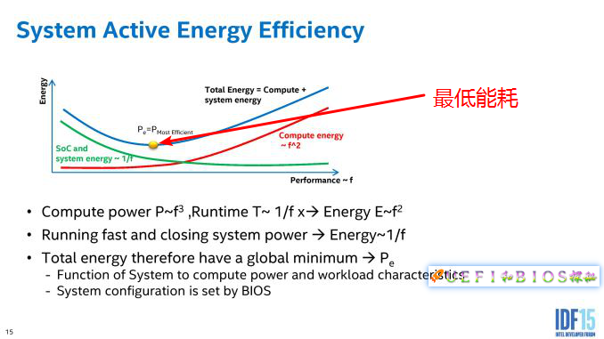

# 0x00. 导读

# 0x01. 简介

CPU 省电节能技术.

[Intel® Xeon® Gold 6348 Processor 参数例子](https://www.intel.com/content/www/us/en/products/sku/212456/intel-xeon-gold-6348-processor-42m-cache-2-60-ghz/specifications.html)

# 0x02. 

[Frequency Behavior - Intel](https://en.wikichip.org/wiki/intel/frequency_behavior)

Intel 有好几个技术会自动动态调整 CPU 运行频率：

- Intelligent Power Capability, 智能供电
- Enhanced Intel SpeedStep Technology (EIST) - Introduced with Pentium M, 2005
- Dynamic Acceleration Technology (DAT) - Introduced with Modified Pentium M/Core 2006
- Turbo Boost Technology (TBT) - Introduced with Nehalem in 2008
    - Turbo Boost Technology 2.0 (TBT 2.0) - Introduced with Sandy Bridge in 2010
- Speed Shift Technology (SST) - Introduced with Skylake in 2015
- Turbo Boost Max Technology 3.0 (TBMT) - Introduced with Broadwell E in 2016
- Thermal Velocity Boost (TVB) - Introduced with Coffee Lake H in 2018
- Speed Select Technology (SST) - Introduced with Cascade Lake in 2019

## 2.4 P-states 切换

P-state 有多个档位，P0 P1 P2 ... 谁来负责切换，Intel 有两个选择：
- 软件，操作系统
    - Enhanced Intel SpeedStep Technology, 
- CPU 硬件
    - Speed Shift Technology

### 2.4.1 EIST

EIST, 智能降频技术，它能够根据不同的系统工作量自动调节处理器的电压和频率，以减少耗电量和发热量。它的引入，大大节省了 CPU 在低工作量的能耗，受到极大欢迎，从此每一代 Intel CPU 上都有了它的身影。

[CPU省电的秘密（一）：EIST](https://zhuanlan.zhihu.com/p/25675218)

EIST 技术是 BIOS 通过一组 ACPI 表告诉操作系统怎么改变频率，而操作系统负责根据工作量通过这个表改变 CPU 频率。举个例子，奔腾M 1.5GHz 可以有 1.5, 1.4, 1.3, 1.2, 1.1, 1.0, 0.9, 0.8, 0.7GHz 可以选择。

Intel CPU 是 EIST 可以工作的硬件基础。它通过一系列寄存器保证固件和OS可以得到足够的信息，有足够的手段控制EIST的工作模式。


了解即可：  
实际上支持 EIST 的处理器为用户提供了非常简单的编程接口，对 CPU 运行频率进行设置是通过一个名为 `IA32_PERF_CTL` 的 MSR 寄存器进行的，另外还有一个名为 `IA32_PERF_STATUS` 的 MSR 寄存器可供检查 CPU 当前所处的运行频率。当用户需要对 CPU 运行频率进行设置时只需按照 Intel 开发手册的说明向 `IA32_PERF_CTL` MSR 寄存器中写入规定的数值即可。


### 2.4.2 Speed Shift

[根植于硬件的极速变频技术:Speed Shift](https://zhuanlan.zhihu.com/p/30713028)

衡量干完某件事需要消耗的整体能量，实际上有两种策略：

- 保持固定频率，将事情干完，然后CPU进入休息状态。
- 加速干事情，忍受短时功耗上升，尽快干完事情，尽早让CPU休息。

这和人一样，有些人是慢性子，徐徐图之；而有些人性子急，希望早干完早休息。很难判断哪种好，这就需要量化分析了，好在 Intel 的工程师已经为我们找到这个平衡点：



既不能磨洋工也不能一味蛮干，只有将频率调整到最合适才是真的好。

Speed Shift 技术是 EIST 的升级版。原名（或者说最初的技术名词）叫 Hareware Performance State 或 Hardware P-state，简称 HWP 。顾名思义，它的本质是操作系统让渡变频的操控权给硬件，转而只提供性能提示（hint）和控制变频范围，而由硬件自主根据提示工作量快速变化频率。

# 0x03. rdmsr/wrmsr

Intel 处理器的 MSR 中性能状态值：目标性能状态值 Target performance State Value(199H) 和当前性能状态值 Current performance State Value(198H)

读取MSR寄存器，可能需要安装（ sudo yum install msr-tools ）
```bash
$ sudo rdmsr --bitfield 15:0 -a 0x199
$ sudo rdmsr --bitfield 15:0 -a 0x198
```

读取的值需要经过换算才是实际的值。例如，198H 值 1900 表示的值是 (1x16+9)x100=2500 (2.5GHz)，198H 值 1b00 表示值是 (1x16+11)x100=2700 (2.7GHz)。