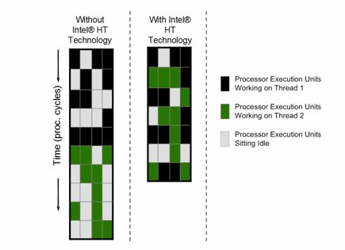

# 0x00. 导读

# 0x01. 简介

CPU 省电节能技术.

[Intel® Xeon® Gold 6348 Processor 参数例子](https://www.intel.com/content/www/us/en/products/sku/212456/intel-xeon-gold-6348-processor-42m-cache-2-60-ghz/specifications.html)

# 0x02. 

时钟速度(clock speed)衡量 CPU 每秒执行的周期数，以 GHz（千兆赫）为单位。

时钟速度为 3.2 GHz 的 CPU 每秒执行 32 亿个周期。有时，多个指令在单个时钟周期内完成；有时，一条指令可能需要多个时钟周期来处理。

## 2.1 术语

- 主频

    主频就是控制 CPU 工作的时钟信号的频率，目前通常为单位 GHz，厂商标注的主频是 CPU 的默认运行频率（也叫 默频），就是 CPU 在正常运行时通常优先使用的频率。也称为 **处理器基本频率(Processor Base Frequency)**

- 外频 倍频

    CPU 的性能太高、运行速度太快，外部设备如主板、内存等速度跟不上 CPU 的频率，外部设备采用较低的时钟信号频率叫做 **外频**（也叫 **系统总线频率**），CPU 的主频相对于外频的倍数叫做 **倍频**（也叫 **倍频系数**）。

- 睿频 睿频加速技术

    限制的 CPU 更加智能化，可以根据 CPU 任务的强度等进行灵活调整工作：比如 CPU 温度过高就自动降频以避免过热烧毁；任务量大了就适当提高频率快速完成；对于多核 CPU 还可以智能关闭一些空闲的核心，把动力给正在使用的核心使它们更高频率运行以提升性能等。

    总之，运行轻量任务时降频以降低功耗，运行重负荷任务时提升频率以保证流畅，这种智能调节可以兼顾性能、功耗与CPU的健康稳定等因素。

    这种技术叫 **睿频加速技术**（Intel 称之为 Turbo Boost ，AMD 称为 Turbo Core ），就是通过 CPU 的智能控制，使频率可以在一范围内根据任务进行自动调整。

    这种睿频加速技术能达到的最高频率厂家标注为该 CPU 的 **睿频**。有时候商标上的最大睿频就是这个意思，甚至还有 英特尔睿频加速max技术3.0频率 ，可能比最大睿频还大，因为睿频加速技术更先进了，明白原理就好。

- 超频(Over Clock) 锁频

    厂家出厂时按 CPU 不同的体质标注 CPU 的主频、睿频，从而同一系列 CPU 划分为不同的型号。 其实这是官方认定的能保证稳定运行的频率，但可能并未完全达到该 CPU 的极限能力，因此一些爱折腾的电脑硬件 DIY 玩家为了发掘 CPU 的潜力、实现超过官方发布的性能，人为通过各种手段、调整一些指标（如调整电压、倍频、外频、散热方式、电源供电、刷BIOS等），通过提高 CPU 的主频或睿频，达到价格更高型号的CPU性能叫做 **超频**。

    但用户如果人为将 CPU 超频到未经官方认可的频率，难以保证 CPU 和系统的稳定运行，甚至有可能烧毁 CPU ，所以厂家在有些 CPU 出厂时将其倍频锁定在固定数值，使倍频系数不能变化，这叫做 **锁频**。

- LFM HFM

    HFM = High Frequency mode = P0 时的频率
    LFM = Low Frequency Mode = P15 时的频率，不一定是 15 ，反正是最低

## 2.2 

[Frequency Behavior - Intel](https://en.wikichip.org/wiki/intel/frequency_behavior)

Intel 有好几个技术会自动动态调整 CPU 运行频率：

- Intelligent Power Capability, 智能供电
- Enhanced Intel SpeedStep Technology (EIST) - Introduced with Pentium M, 2005
- Dynamic Acceleration Technology (DAT) - Introduced with Modified Pentium M/Core 2006
- Turbo Boost Technology (TBT) - Introduced with Nehalem in 2008
    - Turbo Boost Technology 2.0 (TBT 2.0) - Introduced with Sandy Bridge in 2010
- Speed Shift Technology (SST) - Introduced with Skylake in 2015
- Turbo Boost Max Technology 3.0 (TBMT) - Introduced with Broadwell E in 2016
- Thermal Velocity Boost (TVB) - Introduced with Coffee Lake H in 2018
- Speed Select Technology (SST) - Introduced with Cascade Lake in 2019

## 2.3 超线程(Hyper Threading)

[Will Hyper-Threading Improve Processing Performance?](https://www.dasher.com/will-hyper-threading-improve-processing-performance/)

> Intel Hyper-Threading Technology can boost processing performance of a system by up to 30%.  Hyper-threading creates two logical processors from one physical processor core.  It does so by providing two sets of registers (called architectural states) on each core.    
> 英特尔超线程技术可将系统处理性能提升高达 30%。超线程从一个物理处理器核心创建两个逻辑处理器。它通过在每个核心上提供两组寄存器（称为架构状态）来实现这一点。

> When hyper-threading is enabled on an Intel socket, the second architectural state on each core can accept threads from the operating system (or hypervisor).  These two threads will still share internal microarchitecture components called execution units.  This can result in up to 30% more processing performance in a single socket system.  In dual socket systems, hyper-threading can provide up to a 15% improvement.   
> 当在英特尔插槽上启用超线程时，每个内核上的第二架构状态可以接受来自操作系统（或虚拟机管理程序）的线程。这两个线程仍将共享称为执行单元的内部微架构组件。这可以使单插槽系统的处理性能提高多达 30%。在双插槽系统中，超线程可以提供高达 15% 的改进。

缺点一：  

该技术允许一个物理处理器内核在操作系统调度器层面上充当两个逻辑处理器。 虽然一些执行资源，如缓存、执行单元和总线是共享的，但每个逻辑处理器都有自己的架构状态，有自己的一组“通用寄存器”和“控制寄存器”。

需要注意，有资源的共享，意味着，有“锁”和有“锁争用”的不确定性。

缺点二：  

> [缓存抖动(cache thrashing)](https://link.zhihu.com/?target=https%3A//www.cs.uaf.edu/2011/spring/cs641/proj1/rltorgerson/%23%3A~%3Atext%3DSMT%2520processor%2520will%2520have%2520%252242%2525%2520more%2520cache%2520thrashing%2522%2520over%2520the%2520SMP%2520design)  
They also state that while there(SMT) will be greater efficiency in the pipeline over the SMP processor, they have found that an SMT processor will have "42% more cache thrashing" over the SMP design.  
他们还指出，虽然 SMT 的处理器的流水线效率比 SMP 更高，但他们发现 SMT 处理器比 SMP多出 42% 的缓存抖动。

缺点三：  

[Hyperthreading, L1/L2 caching, cache busting, thread trashing, and priority bumping!](https://link.zhihu.com/?target=https%3A//www.javapubhouse.com/2013/05/episode-38-hyperthreading-l1l2-caching.html) 超线程、L1/L2 缓存、缓存破坏、优先级碰撞！

Linux 在为线程选择执行 Core 时，也会考虑到上面 Cache 的复用优化。  
而同一 物理 Core 上的两个逻辑 Core 可能会相互干扰 Cache。试想如果两个不同应用执行于同一物理 Core，干扰将放大。

## 2.4 P-states 切换

P-state 有多个档位，P0 P1 P2 ... 谁来负责切换，Intel 有两个选择：
- 软件，操作系统
    - Enhanced Intel SpeedStep Technology, 
- CPU 硬件
    - Speed Shift Technology

### 2.4.1 EIST

EIST, 智能降频技术，它能够根据不同的系统工作量自动调节处理器的电压和频率，以减少耗电量和发热量。它的引入，大大节省了 CPU 在低工作量的能耗，受到极大欢迎，从此每一代 Intel CPU 上都有了它的身影。

[CPU省电的秘密（一）：EIST](https://zhuanlan.zhihu.com/p/25675218)

EIST 技术是 BIOS 通过一组 ACPI 表告诉操作系统怎么改变频率，而操作系统负责根据工作量通过这个表改变 CPU 频率。举个例子，奔腾M 1.5GHz 可以有 1.5, 1.4, 1.3, 1.2, 1.1, 1.0, 0.9, 0.8, 0.7GHz 可以选择。

Intel CPU 是 EIST 可以工作的硬件基础。它通过一系列寄存器保证固件和OS可以得到足够的信息，有足够的手段控制EIST的工作模式。

### 2.4.2 Speed Shift

[根植于硬件的极速变频技术:Speed Shift](https://zhuanlan.zhihu.com/p/30713028)

衡量干完某件事需要消耗的整体能量，实际上有两种策略：

- 保持固定频率，将事情干完，然后CPU进入休息状态。
- 加速干事情，忍受短时功耗上升，尽快干完事情，尽早让CPU休息。

这和人一样，有些人是慢性子，徐徐图之；而有些人性子急，希望早干完早休息。很难判断哪种好，这就需要量化分析了，好在 Intel 的工程师已经为我们找到这个平衡点：

既不能磨洋工也不能一味蛮干，只有将频率调整到最合适才是真的好。

Speed Shift 技术是 EIST 的升级版。原名（或者说最初的技术名词）叫 Hareware Performance State 或 Hardware P-state，简称 HWP 。顾名思义，它的本质是操作系统让渡变频的操控权给硬件，转而只提供性能提示（hint）和控制变频范围，而由硬件自主根据提示工作量快速变化频率。
