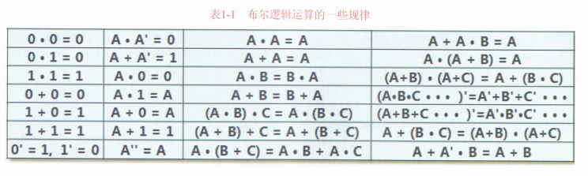

# 0x00. 导读

# 0x01. 简介

# 0x02. 

由初中物理中的并联、串联电路，加上继电器、灯泡，引出门电路这层逻辑。

可以将“门”真的理解成为一扇门，输入的信号从这扇门进去，再出来之后就是其运算结果。与（AND）、或（OR）、非（NOT）门。

与门的输出连接到或门的输入，得到与非门（NOT AND, NAND）。或门的输出连接到或门的输入，得到或非门（NOT OR, NOR），后面这两个门属于二层封装了。

异或门（XOR），属于三层封装了，0 X 0 = 0, 0 X 1 = 1, 1 X 0 = 1, 1 X 1 = 0, 之所以这样命名是因为当两个输入相同的时候，输出为 0 ，当两个输入相异的时候，输出为 1 ，这与之前的 OR 门很像，所以叫异或门。  
还有同或门（XNOR/EOR），输入端相同的时候，输出为 1 ，输入端相异的时候输出为 0. 同或门是天生的比较器，可以通过该门的输出判断两个输入是否相等。判断的结果可以作为其它逻辑电路的输入，从而完成更多的下游逻辑。之所以这样命名是因为，异或门的输出取反就是同或门，也就是 NOT XOR ，也就是 XNOR。

  

更多更详细的逻辑门 [wiki: 逻辑门](https://zh.wikipedia.org/wiki/%E9%82%8F%E8%BC%AF%E9%96%98)

铺垫结束，回到最初的问题，如何让计算机知道 1+1=2

用异或门输出两个数之和，用与门输出两个数相加后的进位，这便完成了一个最简单的 1 位数加法器。其只能实现对 0+0、1+0、0+1和1+1 的运算。但是这个电路足以为我们一开始设置的问题“1+1=2用电路怎么实现”交上满意的答卷了。异或门又被称为**半加器**，因为它只能输出和位而输出不了进位。异或门再加上一个与门，就组成了**全加器**(或者说加法器)，其可以输出两位：不进位时，进位输出为 0；产生进位时，进位输出为 1。这个加法器只能对两个 1 位数相加，所以称之为 **1位加法器**。

加法器是对多种门电路的又一次封装，它为加法这个算子提供了底层硬件支持，是加法运算的基石。这块基石又是由更多“石子儿”门电路拼起来的，每个石子儿又是由数个开关拼起来的。所以说，开关或者说“正反逻辑”，就是计算机世界的最小“粒子”。而在人类的认知层面，加法已经是一个基本算子了。至少我们明白了一个道理，CPU 天生是不知道 1+1 应该等于几的，需要人类来设计的。人类设计好一系列开关逻辑之后，输入的信号经过内部逻辑开关的处理，最终输出计算结果。**“计算”的过程，本质上是电路里一系列开关的组合逻辑。**

现在不禁又要问个问题，这个电路的运算速度有多快？也就是数据从输入到输出，用了多长时间？是光速么？如果单纯看电子的移动速度，其远低于光速(让电子移动所需的电场力本身的传播速度的确是光速，但是电压产生是需要靠电子移动在某处积聚的)。另外还要算上开关的响应速度，磁场将开关吸合的过程，这些相对来讲就非常慢了，毕竟开关运动属于机械运动，而多个开关就像多米诺骨牌一样，是先后运动的。  
比如上图中的开关，只有当输入端信号被输入之后，或门里的开关才会有所动作，或门开关稳定之后，其输出信号才会将与非门里的开关打到相应的状态，最后是右侧的与门。开关是个联动的过程，所以从信号输入到输出之间是有一定时延的，这个时延和开关的响应速度和级联的数量有很大关系。每个开关的时延乘以级联开关数量，可以粗略算出整个计算电路的响应速度。

前面所述的 1位加法器 只是个理论原型，看上去也可以用，但是具体怎么用呢？比如，怎么把数值输入到电路里，又怎么去让人类用眼睛或者耳朵甚至触觉去感知到所输出的结果？也就是说，怎么把电路变成可操作的计算器？将理论变为工程，这里需要做两件事：
- 首先，要把上述电路真的封装成一个物理“器件”，可以使用导线、继电器和开关共同连接而成，然后将其放到一个小盒子中，引出三根信号导线和电源供电线：
- 其次，还需要加一些外围的东西到这个电路周边，我们需要一个闸刀开关，用来输入 1 或者 0 到小盒子的输入端，还需要一个数码管来将小盒子输出的结果翻译成对应灯泡的亮灭，从而显示出图形“0”“1”和“2”，它们分别对应输出信号的 00、01和10，这就是最简陋的显示器。

如图所示为该计算器的物理形态。A 和 B 为加数的输入接口，S(Summary) 为加和的信号输出，C(Carrier) 为进位信号输出。此外，还有电源正负极输入，盒子中电路的接地端都与负极连接起来，从而形成电流的回路。

进一步可以组合起来拓展为多位加法器。

多位加法器有个比较尴尬的地方，那就是你必须用耳朵听，等啪声结束并且稳定之后，数码管上显示的结果才可用。在开关不断开合的过程中，数码管上显示的数字会随着开关的闭合而改变。每次合上一个开关，便会引发多个开关的状态改变，便会听到啪啪声。而上文说过，这些开关之间是先后耦合的关系，每个开关的状态都依赖于其他开关的状态，牵一发而动全身。开关响应是需要时间的，所以结果的稳定输出也需要一定时间。我们可以极端地假设一下:假设每个开关的开合周期至少为1秒，加法器中含有200个开关，一个输入信号的改变传递到输出需要200秒，数码管上的输出从上一个结果到新结果之间也需要200秒。当然，这只是极端假设，实际上整个过程不到1秒。开关形态不同，需要的时间也不同。总之，你是不知道输入之后要等多长时间这个电路才可以输出正确结果的，要么这台机器的使用说明书明确告诉你一个保守等待时间，要么全凭自己的使用经验。这个电路响应时间被称为**电路的时延**。

时代继续进步，技术继续发展，布尔出生了，总结出了逻辑代数运算规律，后人称为 布尔代数。[wiki: 逻辑运算](https://zh.wikipedia.org/wiki/%E9%80%BB%E8%BE%91%E4%BB%A3%E6%95%B0#%E8%BF%90%E7%AE%97%E5%BE%8B)

很多时候，电路一旦多起来，就很难发现优化的地方，但是如果抽象换算成代数之后就能非常容易发现。

举个例子，A+B(C+D(E+F(G+HY))) 这个逻辑需要经过 8 级门来传递，分别为：
1. HY 相与
2. 结果与 G 相或
3. 结果与 F 相与
4. 结果与 E 相或
5. 结果与 D 相与
6. 结果与 C 相或
7. 结果与 B 相与
8. 结果与 A 相或
  
如果根据定律 A(B+C)=AB+AC 的话，上述算式展开后便可以等价为 A+BC+BDE+BDFG+BDFHY, 此时我们再看一下需要传递多少次:
1. 首先 BDFHY 一起相与(5 输入与门，等效于5个开关串联)，同时 BDFG 相与，同时 BDE 相与，同时 BC 相与
2. 然后这 4 个结果与 A 一起相或（4输入或门，等效于4个开关并联）
   
只有 2 级门传递，关键点在于 BC、BDE、BDFG、BDFHY 这四个操作可以并行，同时发生/执行。

新的问题来了，前面说的计算器，我们需要先把数从十进制转成二进制，然后手动将闸刀开关置位，七七八八一套下来，我还不如拿笔算。我现在需要某种电路，而不是人脑，来将十进制翻译成二进制。其实，我们需要的就是 按键计算器，首先，我们需要两个键盘，每个上面有 10 个符号代表 0-9 ，两个键盘分别给加法器的一路输入信号提供对应的输入。键盘有 10 个输出信号线，第一根线为高电压的话就表示 0 被按下，第二根线为高电压的话就表示 1 被按下，以此类推，每次只能按一个键，每次都会输出 10位信号，其中最多只有一个是逻辑 1 。

现在，我们需要将这些编码信号翻译为二进制数值，例如 0000 0000 00 翻译为 0000B(0D), 0000 0000 01 翻译为 1001B(9D, 也就是 9 被按下)。

某个按键被按下，则接通下方对应的电路，现在，我们的加法器如下

计算时，两手各按住两个键盘上的一个键作为一路输入，结果输出之后，放开按键，数码管又显示为 00 。

你听听，我还得按住不松手，解决这个问题，我们就需要电路具有记忆，能够 存储 数据。

先贤们不断研究，终于发现，把两个或非门的输出分别连接到对方的一个输入端，得到了一个具有奇特性质的电路。

R 表示 Reset, S 表示 Set, 下标 D 表示 Data, Q 和 Q' 的输出是互补的（取值相反）。这个电路我们称为 [RS 触发器](https://zh.wikipedia.org/wiki/%E8%A7%A6%E5%8F%91%E5%99%A8)。 触发器的英文是 Flip-flop, 简称 FF. 

1. R 和 S 不能同时为 1 ，这样会给电路带来不确定性（也就是 Q=0 Q'=1 和 Q=1 Q'=0 都有可能）
2. 当 S=R=0 的时候，触发了电路的记忆性，Q 保持不变
3. R=1, 重置
4. R=0, S=1, 设置

注意，该电路只能锁住 1 ，不能锁住 0 。先贤们又改进出了 D触发器，也称为 [D锁存器, latch](https://zh.wikipedia.org/wiki/%E9%94%81%E5%AD%98%E5%99%A8)，因为它可以锁住一位数据（0、1都可以）。

这个电路可以说是计算机成长路上的里程碑，因为它第一次让电路理解和掌握了“时间”。时间的本质是“先后”，有了先后，事物才有变化，有变化，才有了时间。对于永恒不变的事物，时间对于它来讲是不存在的，或者说对于它是静止的。变化是因为运动，所以时间的本质是运动。对于前文中所述的加法器，其内部也有运动，也产生了先后顺序，但是它自身是不“理解”时间的，它不知道自己内部有那么多连在一起的门共同“先后”作用，才产生了逻辑。而D触发器让电路第一次理解了时间，而且能够控制时间。

有选择性地将某路信号放开透传到下游，这个过程又可以被认为是一种“选通”动作，英文可以称之为 **“Enable”(使能)**。

一种能够计数的逻辑电路--计数器，每次高电平刺激都会让该电路的输出值 +1.

特殊电路--**边沿型触发器**，之前的 D触发器称之为**电平型触发器**，因为它在 0电平时锁闭，1电平时打开。边沿触发器则更像是两道依次开合的闸门，两道闸门之间是一个临时等待区，时钟下边沿会将输入端信号传递到触发器内部，但并不输出;时钟上边沿则将上一步暂存在内部的信号输出，并在瞬间封闭输入端通路，直到下一个下边沿到来时，被堵在门口的新输入值才会进门在临时等待区等待。

把输出与输入连接起来，叫作**反馈**。当输出与输入总是互补关系(其中一个是0，另一个就必须是1，反之亦然)时，将这两个冤家连接到一起，便会发生奇特的事情--**振荡**。如图分别是将锁存器、非门、或门的输出反馈到了输入。分析一下时序便知，电路的输出端会在 0 和 1 这两个状态之间反复振荡，没完没了，除非断电。这种反馈振荡电路的振荡频率完全取决于电路的时延，经过的门越多，时延越大，频率也就越低。非门振荡器，频率无疑最快。实际工程中是在电路上并联电容，从而增加电路时延，因为电容有延缓信号变化的特性。通过控制电容的容量值，就可以达到产生不同振荡频率的目的了。

反馈振荡器：一种电路，只要输入和输出相反，并且信号传递有一定的时延。

总结一下这些逻辑电路的形成过程：
1. 很久很久以前，布尔大神全面总结梳理了逻辑运算的概念，于是有了与或非门以及各种组合，比如异或、同或、或非、与非等组合逻辑
2. 1918 年，英国科学家利用现有的这些逻辑门折腾出了 RS触发器，后改良成D触发器
3. 接着，将两个 D触发器 级联，形成了 边沿触发 特性，这个特性导致锁存信号从1变成0时对输出没有影响，相当于屏蔽了一次振荡
4. 然后人们将输出反馈到输入，产生振荡源，再加上边沿触发特性屏蔽掉一次振荡，便产生了 半频器，半频器再次级联起来，形成了奇特的计数器，电路从此可以把时间进行量化！就这么一个过程，人类探索了一百年！

至此，我们成功地让电路理解了时间，我们介绍的电路已经能够理解时间(触发器/锁存器，我的理解是这两个玩意可以记录到变化，有变化才能感受到时间的流逝)、数学(计数器)，并且学会了数数(计数器)，长了心眼儿，产生了记忆。接下来就需要理解语义了，例如：如果是第一次脉冲，就把输出 B 设置为 1 输出 A 设置为 0.

把输入和输出的值的各种组合一一对应起来的表称为 **真值表**。它用来描述你对电路逻辑的原始要求，其中包括了所有可能的输入信号组合对应的输出信号组合，永远不可能出现的输入组合没有列出。根据真值表写出逻辑等式，根据等式规律简化，然后生成逻辑电路。

乘积项：多个输入信号的正值或者反值 相与 。  
译码器, decoder：是用于构造更大组件的一种逻辑单元。最常见的译码器有 n 位输入和 $2^n$ 个输出，其中每种输入组合仅对应一个输出。译码器的工作原理是根据输入的不同组合，激活其中的一个输出。例如 3-8译码器，输入 101 3位，输出 0001 0000 8位  
选择器/多选器/复用器, Multiplexer, MUX：用于从多个输入信号中选择一个作为输出。虽然每次只允许一路输入信号通过，但是可以循环将多路输入信号轮流输出出去，也就是“复用”的意思了。

Crossbar(交叉开关，即每个交叉点上存在一个可控开关)。某个开关导通，便连接了两根导线，信号就被传递到指定的位置，同时也可以看到同一根线上只允许有一个开关导通，否则会导致信号错乱。比如，0号开关不允许与1或者2或者3以及4或者8或者12中的任何一个或者多个同时被导通，但是0和5可以，3、6、9、12也允许被同时导通。总之，位于同一行或者同一列中的两个或以上的开关不允许(但是能)被同时被导通。4输入4输出的 crossbar 交换矩阵被称为 4x4 crossbar switch, 从输入端到输出端最大可同时联通 4 路信号，而且每个输入端可以和任何一个输出端连通，但每次只能连接一个输出端，不能同时连接多个输出端。值得说明的是，Crossbar 的输入信号必须维持住，否则如果输入信号全为 0 的话，其内部将没有任何通路被导通。

将多个输入信号按照目标动态地从多个输出端选择一个(单播)或者多个(组播/广播)连通传递信号的方式称为**交换**，专门承担这种数据交换任务的设备称为交换机，其内部主要部件就是交换电路，而且位宽非常高。

时钟振荡是一个非常有用的东西，它能够代替人手，来自动、反复、循环地“按动”某个开关，从而让整个电路自动运转起来。时钟振荡是永远不会停的。想让它刹车的话，就得使用前文中介绍的一系列方法，比如门控(离合器)时钟、写使能(前文提到过)信号控制(写使能信号如果是0，则对应的锁存器不锁存输入端数据，也就是不将输入端数据透传并稳定传到输出端，此时源端时钟不管怎么振荡，该锁存器下游的电路信号输入不受影响，相当于挂了空挡)等。后面你会发现时钟+锁存器+组合逻辑+控制逻辑是所有数字逻辑电路的核心，而CPU就是一块超级复杂、强大的数字电路。

只用空、满两个状态的话，粒度过大。如果能有更细的粒度通知对方的话，比如四分之一满、半满、四分之三满、满，就便于发送方更智能地判断接收方的处理压力了。此时问题来了，这4个状态需要两根导线来传递，这意味着发送方和接收方之间除了数据导线外，至少还需要两根信号线。如果双方距离较长的话，比如10公里，那么这两根线的存在会严重影响成本以及布线施工难度。很显然如果能用一根线来传递这些信号的话，就可以接受了。甚至，如果把这些信号本身当作数据，直接放到数据导线上传递给对方，不是更省事吗?  
是的!所以，在现代的网络通信实现方式里都是在每个数据包之前把所有的控制信号附带上，从而跟着实际数据一起传递过去。控制信号在每个数据包中所处的位置固定，所有人都按照约定来放置这些信号，这就是通信协议里所规定的一个很重要的内容。接收方收到信号之后，将这些信号对应的锁存器输出端用导线导出来，输送到译码器等控制电路，从而判断出对方当前的状态以及其他一些与数据传送有关的信息，比如是否有几个数据包没传过来等。这种相互告知对方本地的接收缓存状态从而动态调整发送速度的方法，被称为流量控制(简称流控)，或者链路质量控制。  
如果使用单独的导线来将自己的队列状态通告给对方的话，则称为**带外(out-of-band)**控制方式。将这些控制信号融合到数据包中，在数据导线而不是单独的控制信号线上传递并解析、处理的方式，称为**带内**(in-band)控制方式。

《盗梦空间》这部电影中，在现实世界中发生的一次汽车从桥上坠落用了 2 秒钟，而在第一层梦境世界里感受到的可能是 1 小时，而电影中的角色们必须在第一层梦境中的这1小时内(即现实世界的2秒钟内)完成所有任务。
主时钟振荡就是现实世界的节拍器，每个节拍都会传送一次数据，下游的组合逻辑电路必须在下一拍到来之前完成所有开关的闭合和打开，也就是完成计算，并稳定输出结果，组合逻辑电路内的开关闭合和打开的速度，远高于主时钟振荡的速度。如果数据收发主控时钟是现实世界的节拍，那么表遍历电路中的那个独立时钟便是第一层梦境里的节拍器。

假设查表时每选出、比对一条记录耗费 1ms,那么查表电路模块里的时钟周期就必须大于等于1ms，也就是小于等于1kHz。如果是一个 50 端口的交换矩阵，而且每个端口上都连接了设备，那么遍历整张表最长需要耗费 50ms 的时间。如果忽略电路其他部分带来的时延，那么触发数据收发的主时钟的频率就必须小于等于 20Hz，并且必须保证查表模块的时钟频率是主时钟的50倍并且相位相等、步调一致。实际中，可以使用**倍频**电路来将某个时钟源的频率成倍提升至某个频率并且保持同相位。

对于电平型触发器
- 当锁定控制信号端被置为1时，触发器持续处于锁定状态，不管输入端怎么变化，这期间输出端是恒久不变的。
- 当锁定信号被置为0时，触发器会将输入端的信号完全透传到输出端，也就是输出端会跟随输入端的变化而同步变化，此时触发器就相当于一根透明的导线。
- 当锁定信号端从0变为1时，触发器将瞬间锁住，相当于将这根导线突然一分为二，导线右边瞬间被冻住为锁定时的电压值(1或者0)，而导线左边不管怎么变，对右边均没有影响。

对于边沿型触发器
- 则是时钟下沿或者上沿(一般为下沿)来触发，然而触发的是“开锁然后立即关锁”。在下沿的一瞬间，锁先开，然后此时的输入信号立即透传到输出，然后立即关锁锁定输出。

如果触发器的透传时间持续为1秒，而触发器的输入端每秒传来两份数据的话(数据发送端的时钟为2Hz)，那么该触发器就会丢失这两份数据中的一份。因为每次开闸会漏放走一份数据，这就是设计上的失误了。我们必须保证触发器的透传时间小于输入端的时钟周期。