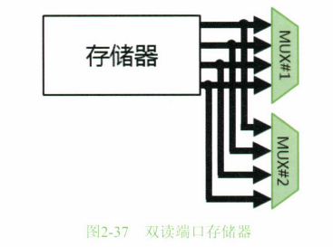

# 0x00. 导读

# 0x01. 简介

# 0x02. 

1. 计算全班平均成绩。
2. 全班成绩的及格率。
3. 分别计算所有女生和所有男生的平均成绩。

三个需求，希望能实现自动化，而不是手动一个个输入。

“相加”指令的基本格式起码是“AddAB”这种描述方式，也就是将 A 和 B 这两个数相加。只要把 Add 编码成一种二进制代码即可，比如用 0010 表示 Add ，译码器收到 0010 就知道要做加法。

数据存储器的地址得根据存储器容量的大小来决定，例如一共可以存储 256 行数据，则至少需要 8 位地址信号来表示。

将指令序列预先存储到一个专门存指令的存储器，称为指令存储器，里面存储的指令都是人为编码的，例如 0000 表示 Load ，0001 表示 Store ，0010 表示 Add。  
对于 Load 指令，Load [100] 寄存器A ，这个 100 是十进制数，并不是指地址 100 ，表示把 100 这个十进制数写入到寄存器 A ，这个 100 称为 立即数。我们完全可以预先把十进制“100”这个数存储到数据存储器中的某个地址上，然后使用 Load 地址的方式。但是这样做太烦琐，不如干脆将要操作的数据直接包含到指令里来得紧凑和高效。随之而来的问题是，操作码如果都是 0000(Load)，那么电路如何区分接下来要操作的是地址还是立即数？无法区分啊！所以，要将 Load 指令进行细分，比如可以使用 Load_a(LoadAddress) 表示前者，而 Load_i(Load Immediate) 表示后者(Immediate在这里的意思是名词“立即数”，并不是形容词“立即”)。

我们预先将编排好的指令序列存储到上图所示的指令存储器中，共包含 400 条指令，每一条指令都是一道工序，这 400 道工序共同形成了一个“程序”。这个程序中的指令必须一行一行地顺序执行。另外，指令存储器也必须至少包含 400 行的存储空间。而且，每一行的存储容量要按照所有指令中最长的那条为准。比如本例中，最长的指令是 14 位，按字节对齐的话就是 16位=2字节，这意味着指令存储器每一行的容量必须至少是2字节。

可以使用开关一行一行地将数据输入到锁存器中，按下数据开关，再按下锁存开关，将数据锁住。然后按下计数器开关让地址+1，控制下游的 DEMUX 将数据输入信号导通到下一行锁存器的输入端。然后继续按下数据开关和锁存开关，重复这个步骤，就可以将要处理的数据、指令输入到存储器中了。然而，一旦断电，就得重新输入，这很烦人。所以，早期人们发明了一种输入设备--穿孔纸带+读纸带机。将要输入的数据编码成二进制之后，在纸带上打孔，孔代表1，没有孔的地方代表0。纸带被载入马达，旋转拉开，然后在纸带上方有一排一排的金属探针，将探针刺向纸带，有孔的地方探针可以穿过去从而接触到纸带下方的触点导通电路，这样就可以将这个高电压输送到存储器中锁存。没有孔的地方会阻止探针穿过，每个探针上方是一个弹簧，所以不会刺破纸带。读完一长条之后，马达旋转快进，再读一长条，读完为止。

在真值表里，这种是 0 是 1 都可以，不会影响输出结果的信号被称为 don't care 信号。

将寄存器输入端送来的信号锁住并输送到输出端的过程，其实就是数据锁存的过程，又被称为“采样”。采谁的样？采的是在寄存器输入端已经抵达而且稳定存在的信号的样。怎么采？“采样”就是锁住，用寄存器的锁定信号来采。

鉴于全 0 的特殊性，我们不妨干脆把全 0 这条指令真的合法化，让译码器收到这条指令之后，将除了程序指针计数器和指令寄存器之外的全部 WE 信号设置为 0，也就是不允许任何寄存器被写入数据，这样的话，这条指令相当于什么也没有干，对电路输出的结果没有任何影响。我们不妨将该指令称为 Noop 指令，即 No Operation 的意思。这样能避免很多麻烦。而且有些程序里还故意加上一些 Noop 指令。Noop 指令又可以称为 bubble(空泡)。

指令本身包含着“电路应该干什么”的信息，译码器则将指令化解、消化、翻译，形成一堆零散的控制信号并输送到对应的选路器和WE信号上(译码)。译码也是一种运算，任何组合逻辑电路都属于运算电路，ALU 也是组合逻辑。我们可以看到，对于 Add A B C 指令，其译码输出的信号会直接把对应路径选通(#3/#4/#5/#6选路器)。也就是说，在该指令被译码的中后期，寄存器A和B的值就会被输送到ALU输入端，ALU内部就已经开始噼里啪啦，排山倒海了，计算结果也会从ALU输出到对应的目的地(寄存器C)，这一切要在一个时钟周期内完成，否则下一个下沿采样到的将会是无效结果。也就是说，Add A B C 指令从开始译码到 A+B 运算完成，是在同一个时钟周期内的，下一个时钟下沿则会将Add指令的执行结果“体现”出来，也就是将结果锁定到寄存器C中，白纸黑字板上钉钉。那么，这条Add指令到底是什么时候被“执行”的呢?准确来讲，应当将“执行”划分为“执行和结果输出”以及“结果被锁存(执行完毕)”两种状态比较合适。Add指令在同一个时钟周期内，先被译码，后进入执行过程并输出结果;下一个下沿被锁存结果，执行完毕。这样说最为精准。如果单纯回答“Add指令是什么时候被执行的?”这个问题，那么问问题的人一定是在问Add指令的执行过程而不是执行完毕发生在什么时间，那么回答应该是“在Add指令被载入指令寄存器的那个时钟周期内被ALU执行运算并输出结果的”  
将结果锁存，说得高雅一些，就是“改变运算电路的状态”。运算完了却没有保存结果，那么电路的状态就不会发生变化。假设所有的WE信号都被封闭，那么时钟下沿将不会改变电路的任何状态，就像什么都没有发生一样。就像你正在蹬自行车，突然链子掉了(WE信号置为不允许写)你继续蹬了一脚(晶振产生时钟下沿)，然而蹬空了(被WE封闭了，挂不上链子)，车子并没有被你这一脚蹬的继续往前挪动(电路状态没有任何改变)，而是靠惯性滑行。然而，数字电路可没有惯性，别指望着执行Halt指令之后，剩下的电路还能自己继续运算一段时间。

数据总线。它是连接在存储器、寄存器、译码器、ALU之间的，用于数据传送的导线。数据导线之间会经过很多 MUX/DEMUX 用来选路导向不同的目标模块。这些导线都是并行排布的，比如如果存储器内的某一行容量为32位，那么数据总线的位宽就是32，也就是32根导线并行，每个时钟周期从32个并排的MUX选出32个位来通过32根导线传递到对面的电路模块

地址总线。如果存储器共有8行，那么地址总线的位宽就是3，3根线上的3个位可以表示2的3次方行，相应地，PC寄存器中也应该有对应数量的触发器。而如果是256行，那就需要8根线，PC寄存器内就需要有8个触发器。这些导线直接从PC寄存器的每个触发器连接出来，输送到地址译码器上进行译码。

控制总线。控制总线是一堆非常凌乱的、以单根为粒度发散出去到每个电路模块上游或者下游的那些MUX/DEMUX、WE控制门等控制部件上的控制信号线。控制信号无处不在，它们就像这个世界里的交通规则，控制着每一个路口。

这种将地址预先保存到寄存器中供后续指令使用的寻址方式，叫作寄存器寻址。那种直接在指令中给出地址的方式叫作直接寻址。

目前最高端的运算电路多数都是采用 **微码(microcode)** 来将一条复杂的需要多个周期才能完成的机器指令，直接翻译成多条简单的、每条只需要一个周期就可完成的简单指令，或称 **微指令(microinstruction)**。所以，程序员可见的机器指令又被称为 **宏指令(macroinstruction)**，因为它可被分解。可想而知，必须存在一个宏指令到微指令的对应表，**这个对应表被俗称为微码**，它存储在某个特殊的内部私有存储器单元中。另外，需要译码器实现对应的判断规则。当发现载入的指令是一条复杂指令时，除了需要封闭PC指针寄存器之外，还需要发出对应的寻址信号，在时钟的驱动之下以及内部计数器或者指针寄存器的控制之下，从对应的微码存储器中将对应的微指令一条一条地读出来并执行，执行完毕后放开PC寄存器，从而在下一个时钟周期继续从主存储器载入指令执行。

下图一个**双端口**存储器，这个巧妙设计相当于给存储器开了两道门，每一道门都可以独立选取任何一条数据出来，没有冲突。但是，双端口存储器需要增加大量的门电路，资源耗费比较大。实际产品中，一般还是将数据与指令分开存储在两个存储器中，但是这两部分是在同一个地址范围内。举例来说，比如“地址0”只有一个，要么放代码，要么放指令，并不是指令存储器和数据存储器各有各的“地址0”，而是比如将地址0至地址4对应的数据放到指令存储器，而将地址5至地址8对应的数据放到数据存储器。

这些存储器中，每一种的密度、速度和成本都不同。密度越大的一般速度越慢，成本越低。它们之间的速度差异靠 WE 信号来协调。比如，如果取指令单元的 PC 寄存器发出寻址信号给缓存控制器，缓存控制器查找缓存需要一定的时间，这个时间高于一个时钟周期，那么此时缓存控制器应当向取指令单元反馈一个 Wait/Busy 信号，而取指令单元根据这个信号将内部运算逻辑电路中所有寄存器的WE信号禁用。这样的话，这些运算电路就会忽略时钟信号，原地待命，整个电路的状态依然维持在上一条指令执行完毕时的状态，一直到缓存控制拿到了对应的数据，从而将Wait/Busy信号置为Ready状态，取指令单元立即解除WE封闭，让拿到数据的电路再次依靠时钟振荡运作起来。

有人会好奇，这个例子中如果 SDRAM 第 0 行存储的是全局地址 5 的数据的话，全局地址0至全局地址4都去哪了？实际上，有些全局地址所存储的数据并不在 SDRAM 中，而在其他部件内部的存储器中，比如用于显示目的的显示器控制器(显卡)。程序如果将数据写入这些地址，电路就会把数据写入到这些部件内部的存储器中。如果写入的是显卡的显示存储器，则显卡就会在屏幕上显示出所写入的数据，这些特殊的地址段被称为 **I/O地址**，以区别于主存地址。但是要注意，全局地址空间是个虚的东西，其包含 IO地址空间和主存储器地址空间。

上图中所示的三种总线，便是用于传递这些信息的导线通路。之所以称为“总线”，是因为连接到总线上的某个部件一旦向总线上放置了某个信号，其他部件都可以感受到，所以总线就是并联在一起的导线。有些数据并没有存储在SDRAM中，而是存储在外部设备中，如果CPU想获取其中的数据，就得把这些数据所在的地址(每个地址也是存放一个字节)和控制信号告诉外部总线总控制器(也接在总线上)。后者再根据对应的地址，从后端诸多外部设备中对应的位置提取数据(用后端名种设备所设计的方式)并将其放置到数据总线上供CPU接收。如果在下一个时钟下沿之前无法读取出所需要的数据，则下游部件需要在Holding信号线(控制总线中的一条)上给出一个电平信号以便通知上游部件继续等待，上游部件在下一个时钟周期内会在该信号的驱动之下(靠译码器译码该信号)，继续保持上个时钟周期内所发出的各种信号，并封闭其内部接收部件的写使能信号。CPU自身并不知道自己发出的地址到底落入谁那里，是程序让它发出这个地址的，程序员当然得清楚自己要访问哪个地址。但是，只有程序员清楚还不够，因为SDRAM控制器与外部总线控制器都接在总线上，总线信号所有人都能收到，所以它们必须各自判断CPU发出的某个地址信号该不该由自己来响应和处理。那么，它们又是怎么知道某个地址信号该不该由自己处理的呢?

PC寄存器发出的地址信号，必定需要有一种机制来判断这个地址对应的数据是在SDRAM里还是在外部的某个设备中，从而可以将对应的访问信号发送给正确的部件来处理。

Intel 的 CPU 加电之后发出的第一个地址信号是 111111111110000，CPU 会从这个地址读取代码来执行。这个地址是被写死在CPU电路中的，加电后就被自动载入PC寄存器从而发出。而这个地址访问请求会被 外部IO总线控制器 认领，并将读请求发送给 BIOS ROM 控制器。外部IO总线控制器内部也被写死，只要收到从 11111111111111110000 到 1111111 这段地址区间的请求，一概将请求发给BIOS ROM控制器并让它读出数据。也就是说，这种一开始的写死也是一种映射--固定映射。BIOS ROM控制器收到请求后，从ROM中的第一行读出数据并返回，读出的数据就是BIOS的机器指令，从而执行BIOS中的代码。从图2-40中也可以看到，整个BIOSROM的2MB的存储内容被映射到了CPU4GB物理地址空间的最顶部。那么，回答上面的问题，谁来做这个映射的?外部IO总线控制器;怎么做的?被写死在硬件电路的地址译码器里了。能否动态映射，也就是更改某段地址在全局物理地址空间里的位置?可以。

所以，在下图中，外部IO总线控制器和SDRAM控制器都会包含一个地址译码器，其可以根据收到的地址信号判断该地址信号到底是不是发给自己后面所挂接的部件的寄存器的，从而决定是否响应该访问请求，这个地址译码器是可以被配置的，也就是可以将一些映射规则(配置字)更新到其前端的寄存器中，其又被称为**配置寄存器**，其中存储的配置字所输出的信号会输出到下游翻译逻辑电路，从而决定了译码器的翻译结果。这个原理相当于上文中介绍过的微码的实现和控制原理。这个地址映射逻辑必须灵活可配置，因为系统一开始并不知道外部会接入多少个设备，会接入多少容量的SDRAM，接入的多，这些设备占的地址空间就大，映射关系就会变化。

我们把针对存储器地址的读写请求称作“访存”。

Byte Enable, BE, 字节选通信号，含义是供上游电路告诉下游电路，上游需要的是这 32 位导线中的具体哪些字节。

实际中，SDRAM的控制器无法在一个时钟周期内读出或者写入数据。所以，如果SDRAM控制器接受的时钟信号与核心运算电路的时钟信号同频率的话，那么PC寄存器一定会频繁地被封闭，运算效率非常低。所以，不得不这样设计：让核心运算电路的时钟频率维持原有的较高频率，而使用分频器将这个高频率分频成频率降低数倍的一个低频率时钟信号，将其输入给SDRAM控制器。从SDRAM控制器的视角向外看，它的确是一个时钟周期读写一条数据，但是它的时间轴跑得比核心运算电路要慢数倍。