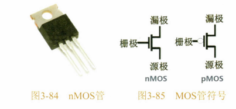
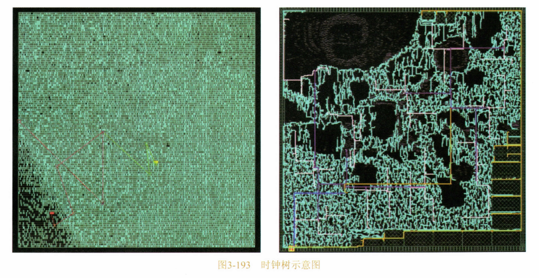

# 0x00. 导读

# 0x01. 简介

# 0x02. 

什么叫作电控开关？电磁继电器算一种，但是其内部依然是机械装置。纯电子开关是这样的：在开关的某个触点通电后，电会从一端流向另一端，断电则不导通；而且不能有任何机械装置，且要求反应足够快。

在三极管的栅极加一个高电压，其阳极则也跟着输出高电压；栅极的电压降下来，那么阳极电压也跟着降下来，效果上和电磁继电器别无二致。另外，电子三极管的响应时间非常短，也就是阳极随着栅极信号的变化的滞后时间，相比继电器加电后直到开关吸合所耗费的时间，完全不在一个数量级上。

电子管固然好，但是缺点也非常明显。首先，为了防止灯丝氧化、阴阳极老化等，需要抽真空；其次，阳极需要加比较高的电压才能够把阴极吹出的电子风吸过来，所以其功耗比较大；再就是体积比较大。

半导体：导电性在一定激发条件下可变的固体材料。

在1948年，有人利用两块缺电子的材料(倾向于带正电，Positive，简称P型材料)夹住了一块富电子材料(倾向于带负电，Negative，简称N型材料)，让它们的表面大面积接触在一起，形成PNP结构，从而在表面形成这种电子梯度效应，在这种装置上，也成功地发现了放大效应。这两种材料的接触面被称为 P/N结。

半导体集成电路(Integrated Circuit,IC)：将多个元件集成在一片半导体品片上的电路。

任何组合逻辑都必须在一个时钟周期之内输出，这就等效于，任何组合逻辑电路的总时延不能超过一个时钟周期，处理器频率越高，时钟周期越短，对组合逻辑的时延要求就越高。实现某个组合逻辑耗费的晶体管数量越多，时延也就相应越大。

数字电路是靠时钟驱动的，这句话听上去似乎都理解，但是如果细究起来具体时钟是怎么驱动数字电路输入输出的？当前的CPU中含有几十万个触发器。时钟信号驱动的就是触发器，比如取指令操作，就是将触发器时钟信号从1变为0，时钟下沿触发的触发器此时便会将其数据输入端的信号锁存起来，一条指令便进入了锁存器，然后继续向前传递给译码器，译码器根据输入信号算出输出信号，然后送入下位单元，比如可能是执行单元等等。**位于同一个功能单元中的所有触发器，都由同一个时钟信号源驱动，也就是它们同时收到相同的 1 和 0 振荡频率**，然而，可能有些模块先收到时钟信号，有些后收到，也就是相位不同。在同步时序电路中，电路模块需要相同的时钟信号，这样才能协调一致。几十万个触发器，可想而知，需要多少条导线将时钟信号引向对应的品体管输入端，而导线的长度、信号完整性可能都有差异，如何保证时钟信号的完全同步？这就是考验技术的时候了，CPU内部电路众多，做到完全相位一致是不可能的，因为时钟信号的传递也需要时间，但是只要在可接受的时延范围内得到正确的输出即可，纵使有相位差。所以，如果时钟树这块的技术搞不定的话，最终芯片的频率也是上不去的。

时钟信号通过主板上的晶振发出，输入到CPU的时钟信号管脚，然后从这里逐渐引向内部各个模块，其所形成的导线网络，被称为**时钟树**。如下图所示，时钟树密密麻麻在芯片上分布着。由于导线数量多，而且每次时钟振荡一次，就意味着整个导线里的电荷被充放一次，所以，一个CPU的动态功耗，有一半以上都用在了对时钟树本身的充放电上去了。（一点参考：[时钟树](https://elec.alampy.com/stm32/clock_tree/)）

一般来讲，CPU访问寄存器需要1个时钟周期，访问Cache则需要3到4个时钟周期，既然它们本质相同，为何后者速度要慢呢?要理解一点，缓存输出数据慢于寄存器，那是因为缓存控制器需要在缓存里查找“当前某个全局地址上的数据是不是在缓存中某个地方放着”，这个操作会耽误2到3个时钟周期。而寄存器中存储的内容不需要搜索，是指哪打哪，因为机器指令里直接就带有寄存器号标识。另外，缓存容量比较大，其电路就更复杂，寄生电容就更大，充放电时间长，运行频率自然就无法做到与寄存器相同。