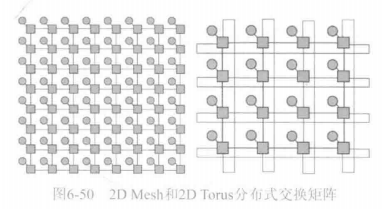
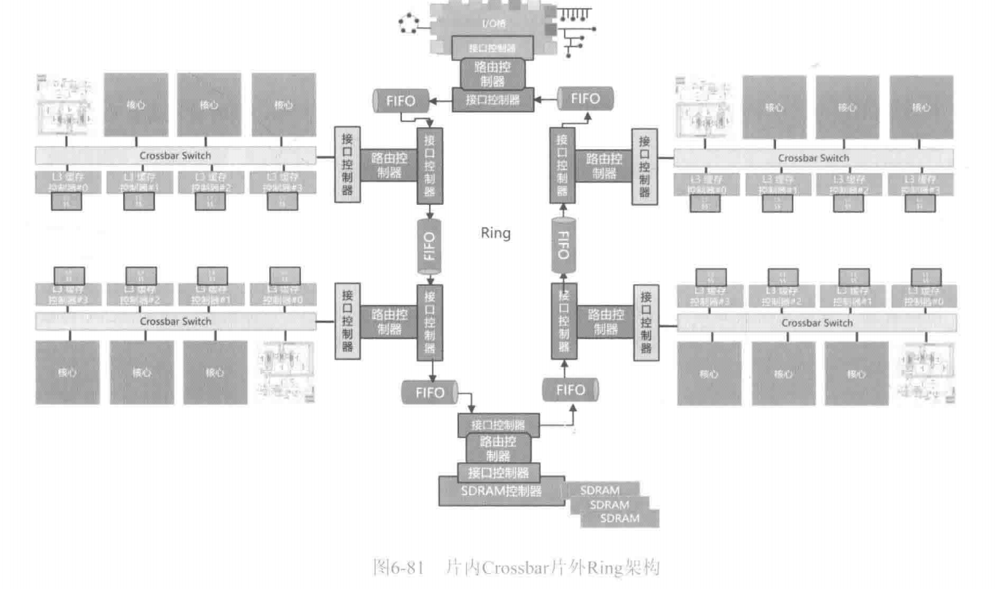
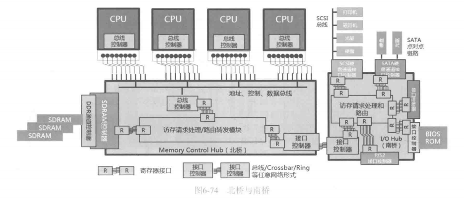

# 0x00. 导读

# 0x01. 简介

# 0x02. 

核心间的广播通告消息被称为 询问/嗅探 (probe/snoop)，能够过滤不必要广播的硬件模块被称为 嗅探过滤器 (snoop flter)。

## 2.1 Crossbar

点阵式 Crossbar 的最大优势就是 **时延极低**，因为任意两点通信只需要经过一个开关联通即可，所以针对很多要求极低时延、极高性能的场景来说，使用这种 Crossbar 是不错的。

单个 Crossbar 容量有限，Crossbar 之间级联之后再级联，所有 Crossbar 就组成一个逻辑更大的 Crossbar ，而且依然可以直接两点通信。

## 2.2 Ring

人们设计出了时延高一些，但是非常节省电路面积，同时又可以达到较高时钟频率和吞吐量的新互联方式 Ring(环)。

所有节点都有发送和接收两套电路，这就像该节点的左右手，左手进右手出。它们手拉手在顺时针和逆时针方向各形成一个环，就像大型城市地铁环线一样，数据在这个环线上传递：从左手进来，如果一看不是给自己的，那就从右手再发出去；如果是给自己的，就收进来处理，不再向外发送。每个器件都有自己的地址 ID，从环上各取所需，只要碰到带有自己 ID 标签的数据包，就收进来，否则就继续转发数据到下一站，数据包继续向下传递。这样，每个节点间的线路就会非常简单，长度也会很短，因为它只连接了两个端点，那么其运行频率自然就可以非常高。如果把导线数量(位宽)增加，比如增到 256 位位宽的话，那么两点间的传输吞吐量将会非常高，达到每秒数十兆字节不成问题。但是其代价就是时延会增加，因为随着环上节点数量的增加，数据传递的跳数也就增加了。对于 bus 或者单级 Crossbar 网络，任意两点间一跳直达，而手拉手传递，数据可能会经过多跳才能传过来。如果目标节点在自己旁边，一跳即可，速度会高于 bus 和Crossbar，因为 Ring 的频率非常高，位宽也大；但是目标如果相隔自己较远，就得多跳。这也是为什么要同时设立顺时针和逆时针两个环的原因，到目标节点走哪个环更近，就上哪个环。

这种环路由于需要一跳一跳地传递数据，所以也属于一种多级网络。节点数量较少的时候，bus 效率较高，Crossbar Switch 效率最高，但是 bus 受制于技术原因、Switch 受制于成本原因，两者都无法扩展到太多节点。Ring 网络的时延增加了，但是却可以以最低的成本和可接受的时延扩展到很多节点。

## 2.3 NoC

Crossbar 和 Ring 是比较常用的两种用于多个核心、缓存之间互联的网络方式
- Crossbar 成本高、时延低，用于接入节点少，更加追求时延的地方，例如 core、L1缓存、L2缓存之间的连接
- Ring 相对成本较低，就用于 core、LLC之间的连接。
  
下图的左图为一个 Full Mesh(全网状) 网络，其中每个方形表示一个 5x5 Crossbar，每个圆形表示一个器件(比如缓存控制器，或者SDRAM控制器等)。每个 Crossbar 用 4 个端口分别与东西南北方向上的 Crossbar 连接，形成多级网络，数据在这个网络上一跳一跳地被转发到目的地。**由于包交换方式更加高效，所以目前已经几乎没有网络使用基于连接的方式了**。每个 Crossbar 都记录一份涵盖全网的路由表。这种分布式 Crossbar 多跳网络，相比任意两点都可以直接互联的大型 Crossbar 来讲，会节省很多成本，占用面积也可控，属于线性增长，每增加一个节点，只需要增加一个 5x5 Crossbar 即可，其以时延作为代价换来了高扩展性。

上图这个 Full Mesh 网格内的每个交叉点处的 Crossbar 都可以连接器件。这种每个器件跟着一个小 Switch 的网络互联方式被称为 直接网络(Direct Network)，而之前那种只在网络边缘连接器件的则被称为 间接网络(Indirect Network)。可以看到，这个矩阵用了 64 个 5x5 Crossbar，支撑了 64 个器件的互联通信。其相距最远的两个几点间隔了 14 跳，忽略其他因素的话，相当于路由一个数据包最差需要 15 个时钟周期。为了解决这个问题，另一种拓扑出现了，观察一下即可发现，这个矩阵的边缘 Crossbar 其实是有一路线路没有任何连接的，如果将每一行和每一列的首尾 Crossbar 的这条空闲线路连接起来之后，就形成了上图右图所示的结构，这个结构学名叫作 Torus, 也就是带有环的 Mesh 拓扑。经过这样的设计，有些相隔很远的节点间通信就可以抄近道了。但是不管怎样，在这种大范围网络中，两点之间通信的平均时延一定是增加一大截的。

很多术语解释可以在 [18_interconnects.pdf](./18_interconnects.pdf) 找到答案。  

Full Mesh网格接入大量的节点，时也增加了，但是却换来了很高的灵活性和较低的成本，以及极高的扩展性。

# 0x03.

这种共享地址空间硬件架构允许任何处理器直接访问内存,而无需复杂的地址转换机制。这样可以提高整个系统的性能和并行处理能力。

英特尔在”Sandy Bridge”微架构中引入环形互联(Ring Interconnect)概念。

1. 具体实现

    - 在这个架构中，每个CPU核心都有一个L3缓存”slice”(2MB)，并通过环形总线连接。
    - 系统代理(System Agent)和图形处理单元(Graphics)也通过相同的环形总线连接。
    - 每个L3缓存”slice”都连接到环形总线上两次。
2. 通信机制

    - 环形总线支持4种不同类型的消息传输:请求、snoop、应答和数据传输。
    - 这样可以更好地支持处理器间的缓存一致性协议和数据共享。
3. 性能优势

    - 理论峰值带宽可达435GB/s,当每个核心访问其本地L3缓存slice时实现。
    - 这种架构提高了内部总线的利用率和并行处理能力。

- Crossbar 指的是一种互连架构,它采用十字交叉的方式将各个核心连接在一起。
- 这种架构可以让任何一个核心都能直接访问其他所有核心,提高了处理器的并行处理能力。
- 在 SUN Niagara 2 处理器中,Crossbar 互连负责连接8个CPU核心,使它们可以相互通信和共享资源。
- 
同时这里引出了CCX (Core Complex)的概念, 上面的Crossbar连接在一起的8个核心可以看做一个CCX (Core Complex):
- CCX 代表 Core Complex,是一个包含多个CPU核心的集成单元。
- CCX 体现了处理器内部存在 NUMA (Non-Uniform Memory Access) 特性,不同CCX区域之间的内存访问延迟和带宽可能会有差异。
- 软件优化需要考虑这种 NUMA 特性,合理调度线程和分配数据,才能发挥处理器的最佳性能。

共享内存：多个核心看到同一个地址空间，并且直接用 load/store 指令就可以寻址全部地址空间。

对于当前的多核心 CPU 来讲，做到共享内存并不是不可以，但是目前 CPU 运行频率比较高，吞吐量比较大，而一个访存请求跨越大规模网络到达目的地的时延太高，CPU 会浪费太多时间原地等待，**所以对于基于 NoC 的芯片，有很多产品不支持共享内存**，这些产品或者无法直接寻址 SDRAM (外围访存电路只能把访存请求路由到缓存)，或者可以直接寻址但是不推荐，性能会非常差。（共享内存是上个世纪电脑的事，没有 L1 L2 L3）

不支持直接寻址 SDRAM 的多核心 CPU 一般会提供数百 KB 的 SRAM 存储器（L1 L2 L3），核心只能直接寻址这块存储器( Scratchpad RAM, SPM, 暂存器存储器)，所以地址线的位宽可以比较低。这就意味着多核心上的程序不能直接相互通信：  
比如 核心1 上某个线程将某个变量放在 A 地址，A 地址指的是它自己的 SRAM 中的地址，这个地址是一个只能由该核心自己看得到的本地地址，其他核心访问不了这个地址，也就是说 核心2 如果发出访问地址 A 的请求，其访问到的是 核心2 自己的 SRAM 里的 地址A，这里放的可不是那个变量。所以，多核心上的程序想交换数据的话，就得把数据放到核心外部，位于 NoC 某个节点上的 SDRAM，其他核心再从这里拿走。但是 SDRAM 又不可以被直接寻址，如何访问它呢？需要给 NoC 接口收发控制器发送请求 “我要访问 SDRAM 节点内部的第 1024 字节，拿到数据后请放置到本地 SRAM 中的第 4096 字节处”，NoC 接口控制器的驱动程序会提供对应的 API，上层程序调用之即可，驱动程序负责读写 NoC 控制器对应的寄存器，将上层程序传过来的参数写入其中，NoC 控制器则自行封装出一个访存请求数据包，包中含有 SDRAM 节点的 ID 号、要访问的字节号、源节点 ID 号等控制信息，数据包被载入 NoC 路由到 SDRAM，后者返回数据到发送方 NoC 控制器，NoC 控制器再把数据放置到 SRAM 中指定地址，然后中断发送方 CPU 核心处理该条数据。

## 3.1 

存储器可以与核心采用任何方式互联，核心并不关心它所访问的地址的数据到底被放在哪里，你放到月球上用卫星发回来，核心也不知道，核心它只知道发出地址，发出操作码，数据返回时下级电路会在 Ready 信号线上拉低/高电平，核心将数据导线上的电压进行锁存，就拿到了数据。从访存请求发出，到成功拿到数据或者写出数据，所耗费的时间，被称为 Load_to_Use_Latency, 也就是访存时延，这个时延越小越好，否则核心原地空转比例太高。这就是要加一层层缓存的原因，也是不能把硬盘上的存储空间映射到全局地址空间中统一路由的原因。

访问 L1 缓存可接受的时延范围在三四个核心时钟周期，所以 L1 缓存与核心 L/S(Load/Store) 单元之间最好是直接用寄存器连接起来，比如一个 FIFO 队列，也就是 L/S 队列，你放进去，我拿走，这样最直接最迅速，这种通信方式被称为 寄存器接口( Register Interface )。

寄存器接口是所有通信方式中最原始的方式，其未经任何处理(比如信号重新编解码、串并转换、波形重整、附加上一些控制字段等)，速度最快，但是局限性也很大，是所有通信方式的始发点和终点。在寄存器和寄存器之间增加一些控制和处理，就会形成各种上层的网络通信方式，也就是先将数据从发送方寄存器传送到处理模块中的寄存器，处理模块对数据做处理，通过各式各样的网络发送到目标端，网络中流淌的数据可能是已经变化了很多的、且被附加了很多控制信息的数据，目标端的处理模块接收这些数据，再将数据还原成最原始的数据，然后将数据传送到最终目标的寄存器中，所有的数字通信线路的两端都始于寄存器，终于寄存器。

L1 与 L2 缓存之间通常也采用寄存器接口。由于 L3 缓存要被多核心共享访问，这就需要使用 bus/Crossbar/Ring 等网络方式把多个核心的 L/S 单元与 L3 缓存控制器连接起来，这样的话，就不能寄存器直连了，必须增加一个 总线/网络控制电路 来让数据有序地发送到目的端。下图为这个过程的演化示意图，从最原始的寄存器直连再到 bus 再到网络方式。总线控制器的作用除了实现多个模块同时发起请求时的仲裁之外，还负责将输送到总线上的信号进行加强处理，因为总线的电容非常高，需要强劲澎湃的充放电，总线控制器中会有对应的电路来做这件事，称之为总线驱动电路。另外，当某个模块没有数据要发送或者接收的时候，驱动电路会关闭与总线连接的电路，从而不吸收也不放出电流，既达到省电目的，又能保证总线的电容恒定。

对于基于 Crossbar 和 Ring 网络的多核心缓存互联架构来讲，虽然 Crossbar、Ring 都可以允许任意两点间同时通信，是一种无阻塞网络，但是所有访问 L3 缓存的请求，都要在 L3 缓存控制器前端的 FIFO 排队，L3 缓存每个时钟周期只能处理一条访存请求，所以多个核心访问 L3 缓存的本质过程依然是有阻塞的。如果能够让 L3 缓存同时处理多个请求，那就需要把 L3 缓存分割为多个分片，每个分片都加入一个缓存控制器，然后多个核心发出的访存请求恰好各自落入一个分片，上面这几个条件缺一不可。如果不将缓存分片，只改进缓存控制器，让它并行执行多个请求是做不到的，因为每个请求都要并行搜索全部 L3 缓存的所有路。

大多数 CPU 都直接连接了多个 L3缓存控制器 + L3缓存到网络中，假设是 4 个，这样可以并发 4 个请求，前提是每个核心的请求落入其中一个分片。值得一提的是，这 4 分片的 L3 缓存是全局共享的，也就是说某个缓存行在所有分片中只存在一份，而不是 分片1 缓存了一份，分片2 又缓存了一份，任何核心都可以直接访问任何分片，会有一定的机制来判断哪个地址在哪个分片中。对于某个缓存行，需要选择到底将它放入到哪个 L3 分片中，任意放置是不现实的，因为这样每次访存就又得并行查找全部缓存行。实际上一般实现是用访存地址的高 n(n=Log, 分片数量) 个位作为索引来将缓存行分散存放，这样的话，核心要写入某个缓存行时，L2 缓存控制器先将这高 n 个位翻译成 L3 分片位于网络中的 ID，然后网络接口控制器向该 ID 发出该访存请求，就将该请求路由到对应的分片中了，读过程也是一样的操作方式。

但是，利用高 n 个位来分割的方式，容易导致 L3 缓存不能被充分利用，比如如果多个核心中运行的多个线程发出的访存请求恰好总是集中在某个局部地址段范围，那么这些请求就会争相落入少数分片而迅速撑满该分片，而其他分片拥有大量空闲空间无法被利用。所以又有一些实现中，缓存控制器采用 Hash 算法硬件模块先把地址请求进行 Hash 计算生成另外一串位，然后用这些位来索引对应的分片，Hash算法能够保证即便是距离较近的地址的Hash结果也会大不相同，从而做到平均化。

# 0x04. 

片内多核心之间可以有多种拓扑，从共享总线、Crossbar、Mesh 再到 Ring。同样，多个CPU芯片之间的外部访存网络连接拓扑，也可以基于这几种。至于 SDRAM 主存，不但需要被片内多个核心共享访问，而且需要被多个CPU芯片共享访问，所以 SDRAM 控制器就得放置在连接有多个 CPU 芯片的外部访存网络上。

下图为一个多 CPU 架构示意图。其中片内、片外都使用 bus 方式互联。能否将所有 CPU 的核心和 L3 缓存控制器全部连接到一个大总线上呢？理论上可以，技术上行不通，共享总线无法承载太多的节点。由于 L3 缓存是在单片 CPU 内部的多个核心之间共享的，如果把所有 L3 缓存都连接到同一条大总线上，那么任何一个核心访存时，其他节点都要等待，很不划算。所以还是如图所示将多个总线分割开，各访问各的比较合适，当需要缓存同步的时候，才将请求发送到片间互联总线上。

总线无疑是低效的，下面是基于非总线拓扑的各种片外网络。

## 4.1 芯片组

专门用来容纳 CPU 和 SDRAM 之间的访存总线的芯片，Intel 称之为 **MCH(Memory Control Hub)**，其他 CPU 厂商不见得这么叫，但本质都是一样的。

[Northbridge](https://en.wikipedia.org/wiki/Northbridge_(computing)):  
> 也叫 host bridge 或者 north bridge  北桥。generally handles high speed onboard communications.
>   
> 处理器设计的总体趋势是将更多功能集成到更少的组件上，从而降低总体主板成本并提高性能。处理 CPU 和 RAM 之间通信的内存控制器被 AMD 从 AMD K8 处理器开始转移到处理器芯片上，英特尔则从 Nehalem 处理器开始转移到处理器芯片上。将内存控制器集成在 CPU 芯片上的优点之一是减少从 CPU 到内存的延迟。  
> 
> Modern Intel Core processors have the northbridge integrated on the CPU die, where it is known as the uncore or system agent.

但是，上面这个系统很不易用，因为它缺乏 I/O 子系统，无法接入硬盘、键盘、鼠标、显示器、网络。所以，需要把硬盘通道控制器、键盘/鼠标控制器、网络控制器、显示控制器等一系列 I/O 控制器也接入到系统中来。由于 IO 方式太多，将所有控制器都接入到 MCH 中的总线是不现实的，尤其是对于早期的计算机来讲，芯片集成度非常低，那就需要再来一个芯片专门接入这些 I/O 控制器，Intel 称之为 **IOH(I/O Hub)**，IOH 与 MCH芯片之间通过某种接口连接起来。这个接口属于外部接口，一般不采用寄存器对寄存器直连接口，而是采用并行或者串行点对点网络连接，也就是在两端的数据收发寄存器之间加入一些适合于外部传输的因素，比如串并转换、重新编解码等物理层处理，以及一些链路层的数据交互方式。这个接口并不是将 IOH 中的所有部件连接到 MCH 内部的总线上，虽然它可以这么做，但大量的部件连接到总线，会导致总线运行频率降低，电容增大了，也会拖累 CPU 的访存性能。MCH 内部的连接 CPU 与 SDRAM 控制器的总线被称为 **前端总线(Front Side Bus，FSB)**。而 MCH 与 IOH 之间的 总线/链路/网络 被称为 **桥间总线**，FSB 与桥间总线被统称为 **系统总线(System Bus)**。IOH 上各个 I/O 控制器连接各种设备所用的总线，被统称为 **IO总线**。下图为 IOH 和 MCH 的全局架构示意图。

[Southbridge](https://en.wikipedia.org/wiki/Southbridge_(computing)):  
> 负责处理计算机的许多输入/输出功能。
>
> 南桥芯片组处理 USB、音频、系统固件、低速 PCI/PCIe 总线，IOAPIC 中断控制器、SATA 存储、历史 PATA 存储、NVMe 存储 以及 ISA 、 LPC、SPI或 eSPI 等低速总线 。在 20世纪90年代 和 2000年代初，北桥和南桥之间的接口是 PCI 总线。截至 2023 年，使用的主要桥接接口对于 Intel 是 Direct Media Interface, DMI 和 对于 MAD 是 PCI Express 。
>
> 在 Intel 中，I/O Controller Hub (ICH)，后来被 Platform Controller Hub 芯片组取代。在较旧的 Intel/AMD 架构中，南桥通常连接到北桥，而北桥又连接到 CPU。大约 2004 年及之后的 Intel 架构开始将南桥直接链接到 CPU（例如通过 DMI）。通过使用 控制器集成的通道电路，北桥（或CPU本身）可以将来自 I/O 单元的信号直接链接到CPU以进行数据控制和访问。
>
> 由于 片上系统(SoC) 处理器的发展，现代设备越来越多地将北桥集成到 CPU 芯片本身中。随着 2008 年 Intel 5 系列芯片组的出现，南桥变得多余，并被引入的 平台控制器中枢(PCH) 架构所取代。 AMD 在 2011 年发布首款 APU 时也采取了同样的做法，将 PCH 命名为 融合控制器中枢(fusion controller hub, FCH)，仅在 AMD 的 APU 上使用，直到 2017 年开始在 AMD Zen 架构上使用，同时放弃了 FCH 名称。
>
> 在 Intel 平台上，所有南桥功能和剩余 I/O 功能均由 PCH 管理，PCH 通过 DMI 直接连接到 CPU。

由于制造主板的厂商一般将 MCH 做在主板的上方，IOH 做到主板的下方，MCH 如同 CPU 和 SDRAM控制器、IOH 之间的桥梁一样，所以俗称 MCH 为 **北桥(North Bridge)**；IOH 为架在 MCH 与各种IO控制器之间的桥梁，俗称 **南桥(South Bridge)**。北桥和南桥起被称为 **芯片组(chipset)**，共同支撑一台计算机的运行。**北桥为CPU提供主存访问通路，南桥为CPU提供I/O访问通路，所以芯片组指的就是为了支撑一台计算机运行所需的除了CPU之外的所有芯片的集合。**

CPU、北桥、南桥共同被称为芯片组，意思就是只靠 CPU 这一颗芯片并不能支撑起整个系统的运行，必须是一组芯片。当然，目前的 CPU 集成度越来越高，正在逐渐将越来越多的角色集成到CPU芯片内部去。

## 4.2

纵观前面的几种架构，SDRAM 都是被集中挂接在外部网络上的，所有 CPU 的未命中缓存的访存流量都会被外部网络路由到与 SDRAM 控制器连接的网络端口上，那么很自然地，这个端口的缓冲队列将长期处于高压状态，一旦队列被充满，则网络会通知发送方队列满(QueueFull)信号，发送方只能原地等待，从而产生了瓶颈。例如上图

所有人都挤进同一扇门，自然会有瓶颈。为何不放置多扇门呢？另外，能不能把 SDRAM 放在更加靠近核心的位置？系统架构师们也是这么想的。2008年，Intel 从代号 Nehalem 架构的 CPU 系列开始，对整个架构进行了脱胎换骨的改造，迈出了很大的一步。新的架构基于上所示，北桥被集成到了 CPU 内部了，而且，最关键的变化，是把 SDRAM 控制器（后文统一简称内存控制器(Memory Controller，MC)）直接挂接到了片内网络上，每个CPU片内有一个MC(也可以有多个)，Intel 称之为 集成MC(integrated MC，iMC)。下图为一个由 4 个 CPU 芯片组成计算及系统架构示意图。
将原来集中挂接在片外网络上的 MC 提升到片内网络，与 L3 缓存控制器同级别待遇，显然降低了访问 SDRAM 的时延，再加上 SDRAM 自身的运行频率越来越快，也有诉求被挂接到更高速的网络中。这样的系统被称为 分布式共享内存系统(Distributed Share Memory,DSM)。

Intel 采用先串后并的方式作为 Crossbar 网络的底层传输方式，对应的片外互联接口控制器被称为 **快速路径互连(Quick Path Interconnection，QPI)**，图中标识为 Q。每个 Crossbar 共有 5 个端口，其中一个连接到内侧的 QPI 控制器上，另外 4 路可以接其他网络节点。CPU 核心发出的访存请求的目标地址如果恰好落入了连接在与自己处于相同 Ring 的那个 MC 后面挂接的 SDRAM 中的话，那么访问时延将比较低，性能也较高；相反，如果访存地址落入了其他 CPU 芯片内的MC，那么该请求会被路由到本地的 QP 控制器，然后经过 Crossbar 交换到对方的 QPI 控制器，再被路由到对方的 MC 上执行。访问远端的内存需要跨 QPI 网络通信，其时延势必很大，性能就较差。这里要理解一点，内存虽然被分布到各个 CPU 后面，但是所有 CPU 核心依然可以使用地址信号直接寻址，而并不关心也不知道它所访问的这个地址到底位于本地内存还是其它 CPU 后面的内存，因为 Ring 和 QPI 网络中的每个节点都会透明的路由每条访存请求。

这就自然会产生一种诉求，如果 进程1 在 CPU1 上运行，那么内存管理程序如果能够将 进程1 的内存物理页分配到 CPU1 而不是其他 CPU 所挂接的 SDRAM 中，这样就可以人为地提升进程运行的速度了。的确，现在的主流操作系统中的内存管理程序模块就可以被配置为这种策略。

这种访问本地 RAM 快于远程 RAM 的访存形式被称为 **非一致性内存访问(NoneUniformMemoryAccess，NUMA)**。相比之下，之前那种把 SDRAM 控制器集中挂接到北桥，所有节点对称访问的做法，则被称为 **一致性内存访问(UMA)**，因为此时多个 CPU 访问 SDRAM 的距离是相等的，性能是均匀一致的。但是，即便可能跨 QPI 网络访问 SDRAM，也并不能说 NUMA 架构的性能就比北桥时代的性能差，因为 QPI 网络的速度和时延相比北桥时代还是有天壤之别的，虽然网络跳数增加了，但是也得综合来看。

# 0x05. 缓存一致性

现在，所有核心、缓存以及 SDRAM 内存都通过某种网络互相连接了起来，QPI 具有如此高的带宽，用于 CPU 与 IO 桥之间通信，这很好理解，因为 CPU 需要与外部 I/O 设备互传数据，但是为何 CPU 之间也需要这么高的带宽？实际上，CPU 之间的 IPI 消息只占了很小一部分，大部分链路带宽都被 缓存一致性探查 和 相互同步缓存数据 给占用了。

## 5.1 访存空间一致性问题

大家可能听说过平行宇宙理论，该理论认为每一次事件选择都会引发一个空间分支，形成另一个空间独立发展。缓存的存在会导致这种平行空间问题：
- RAM 中某个地址 A 上的数据 a，可能会被同时缓存到 核心1 的 缓存1 和 核心2 的 缓存2 中，初始时刻两个缓存中该地址的值可能还是 a，这个时候 RAM、缓存1、缓存2 这三个空间是一致的。
- 但是随后 缓存2 中该地址的值 a 被 核心2 更改为值 b，此时便出现了两个数值版本， 核心1 如果继续使用 缓存1 中的 a 做计算，十有八九会出错。

这种就是在空间上产生的不一致问题。

所以，为了实现空间一致性，必须将新生成的数据同步广播到其他的缓存中去。这又产生一个思考：将 缓存2 中的 b 同步到 缓存1 的过程也是需要时间的，无法做到 0 时延，所以，核心1 如果在新数据没到来之前就从 缓存1 中取出了该地址的数据，那么取出的将是 a 而不是 b，依然可能导致计算错误。既然这样，将数据同步来同步去的意义何在？**同步时延问题是一道无法逾越的鸿沟**，程序员必须接受，**但是可以采用其他方法保证程序执行的时序正确性，比如互斥锁、同步屏障等机制**，但是并不能因废食而放任多个缓存形成多个版本的数据。

目前，所有的商用多核心 CPU 无一例外都支持硬件保障的 缓存一致性(cache coherency)。**缓存一致性仅仅指空间一致性，并不表示时序一致性**。**实现了缓存数据同步，也仅仅是实现了带有延迟的空间一致性，至于这个延迟有多大，无法预知**。**比如有 8 个核心的 8 份独立私有缓存，各自运行了一个线程，访问某共享变量，其中一个核心更新了该变量，如果还需要把这个变量同时发送给其他 7 个核心，那么这 7 个核心看到该变量最新值也是有先后顺序的，这取决于它们与发送数据的核心的距离以及其他相关因素**。

**不管有没有缓存，延迟问题导致的时序一致性问题总是存在的，时序问题与缓存的存在并无直接联系。缓存的存在只是在原本的时序问题上又增加了空间版本不一致问题，所以，必须先把空间问题解决掉之后，再解决时序问题，否则毫无意义。**

访存时序一致性又被称为 **Memory Consistency**，访存空间一致性又被称为 **Memory Coherency**，但是空间一致性问题都是由缓存的存在而导致的，所以又特指缓存一致性 Cache Coherency。这里有个疑问，同一个地址的数据也有可能在不同核心内部的寄存器里生成多个副本，即便没有缓存，也是存在一致性问题的啊！这里需要深刻理解一个更加本质的问题，那就是核心内部的流水线寄存器只是用来暂存数据的(缓冲)，而不是缓存数据的。对于缓冲，寄存器中的数据一定会在一个或者说最多几个时钟周期内就被搬移到外部存储器中存放，只有搬出去之后，其他核心才能看得到，所以其本质上导致的是时序问题，而不是故意产生的空序问题；而缓存则不同，其是有目的地将外部存储器中的数据在相当一段时间内保持在自己这里，如果不去有意识地将更新同步到其他核心的缓存，就会产生空序问题。

## 5.2 访存时间一致性问题

时间一致性问题，或者说时序问题，对于人脑来讲理解起来比较困难。我们先假定不存在空间一致性问题，也就是 CPU 内部没有任何缓存存在，任何访存请求都必须访问 SDRAM，而 RAM 是被多个 CPU 平等共享访问的。在这个场景下，所有 CPU 在任何时刻都会看到一模一样的 RAM 数据，任何一个CPU对任何一个RAM地址处数据的更改，其他 CPU 在下次访存时，按理说，应该必然会看到。然而，事实却非常复杂。

### 5.2.1 延迟到达导致的错乱

CPU 内部是个大工厂，就算没有缓存，起码也会有各级寄存器，数据被载入到 CPU 内部运算，在经过运算部件之后，很有可能会被更改为不同的值，暂存在流水线某一级的寄存器中，处于尚未写入 RAM 的状态。而正当此时，另一个核心尝试加载该地址的数据，其访存请求被发送到 RAM，结果取回了旧数据。

在一个分布式系统中，某个节点生成的最新数据，会过多久才被其他节点观测到？无疑，这个时延最小值是两个核心之间的距离除以光速，结果不是0，但是数值会非常小，为 皮秒级。这种时序一致性问题被称为 **延迟到达错乱**。如果所有的更新都能够在“瞬间”让所有节点观测到、获取到，就比较理想了。然而，这根本无法实现，因为即便是光速，也是有限值，做不到0延迟。

在软件工程中，理论上是可以消除延迟达到错乱，但性能会非常差：在一个时钟周期内完成数据同步，就不得不降低时钟频率，因为数据同步是需要一定时间的，比如数十纳秒，那么时钟频率就只能到几十上百兆赫兹了。

### 5.2.2 访问冲突导致的错乱

如果两个核心同时发起对某个地址的更改操作，它们都瞬间把自己的新值广播给所有其他核心，那么这份数据最终是什么状态，到底算谁的呢？这就是访问冲突，还可以细分：同时读、同时写、同时读写。

### 5.2.3 提前执行导致的错乱

- t1: 核心2 上，分支预测单元预测分支不会跳转，流水线上就会把 Q 的地址存到寄存器 C
- t2: 核心1 执行完 stor 、Inc
- t3: 核心2 执行两个 Load 之后 Cmp ，发现两个值是不相等，确实不用跳转
- t4: 既然如此，那么 t1 时刻预测成功，提前载入的 Q 地址（错的，没有得到任务指针）就被拿去用了，导致错误。

这个问题其实是跨核心产生了 RAW 问题。每个核心只能判断运行在自己内部的代码序列是否有 RAW 问题，哪能管得到其他核心上的某个指令与自己是否有 RAW 问题呢？这就是产生问题的原因。

### 5.2.4 乱序执行导致的问题

乱序执行导致的错乱问题与分支预测提前执行导致的错乱，其实是一回事，其本质都是乱序执行：本不该被执行的指令被提前执行。

## 5.3 解决多核心访存时间一致性问题

如果能有某种机制让线程1访问共享变量时，其他线程都不可以访问；而且在线程1更新完变量之后，仅当对应的新数据已经同步到其他核心之后，其他核心上的线程才能访问这个变量，这就可以比较好地实现精确的时序一致性了。这类在多个线程之间做到时序保证的方法，被称为**线程同步**。

可以想象，仅靠线程之间各自自觉是不可能完成这个任务的，因为在多个核心上运行的线程之间是完全异步的，哪个线程什么时候运行到哪了，要访问哪里了，其他线程是根本不知道的。线程间可以通过共享变量来通告各自的状态，但是访问共享变量过程本身也存在时序问题和冲突问题。所以，这个任务必须依靠硬件的辅助来完成。

### 5.3.1 互斥访问

硬件可以提供一种锁定的机制：当某个线程要访问某个地址时，可以通过先执行一条特殊的指令，比如 Lock 指令，让运行该线程的核心向总线上发出 Lock 信号，尝试锁定整个总线而不让其他核心继续访问；如果此时总线已经被其他核心锁定了，那么该 Lock 请求会在下一个时钟周期内重新发出，直到成功将总线锁定为止。

对于早期的共享总线来讲，实现锁定机制比较简单，即通过一根单独的信号线，收到 Lock 指令则先检测该导线是不是处于高电平，如果是，说明没有其他核心正在锁定中，则拉低该导线电平，这样其他核心的总线控制器就会知道总线被锁定了，下一个周期不再发出任何请求，但是依然会对 Lock 信号采样以判断是否依然被其他核心锁定中。

总线是有仲裁器的，任何一个核心想操作总线上的任何信号（包括Lock信号）之前，都必须先获得仲裁。正是这个仲裁器充当了最原始最底层的绝对的串行化控制点，保证即便是有多个核心同时试图争抢 Lock 信号，也只有一个核心抢到总线控制权，从而抢到 Lock 信号；Lock 信号再去保证只有一个核心发起访存操作，从而保障对共享变量的串行访问。当然，该不该用 Lock 信号，是需要由程序控制的，访问共享变量时就要用，访问非共享变量就不用。具体的，硬件可以暴露对应的指令，即不同的CPU对锁功能所暴露的操作方式不同：有些是用单独的指令加锁，先锁，再执行指令，再解锁；有些是随着访存指令一起附带上锁信号，执行该访存指令时顺带尝试加锁，当写入数据后，自动解锁。

锁定整个总线无疑是非常浪费的，因为有些非访存请求以及访问非共享变量区域的访存请求也需要利用总线来传输，这就好比大炮虽然可以打死蚊子但是误伤范围太大。早期的 CPU 的确是锁定整个总线的，后来逐步优化，新的商用 CPU 几乎都增加了一些细粒度控制访问的硬件模块，可以记录精细的需要锁定的起始内存地址+长度范围，只有落入这些地址的访存请求，才会被检查是否有权限访问，这样性能就不会降低太多了。一旦某段地址被加锁，谁加的锁谁才被允许写入该区域(通过访存请求中的核心标识符来区分)，其他核心针对该地址段的加锁请求或者不带锁的写请求都会被阻塞，暂时不发送到总线，一直到总线被解锁之后。

共享变量是需要被所有核心都看得到的，所以编译器不能像非共享变量一样直接把对应的数值放到某寄存器中来计算、更新，每次更新时，必须用 Stor 指令存储到外部存储器中，这样其他核心才看得到。具体的，编译器不会自动去检查某个变量是不是共享变量，而是要让程序员通过一些编译制导关键字来告诉编译器应该怎么做，比如 volatile int a=0，其中 volatile 关键字就是用来告知编译器不要把变量 a 存储到寄存器中，而是要写到外部存储器。如果程序员忘记加制导关键字，程序会产生潜在 bug。同理，对于 volatile 关键字的变量，每次访问也必须从内存地址而不是寄存器中访问，这样才能保证访问到其他核心已经改动过(而后被存储到内存地址中)的值。

如果多核心之间是通过 Crossbar/Ring 等多级跳网络来连接的话，底层机制就需要考虑得更多一些。如果某时刻，某核心发出了一个 Lock 请求，该 Lock 请求会被与该核心连接的那个 Crossbar/Ring 控制器广播到与其他核心连接的每个 Crossbar/Ring 控制器上，通告它们“凡是访问这段地址的请求，你们都暂时阻塞不发出”，对方再返回一个 Lock Response 来确认加锁成功。看似也简单，但是如果有多个核心同时发出 Lock 请求，最终如何判定谁获胜呢，这就得有个仲裁机制，例如有些就会让 Ring/Crossbar 上的 MC 控制器(SDRAM控制器)来充当这个角色，实际设计中不一而同。

常用的是 **互斥锁**，意即多个人共享访问某些资源，但是同一时刻只能由一个人对共享资源做变更操作，多个线程互相排斥对共享资源的访问。抢到锁之后，线程在解锁之前所做的事情以及操作的内存区域，被称为 **临界区(critical section)**。如果有多个步骤共同组成一个完整的大步骤，而且这些步骤执行期间不能被其他人乱入，这些步骤被称为一个**事务(transaction)**，或者**原子操作(atomicoperation)**。

之前我们说过，数据的更新是没法做到 0 延迟同步的，因为违反了现阶段的光速有限原理。既然这样，当自旋锁解锁时，所有针对临界区共享变量的更改，就无法保证被立即瞬时地同步到了其他核心的缓存中。假设这些更新的数据需要延迟 m 时间才能完成缓存的同步，那么，其他核心如果在 m 时间之内成功地获取了锁并读入了共享变量，读到的就是旧值，程序会输出带有逻辑错误的结果。所以，加锁的原子操作只能保证多核心之间不会同时更改某个变量，但是保证不了共享变量的最新值还没同步到对方缓存之前，锁变量却先被同步过去了，而对方拿到锁后，共享变量依然没同步过来，结果对方读到了旧数据。

假设有这样一条指令：CPU 只要收到这条指令，便暂停执行该指令后面的、已经被载入流水线中的所有访存指令(注意，仅仅针对访存指令，运算指令依然可以继续执行，把性能影响降到最低)，然后开始等待所有位于该指令前面的、已经执行完但是还没有同步完的、正在执行中的访存指令的结果全部同步到其他核心缓存，即确保这些变更结果对系统内所有核心都可见之后(可见就是其他核心若读写这些地址，读到的一定是最新同步过来的数据)，再开始执行该指令之后的访存指令。

答案就是 **访存屏障(memory barrier，或者简称 barrier)指令**。

### 5.3.2 硬件原生保证的基本时序

有些 CPU 在执行访存指令的时候会原生地保障一些最基本的序。如果程序可以在这些基本的保障之上运行而没有逻辑问题的话，那么程序员就可以不再使用这些拥有更高代价的显式或者隐式屏障指令了。

有些CPU原生提供的时序保障比 **终极一致性（0延迟同步）** 弱一些。比如，有些保证所有的访存指令都按照程序代码中的顺序依次执行，不会重排序执行，但对运算指令依然会重排序以实现乱序执行提升效率。这种时序一致性保障被称为 **程序一致性(program consistency)**

比程序一致性再弱一些的，则是要求所有核心的 Stor 访存操作的结果被同步到其他核心时必须按照程序原有的顺序被其他核心看到。也就是说，可以允许所有 Stor 类访存指令被其他任何一个核心延迟看到，但是不可以乱序看到，每个核心的延迟也可以不同，但是看到的顺序都相同。这种时序保障被称为 **顺序一致性(sequential consistency)**

比顺序一致性再弱一些的，则是只保证每个核心发出的那一批 Stor 类访存指令对其他所有核心所见的时序与程序中相同，这一批次内顺序有保障，但是多个核心的多批写访存指令之间就没有时序保障了，可以是相互穿插乱序的。这种时序保障被称为 **处理器一致性(processor consistency)**。

有一点可以肯定的是，时序越弱，整体性能越好，因为受到的约束更少，就可以更加自由地乱序重排，也就可以更加充分地利用流水线资源。但是对程序的要求也就越高，需要程序员时刻注意在适当位置插入对应的屏障。

有些 CPU 可以支持对不同内存地址区域采用不同的时序保障。Intel CPU 采用 MTRR(MemoryType Range Register，内存类型范围寄存器) 来专门存放“访问哪些内存区域用什么时序保障方式”“哪些区域不可被缓存”“哪些区域透写/写”等策略信息。

注意，上述这些 CPU 内部原生的时序保障（知道 CPU 有基本的时序保障就好，在这里不用太较真），只是保障其他核心在看到对应的更新时一定是按照对应顺序的，但是这些原生时序保障措施并不保障 “某个更新会瞬间被看到” ，这点需要深刻反复理解。如果任何更新可以瞬间被其他核心看到(比如一个时钟周期内)，那就彻底解决了时间一致性问题。

互斥锁是大家一锅粥乱抢，完全无序地争抢来决定谁挤进临界区。而有时候我们希望每个线程按照一定的顺序，比如轮流或其他某种顺序进入临界区，这种能够实现有序进入临界区的锁机制，称为 **同步锁/同步机制**。互斥锁只解决线程无冲突进入临界区，也就是不会有两个人挤进同一个门，而同步锁在保证无冲突前提下，还解决了谁应该先进门，谁后进门，这就叫 线程同步。

## 5.4 解决多核心访存空间一致性问题

把更新的数据同步给其它所有核心，让他们看到。MESI 协议。

