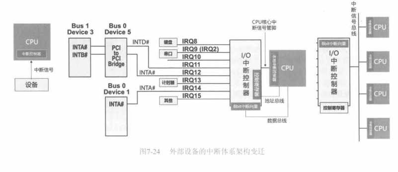
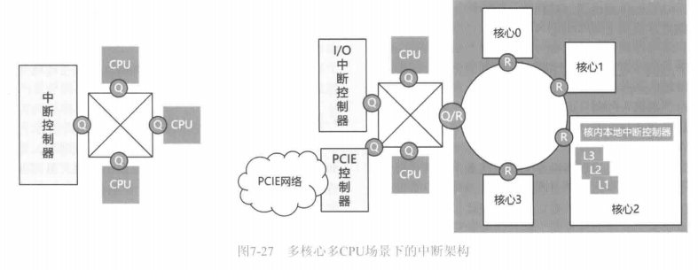

# 0x00. 导读

中断。

# 0x01. 简介

PCI 开始介绍。

# 0x02. 

最原始认知里，可能中断就是下图左侧所示的一根信号线的事情。如果整个计算机只有一个外部设备，那中断的确这么简单。可是，计算机的外部设备太多了，有通过 PCI总线/PCIE网络 接入系统的，也有通过其他方式接入的比如 P/S2、串口等，这些设备控制器也需要发出中断信号，所以一根线恐怕是不够的。

为此，人们搞出一个中断中继器，如下图中间部分所示。该中继器推出多个中断信号线，也就是图中的 IRQ#(Interrupt Request，中断请求)，比如 Intel 早期的 8259A PIC(Programable Interrupt Controller,可编程中断控制器) 有 8 个中断信号线。但是该中继器与 CPU 仍然只通过一根信号线相连。当任何一个设备产生中断信号时，该中继器便也向 CPU 发出一个中断信号。这种多对一映射的方式，如何让 CPU 分清楚到底是哪个设备产生的中断呢?

该中继器在 IRQ# 上接收到中断信号之后，将生成一个编码并存储到中断向量寄存器中，比如收到 IRQ#8 信号则生成 01000010 串码。具体的生成规则可以静态固定，也可以动态配置。 8259A 芯片提供了对应的寄存器，程序可以将对应的配置规则写入到该寄存器来改变 IRQ# 与该串码的映射规则。

如果中断控制器同时收到多个 IRQ# 信号，则根据优先级(优先级策略也是可以通过片内控制寄存器来配置的，所以其称为**可编程中断控制器**)，生成对应的串码。这个串码被称为**中断向量**，存储它的寄存器就是**中断向量寄存器**。正是利用这个串码，CPU 可以区分目前的中断到底是哪个 IRQ# 发来的。

> 在很早期的时候，CPU 并不是采用访存地址来访问外部 I/O 设备的寄存器的，而是采用所谓 I/O地址。这相当于 CPU 除了有内存地址和数据总线、控制总线之外，还增加了一套 I/O 地址和数据总线，后者专门用于访问 I/O 设备的寄存器，而访问内存时才走内存地址/数据总线，一直到后来，内存和外部 I/O 设备寄存器才被统一到同一个地址/数据总线上。早期访问 IO 寄存器也并不是使用 Load/Stor 指令，而是采用 In/Out 指令，这样，CPU 内的电路收到这个指令便知道本次需要访问 I/O 总线而不是内存总线。由于兼容性原因，IO 访问方式被保留了下来，多数设备已经不采用 I/O 地址了。

中断到来后，CPU 内部的中断处理模块临时将正在执行的线程的现场保护好之后，首先要做开门应答的动作，也就是告诉 PIC 收到中断了马上开始处理，具体也是通过发送一个 Interrupt Acknowledge 总线信号给 PIC，后者则设置内部的相关控制寄存器以清除中断触发状态。注意，此时外部 IRQ# 上依然持续地在被对应的 IO 设备按着门铃，只不过此时 PIC 不再当它是新来的门铃。然后 CPU 的中断处理模块会接着再发送一个总线信号给 PIC，要求其将中断向量寄存器中的数值发到总线上。CPU 拿到这个值，到位于内存中的中断向量表中查询对应该值的中断服务程序入口指针，然后跳转到该中断服务程序执行。上述这个过程完全由 CPU 内的中断处理模块处理，不需要运行任何机器指令。

然后，CPU 开始执行中断服务程序的指令。中断服务程序所做的第一件事就是与对应的 I/O 设备进行直接通信，也就是直接访问对应 IO 设备的对应控制寄存器(驱动程序会从 BIOS 生成的设备配置信息表中获取到自己所驱动设备的寄存器或者 IO 地址)，告诉它“别按门铃了俺来啦”。要知道，PIC 之所以发中断给 CPU，是因为其某个 IRQ# 上有设备正在按门铃，源头在 IO 设备端，只有驱动程序能够对其消音。然后，驱动程序继续访问设备的寄存器，以获取该设备发出中断的原因，并做后续处理。如果是 I/O 设备完成了一个 IO，将完成消息写入了主存中的完成队列，那么中断服务程序还需要继续处理一下这个已经完成的 I/O。

如果之前是有多个 IRQ# 同时发生的话，按照优先级，CPU 只处理了其中一个。但是此时， CPU 告诉 PIC“我已经在处理了，请松开按门铃的手”之后，由于其他 IRQ# 的门铃依然被按着，所以在下一个时钟周期，PIC 依然会继续产生中断信号，也就是再次生成新的中断向量，再次中断 CPU，CPU 再次进入中断响应流程。如果上一个中断还没有被处理完之前下一个中断就到来的话，这就产生了中断嵌套，不过这没有什么问题，因为 CPU 被中断之前都会保护之前任务的现场，恢复后继续处理。

人们通常将用于 中继所有 I/O 设备的中断信号的外部中断控制器 称为 **I/O 中断控制器**，而将位于 CPU 内部的处理中断请求的模块称为 **CPU 本地中断控制器**。值得一提的是，不仅外部 IO 设备可以向 CPU 发出中断，多个 CPU 之间也可以互相发起中断，后者被称为 处理器间中断(Inter Processor Interruption，IPI)。IPI 就是通过 CPU 的本地中断控制器发出的。一个 CPU 可以将自己收到的外部中断请求通过 IPI 转手给其他 CPU 处理， IPI 物理上对应着一个在 CPU/核心 互联访存总线上传递的消息，其中包含要跳转到的程序入口地址以及其他参数，其他 CPU/核心 拿到信息之后可以直接执行对应的中断服务程序。理论上，IPI 还可以用来传递其他任何类型的消息。

上图最右侧部分。在一个多 CPU 场景下，I/O 中断控制器应该如何与CPU相连？实际上，当时人们新设了一个单独的总线，叫作 **中断信号总线**，也就是将 IO 中断控制器的中断信号线与所有 CPU 的中断接收线连接在同一个总线上，并设置单独的总线信号以便让 I/O 中断控制器可以选择将中断信号发送给哪个 CPU。这可有点犯难啊!因为任何一个CPU都可以处理任何中断，每个 CPU 都可以根据内存中的中断向量表找到中断服务程序来执行，谁执行都是一样的（有些许不同，如果待处理的数据在某个CPU缓存内，而中断却被发送到其他CPU上，其他CPU恰好要访问这些数据，此时会产生CC同步流量，从而影响性能）。

早期，在这种场景下，中断控制器将中断默认只发送给某个固定 CPU，当然，这会导致该CPU的负载较高。后来做了一些优化，I/O 中断控制器上也做了一些改进，比如可以根据不同的中断向量，均衡地轮流向多个CPU发起中断请求，这种技术叫作 IRQ Balance。IRQ Balance 也可以通过不依赖 I/O PIC 提供的均衡能力，而是利用软件来处理，先接收 IO PIC 的中断，然后根据系统当前的 CPU 负载状况，动态地利用 IPI 中断将收到的外部中断转手给其他 CPU 处理，也可以使用轮询的方式，比如可以在中断控制器上设置一个32位寄存器，该寄存器中的每个位与系统中的一个CPU核心相对应。当收到外部中断时，中断控制器检查该寄存器，发现哪个位是 1，就将该中断导向哪个CPU核心。该CPU核心执行中断服务程序时，中断服务程序会执行额外的一步操作，就是将该寄存器中的下一个位置1，之前为1的位置0。这样，再次发生中断后，该中断将会被导向到下一个CPU核心，周而复始循环，这样就可以实现轮询了。其他的些具体实现方法就不多介绍了。

这个改进版的 I/O 中断控制器内部的功能也更加强大和复杂，也就需要提供更多的控制寄存器以供配置其工作模式，包括 IRQ Balance 策略等。Intel 平台将改进版的 PIC 称为 **APIC(A表示Advanced)，APIC 依然分为 I/O APIC 和 CPU 本地的 LocalAPIC** 。由于采用了单独的 APIC 总线与多个 CPU 互联，这就使得 APIC 可以直接将中断向量主动告诉 CPU，而不是再像之前那样只能通过一根导线的电平信号来中断 CPU，后者再来主动获取中断向量。
再后来，每个 CPU 芯片变成了多核心，每个核心都配有一个 Local APIC，整个系统依然配有单独的个 I/O APIC (一般位于 IO 桥上)，如下图所示。对于一个规模变得更大的系统来讲，单独设立一个中断信号总线就不太合适了。为何不能将中断信号封装成消息，载入核间、CPU片间的访存网络上传递呢？是的，目前的主流多核 CPU 就是这么做的。

