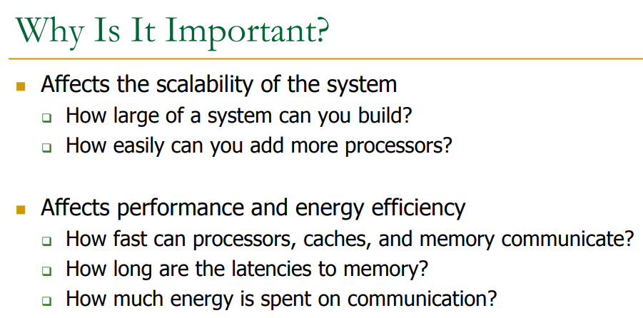

# 0x00. 导读

讲 Interconnection network 三要素：拓扑结构、路由算法、流控。其中拓扑结构又会牵扯到 Switching（交换），讲解两者的关系。

[很多概念解释的蛮清楚](./18_interconnects.pdf)

[结合 NOC 讲](https://www.cs.cmu.edu/afs/cs/academic/class/15418-s21/www/lectures/15_interconnects.pdf)

# 0x01. 简介

互连网络（Interconnection network）用于将节点连接到其他节点，其中节点可以是单个处理器或处理器组，甚至是路由器、交换机。

intra=内部, inter=间。

芯片内部、核之间、系统之间。你要的互联是哪个级别的？要经常问自己这个问题，以及当前的互联技术/架构的三要素分别是什么，才不会陷入迷雾。

**The topology determines the roadmap, the routing method steers(驾驶，引导) the car, and the flow control controls the traffic lights, determining when a car can advance over the next stretch of road (channels)(下一段道路上前进) or when it must pull off into a parking lot (buffer) to allow other cars to pass.**

对于总线，当前在 linux 中真的管理了很多类型。
- 低速的：就有 i2c, i3c, uart, SPI, QSPI 等
- 中高速的：pci/pcie, usb 等
- 工厂用的：CAN , Modbus 等
- 片上的：AMBA（AHB, AXI, APB）等，或者 FSB, QPI, DMI 等。

不同的类型，琳琅满目，低速的相对比较简单，中高速的相对就复杂了，比如对于 pci ，可以养活一个产业。2023 年还引入新的 cdx 总线。

# 0x02. 三要素

从 Topology 开始。

## 2.1 拓扑结构

[有八种基本拓扑种类](https://en.wikipedia.org/wiki/Network_topology#Classification)：point-to-point, bus, star, ring or circular, mesh, tree, hybrid, or daisy chain.（点对点、总线、星形、环形或圆形、网状、树形、混合或菊花链）

下面说的 bus、Point-to-Point、Crossbar 等就只是列举出一些 拓扑结构 实例，并没有进行归类或者统计，就好比你问我食物，我回答你汉堡、饺子、米饭、西瓜这些。这些回答是可以分类的，例如中餐西餐，水果，南方，北方等。

衡量 拓扑结构 的一些指标：
- Cost
- Latency
- Contention, 争用（Contention）是一种随机发生的访问。
- 其它：
  - 能耗
  - 带宽
  - 整体系统系能

### 2.1.1 Bus

All nodes connected to a single link

优点：
- 简单
- 当节点数较少的时候，性价比很高
- 容易实现一致性(snooping and serialization)

缺点：
- 节点数较多的时候，无法扩展
- High contention -> fast saturation(饱和)

### 2.1.2 Point-to-Point

Every node connected to every other with direct/isolated links

优点：
- 最低/少的 Contention
- 最低的延迟
- 最理想的模型

缺点：
- 开销最大，n 个节点需要 n*n 个连接
- 不可扩展
- How to lay out on chip?

### 2.1.3 Crossbar

- Every node connected to every other with a shared link for each destination
- Enables concurrent transfers to non-conflicting destinations
- Could be cost-effective for small number of nodes

用于 core-to-cache-bank

优点：
- 低延迟、高吞吐

缺点：
- 开销大
- 不可扩展
- 节点数多了之后难易部署

### 2.1.4 Ring

Each node connected to exactly two other nodes. Nodes form a continuous pathway such that packets can reach any node.

用在 Intel Haswell, Intel Larrabee, IBM Cell 等商业系统

优点：
- 开销小

缺点：
- 延迟高
- 难扩展

还可以细分为：Unidirectional Ring（单向环）、 Bidirectional Rings（双向环）、Hierarchical Rings（多层环）

### 2.1.5 Mesh

Each node connected to 4 neighbors (N, E, S, W)

用于 on-chip network

优点：
- 开销小
- 延迟低

缺点：
- 暂无，不是没有

### 2.1.6 HyperCude

**HyperCube 超立方是 Intel QPI 网络（多个 CPU 芯片间的互联）所使用的拓扑。**

## 2.2 继续 topology

[拓扑有两种主要类型](https://en.wikipedia.org/wiki/Multistage_interconnection_networks#Background)：
- 静态
  - 静态互连网络是硬连线的，无法更改其配置。常规静态互连主要用于由松散耦合节点组成的小型网络。规则结构意味着节点以特定形状排列，并且该形状在整个网络中保持不变。
- 动态
  - 在动态互连网络中，节点通过一系列简单的交换元件（switching elements）互连。然后可以通过使用路由算法来改变这种互连，从而可以改变从一个节点到其他节点的路径。动态互连可分为：
    - Single stage Interconnect Network, 单级互连网络
    - Multistage interconnect Network, 多级互连网络
    - Crossbar switch connections, 纵横开关连接

### 2.2.1 Crossbar Switch Connections

随着输出数量的增加，开关数量增加 n 倍。对于大型网络来说这将是一个问题。该方案的替代方案是分阶段切换（staged switching）。

### 2.2.2 Single Stage Interconnect Network

在单级互连网络中，输入节点通过单级开关连接到输出。

### 2.2.3 Multistage Interconnect Network

多级互连网络由多个单级交换机级联而成。然后，交换机可以使用自己的路由算法或由集中式路由器控制，形成完全互连的网络。

多级互连网络可分为三种类型： 
- Non-blocking, 非阻塞网络可以将任何空闲输入连接到任何空闲输出，无论网络上已经建立的连接如何。 
- Rearrangeable non-blocking, 这种类型的网络可以通过重新排列其现有连接来在输入和输出之间建立所有可能的连接。
- Blocking, 这种类型的网络无法实现输入和输出之间所有可能的连接。这是因为一个空闲输入与另一空闲输出之间的连接被网络中的现有连接阻止。

实现无阻塞网络所需的交换元件（switching elements）数量最多，其次是可重排无阻塞。阻塞网络使用最少的交换元件。

多级互连网络举例：

Omega network  

Clos network  

Benes network  

## 2.3 路由算法

路由算法（routing algorithm），即决定数据包在网络拓扑中从起点到终点路径的算法。路由算法的目标是尽可能地在网络拓扑中均匀分配网络流量，以避免出现热点（hotspot）并最小化竞争（contention），从而降低网络延迟并提高吞吐量。

当两个 packets 想要同时使用同一个线路，其中一个包被支开去到其它线路。

三种类型的路由算法：
- Deterministic, 确定性路由: always chooses the same path for a communicating source-destination pair. 所有从节点 A 向节点 B 移动的数据包都通过相同的路径。
- Oblivious, 无关路由: chooses different paths, without considering network state. 消息从 A 到 B 可以有多条不同的路径选择 ，但选择路径时不考虑网络拥塞，随便走。
- Adaptive, 自适应路由: can choose different paths, adapting to the state of the network. 一个数据包从节点 A 移动到节点 B 的路径取决于当前的网络流量（traffic）情况。

注意避免死锁  

## 2.4 Buffering and flow control

# 0x03. Switching techniques

在大型网络（这个网络可大可小，核间通信也算）中，从发送方到接收方可能存在多条路径。交换技术（Switching techniques）将决定数据传输的最佳路径。交换技术用于连接系统以进行一对一的通信。

1. 电路交换（Circuit Switching）是一种在发送方和接收方之间建立专用路径的交换技术。一旦建立连接，专用路径将保持存在，直到连接终止。在电路交换技术的情况下，当任何用户想要发送数据时，请求信号被发送到接收器，然后接收器发回确认以确保专用路径的可用性。收到确认后，专用路径传输数据。电路交换可以使用以下两种技术之一：
    1. Space Division Switches, 空分开关：
        - Crossbar Switch  纵横开关
        - Multistage Switch  多级开关
    2. Time Division Switches
2. 消息交换（Message Switching），其中消息作为一个完整的单元进行传输，并通过存储和转发的中间节点进行路由。
    
3. 数据包交换（Packet Switching），一个包可以被分成更小的块，并且它们被单独发送（很可能是通过不同的路径）。
    
    数据包交换有两种方法：
    - Datagram Packet switching, 数据报包交换
    - Virtual Circuit Switching, 虚拟电路交换

## 3.1 Switching vs Topology

- Circuit/packet switching choice independent（独立，不依赖） of topology
- It is a higher-level protocol on how a message gets sent to a destination

虽然 Switching 和 Topology 是不同的概念，它们之间是紧密相关的。**网络的拓扑决定了数据流的路径和网络的物理结构，而交换方式决定了数据如何在这些路径上传输。**
1. 拓扑影响交换：

     - 例如，在 星形拓扑 中，所有的数据传输都必须通过中央交换节点（如交换机）。因此，采用 分组交换（Packet Switching）可以让多个设备共享该节点的带宽，而不会干扰到其他通信。
     - 在 网状拓扑 中，由于每个节点都与多个其他节点直接连接，采用 分组交换（Packet Switching） 可以让数据在多个路径上并行传输，从而提高网络的可靠性和带宽。
  
2. 交换方式影响拓扑设计：

   - 分组交换 更适合于高度分布式和动态的拓扑，比如互联网，其网络拓扑通常是一个大规模的网状拓扑，允许多个路径并行传输数据。
   - 电路交换 更适合于需要固定路径的拓扑，常见于电信网络中，通常是 树形拓扑 或 环形拓扑。

总结起来就是：
- Switching 侧重于网络中数据传输的方式，决定了数据如何通过交换设备在不同节点之间传输。
- Topology 侧重于网络中节点之间的连接方式，影响了数据传输的路径和网络的组织结构。

在实际应用中，Switching 和 Topology 是互相依赖的，一个良好的网络设计会同时考虑交换方式和拓扑结构，以确保高效、可靠的数据传输。

# 0x0. 有趣的图

  
