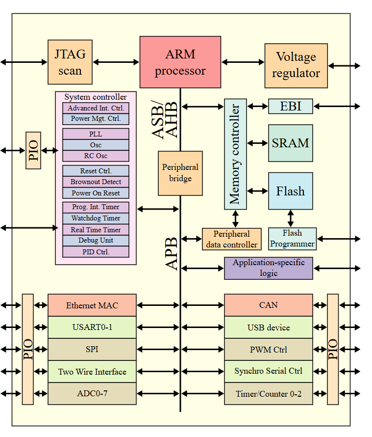
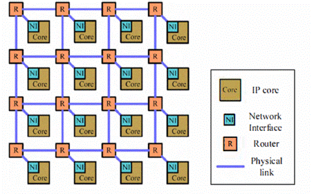
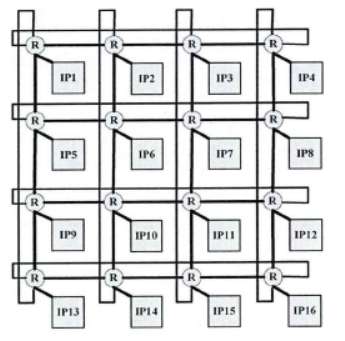

# 0x00. 导读

[SoC 101, Everything you wanted to know about a computer but were afraid to ask](https://www.youtube.com/watch?v=_E2PS9jxkrA&list=PLZU5hLL_713ygweO3b_9KiZUJuEI7I5yK&ab_channel=AdiTeman)

# 0x01. 简介

[wiki/System_on_a_chip](https://en.wikipedia.org/wiki/System_on_a_chip): 
> 片上系统（ SoC ）是集成了计算机系统的大部分组件的集成电路。这些组件通常包括片上中央处理单元(CPU)、内存接口、输入/输出设备和接口以及辅助存储接口，通常还包括图形处理单元(GPU) 等其他组件 – 所有这些都位于一个单一基板或微芯片（microchip）。

一般来说，SoC 分为三种类型：

- 围绕微控制器（microcontroller）构建的 SoC，结构见下图
- 围绕微处理器（microprocessor）构建的 SoC，常见于手机中；
- 专门针对不属于上述两类的特定应用而设计的专用集成电路SoC。

SoC 由硬件功能单元组成，包括运行软件代码的微处理器，以及在这些功能模块之间进行连接、控制、指挥和接口的通信子系统。SoC 包含许多执行单元，这些单元必须经常来回发送数据和指令。**因此，所有 SoC 都需要通信子系统**。最初，使用数据总线（data bus）架构（比较常见的是 ARM 的 Advanced Microcontroller Bus Architecture, AMBA），但最近基于片上网络(NoC)的设计已日益受到关注。[深入理解AMBA总线（零）绪论](https://zhuanlan.zhihu.com/p/623558837)

在 2010 年代末，出现了一种 SoC 以 network-like topology 而不是 bus-based protocols 来实现通信子系统的趋势。 SoC 上处理器内核增多的趋势已导致片上通信效率成为决定整体系统性能和成本的关键因素之一。这导致了 router-based packet switching 的 片上网络（NoC）的出现，以克服基于总线的网络的瓶颈。

[wiki/Network_on_a_chip](https://en.wikipedia.org/wiki/Network_on_a_chip):
> 片上网络（ NoC ）是集成电路上基于网络的通信子系统，最常见的是用于在片上系统（ SoC ）中的模块之间。 The network on chip is a router-based packet switching network between SoC modules.
> NoC 技术将计算机网络的理论和方法应用到片上通信中，相对于传统的总线（bus）和交叉开关（crossbar）通信架构带来了显着的改进。片上网络有多种网络拓扑，其中许多截至 2018 年仍处于实验阶段。

**NoC 技术的诞生就是为了能够让 IP 核之间的通信能够实现高效、高吞吐量、低功耗的目的**。因此 NoC 技术主要研究对象就是各种互连方法、互连结构，以及 IP 核互联网络中路由算法。在 NoC 架构中，每一个模块都连接到片上路由器，而模块传输的数据则是形成了一个个数据包，通过路由器去送达数据包的目标模块。（NoC 是多核系统的最佳互联机制，NoC 领域最经典的教材 [Principles and Practices of Interconnection Networks.pdf](https://github.com/timewh/NoC/blob/main/Principles%20and%20Practices%20of%20Interconnection%20Networks.pdf)。）

在NoC中可以实现更多有趣的特色技术，比如 QoS (Quality of Service)，也就是决定先转发哪个请求，后转发哪个，每个节点 Crossbar 的接收和发送端口上可以增加队列缓冲，以实现 QoS 优先级控制；再如实现更先进的流量控制策略，更加充分地利用队列；利用更先进的路由算法和拥塞判断算法，算出从哪条路走到目标节点更加顺畅。

与 bus 和 Crossbar 相比，NoC 的主要优势可以体现在横向和纵向两方面。横向的优势是指当片上使用互联的模块数量增加时，NoC 的复杂度并不会上升很多。这也是符合直觉的，因为 NoC 使用了类似计算机网络的架构，因此可以更好地支持多个互联模块，同时可以轻松地加入更多互联模块——这和我们把一台新的电脑接入互联网而几乎不会对互联网造成影响一样。与 NoC 相比， bus 和 Crossbar 在互联模块数量上升时就显得有些力不从心，尤其是 Crossbar 的互联复杂性与互联模块的数量呈指数关系，因此一旦加入更多模组其后端物理设计就会要完全重做。当然，NoC 为了实现可扩展性，也需要付出路由器逻辑之类的额外开销。因此，在互联模块数量较少时， bus 和 Crossbar 因为设计简单而更适合；而一旦片上互联模块数量上升时（如大于30个模块），NoC 的优势就得到体现，这时候路由器逻辑和网络协议的开销就可以忽略不计，因此在互联模块数量较多时NoC可以实现更高的性能，同时面积却更小。

NoC 纵向的优势则来自于其物理层、传输层和接口是分开的。拿传统的总线为例，ARM 的 AXI 接口在不同的版本定义了不同的信号，因此在使用不同版本的 AXI 时候，一方面模块的接口逻辑要重写，另一方面 AXI 矩阵的逻辑、物理实现和接口也要重写，因此造成了 IP 复用和向后兼容上的麻烦。而 NoC 中，传输层、物理层和接口是分开的，因此用户可以在传输层方便地自定义传输规则，而无需修改模块接口，而另一方面传输层的更改对于物理层互联的影响也不大，因此不用担心修改了传输层之后对于 NoC 的时钟频率造成显著的影响。

简单粗暴的理解：片上网络就是在数字电路中一个简化版的 “网络”。

异构计算（Heterogeneous computing），又译异质运算，主要是指使用不同类型指令集和系统架构的计算单元组成系统的计算方式。常见的计算单元类别包括CPU、GPU等协处理器、DSP、专用集成电路、FPGA等。  

异构计算的主要目标是通过不同类型的计算单元的组合使用，优化计算任务的执行效率，提高系统的性能和能效比。例如，CPU 擅长处理复杂的控制流程和逻辑运算，而 GPU 则在执行并行计算任务时表现出更高的效率。通过在同一计算任务中将适合的计算工作负载分配给最适合它们的计算单元，异构计算能够显著提高计算效率和处理速度。

在摩尔定律接近实效的今天，为了能实现处理器性能的提升，最可行的方法就是针对每一种计算去设计专用的计算模块，从而实现性能的提升，这也就是异构计算的思路。异构计算的芯片架构中，多个专用计算模块会通过 片上互联 去访问存储器，同时也会通过 片上互联 去互相通信，因此 片上互联 在异构计算时代正在扮演越来越重要的角色。而在使用异构计算思想设计的 SoC 中，这样的专用模块数量正在上升到数十个，因此 NoC 成了实现片上互联的最佳实现方式。而随着未来异构计算范式得到更多认可和应用，我们可以预见片上互联会需要连接越来越多数量的模块，因此 NoC 设计的重要性也将会提升。

# 0x02. NoC

回顾 [InterconnectNetwork.md](./InterconnectNetwork.md) 中的知识，Network On Chip 也是一种 Interconnect Network ，那么自然也就需要确认 topology 结构、路由算法、流控等。（一般路由算法和流控我没打算细了解，知道是啥意思就行，水太深。而拓扑结构是最容易理解的，所以说的多点）

回顾一下经典比喻：
> The topology determines the roadmap, the routing method steers(驾驶，引导) the car, and the flow control controls the traffic lights, determining when a car can advance over the next stretch of road (channels)(下一段道路上前进) or when it must pull off into a parking lot (buffer) to allow other cars to pass.

NoC 常见的拓扑结构包括规则拓扑和不规则拓扑两种。规则拓扑主要包括 2D Mesh、2D Torus、3D Mesh、Octagon、Cluster Mesh、Spidergon、超立方、蜂窝式、树形和蝶形等拓扑结构。不规则拓扑包括专用网络、分层网络、网络总线混合拓扑以及由规则拓扑组合而成的拓扑结构。

下图所示为一个 4×4 的 2D Mesh 结构。  

将 2D Mesh 结构的每行首尾节点连接起来，每列的首位节点也连接起来，便是 2D Torus 结构，该结构每个节点在几何上都是等价的，缩短了节点间的平均距离，减小了网络直径，同时该结构可能因为过长的环形链路而产生额外的延迟。  

3D Mesh 为三维的网格结构，将多个 2D Mesh 叠加并对应节点连接起来，这样做进一步降低了网络直径和平均距离，但物理实现难度比较大。  
