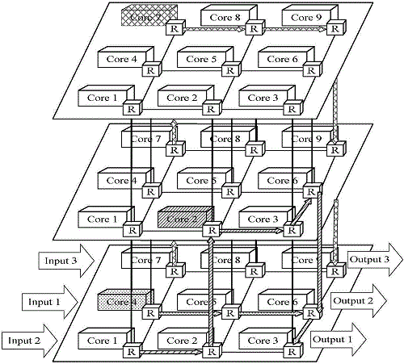

# 0x00. 导读

# 0x01. 简介

[wiki/System_on_a_chip](https://en.wikipedia.org/wiki/System_on_a_chip): 
> 片上系统（ SoC ）是集成了计算机系统的大部分组件的集成电路。这些组件通常包括片上中央处理单元(CPU)、内存接口、输入/输出设备和接口以及辅助存储接口，通常还包括图形处理单元(GPU) 等其他组件 – 所有这些都位于一个单一基板或微芯片（microchip）。

一般来说，SoC 分为三种类型：

- 围绕微控制器（microcontroller）构建的 SoC，结构见下图
- 围绕微处理器（microprocessor）构建的 SoC，常见于手机中；
- 专门针对不属于上述两类的特定应用而设计的专用集成电路SoC。

SoC 由硬件功能单元组成，包括运行软件代码的微处理器，以及在这些功能模块之间进行连接、控制、指挥和接口的通信子系统。SoC 包含许多执行单元，这些单元必须经常来回发送数据和指令。因此，所有 SoC 都需要通信子系统。最初，使用数据总线（data bus）架构（比较常见的是 ARM 的 Advanced Microcontroller Bus Architecture, AMBA），但最近基于片上网络(NoC)的设计已日益受到关注。

在 2010 年代末，出现了一种 SoC 以 network-like topology 而不是 bus-based protocols 来实现通信子系统的趋势。 SoC 上处理器内核增多的趋势已导致片上通信效率成为决定整体系统性能和成本的关键因素之一。这导致了 router-based packet switching 的 片上网络（NoC）的出现，以克服基于总线的网络的瓶颈。

[wiki/Network_on_a_chip](https://en.wikipedia.org/wiki/Network_on_a_chip):
> 片上网络（ NoC ）是集成电路上基于网络的通信子系统，最常见的是用于在片上系统（ SoC ）中的模块之间。 The network on chip is a router-based packet switching network between SoC modules.
> NoC 技术将计算机网络的理论和方法应用到片上通信中，相对于传统的总线（bus）和交叉开关（crossbar）通信架构带来了显着的改进。片上网络有多种网络拓扑，其中许多截至 2018 年仍处于实验阶段。

**NoC 技术的诞生就是为了能够让 IP 核之间的通信能够实现高效、高吞吐量、低功耗的目的。**因此 NoC 技术主要研究对象就是各种互连方法、互连结构，以及 IP 核互联网络中路由算法。NoC 技术目前还处于学术研究阶段，大部分学术论文里都是仿真结果，工业界也有应用实例，但是比较少。

简单粗暴的理解：片上网络就是在数字电路中一个简化版的 “网络”。

# 0x02. NoC

回顾 [InterconnectNetwork.md](./InterconnectNetwork.md) 中的知识，Network On Chip 也是一种 Interconnect Network ，那么自然也就需要确认 topology 结构、路由算法、流控等。（一般路由算法和流控我没打算细了解，知道是啥意思就行，水太深。而拓扑结构是最容易理解的，所以说的多点）

回顾一下经典比喻：
> The topology determines the roadmap, the routing method steers(驾驶，引导) the car, and the flow control controls the traffic lights, determining when a car can advance over the next stretch of road (channels)(下一段道路上前进) or when it must pull off into a parking lot (buffer) to allow other cars to pass.

NoC 常见的拓扑结构包括规则拓扑和不规则拓扑两种。规则拓扑主要包括 2D Mesh、2D Torus、3D Mesh、Octagon、Cluster Mesh、Spidergon、超立方、蜂窝式、树形和蝶形等拓扑结构。不规则拓扑包括专用网络、分层网络、网络总线混合拓扑以及由规则拓扑组合而成的拓扑结构。

下图所示为一个 4×4 的 2D Mesh 结构。  

将 2D Mesh 结构的每行首尾节点连接起来，每列的首位节点也连接起来，便是 2D Torus 结构，该结构每个节点在几何上都是等价的，缩短了节点间的平均距离，减小了网络直径，同时该结构可能因为过长的环形链路而产生额外的延迟。  

3D Mesh 为三维的网格结构，将多个 2D Mesh 叠加并对应节点连接起来，这样做进一步降低了网络直径和平均距离，但物理实现难度比较大。  
