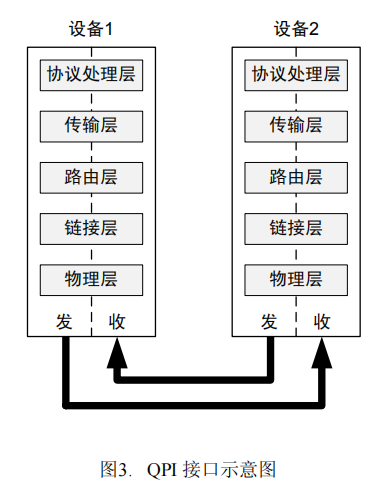

# 0x00. 导读

[Ch 3: Bus, QPI, PCIe](https://www.youtube.com/watch?v=a84Dwz0AHVM&ab_channel=NADIAHHUSSEINIBINTIZAINOLABIDIN%2FENG)

# 0x01. 简介

QPI 是用来片间互联的，点对点的。不要和 NoC 的 ring/mesh 混淆了，两个层级的不同东西。UPI 就是个升级版。


# 0x02. 历史故事

在较旧的共享总线系统中，如下图所示，所有流量都通过单个共享双向总线（也称为 **前端总线 (FSB)**）发送。这些总线（Intel Xeon 处理器为 64 位，Intel Itanium 处理器为 128 位）一次可接收多个数据字节。随着总线频率的增加而遇到了电气限制，为了解决这个问题，英特尔通过一系列技术改进改进了总线。

最初在 20 世纪 90 年代末，数据以 2 倍总线时钟输入，也称为 **double-pumped**。后来的 Intel Xeon 处理器 FSB 是 **quad-pumped**，以 4 倍总线时钟输入数据。如今 FSB 上的最高理论数据速率为 1.6 GT/s。


为了进一步增加基于前端总线的平台的带宽，单共享总线方法演变为 **双独立总线 (DIB)**，如下图所示。DIB 设计实质上使可用带宽翻倍。但是，所有监听流量都必须在两条总线上广播，如果不加以控制，将减少有效带宽。为了最大限度地减少此问题，在芯片组中采用了监听过滤器来缓存监听信息，从而大大减少了带宽负载。


随着**专用高速互连 (DHSI)** 的引入，DIB 方法得到了进一步的扩展，如下图所示。基于 DHSI 的平台使用四个 FSB，平台中的每个处理器各一个。同样，还采用了监听过滤器来实现带宽扩展。


随着基于下一代 45-nm Hi-k Intel Core 微架构的处理器的生产，Intel Xeon 处理器使用 Intel QuickPath Interconnects 的分布式共享内存架构。此配置如下图所示。凭借基于差分信号的窄单向链路，Intel QuickPath Interconnect 能够实现更高的信号传输速率，从而提供满足未来处理器需求所需的处理器互连带宽。


## 2.1 IOH ICH PCI

第一代 Intel Core i7 （Nehalem, 45nm）抛弃了传统的北桥，并且将 memory controller 集成到了 CPU 内部。当时，Intel 没法把 PCI Express controller 也集成进去，只能将它放在一个单独的 chip, 称为 I/O Hub (IOH). 北桥虽然没有了，南桥 (I/O controller hub, ICH) 还是保留了。并且使用 QPI 代替 FSB 来连接 CPU 与 IOH.


Westmere 将 IOH 移入 processor package 使其作为 second die。这次，Intel 将之前的位于片上的 memory controller 移动到 IOH 内。南桥被 PCH 取代， QPI 仍然用来连接 CPU package 内的 dies。

Sandy Bridge 淘汰了 second die, 将 GPU、PCI Express Controller、memory controller 移入 CPU 。 

[Sandy_Bridge](https://en.wikipedia.org/wiki/Sandy_Bridge#CPU)  
> 256-bit/cycle ring bus interconnect between cores, graphics, cache and System Agent Domain
> 
> Integration of the GMCH (integrated graphics and memory controller) and processor into a single die inside the processor package. In contrast, Sandy Bridge's predecessor, Clarkdale, has two separate dies (one for GMCH, one for processor) within the processor package. This tighter integration reduces memory latency even more.
>
> Integrated PCIe Controller

Uncore 里集成了过去 x86 UMA 架构时代北桥芯片的基本功能。在 Nehalem 时代，内存控制器被集成到 CPU 里，叫做 iMC(Integrated Memory Controller)。 而 PCIe Root Complex 还做为独立部件在 IO Hub 芯片里。到了 Sandy Bridge 时代，PCIe Root Complex 也被集成到了 CPU 里。 现今的 Uncore 部分，除了 iMC，PCIe Root Complex，还有 QPI(QuickPath Interconnect) 控制器， L3缓存，CBox(负责缓存一致性)，及其它外设控制器。

# 0x03. QPI

Quick Path Interconnection，QPI 是 Intel 的高端 CPU 采用的 **片间互联网络（或者叫片外访存网络, off-chip Interconnect）** 的名称。Intel 在发布 Sandy Bridge-EP 核心（Romley 平台）后，也顺势公布首代 QPI 的改进版 QPI 1.1 版本。Intel 于 2017 年发布的 SkyLake-SP Xeon 中，用 UPI（UltraPath Interconnect）取代 QPI。

尽管多数时候被称作 总线，但是 QPI 是一种点对点互联结构。它被设计成与 AMD 自 2003 年使用的 超传输（HyperTransport）总线 竞争。

Intel 在 2008 年开始用 QPI 取代以往用于至强、安腾处理器的前端总线（FSB）。初期，Intel 给这种连接架构的名称是 公共系统界面（Common System Interface ，CSI），是一种包传输的串行式高速点对点连接技术。

[wiki/Intel_QuickPath_Interconnect](https://en.wikipedia.org/wiki/Intel_QuickPath_Interconnect)

> The QPI is an element of a system architecture that Intel calls the QuickPath architecture that implements what Intel calls QuickPath technology.
>
> QuickPath 架构假定处理器具有集成内存控制器，并启用非均匀内存访问(NUMA) 架构。

QPI 是 Intel Nehalem 微架构中的 uncore 组件。  


```
As a rule of thumb(根据经验) the buses used by the processors are:

- To other CPUs - QPI
- To IOH - QPI (if IOH present)
- To the uncore - QPI
- To DIMMs - Pins as the DRAM technology (DDR3, DDR4, ...) support mandates. For Xeon v2+ Intel uses a fast SMI(2) link to connect to an off-core memory controller (Intel C102/104) that handle the DIMMS and channels based on two configurations.
- To PCH - DMI
- To devices - PCIe, SATAexpress, I2C, and so on.
```

## 3.1 带宽


每个 QPI 包含两个 point-to-point 的数据链路，每个数据链路包含 20 个通道（lane），每个方向一个（全双工），每个方向都有一个单独的时钟对（clock pair）（发送 (TX) 和接收方 (RX) 的时钟信号），总共 42 个信号。每个信号都是差分对（ differential pair），因此引脚总数为 84。20 个数据通道被分为四个“象限（quadrants）”，每个象限有 5 个通道。传输的基本单位是 80 位 flit(In computer networking, a flit (flow control unit or flow control digit) is a link-level atomic piece that forms a network packet or stream) ，其中 8 位用于错误检测，8 位用于“链路层标头（link-layer header）”，64 位用于数据。一个 80 位 flit 在两个时钟周期内传输（四次 20 位传输，每个时钟周期两次）。QPI 带宽是通过计算每个方向上每两个时钟周期传输 64 位（8 字节）数据来公布的。

Intel 通过计算每个 80 位 flit 中的 64 位数据有效负载来描述数据吞吐量（以 GB/s 为单位）。然而，英特尔随后将结果加倍，因为单向发送和接收链路对可以同时处于活动状态。因此，英特尔将具有 3.2 GHz 时钟的 20 通道 QPI 链路对（发送和接收）描述为具有 25.6 GB/s(3.2 * 8) 的数据速率。 2.4 GHz 时钟速率可产生 19.2(2.4 * 8) GB/s 的数据速率。更一般地说，根据此定义，双链路 20 通道 QPI 每个时钟周期传输 8 个字节，每个方向 4 个字节。

```
3.2 GHz
× 2 bits/Hz （DDR）
× 20 （QPI连接宽度）
× (64/80) （数据比特数/数据包比特数）
× 2 （各向发送和接收作业同步进行）
÷ 8 （bits -> Byte）
= 25.6 GB/s
```

## 3.2 QPI 架构分层

QPI 协议层制订了一系列规则，用于保证分布式共享存储系统的缓存同一性。常见的 QPI 缓存同一性协议分为 Home Snoop（宿主侦听）和 Source Snoop（数据源侦听）两种。



从下到上是：物理层，链路层，路由层，传输层，协议层；(基本上认为是四层协议)

- 物理层：负责收发 0,1；传输的单位是20bit，也被称为是 physical unit 或者phit
    - 4.8GT/s的话，带宽是：4.8GT/s \* 16bit / 8 * 2 direction = 19.2GB/s
    - 可以工作在 full、half、quarter 宽度，full 宽度的时候 2 个 phit 组成为1个flit

- 链路层：负责可靠传输和流控，传输的单位是 80bit，也被称为是 flow control unit 或 flit
    - 支持14个消息类型，但是又一部分没使用；实际上可能只使用6个，如下图；
    - 支持3个虚拟网络，最大就是14*3=42个虚拟通道；
    - 流速控制使用令牌；发送者的令牌减少，接收者的令牌增加，每转发完成返回令牌；
    - 每80bit需要8wbit进行crc校验；

- 路由层：指导包的传输
    - 基本是FW写路由表实现；

- 传输层：负责可靠端到端传输，为可靠性预留；

- 协议层：各种 flit 包的传输
    - 实现一致性
    - 基于 MESI(messy) 协议，增加一个forward状态成MESIF协议；
    - 核心上是 CA(Cache Agent), 内存侧是 HA(Home Agent)
    - 请求行为分为两种倾向：source snoop和home snoop，简单来讲就是少核心的时候使用 source snoop ,多核心的时候使用 home snoop；
        - source snoop 是 two hop snoop，二跳探听，在第二次的时候收到数据；
        - home snoop 是 three hop snoop，三跳探听，在第三次的时候收到数据；


QPI 链路层将物理层虚拟成三个虚拟网络(Virtual Network)通道: VN0、VN1 和 VNA。虚拟通道的本质就是多个 FIFO 缓冲队列，按照不同的优先级策略，轮流地从这三个通道中取出消息，然后从同一个物理接口中发出去，但是每个通道队列中的消息只能按照 FIFO 顺序发送。VN 其实就是 QPI 对虚拟通道的另外一个包装名词而已。VN0、VN1 和 VNA 这三个虚拟通道每个都具有相互独立的缓冲队列，为了区别对待，有些消息类别只能进入 VN0，有些只能进入 VN1，而 VNA 则可以承载任何类型的消息。由于不同消息类别必须走各自的 VN，也就是放入各自对应的队列，所以即使被映射到 VN0 的消息过多，它们也不能走 VN1，VN1 此时如果有闲置资源，也不能被充分利用。VNA 就是为了应对这种场景的，用来放置临时排不开的那些消息。在系统设计时，可以根据不同场景选择使用 VNA，这样流量就可以均摊到所有缓存/队列了。

所有消息共享同一个通道的后果就是一旦某个消息受到阻寒而迟迟得不到发送，那么该消息会堵住该通道队列后面排着队的所有消息，所以实际中如果选用了 VNA，则需要同时启用 VN0 和 VN1 中的至少一个。

链路层将上层划分的 6 大消息类别按照一定的优先级和仲裁策略放置到对应的队列中，从这三个虚拟网络选择一个发出去，这样就相当于有 6x3=18 个虚拟路径/通道。每个数据帧都带有对应的消息类别标识和虚拟网络标识。消息经过虚拟通道到虚拟网络最后到物理层。


[MESI 交互网站](https://www.scss.tcd.ie/Jeremy.Jones/VivioJS/caches/MESIHelp.htm)

## 3.3 CHA


CHA 的出现是为了协调通信，解决缓存一致性的问题，也称为代理 （agent）。

Cache Agent 主要实现 CPU Cache 的管理，并且发起对内存的访问功能，并且响应其他请求的侦听请求。Home Agent 主要实现多个CA对同一地址的串行化访问和对不同地址的并行化访问。
  
Cache Agent（CA），连接到 L3 Cache 端，cache misses 的时候为 cache line 数据制作请求发送给 HA


内存中的一份数据在处理器的多个 core 的 cache line 中存在的时候，这些 core 中的每个 core 称为一个 client。

为了实现缓存一致性，一个 client 对 cache 的操作必须按照顺序传播到所有其他的 client。

实现缓存一致性的两种方法：
- Snooping, 侦听方法；可以理解成广播方法，一个 client 的请求和响应必须广播到所有的 client 上，缺点是 client 多的时候，要求的总线带宽比较大，优点是更快，更加简单。目前广泛是用在核心少的处理器的缓存一致性机制的实现里面。
- Directories Based，基于目录的方法；可以理解成基于请求的方法，需要维护一致性的 cache 被放在一个 dir 中，client 发出请求，被允许之后，dir 更新，其他地方的都置无效。

# 0x04. UPI

Intel UPI is a coherent interconnect for scalable systems containing multiple processors in a single shared address space. Intel Xeon processors that support Intel UPI, provide either **two or three(见下图的红色箭头)** Intel UPI links for connecting to other Intel Xeon processors and do so using a high-speed, low-latency path to the other CPU sockets.


# 0x0


我们看一下这个示意图中到底有哪些模块：
- 负责整个CPU计算的Core
- CHA（Cache Home Agent）,负责缓存一致性
- LLC （Last level Cache） 最后一级缓存，也就是L3
- SF（Snoop filter） 嗅探过滤一些多余的缓存更改消息
- UPI（Ultra Path Interconnect）负责**CPU与CPU**之间的互联
- PCIe/DMI  **CPU连接外设**的主要接口
- MC/DDR4 （Memory control） 内存控制单元与内存
- MESH总线（黄色的那些连线），**CPU内部各个单元**的连接总线

把CPU里面的主要单元理清楚之后。我们简单分个类
- 第一类：负责计算的Core
- 第二类：负责链接的总线，CPU内部的是mesh, CPU之间的是UPI，CPU与外设的链接是PCIe，还包含CPU与南桥芯片（PCH）链接的DMI ,CPU与内存链接的是MC。
- 第三类：缓存相关的模块，SF，CHA和LLC