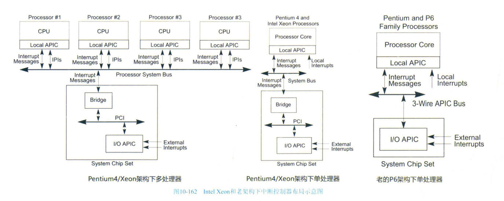
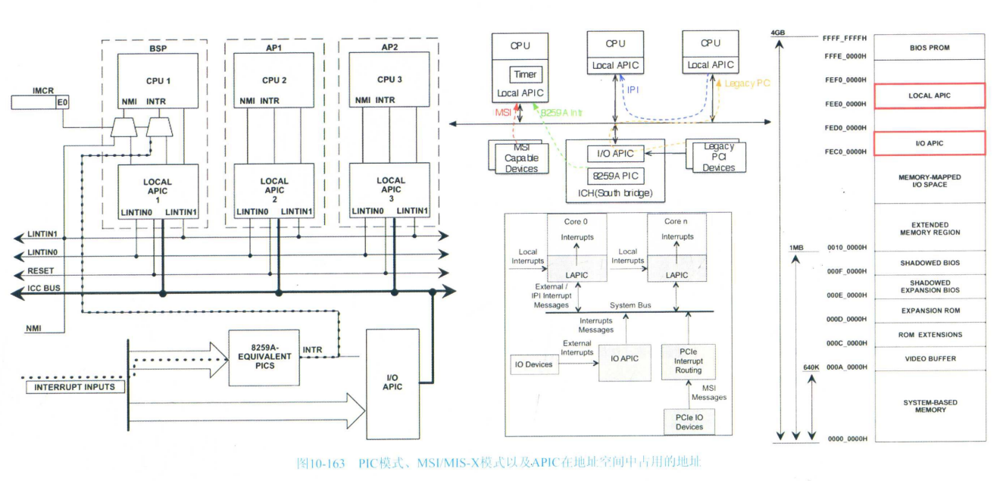
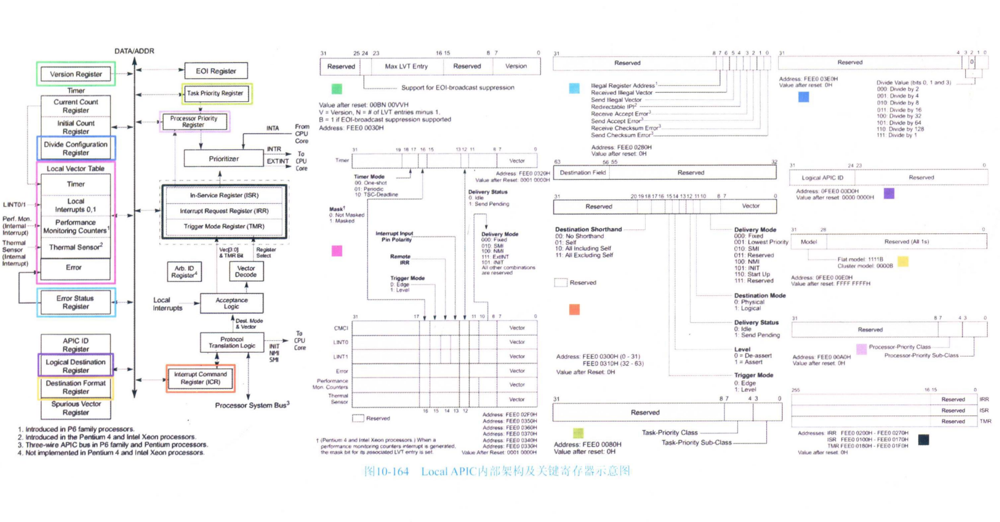
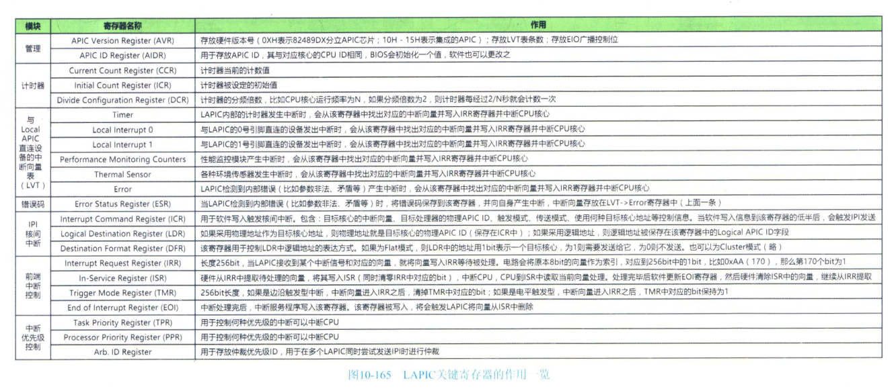
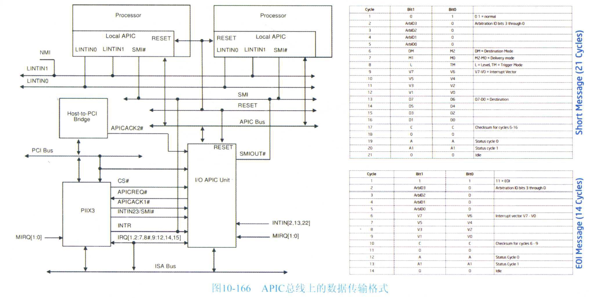

# 0x00. 导读

讲中断、时间中断。

# 0x01. 简介

# 0x02. 

中断贯穿着系统运行的始终，比如时钟中断为系统提供嘀嗒参考，供内核记录当前的时间，供调度统计器更新任务运行信息继而切换任务。

系统内存在三大类的中断，它们各自有不同的处理路径，分别为:内部被动中断(异常等)、内部主动中断(系统调用、IPI)和外部中断(时钟中断、I/O APIC、MSI/MSI-X等)

在目前 Intel 主流 CPU 架构中：IO APIC 连接在 IO 桥片上，统一接入处理器前端总线(比如 QPI)，每个处理器核心都有各自的 Local APIC (注意，每个物理 CPU 芯片内的每个核心都有独立的 Local APIC)，这些 Local APIC 与 IO APIC 之间通过 Ring/QPI 前端总线相互通信。图中右侧所示为老的P6处理器架构，其使用了独立的 APIC Bus，中断信号并不采用数据包的方式传输，而是直接在一个三根线组成的传统总线上传递。

如下图左侧所示，APIC可以被整体禁用，而只使用传统的 8259A 中断控制器(俗称 PIC, 淘汰了)，配置 IMCR(Interrupt Mode Configuration Register) 寄存器中的对应位决定，改变这个位就可以控制上述两种模式的切换。

如上图中间所示，还有 MSI/MSI-X 中断方式。另外，在每个 Local APIC 内部会集成一个高分辨率的计时器 (High Resolusion Timer, HRTimer)。上图右侧所示为 Local APIC 与 I/O APIC 上的配置寄存器在系统物理地址空间中的位置。

核心内部本地设备发出的中断，LAPIC 从 LVT 中获取中断向量；外部设备发出的中断，LAPIC 直接从外部总线上拿到中断向量。中断向量是一个8位的值，因为 x86 CPU 最大支持256个向量。LAPIC 将对应的中断向量做转换展开，比如 向量=0xAA，其十进制值是170，则展开成256个位，第170个位为1，其他都为0。然后将这个1写入到 IRR 寄存器(256位长)中的第170位上，以表示“170号向量对应的中断正等待发送到CPU核心”。由于外部设备发出中断信号的时机不确定，所以只要LAPIC收到了信号，就将对应向量写入 IRR 等候处理，假设所有255个向量对应的设备同时发出中断，那么IRR中将全为1，然而这是不可能发生的场景。

之后，LAPIC 会根据中断的优先级(数值越大越高)从 IRR 中找出最高位的位，将其写入 ISR 中对应的位，同时清零 IRR 中对应的位，然后向CPU核心发出中断信号。也就是说：
- IRR 中保存的是已经被LAPIC接纳但是还没有开始执行的中断
- ISR 中保持的是当前正在执行但是还没有完成的中断。

CPU核心会从 ISR 中读取对的向量然后根据由内核初始化的中断向量表查到对应的中断服务程序入口执行。中断返回后，中断服务程序需要对 EOI 寄存器做次写操作，LAPIC 便知道本次中断处理完成，于是清零ISR中对应的位。

如果 LAPIC 收到的是 NMI/SMI/INIT/ExtINT 类型的中断，则不让其等候在IRR和ISR中，而是直接发送给CPU核心。因为这些中断都是需要紧急处理的，其中，NMI为不可屏蔽中断，INIT 为与电源加电/掉电相关的中断，SMI 是 System Management Interrupt，与系统管理相关的中断。ExtINT 为对传统 8259A PIC 的模拟。

下图为 LAPIC 中关键寄存器的作用一览。
中断的优先级=中断向量/16 取余，也就相当于右移 4 位，也就是优先级=中断向量的高4位，共16级优先级。同时由于 0~31 号中断向量被 CPU 保留，其优先级为 1 所以用于其他设备的优先级范围是 2~15。TPR 寄存器可以被软件写入一个优先级值，凡是发生低于这个值的中断( NMI/INIT/SMI/ExtINT 中断不受其限制)，LAPIC 并不向CPU核心发送，但是依然被记录到 IRR 中待命。这可以让软件获得充分的灵活性，比如当前如果正在执行个关键任务，不想被优先级低于xx的中断打断，就可以设置 TPR 寄存器来实现。而 PPR 寄存器中保存的是当前 CPU 核心正在执行的任务的最高优先级，其值为 maximum{TRR值，ISR中最高优先级}。当 LAPIC 收到某个中断请求时，会根据 PPR 的当前值判断是否要把刚收到的中断请求发送给 CPU ，如果刚收到的中断优先级高于 PPR 中的则发送，如果小于则不发送。也就是说，内核希望高于 TPR 优先级的中断可以进 CPU，但是如果来了一个优先级比 TPR 高但是低于 PPR 的中断，LAPIC 也不能将其发送给 CPU，只能先在 IRR 中等候。

再来看看 IO APIC。如下图所示为 Intel 82093AA IO APIC 与 LAPIC 连接拓扑细节图，该系统为老一代系统，其中，PIIX3 为兼容 ISA 总线设备而保留的中断控制器，I/O APIC 上也有一些配置寄存器，其通过 PCI 总线连接到系统中，将这些寄存器纳入地址空间中可供配置，同时另一侧则使用 APIC 总线与 LAPIC 互连。APIC 之间采用3线的专用 APIC 总线互连，APIC 总线的三根导线分别为:时钟线、数据线#1和#2。图中右侧所示分别为 I/O APIC 向 LAPIC 发送的一条中断消息和 LAPIC 向 I/O APIC 发送的一条 EOI 消息(对于电平型中断，中断结束后 LAPIC 发送 EOI 消息给 I/O APIC 通告处理完成)在该总线上的传递时序。由于只有两根数据线，每周期只能传递2位的数据。对于新架构的系统，APIC 之间会采用数据包的方式，利用 Ring/Mesh 等前端访存网络互相传递数据。

时钟就像计算机系统的心跳。外部 clock 信号为数字电路提供心跳，而软件的运行，也需要在高维度上需要一个心跳。比如用于任务调度、闹钟定时任务等需求。在计算机系统发展史上，出现了多种不同种类的计时器来在高维度上为软件提供计数、定时、周期性中断功能。

Real Time Clock 于 1984 年被 IBM 在其 PC 上引入，是老系统和新系统上都具有的一种表，其利用主板上的纽扣电池供电，即便系统关机后，RTC 依然在后台计时。Linux 下的 /dev/rtc 路径对应的就是 RTC 设备，该设备有对应的 IO 地址(0x70和0x71)，可以利用这两个I/O地址进行读出/更改时间值等操作。

RTC 一般会被连接到 32.768kHz 频率的晶振时钟源上。老式的 RTC 是一块独立的芯片+电池+晶振的组合模块，或者有些设计将 RTC 与 BIOS ROM 集成到同一个芯片内。不过，在最新的系统中，RTC 已经被集成到了I/O桥内部，纽扣电池则依然位于主板上。RTC的中断信号被接入 IRQ#8 上，不管是用 8259 PIC 还是 IOAPIC，都接到它们的 8 号中断管脚上，内核的irqdesc 序号也是 8。

RTC除了可以用于记录系统时间之外，还可以用来产生周期性的中断，是可编程的。其产生频率的范围一般在 2~32768Hz 之间，但是一般常用系统中 RTC 的最高中断发生频率上限被限制在8192Hz，而默认的中断发生频率为1024Hz，默认不发出中断。

老主板上基本都有一个PIT(Programmable Interval Timer)，最普遍的是 Intel 8253/8254/8254-2 PIT芯片。其通过 IRQ0 产生周期性或者 One-Shot 定时中断信号。

一般来说，系统中会同时存在 RTC 和 PIT，前者一般只用于记录系统日历时间(又称为 Time on the Wall，墙上时间)。Linux 启动时会读取 RTC 的值作为基准系统时间，后续并不再依赖 RTC 来获取日历时间，而是利用 PIT 产生的一定频率的中断信号来记录增量时间，从而变相得到日历时间，将其保存在内存的变量中，这样就可以更快得到当前日历时间，而不是每次都去访问 RTC 的 I/O 地址(非常慢)来获取。OS 还可以择机把自主计算的当前系统日历时间写回到 RTC 里，比如通过网络对时之后。所以 RTC 的时间值可能会不同于OS自己记录的时间值。

HPET(High Precision Event Timer ) 是 Intel 和 Microsof 在 2005 年推出并集成在系统 IO 桥内部的一种高精度定时器。其时钟源输入被提升至 14.318MHz，精度可以达到小于 100ns，周期性中断产生频率可以超过 10MHz(无意义，更需要的是One-Shot精度的提高)。HPET 采用 MMIO 方式将其各种寄存器暴露在系统地址空间中，加快了访问速度。

在后期的 x86 CPU 的 Local APIC 中嵌入了一个定时器，被称为 Local Timer，其除了精度能够做到 10ns(100MHz)之外，由于其嵌入在 CPU 核心内部，所以访问速度非常快。其内部包含几个关键寄存器：
- Divide Configuration Register 用于配置分频倍率 (Local Timer 可以被设计为使用 CPU 内部总线频率或者核心频率同频的时钟源来驱动其内部的计数器，如果程序尝试使用CPUID指令读出了0x15偏移量处的信息，则Local Timer会切换到核心频率运行，否则默认运行在总线频率上。总线频率一般为1GHz左右，视不同CPU平台型号而定)。目前的x86CPU都支持根据系统负载动态升降频，以及可能会进入idle模式从而停止内部一些耗电模块的运行，所以LocalTimer的时钟源频率就会不停变化，甚至直接停止工作。不过LocalTimer可以支持以固定频率持续运行，不受升降频或者省电状态的影响，使用CPUID指令的返回值中对应的位可以获知当前Local Timer被设计为使用哪种方式。Local Timer支持周期性和一次性中断的运行模式。
- Initial Count and Current Count Registers

然而，10ns 精度有时候也无法满足需求。还有招，也是最后一招，x86CPU提供了一个64位的TSC(Time StampCounter)，该计数器会在每个外部时钟振荡后+1，但是其并不能产生中断，程序只能读取该寄存器的值，由于其分辨率已经达到了电路的最小变化单位 -- 一个外部时钟振荡周期，所以其精度已经达到了最高。对于这种高精度的计数器，通过访存来读取它的值相比之下就显得太慢了，因为访存有时候可能需要数百个时钟周期，当你决定读出其当前值时，读出的其实是未来的值。所以x86干脆提供了一条rdtsc指令来供程序读取该值，从而可以将误差降低到若干纳秒。

Intel 的 Nehalem-EX CPU 已经可以确保 TSC 在多个核心以及CPU片间保持同步

表哥的烦恼在于它出门到底应该带哪块表，表哥期望有一块能够满足所有需求的多功能表。

表哥如果想获取当前的系统时间，也就是年月日时分秒，按理说只需要简单地使用 IO 指令访问RTC的时间寄存器即可。但是，由于RTC的精度只有1s，如果某个日历程序需要计时到100ms精度，也就是每经过0.1s就跳变一个数字，RTC这块表就无法满足了。另外，由于RTC只能通过IO指令而无法通过访存来访问其寄存器，访问速度过慢，也不理想。所以这块表只能当成老古董来鉴赏了，不过由于它自带发条(有电池后备)，仍然具有关键价值，也就是系统开机时可以读出它的时间作为基准参考。虽然现在有网络对时机制，但如果系统没有联网呢?

对于RTC，只在启动时读出一个基准时间，关机前写入内存中保存的最新时间。由于PIT/HPET和Local Timer功能类似，所以表哥更中意Local Timer,毕竟后者的精度更高，而且更为关键的是，后者的位置就在核心旁边，而前者一般在主板I/O桥上。不管是配置成周期性中断(硬Tick)还是One-Shot模式+周期性软Timer(软Tick)，后者都游刃有余。但是，历史上曾经有个恼人的bug，当时的x86CPU内部的Local Timer竟然会跟随着CPU逐步进入低功耗模式并最终停止运行。平时只用Local Timer米驱动软计时、软定时和软Tick，用TSC作为单调时钟源作为绝对时间参考，而把PIT/HPET作为备用，平时不工作。一旦CPU要进入idle状态之前，启用PIT/HPET，设置对应的超时值，让PIT/HPET来唤醒自己。

APIC Local Timer 和 TSC由于是per cpu的，每个CPU核心都有一个，专门服务于本核心，本核心发出的针对它的地址访问，这些访存请求是局部的，不会被路由到核心外部。而 PIT/HPET 这类时钟设备则属于全局的，所有CPU可以共享访问。