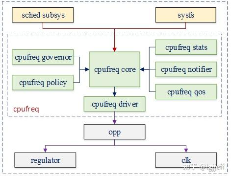

# 0x00. 导读

CPUFreq 是 Linux 的内核子系统，为了动态调节 CPU 频率而生。

governor 算出 CPU 当前应该处于一个什么频率。  
driver 负责实现 governor 的梦想。

暂时忘记 intel_pstate 的一切。

# 0x01. 简介

根据系统的负载情况，动态调整 CPU 频率和电压，就能减少这部分功率消耗。CPUFreq 就是内核为支持这种能力而定义的一套管理框架。

大多数现代处理器能够在多种不同的 时钟频率和电压 配置下运行，这些对应的 时钟频率和电压 配置通常称为 **Operating Performance Points**, 在 ACPI 术语中，这些配置叫 **p-state** （注意上下文语境）。

在 Linux 中，这种根据需求来调整 CPU 性能的技术称为 **CPU 性能伸缩 (CPU performance scaling)** 或 **CPU 频率伸缩(CPU frequency scaling)**。

- 内核调度器会在一些重要事件发生时（例如新建或销毁进程）， 或者定期（every iteration of the scheduler tick）回调 cpufreq update 方法，更新 cpufreq 状态。
- cpufreq 根据状态状态信息，可以动态调整 p-state 级别。

## 1.1 Linux CPU 性能伸缩(CPU performance scaling)

也叫 **DVFS(Dynamic Voltage Frequency Scaling)**.

Linux 内核通过 CPUFreq 子系统支持 CPU 性能缩放，该子系统由三层组成：

1. 缩放核心 (CPUFreq core)  
CPUFreq core 为支持 CPU 性能扩展的所有平台提供通用代码基础设施和用户空间接口。 它定义了其他组件运行的基本框架。

2. 缩放调控器 (scaling governors)  
缩放调控器 (scaling governors) 运行算法来估计所需的 CPU 容量。 通常，每个 scaling governors 都实现一个可以参数化的缩放算法 (scaling algorithm)。

3. 缩放驱动程序 (scaling drivers)  
scaling drivers 与硬件对话。 它们为 scaling governors 提供可用的 p-state 的信息，并通过使用硬件接口来根据 scaling governors 的请求更改 CPU p-state。

[/Documents/cpufreq/core.txt](https://www.kernel.org/doc/Documentation/cpu-freq/core.txt)

# 0x02. CPUFreq

**CPUFreq 主要功能**为动态调节 CPU 的频率和电压，为了达到这一目标，该框架需要考虑以下几个问题：

1. 确定每个 CPU 的频率调节范围，包括硬件支持的最大频率、最小频率，以及软件可调节的最大频率和最小频率等。  
（在 CPUFreq 中它可通过 **Policy** 来管理。(`/sys/devices/system/cpu/cpufreq/policyY/cpuinfo_xxx_freq scaling_xxx_freq`)）

2. 在当前负载下，确定 CPU 应该工作于哪个频率，例如简单地使 CPU 工作在最高频率以提供最高性能，或者使其工作在最低频率以降低功耗。但系统的负载是动态变化的，因此 CPUFreq 还支持通过特定算法，在负载变化时动态调节 CPU 的频率。它可通过 **Governor** 组件实现

3. 确定 CPU 频率调节的周期及触发时机，以使其既不对系统有太大影响，又能较快地跟踪系统的负载变化。它是通过 **内核调度器** 和 CPUFreq 模块共同完成的

4. 当待调节频率确定后，如何调用频率设置接口，实现实际的频率调节工作。它是通过其 **driver** 组件实现的

除此以外，CPUFreq 还包含 **CPUFreq stats**，**CPUFreq qos**，**CPUFreq notifier** 等辅助模块，其主要功能如下：
1. CPUFreq stats: 用于搜集 CPUFreq 的一些统计数据，如 CPU 在每个频点下的运行时间，总的切频次数等。

2. CPUFreq qos: 该模块用于在 CPUFreq 频率限制值发生改变时，向 CPUFreq 模块发送一个通知，使其能及时调整到新的值

3. CPUFreq notifier: 那些对 CPU 频率切换，或者对 policy 对应的 governor 发生改变感兴趣的模块，可以向 CPUFreq 注册一个通知。当以上事件发生时，CPUFreq 将会向其发送相关通知

最后由于 CPU 的工作电压越高，其功耗也越大，因此我们希望 CPU 在切换到某一频率时，其电压也相应地切换到其可稳定工作的最低电压。为了得到电压和频率的关系，一般 SoC(System on a chip) 都会提供一些频点组合，CPUFreq 只会在这些规定的频点中切换。这些系统预置的频点叫做 **operation performance points(opp)**



## 2.1 driver governor 简介

核心的数据结构有三个：

- `struct cpufreq_policy`: 用于描述不同的 policy，涉及到频率表、cpuinfo 等各种信息，并且每个 policy 都会指向某个 governor; [cpufreq_policy.md](./cpufreq_policy.md)
- `struct cpufreq_governor`: 用于对 policy 的管理；[cpufreq_governor.md](./cpufreq_governor.md)
- `struct cpufreq_driver`: 用于描述具体的驱动程序；[cpufreq_driver.md](./cpufreq_driver.md)

CPUFreq Governor 的主要功能是根据其相应的控制策略，为 CPU 选择一个合适的运行频率，而频率设置流程需要 cpufreq dreiver 完成。

**driver 是机制， governor 是策略， core 对机制和策略进行管理。**

>
>机制与策略：  
>策略 call 机制。层次上来看，策略在上，机制在下。例如：游戏提供了可玩的机制，你在此基础之上，用自己的策略获得高分。
>
>机制相当于是规则，策略则是在规则下实现目的的方法。

# 0x03. sysfs 接口

所有与 CPUFreq 相关的 sysfs 接口都位于: `/sys/devices/system/cpu`.  
见 [sys_devices_system_cpu.md](./sys_devices_system_cpu.md)

# 0x04. 接下来

## 4.1 intel_pstate

原则上，所有可用的 scaling governors 都可以与每个 scaling drivers 一起使用。然而，不适用于基于硬件本身提供的信息的性能扩展算法，因为该信息通常特定于它所来自的硬件接口，并且不容易在抽象平台中表示。

因此， CPUFreq 允许扩展驱动程序绕过 scaling governors 实现自己的性能扩展算法。 **intel_pstate scaling drivers 就是这样的**。

Intel 借助这个空子，放出了复杂、霸道的 intel_pstate.

## 4.2 睿频

有些处理器支持在特定条件下暂时提高 **部分** 内核的运行频率的机制。Turo Boost 是在操作系统请求处理器的最高性能状态（highest performance state, pstate）时候激活。在Turbo Boost背后的设计概念也被称为 **动态超频** 。

不同的供应商使用不同的名称来指代此功能。对于 Intel 处理器，它被称为 Turbo Boost ， AMD 称之为 Turbo-Core 或（在技术文档中） Core Performance Boost 等等。一般来说，不同的供应商也有不同的实现方式。

频率提升机制可以是基于硬件的或基于软件的。如果它是基于硬件的（例如在 x86 上），则触发加速的决定由硬件做出。如果它是基于软件的（例如在 ARM 上），则 scaling driver 决定是否触发提升以及何时触发。

许多系统都可以在平台固件 (BIOS) 设置中禁用频率提升机制。

## 4.3 日常使用

查看当前睿频情况(0:enable 1:disable)
```bash
$ cat /sys/devices/system/cpu/intel_pstate/no_turbo
```
cpu 工作模式，powersave 代表省电模式，performance 代表性能模式。

查看当前策略
```bash
$ cat /sys/devices/system/cpu/cpu*/cpufreq/scaling_governor
$ cat /sys/devices/system/cpu/cpu*/cpufreq/scaling_driver 
```
更改为性能模式
```bash
$ sudo cpupower -c all frequency-set -g performance
```
查看当前频率
```bash
$ watch cat /sys/devices/system/cpu/cpu[0-9]*/cpufreq/scaling_cur_freq
```