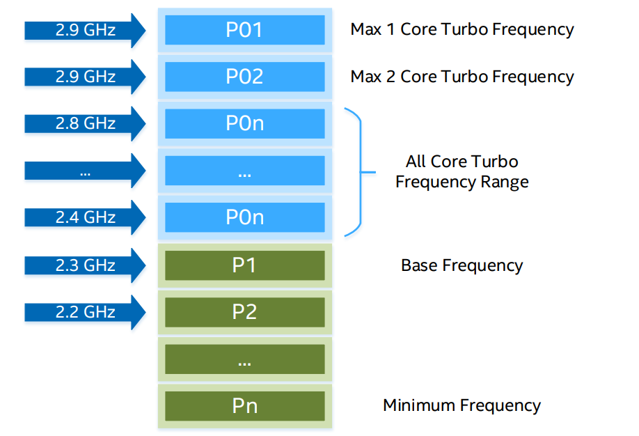
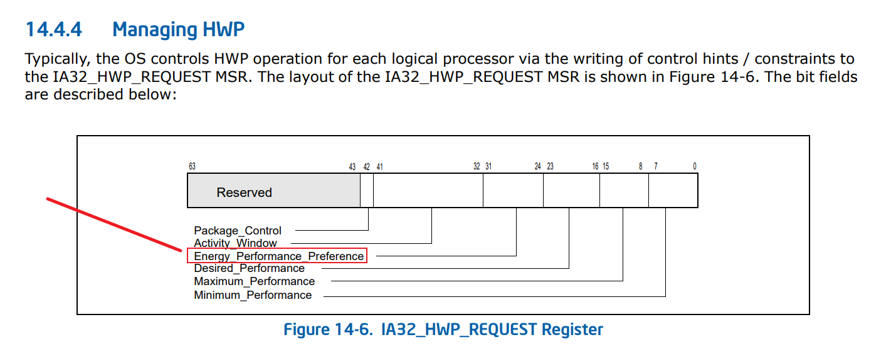

# 0x00. 导读

# 0x01. 简介

# 0x02. P-state 定义

- OS 控制的 P-states  
    OS 设定特定的 P-states，即选择工作频率，处理器再根据频率计算电压。 
- 硬件控制的 P-states  
    OS 只给出负载，由硬件选择对应的 P-states，并设置电压和频率。
- Intel_pstate 驱动  
    此驱动程序通过 **内置调频器**，实现面向 Intel Core（SandyBridge 和更新的型号）处理器的调频驱动。可以通过 cpupower 命令设置最大最小频率。

Turbo: 在个别核非常繁忙同时其他核又因为空闲进入 C-States 时，内置的电源管理模块将其电能输送给忙碌的 core，升高其电压和频率，使其获得比标频更高的频率。

monitor/mwait: 在 core 空闲或者等待写入时，使当前 core 进入 C1 等 C-states 的特殊指令。

**通俗解释**：  

P-state 是 performance state ，当 CPU 处于 C0-state 的时候，可以按照 P-state 来细分。P0 是最高频，越往后频越低。  

该状态用于调整 CPU 运行的电压与频率，以此降低 CPU 的功耗。

Linux 中 p-state 有一个别名：**Operating Performance Points(性能操作点)**.

**正经解释**：  

根据参考一，得到的 P-state 定义：
> CPU P-states represent voltage-frequency control states defined as performance states in the industry standard Advanced Configuration and Power Interface (ACPI) specification (在 ACPI 规范中，P-state 表示 (电压,频率) 控制状态（也就是说 P-state 是一组预定义的 CPU 频率/电压）).

> In voltage-frequency control, the voltage and clocks that drive circuits are increased or decreased in response to a workload. The operating system requests specific P-states based on the current workload. The processor may accept or reject the request and set the P-state based on its own state.

> P-states columns represent the processor’s supported frequencies and the time spent in each frequency during the collection period.

根据参考二，得到的 P-state 定义：
> A Performance State (P-state) is an operating point(操作点) where a core is operating at a specific frequency and voltage(电压) while executing instructions. As the core moves to lower P-states, the frequency and associated voltage drops resulting in reduced power consumption and performance. The Advanced Configuration and Power Interface (ACPI) defines the performance states that are exposed to system software. Software interfaces provided by Enhanced Intel SpeedStep Technology allow P-states to be controlled per core.

SKU (Stock Keeping Unit) 的意思是库存量单元，其实就是用来进行库存管理的标识数，区分不同的产品，有点类似于图书的 ISBN 号，或者超市里商品的扫描条码，有了这个才能方便的计数，统计不同的产品的库存量是多少，方便管理大量库存呀。

P-states have an associated frequency that varies between SKUs, organized as follows:
- P01 is the Max 1 Core Turbo Frequency, the maximum frequency that can be reached with one core active.
- P0n is the All Core Turbo Boost Frequency range. The level of Turbo Frequency depends on the workload(工作负荷) and the operating environment. Turbo is opportunistic(伺机，投机取巧) as(由于，因为) the frequency achieved may fall short of(达不到) the maximum frequency. 
- P1 is the Guaranteed Base Frequency of a SKU. All cores can run at this speed while within standard operating conditions.
This is sometimes referred to as P1n.
- P2, P3, and all lower P-states are defined as 100 MHz (referred to as a 'bin') below the previous P-state's frequency.
- Pn is the lowest P-state supported by the CPU.

p-state划分:
P0 - P1 是 turbo范围  
P1 - Pn 是 保证范围（操作系统可见的状态）  
Pn - LFM 是 温度控制范围

例如：

## 3.1 P-states: Management

Hardware: In Intel® Xeon® Scalable processors, Hardware-Controlled Performance States (HWP) give the option to pass P-state control to the hardware, allowing it to make much faster and finer adjustments to the frequency and voltage based on each core’s load and OS hints. Without HWP, the OS can directly request P-states through the intel_pstate driver or the acpi_cpufreq driver.

Operating System: P-states can be managed from user space via the Linux kernel system file system “sysfs”. By default, the P-states have a management routine known as a governor that decides how to control the frequency in response to the workload.

P-states can be used to dynamically reduce frequency per core, reducing the power consumption of the server.

Sysfs for intel_pstate (and cpufreq):
- /sys/devices/system/cpu/intel_pstate/*
- /sys/devices/system/cpu/cpu*/cpufreq/*

[探索 Intel P-state 在Linux下限制cpu频率过程中的影响](https://makiras.org/archives/344)

影响 CPU 频率调度情况的主要因素有三个：

- 支持的 P-state 范围，以及是否支持 Hardware P-state (hwp)

- 内核的启动参数，对 intel cpu 一般是 intel_pstate=active|passive|no_hwp|......

- 服务器 BIOS 设置：是否进行了 硬件频率控制 等设置

参考三:  

> Energy_Performance_Preference (bits 31:24, RW) — Conveys(传递) a hint to the HWP hardware. The OS may write a range of values from 0 (performance preference) to 0FFH (energy efficiency preference) to influence the rate of performance increase /decrease and the result of the hardware's energy efficiency and performance optimizations. The default value of this field is 80H. Note: If CPUID.06H:EAX[bit 10] indicates that this field is not supported, HWP uses the value of the IA32_ENERGY_PERF_BIAS MSR to determine the energy efficiency /performance preference.

> Maximum_Performance (bits 15:8, RW) — Conveys a hint to the HWP hardware. The OS programs this field to limit the maximum performance that is expected to be supplied by the HWP hardware. Excursions above the limit requested by OS are possible due to hardware coordination between the processor cores and other components in the package. The default value of this field is IA32_HWP_CAPABILITIES.Highest_Performance

但在 Intel 较新的 CPU 中，引入了 Hardware-controlled P-State (HWP) 技术，该技术允许硬件（即 CPU 本身）自行控制 P-state（该技术作为 Speed Shift 被熟知）。

而 HWP 调整频率的偏好则由 `Energy-Performance Preference (EPP)` 寄存器控制，HWP 的控制 override 了 OS 对 CPU 频率的控制，导致通过 sysfs 进行的约束失去作用。虽然按照 kernel doc 所描述的，sysfs 中的 scaling_min_freq 与 scaling_max_freq 可以限制频率，但是实际上并没有任何作用。

经过阅读文档，如果要限制，需要通过 IA32_HWP_REQUEST 寄存器 (per logical processor) 的 Maximum_Performance 字段控制。

[Intel Power Management & MSR_SAFE](https://events.it4i.cz/event/39/attachments/150/344/04-2020-01-29-prace-ee-DC-RS.pdf)  
[intel_pstate CPU Performance Scaling Driver](https://www.kernel.org/doc/html/v4.19/admin-guide/pm/intel_pstate.html)

## 3.2 软件

- With Turbo
    1. intel_pstate with active mode

        该模式下通过 MSR-EPP/EPB 寄存器控制频率调度的偏好。支持两种策略:
        - performance   
        intel_pstate will write 0 to the processor’s Energy-Performance Preference (EPP) knob (if supported) or its Energy-Performance Bias (EPB) knob (otherwise). This will override the EPP/EPB setting coming from the sysfs interface  
        注意，该模式并非总是进入允许的最高 P-state，而是激进地提升 P 状态。

        - powersave  
        intel_pstate will set the processor’s Energy-Performance Preference (EPP) knob (if supported) or its EnergyPerformance Bias (EPB) knob (otherwise) to whatever value it was previously set to via sysfs (or whatever default value it was set to by the platform firmware). This usually causes the processor’s internal P-state selection logic to be less performance-focused.

    2. intel_pstate with no_hwp mode

        该模式是不支持 HWP 功能 CPU 的默认模式，也是添加了 intel_pstate=no_hwp 内核启动参数的模式（不一定生效，在实验中如果 BIOS 开启了 HWP，该参数无法对调度产生影响）。支持两种策略

        - performance  
        It selects the maximum P-state it is allowed to use, subject to limits set via sysfs, every time the P-state selection computations are carried out by the driver’s utilization update callback for the given CPU (that does not happen more often than every 10 ms), but the hardware configuration will not be changed if the new P-state is the same as the current one.

        - powersave  
        It generally selects P-states proportional to the current CPU utilization, so it is referred to as the “proportional” algorithm

    3. intel_pstate with passive mode

        该模式隐式声明了 no_hwp 参数，并被称为 intel_cpufreq。 

        - The driver behaves like a regular CPUFreq scaling driver. That is, it is invoked by generic scaling governors when necessary to talk to the hardware in order to change the P-state of a CPU (in particular, the schedutil governor can invoke it directly from scheduler context).

        - While in this mode, intel_pstate can be used with all of the (generic) scaling governors listed by the scaling_available_governors policy attribute in sysfs (and the P-state selection algorithms described above are not used).

        - In other words, in the passive mode the entire range of available P-states is exposed by intel_pstate to the CPUFreq core. However, in this mode the driver does not register utilization update callbacks with the CPU scheduler and the scaling_cur_freq information comes from the CPUFreq core (and is the last frequency selected by the current scaling governor for the given policy).

    4. intel_pstate with per_cpu_perf_limits mode

        该模式屏蔽 max_perf_pct 和 min_perf_pct 这两个全局限制。

- Without Turbo

    1. intel_pstate with disable parameter (usually acpi-cpufreq)

        不使用 intel_pstate 即使处理器支持。 实际上此时 linux 系统会选择 acpi-cpufreq 调度器。

        - Apart from the above, acpi-cpufreq works like intel_pstate in the passive mode, except that the number of P-states it can set is limited to the ones listed by the ACPI _PSS objects.  
        实质上，此时 CPU 不支持睿频。

# 0x0 . 参考

参考一：[Intel P-State](https://www.intel.com/content/www/us/en/docs/vtune-profiler/user-guide/2023-0/p-state.html) 

参考二：[TECHNOLOGY GUIDE Power Management - Technology Overview](https://networkbuilders.intel.com/docs/networkbuilders/power-management-technology-overview-technology-guide-1677587938.pdf)

参考三：[64-ia-32-architectures-software-developer-vol-3b-part-2-manual.pdf](https://www.intel.com/content/dam/www/public/us/en/documents/manuals/64-ia-32-architectures-software-developer-vol-3b-part-2-manual.pdf)

Inetl 手册白皮书  
[Intel® 64 and IA-32 Architectures Software Developer Manuals](https://www.intel.com/content/www/us/en/developer/articles/technical/intel-sdm.html)  
第 1 卷：说明支持 IA-32 和 Intel® 64 架构的处理器的架构和编程环境。  
第 2 卷：包括完整的指令集参考 A-Z。描述指令的格式并提供指令的参考页。  
第 3 卷：包括完整的系统编程指南，第 1、2、3 和 4 部分。描述 Intel® 64 和 IA-32 体系结构的操作系统支持环境，包括：内存管理、保护、任务管理、中断和异常处理、多处理器支持、散热和电源管理功能、调试、性能监视、系统管理模式、虚拟机扩展 （VMX） 指令、Intel® 虛擬化技術 （Intel® VT） 和Intel® Software Guard Extensions （Intel® SGX）。  
第 4 卷：描述支持 IA-32 和 Intel® 64 架构的处理器特定型号寄存器。

