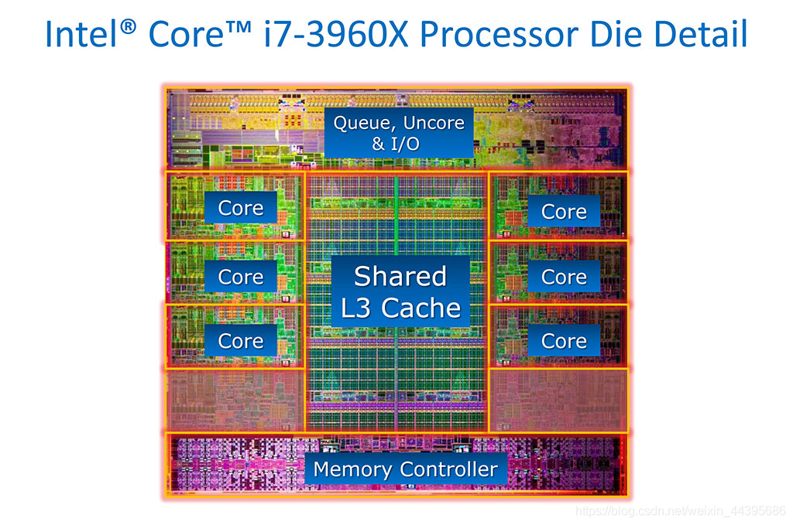

# 0x00. 导读

# 0x01. 简介

# 0x02.

## 2.1 wafer 晶圆

很简单的说，首先由普通硅砂拉制提炼，经过溶解、提纯、蒸馏一系列措施制成单晶硅棒，单晶硅棒经过切片、抛光之后，就得到了单晶硅圆片，也即单晶硅晶圆。 

**【硅晶棒】**   

**【加工后的晶圆】**   

简略步骤图如下：   

注意，第三阶段，切割后的晶圆需要进行加工,以使其像镜子一样光滑。这是因为刚切割后的晶圆表面有瑕疵且粗糙,可能会影响电路的精密度,因此需要使用抛光液和抛光设备将晶圆表面研磨光滑。   
加工前的晶圆就像处于没有穿衣服的状态一 样,所以叫做裸晶圆(Bare wafer)。经过物理、 化学多个阶段的加工后,可以在表面形成 IC(Integrated Circuit 集成电路)。 经过加工阶段后,会成为如下形状。

## 2.2 die 裸晶

从晶圆（Wafer）上切割下来的就称为 Die，一般来说，Die 可以分为很多种，有 Computer Die，里面主要包含处理器的核心，缓存等，IO Die 主要包含IO控制器（例如PCIe 控制器等），当然如何组合取决于设计需求。将多个 Die 通过封装（Packaging）封在一起后就成了我们日常看到的CPU，可以直接安装在主板上，让后安装到系统里（台式机或笔记本）。下图中黑色小方块里面就是Die，绿色就是封装。

一个 Die 的内部组成，由 片上网络（Network on Chip）将各个 Core（核心，传统意义上的CPU），L3缓存，内存控制器（DDR内存控制器），有的还可能还会有各种IO控制器（例如PCIe和QPI控制器）和特定加速器（例如加解密加速器）等连接起来，连接方式常见的有Ring网络，最近用的比较多的是Mesh网络。

通常一个 Die 中包含多个 core 、 L3cache 、内存接口、 GPU 等， core 里面又包含了 L1 、 L2cache 。

## 2.3 package 封装

将一个或多个 Die 封装成一个物理上可以售卖的 CPU 。   

socket: 目前见过最容易理解的解释是 CPU 插槽  

可以用命令 lscpu | grep socket 查看

## 2.4 CPU core 内部

这部分就是传统意义上的CPU。主要包含计算与控制单元，L1和L2缓存等。

例如一个典型的超标量流水线处理器，核心一般分为3个部分。

- 前端（Frontend）：主要包含一级指令缓存（I-Cache），MMU 和 I-TLB（虚拟地址翻译缓存），取值单元（IFU），分支指令预测器（BPU），以及所需的队列和缓存（Queue 和 Buffer），一般性能的瓶颈就在前端。
- 寄存器重命名和派发：主要包含指令解码（Decode），寄存器重命名（Register Renaming），写入ROB (重排序缓冲）和指令派发（Dispatch）。
- 后端（Backend）：只要包含发射队列（IQ），乱序执行单元（EU），执行单元一般也会分为整数，浮点数，向量单元，以及内存访问单元。每个执行单元还会有物理寄存器，每条指令执行完后从ROB中退休（Retire)，以保证程序顺序的正确性。此外还有L1 D-Cache（缓存），L1 D-TLB（虚拟地址翻译）以及L2缓存和 L2 TLB。

