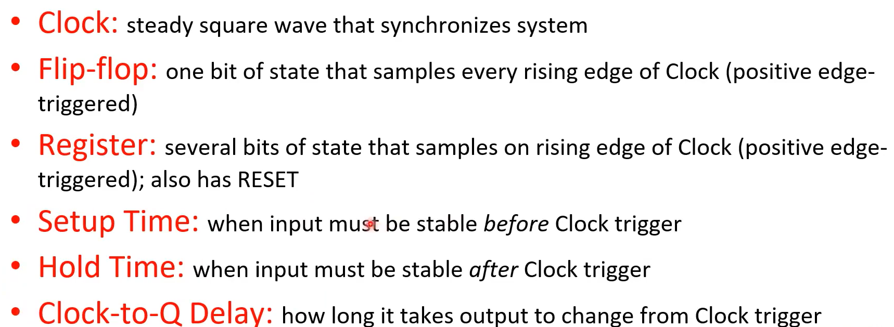

# 0x00. 导读

[CS 61C 2020 Great Ideas in Computer Architecture](https://www.bilibili.com/video/BV1fC4y147iZ/?spm_id_from=333.337.search-card.all.click&vd_source=55019cf38cd2bfef2ff9bcd83a1f91df) 笔记。


# 0x01. 简介

# 0x02. number

```
进制：二进制、十进制、十六进制
正数、负数、溢出、符号位

反码（one’s complement）
一种对定点整数或定点小数进行二进制编码的编码方案。由于计算机处理反码没有补码方便，反码已很少被用到了。

补码（Two's Complement）
正号「+」用符号位「0」表示，负号「-」用符号位「1」表示，正数的数值部分不变，负数的数值部分是「各位取反，末位加 1」。

偏移表示法(Biased Notation)
将每一个数值加上一个偏置常数，一般来说，当编码位数为 ，当编码位数为 n 时，bias 取 2^(n-1)
例如 n=4, bias 就会等于 8
-8 (+8) -> 0000
-7 (+8) -> 0001
...
0 (+8) -> 1000
...
+7 (+8) -> 1111

bits can represent anything.
```

# 0x03. C 语言


# 0x04. floating number

# 0x05. RISC-V 汇编

寄存器

RISC-V 中用 x0-x31 表示。寄存器越多，越慢，太少也不方便，所以 32 个是一种权衡。

特殊寄存器 x0 总是 0 并且不能被修改。往里面写值也没有任何效果。

op dst, sr1, sr2

立即数 opi dst, src, imm  
addi s1, s2, 5  # a = b + 5

memop reg, offset(bAddr)  
lw sw

大小端

# 0x06. 汇编如何变成 CPU 可以执行的指令


stored-program concept: 我们完全可以把程序像数据一样存储起来。

CALL: Compiler, Assembler, Linker, Loader
- Compiler converts a single source code file into a single assemblyfile: `.c -> .s`
- Assembler removes pseudo-instructions, converts what it can to machine language, and creates a checklist for linker(relocation table): `.s -> .o`
  - Resolves addresses by making 2 passes (for internal forward references)
- Linker combines several object files and resolves absolute addresses: `.o -> .out`
  - Enable separate compilation and use of libraries
- Loader loads executable into memory and begins execution

# 0x07. transistors 晶体管, logic circuits 逻辑电路图, block diagram 框图

开始由下往上。

synchronous digital systems (SDS):
- synchronous: 所有的操作都由中央时钟统一协调
- digital: 用 0 和 1 来表示


布尔代数


组合逻辑电路 Combinational Logic, CL: 没有状态，同样的输入一定是同样的输出
- 组合逻辑门
- 真值表
- 布尔代数, SoP(Sum of Products), PoS(Product of Sums)
- 简化电路。电路越简洁，逻辑越清晰，效率越高，电路延迟越少
  

  


顺序逻辑电路 Sequential Logic, SL: 有状态。
- 多选器/多路选择器（Multiplexer, MUX）。用于从多个输入信号中选择一个作为输出。让我们能够实现更高层次的逻辑。
- Sequential Logic Timing
- Maximum Clock Frequency
- 状态机
- Functional Units


这里关于 register 和 clock 的解释很好，整个 11.4 都很好，[看看](https://www.bilibili.com/video/BV1fC4y147iZ?t=253.4&p=82)。





同步模型，如何确保每个数据在 tick 之间都准备好了。
critical path is the longest delay between any two registers in a circuit.
the clock period must be longer than this critical path, or the signal will not propagate(传播) properly to that next register.

maximum clock frequency（最高时钟频率，fmax）: limited by how much time needed to get correct next state to register.
> 时钟是一个电路的心脏和节拍器，学习时序分析当然要从时钟周期 ( 时钟频率 ) 开始了， 时序约束主要是为了满足器件稳定工作在我们需要的工作频率 ！！！
> 以前对频率的理解很简单，认为晶振输入多少就是多少工作频率，现在才认识到因为器件内部的各种延迟，数据的采集、建立和传输都有时间延迟，如果时钟周期小于这个延迟，则芯片内部的数据在当前时钟还没有正常的采集、建立和传输，下一个时钟就已经来到，造成工作错乱——这就是电路能承受的最高工作频率，如果要求工作在 100MHz  ，但是电路只能跑到 80MHz ，如果硬是上到 100MHz 的输入频率，那么这个芯片由于不满足时序将不能正常工作

max delay = CLK-Q Delay + CL Delay + Setup Time

粗略解释：  
CLK-Q Delay: tick 开始，从起始 register 穿过（看看 register 那个图，从 D 到 Q 的时间）
CL Delay: 在组合电路中走啊走  
Setup Time: 到达下一个 register 的 D 的一系列准备时间  
这里的 frequency 就是我们平常说的 CPU 频率多少多少 GHZ 了。近年来这个值已经增长很慢了，因为物理世界很难突破，再快就是牺牲质量了，硬件就没法正确工作了。


超频，超的就是这个 maximum clock frequency 。

要想加速，只能另辟蹊径了 -- 流水线！增加更多寄存器，将 critical path 拆成更小的 stages


CPU:
- Datapath, 数据通路: 指令执行过程中数据所经过的路径，包括路径上的部件，如ALU（算数部件）、通用寄存器、状态寄存器等等。数据通路由 控制单元 进行控制。形象的说， datapath 是数据流动的 路 ，当然路上有许多 关卡 ， 关卡 的开关由 控制单元 决定，而 控制单元 又是由指令产生的控制信号决定的。
- Control, 它需要根据输入指令做出决策，例如确定当前执行的操作类型、是否需要从内存中获取信息、是否需要将结果写入寄存器以及写入哪个寄存器。
  
数据通路由两类部件组成
- 组合逻辑元件，也称 操作元件
- 存储元件，也称 状态元件
数据通路由操作元件和存储元件，通过总线连接方式或者分散连接方式连接而成，用于数据存储、处理、传送。

[CS61C｜Lec12-Single-Cycle CPU Datapath](https://forsakendelusion.online/computer/openclass/805/)

 

