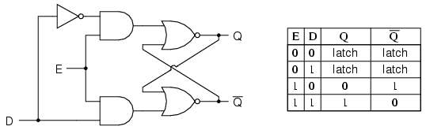

# 0x00. 导读


[为什么 CPU 需要时钟才能工作？](https://www.zhihu.com/question/21981280/answer/126921197)

# 0x01. 简介

时钟不是作用在ALU（逻辑控制单元）上而是寄存器上。

# 0x02. 

一般对 CPU 比较朴素的一种理解是，知道它是一组逻辑门组成黑箱。给特定的输入，会有相应的输出。就像一个函数。这种模型就叫 “组合电路”。比如 1+1=2。输入两个操作数 A=1，B=1，操作符为 “➕” 加号。输出结果为 2。

但情况要是稍微复杂一点，比如说 1+1+1=?，怎么办？是不是要重新设计一个有 3 个输入的逻辑加处理单元？那么 1+2+3+4+...+10=？怎么计算？同时输入 10 个操作数吗？肯定不行。

解决的方法，就是需要 “累加”。就是先计算 1+2，得到的结果再 + 3，以此类推。累加的过程，这里必须用到 2 个 “寄存器”。1-10 十个数字排列在 2 号寄存器里，按顺序取出来和上一次计算的和相加。每次得到的暂时的和存在 1 号寄存器。这时候，CPU 的假想结构就变成了下面这样，


到这里，问题就来了。假设从 2 号寄存器取出初始输入 A=1，1 号寄存器初始化 y=0，第一次加法 1+0=1。此时逻辑电路处在一个稳定状态。根据上图，这个稳定状态如下，
```
输入：A=1，y=0
输出：Z=1，Y=1
```
但如果没有时钟脉冲的控制，这个稳定状态一瞬间就会被打破。因为 0+1=1 的结果马上会被写入 1 号寄存器。马上 1 又作为输入重新回到逻辑运算单元。假设此时 2 号寄存器还没来得及读取出下一个参与计算的数字 2，逻辑运算单元此时的输入变为 1+1，输出变成 2。情况也有可能完全反过来，2 号寄存器跑得快，上一次计算的和 1 还没来的及回到逻辑运算单元，下一个数字 2 已经到了，于是 2+0=2 就成了第二个输出。因为像这样操作数顺序不确定，导致一切都会乱套。

解决问题的办法，就是加个时钟。真正神奇的地方在于，时钟不是直接作用于 ALU 逻辑运算单元上。而是作用在寄存器上，寄存器上，寄存器上。

这种特殊的寄存器叫：时钟寄存器。只有在时钟信号的上升沿（比如说 5V 高位）才能往里写入。其他时候，输入只能在外面等着。（图源：《深入理解计算机系统》P249）


还是从第一个稳态开始：
```
输入：A=1，y=0
输出：Z=1，Y=1
```
这时候虽然逻辑运算单元的输出是 Y=1，但只要时钟的高压 5V 脉冲没有到，这个 Y=1 的输入一直无法写进 1 号寄存器。所以它的输出 y 一直保持初始值 0。同理 2 号寄存器也必须等时钟脉冲到达才能读取第二个操作数 2。

所以当时钟电压升高以后，两个寄存器同时被写入新的值。逻辑运算单元接收到两个新输入，在下一个时钟脉冲到达之前，一直保持第二个稳态。
```
输入：A=2，y=1
输出：Z=3，Y=3
```
以此类推，直到得到最后计算结果，都保证下一个操作数和上一次计算的和是同时进入逻辑运算单元。

最后再贴个图，也是《深入理解计算机系统》里的一个例子，可能更贴近实际情况，


注意 2 号图，周期 3 结束时。这里有 3 个寄存器。

1. 组合逻辑内部寄存器，记录临时状态。下一个状态 000 已经得出，但还没写入寄存器，寄存器还保持 100 的初始状态。在等待下一个时钟脉冲才能写入。
2. 程序计数器的下一条指令 0x00e 也等待下一个时钟脉冲到达才能写入。
3. 寄存器文件的上一次计算的输出 0x300 已经等在外面，准备写入 %ebx 地址。还是在等下一个时钟高位。

注意 3 号图，等第 4 个周期开始的一瞬间，也就是电压升高的瞬间，三个寄存器的值同时被写入。此时组合逻辑的平衡立刻被打破，内部逻辑马上会得到一个新的输出，在下一个脉冲到达前，三个寄存器再次改变状态前，保持暂时的平衡。

总之，如果没有寄存器这种被控制写入时机的特性，逻辑电路之间的迭代将是毫无章法的。就是靠时钟脉冲这个节拍器，系统才能在一次接一次的短暂稳态中得到最后想要的计算结果。

因此 CPU 大部分时间都没有在计算，都处于时钟低平的稳态中等待。所以说 CPU 为什么越高频越好。时钟频率越高每秒完成的步数越多，CPU 的利用率越高。

最后展示一下组成寄存器最基本的神奇单元，锁存器（Latch）。



上图是一个 “时钟 D - 锁存器”。非常简单，由一个非门和两个或非门构成。里面的细节可以不用管，它的效果就是：

- 当时钟处于 5V 高电平：输出 Q 等于输入 D，输出 $\bar{Q}$ 和输入 D 相反。而且一直保持这个输出。
- 当时钟处于 1V 低电平：输入 D 对输出 Q 和 $\bar{Q}$ 没有影响。

更高级一点的是 “D - 触发器（Flip Flop）”。它和锁存器的区别在于，锁存器在 5V 高电平的任何时间都可以对内部数据进行改写。而触发器只有在时钟信号从低平变为高平的上升沿（一瞬间）内部信号才能被改写。

触发器可以简单通过反向连接两个锁存器获得：

