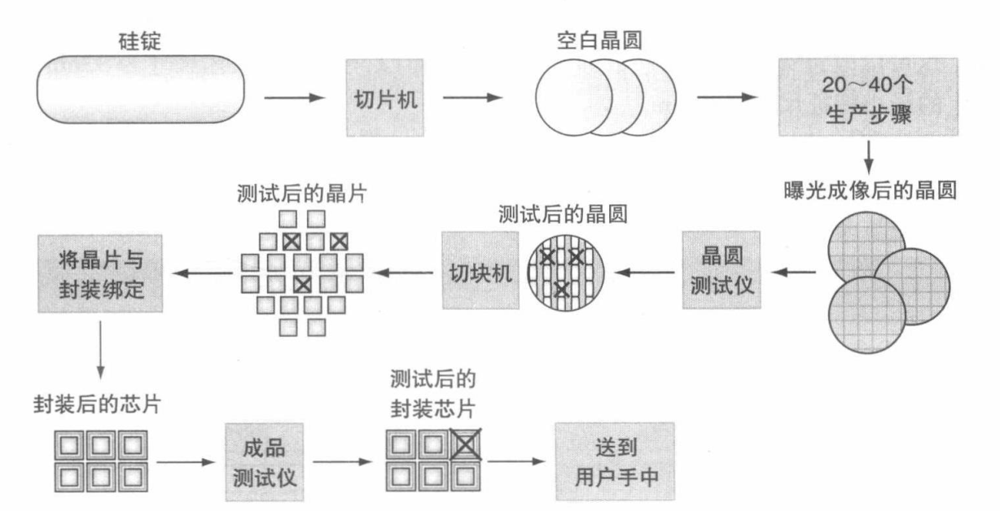

# 0x00. 导读

# 0x01. 简介

# 0x02. 

现代计算机的特征是处理器的并行性和内存的层次性。

使用抽象简化设计：使用抽象来表示不同的设计层次，在高层次中看不到低层次的细节，只能看到一个简化的模型。

集成电路（integrated circuit）俗称芯片（chip）。晶体管是一种只受电流控制的开关，集成电路是由成千上万个晶体管组成的芯片。



响应时间也叫执行时间，是计算机完成某任务所需的总时间。
吞吐量也叫带宽（band-width）,表示单位时间内完成的任务数量。
后续内容暂定，如果A性能比B性能好，就是A的响应时间更少。

本书中，系统性能（system performance）表示空载系统的响应时间，CPU性能（CPU performance）表示用户CPU时间（程序本身所花费的CPU时间，不包括系统CPU时间）

程序的 CPU 执行时间 = 程序的 CPU 时钟周期数 * 时钟周期长度
程序的 CPU 执行时间 = 程序的 CPU 时钟周期数 / 时钟频率
硬件设计者减少程序执行所需的 CPU 时钟周期数或者缩短时钟周期长度，就能改进性能。

CPI=clock cycle per instruction, 指令平均时钟周期数，表示执行每条指令所需的时钟周期平均数。

CPU时间 = 指令数 * CPI * 时钟周期长度
CPU时间 = 指令数 * CPI / 时钟频率
指令数多不代表就慢，每类指令的 CPI 不同，有可能指令多些，但是因为 CPI 小，所以花费的时间少些。指令数 、 CPI 、 时钟周期长度，至少需要这三个指标一起才能作为性能指标，不能只看单一数据。

上面的公式扩展开来：  
`秒数/程序 = 指令数/程序 * 时钟周期数/指令数 * 秒数/时钟周期数`

当前在集成电路技术中占统治地位的是 CMOS (互补型金属氧化半导体)，其主要的能耗来源是动态能耗，即在晶体管开关过程中产生的能耗，即晶体管的状态从 0 翻转到 1 或从 1 翻转到 0 消耗的能量。动态能耗取决于每个品体管的负载电容和工作电压:
```
能耗 成正比 负载电容 * 电压的平方

上面的等式表示的是一次 0->1->0 或者 1->0->1 的逻辑转换过程中消耗的能量，所以每个晶体管需要的功耗是一次翻转需要的能耗乘以开关频率：

能耗 成正比 1/2 * 负载电容 * 电压的平方 * 开关频率
```

工作负载（workload）：运行在计算机上的一组程序。

SPEC( System Performance Evaluation Cooperative) 目的是为现代计算机系统建立基准评测程序集。
```
SPEC CPU2006 是 2006 年 6 月推出的基准测试套件，它有几种不同的方法来衡量计算机性能。一种方法是测量计算机完成单个任务的速度，这是速度测量。另一种方法是测量计算机在一定时间内可以完成多少个任务，这称为吞吐量，容量或速率测量。

SPEC CPU2006 包含 12 个 Integer Benchmarks，和 17 个 Floating Point Benchmarks


SPEC CPU2017 是 2017 年 6 月发布的，基准测试包包含 43 个基准，分为四个套件：
SPECrate 2017 Integer,   SPECspeed 2017 Integer
SPECrate 2017 Floating Point,   SPECspeed 2017 Floating Point

SPEC CPU2017 分别包含: 10 个 Integer rate, 10 个 Integer speed, 13 个 Floating Point rate, 10 个 Floating Point speed

更多点我: https://www.cnblogs.com/LCharles/p/13539911.html
```