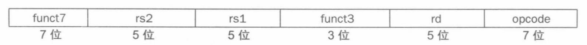
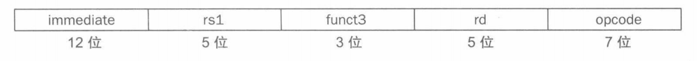
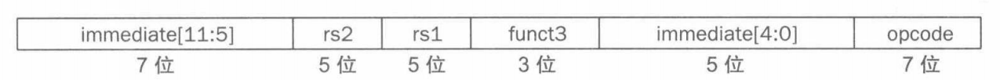

# 0x00. 导读

# 0x01. 简介

# 0x02.

硬件设计三条基本原则：
- 简单源于规整，所以 RISC-V 指令是定长
- 更少则更快，数量过多的寄存器会增加时钟周期，因为电信号传输的距离更远，花费的时间就更长。

算术指令的操作数受到限制：必须来自寄存器，而寄存器数量有限（通常 32 个）。  

数据传输指令：在内存和寄存器之间传送数据的命令。将数据从内存复制到寄存器的数据传输指令称为载入指令（load）。
```
ld x5, 40(x6)
x5 = Memory[x6 + 40]
x6 称为基址寄存器, 40 称为偏移量
```
将数据从寄存器复制到内存的数据传输指令称为存储指令（store）。
```
sd x5, 40(x6)
Memory[x6 + 40] = x5
x6 称为基址寄存器, 40 称为偏移量
```

指令是以一系列高低电平信号的形式保存在计算机中，并且以数字的形式表示。每条指令的各个部分都可以被视为一个单独的数，把这些数字并排拼到一起便形成了指令。
```
符号表示为
add x9, x20, x21 
的 RISC-V 指令

十进制表示为 0 21 20 0 9 51, 
二进制表示为 0000000 10101 10100 000 01001 0110011
                7      5    5    3    5     7

一条指令的每一段称为一个字段。第一、第四和第六个字段(0、0 和 51)组合起来告诉 RISC-V 计算机该指令执行加法操作。第二个字段给出了作为加法运算的第二个源操作数的寄存器编号( 21 表示 x21)，第三个字段给出了加法运算的另一个源操作数( 20 代表 x20)。第五个字段存放要接收总和的寄存器编号( 9 代表 x9)。因此，该指令将寄存器 x20 和寄存器 x21 相加并将和存放在寄存器 x9 中。

其中，二进制数字字段组成的指令表示形式也称为 指令格式。
指令的数字表示称为 机器语言，把这样的指令序列称为 机器码。
```

  



还有 S、SB、U、UJ 型。

指令格式通过操作码字段的值进行区分。

基本块 Basic Block: 如果一段程序的第一条语句被执行过一次，这段程序中的每一个都要执行一次，称为基本块。一个 BB 中的所有语句的执行次数一定是相同的。一般由多个顺序执行语句后边跟一个跳转语句组成。所以一般情况下 BB 的最后一条语句一定是一个跳转语句，跳转的目的地是另外一个 BB 的第一条语句，如果跳转时有条件的，就产生了分支，该 BB 就有两个 BB 作为目的地。

不调用其它函数的函数叫做 叶子（leaf）函数。

# 0x03.

当任务之间相互独立时，并行执行更为容易，但通常任务之间需要协作。协作通常意味着一些任务正在写入其他任务必须读取的值。需要知道任务何时完成写人以便其他任务安全地读出，因此任务之间需要同步。如果它们不同步，则存在数据竞争(data race)的危险。

同步机制通常由用户的程序构建，但是这依赖于硬件提供的同步指令。加锁和解锁可创建只有单个处理器才能操作的区域，称为 互斥区 。

保留加载（load-reserved）双字 lr.d 的加载指令，条件存储（store-conditional）双字 sc.d 的存储指令。