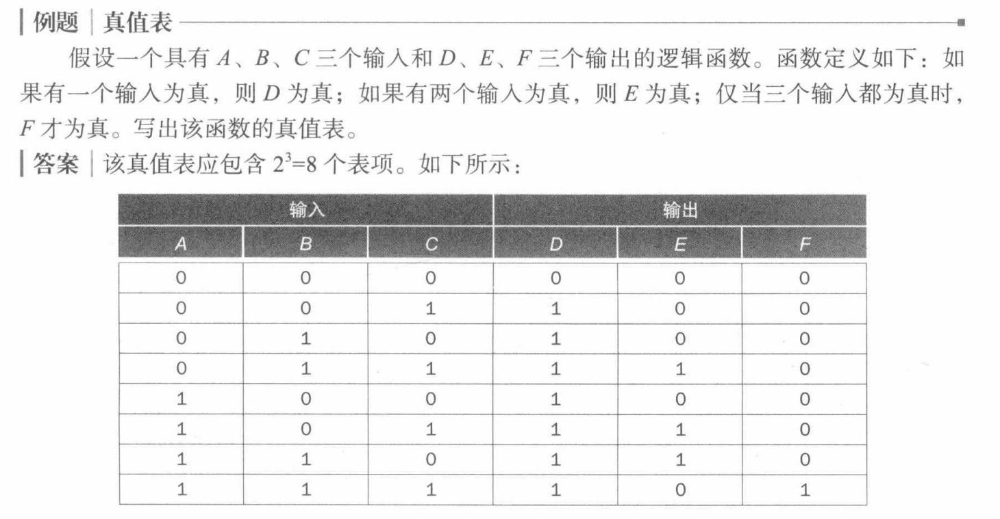
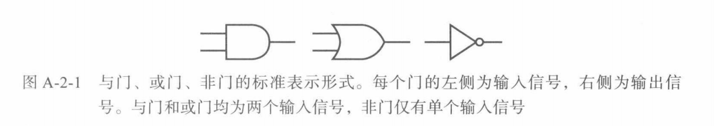
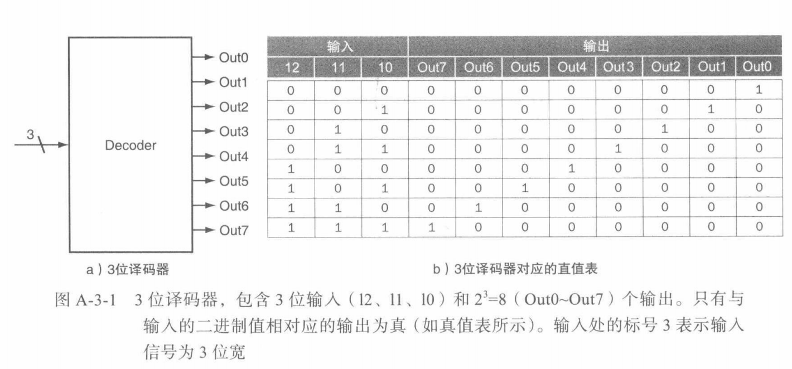
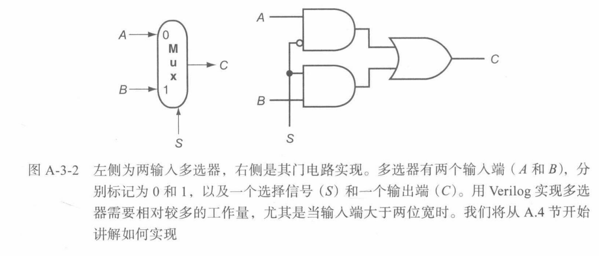
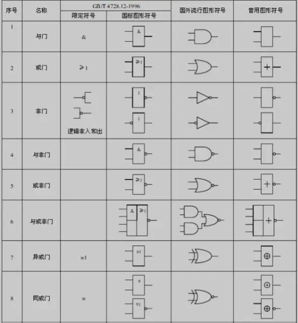
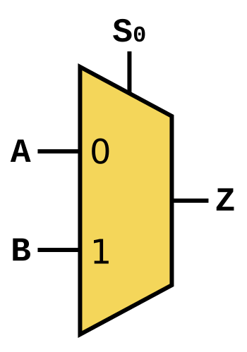

# 0x00. 导读

逻辑设计的基础知识。

# 0x01. 简介

逻辑电路的基本组成单元 -- 门。使用门来构建逻辑系统。

# 0x02. 门、真值表和逻辑方程

现代计算机的内部电子元件是 **数字电路**。数字电子元件仅在两个电压水平下运行:高电压和低电压。

在不同的逻辑系列中，高低两个电压值以及它们之间的关系是不同的。因此，我们不参考电压水平的高低，而是谈论逻辑上为真、为 1 或有效（asserted）的信号，或者逻辑上为假、为 0 或无效（deasserted）的信号。称值 0 和 1 彼此**互补**或**反转**。

有效信号：逻辑上为真或 1 的信号。  
无效信号：逻辑上为假或 0 的信号。

根据逻辑块是否包含存储器，将其分为两类：
- 不包含存储器的块称为**组合逻辑电路（combinational logic circuit）**，组合电路的输出仅取决于当前输人。在含有存储器的块中，输出可以由输入和存储在存储器中的值（称该值为逻辑块的状态）共同决定。
- 时序逻辑电路 **（sequential logic circuit）**

## 2.1 真值表

由于组合逻辑块不包含存储器，因此通过为 每个 可能的输入值集合 定义 对应的输出值 就可以完全指定一个组合逻辑电路。这种确定的对应关系通常用**真值表**给出。

对于一个包含 n 个输入的逻辑块：存在许多可能的输入值组合，因此真值表含有 $2^n$ 个表项。每个表项为特定输入组合指定所有的输出值。



## 2.2 布尔代数

另一种方法是用逻辑方程来表示逻辑函数，也就是 布尔代数 来完成。在布尔代数中，所有变量的值非0即1，在典型的表达式中有三个运算符:
- 或操作记作 +，如 A+B。如果任一变量为 1，则或操作的结果为 1。因为任一操作数为 1，则结果为 1，所以或操作也称为**逻辑和**。
- 与操作记作 ·，如 A·B。只有当两个输入都为 1 时，与操作的结果才为 1。因为仅当两个操作数均为 1 时，结果才为 1，所以与操作也称为 **逻辑积**。
- 一元非操作写为 $\overline{A}$ 。仅当输人为 0 时，非操作的结果才为 1。我们将非操作应用于逻辑取反。

布尔代数中的某些定律有助于操作逻辑方程。
- 恒等定律: A+0=A，A·1=A
- 0/1 定律: A+1=1，A·0=0
- 互补律: A+$\overline{A}$=1，A·$\overline{A}$=0
- 交换律: A+B=B+A，A·B=B·A
- 结合律: A+(B+C)=(A+B)+C，A(B·C)=(A·B)C
- 分配律: A·(B+C)=(A·B)+(A·C)，A+(B·C)=(A+B)(A+C)

上例中描述逻辑函数 D、E、F 对应的逻辑方程式：

D 的方程式为：D = A + B + C  
F 的方程式为：F = A · B · C  
E 的方程式为：E = ((A · B) + (A · C) + (B · C)) · ($\overline{A}$ · $\overline{B}$ · $\overline{C}$)

## 2.3 门

门：实现基本逻辑函数的设备，例如与门、或门。

**逻辑块由实现基本逻辑功能的 门 构成。**


通常不会直接绘制反相器，而是在 与门 的输入 $\overline{\overline{A} + B}$ 或输出端添加 “气泡”，以表示该输入线或者输出线上的逻辑值取反。例如下图，左边使用显式反相器表示，右侧使用带 气泡 的输入和输出表示：


或非门（NOR）：或门取反  
与非门（NAND）：与门取反  
或非门和与非门被称为万能门电路，因为任何逻辑函数都可以使用这种类型的门电路构建。


# 0x03. 组合逻辑电路

## 3.1 译码器（decoder）

译码器 是用于构造更大组件的一种逻辑单元。最常见的译码器有 n 位输入和 $2^n$ 个输出，其中**每种输入组合仅对应一个输出**。译码器的工作原理是根据输入的不同组合，激活其中的一个输出。常见的用途包括地址解码、键盘矩阵处理等，帮助将复杂的信息编码成易于识别的形式。

译码器将 n 位输入转化为对应于 n 位二进制值的信号。因此 n 个输出通常被标作 Out0，Out1，…，Out$2^n$-1。如果输入的值是 i ，那么Outi 为真，其他所有输出均为假。

下图 给出了一个 3 位译码器及其对应的真值表。该译码器有 3 位输入和 8（$2^3$） 个输出，因此称为 3-8 译码器。此外，还有一种称作编码器的逻辑元件，它与译码器的功能正好相反。编码器有 $2^n$ 个输入并产生 n 位输出。



例如输入 000 则输出 0000 0001，输入 110 则输出 0100 0000.

## 3.2 多选器/多路选择器（Multiplexer, MUX）

称其为选择器可能比多选器更为合适，**用于从多个输入信号中选择一个作为输出**。

考虑双输入多选器，下图的左侧给出了该多选器的三个输入：两个数据值和一个选择器（控制）值（selector (control) value）。**选择器值确定哪个输入信号将成为输出信号**。下图右侧的门电路表示由双输入多选器计算的逻辑函数：C=(A·S) + (B·S)。

选择器值：也称作控制值。用于从多选器的输入信号中选出一个作为其输出信号的控制信号。



多选器可以有任意数量的输入信号。当只有两个输入时，选择器只需要单个信号，如果选择信号为真（1），则选择其中一个输入作为输出；如果选择信号为假（0），则选择另一个输入作为输出。如果有 n 个数据输入，则需要 $\log_2 n$ 个选择信号。此时的多选器包含以下三个部分（下面的三点要是不明白，就把 n 替换为 2 ，然后结合上图看）:

1. 产生 n 个信号的译码器，每个信号指示一个不同的输入信号值
2. n 个与门组成的阵列，每个与门将一个输入信号和对应于译码器的一个信号相结合
3. 单个大的或门，用来合并与门的输出。
   
为了将输入信号与选择器值相关联，我们经常用数字来标记数据输入信号（如 0，1，2，3，...，n-1），并将数据选择器输入信号转化为二进制数。

## 3.3 析取范式 合取范式

析取范式 (Disjunctive normal form, DNF)

析取，用符号 "∨" 表示，逻辑或的意思。析取范式就是对一堆 与操作 求 或操作 的逻辑表达式。例如：  
```
（今天星期五，并且，今天发工资）或者（今天节假日，并且，零用钱很多）或者（今天开心） -> 出去吃一顿
```


合取范式 (Conjunctive normal form, CNF)

合取，基本符号 "∧∧" ，逻辑与的意思。合取范式就是对一堆 或操作 求 与操作 的逻辑表达式。例如：  
```
（今天星期五，或者，今天放假）并且（今天你有钱，或者，今天我有钱）并且（网吧有空位） -> 一起开黑

任何逻辑函数都可以通过其真值表来构造出析取范式表示形式。

PLA(Programmable Logic Array) 可编程逻辑阵列，是一种结构化逻辑单元，由 与门 和 或门 构成。PLA 将逻辑功能实现为析取范式。
```


常用的基本逻辑门有两组符号，均在 ANSI / IEEE Std 91-1984 及其补充 ANSI/IEEE Std 91a-1991 中定义. [Logic_gate wiki](https://en.wikipedia.org/wiki/Logic_gate)




[数据选择器](https://zh.wikipedia.org/wiki/%E6%95%B0%E6%8D%AE%E9%80%89%E6%8B%A9%E5%99%A8)  


圆圈带有两个等于号的符号通常表示的是一个比较器（comparator）。在缓存结构中，比较器的作用是将输入的标记（Tag）与存储的标记进行比较，判断它们是否相等。如果相等，说明缓存命中（hit），否则是未命中（miss）。