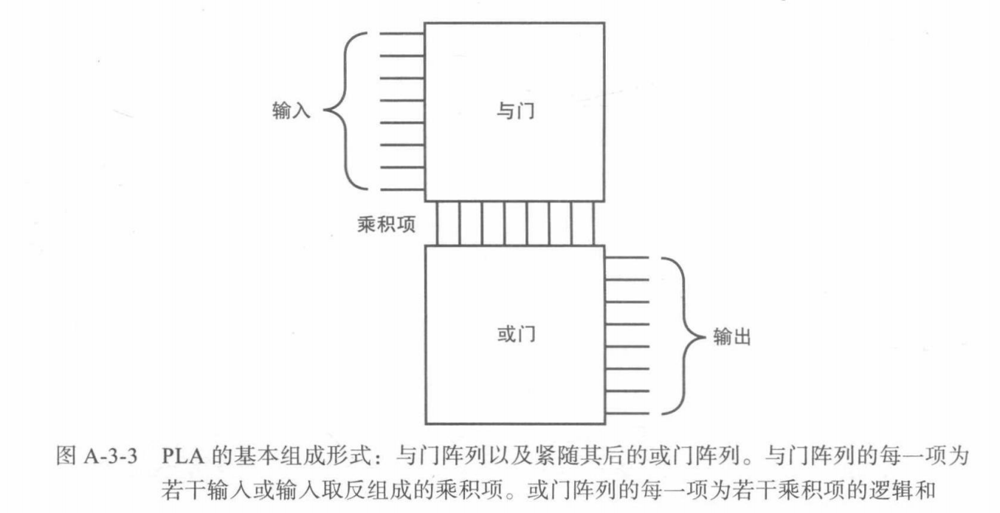
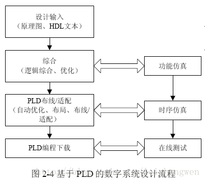
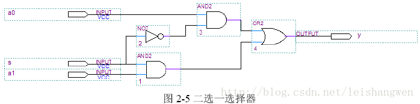

# 0x00. 导读

PLD = Programmable Logic Device, 可编程逻辑器件，意思是“可由用户编程的逻辑电路”。

可编程逻辑器件起源于20世纪70年代，是在专用集成电路（ASIC, Application Specific Integrated Circuit）的基础上发展起来的一种新型逻辑器件，是当今数字系统设计的主要硬件平台，其主要特点就是完全由用户通过软件进行配置和编程，从而完成某种特定的功能，且可以反复擦写。在修改和升级 PLD 时，不需额外地改变PCB电路板，只是在计算机上修改和更新程序，使硬件设计工作成为软件开发工作，缩短了系统设计的周期，提高了实现的灵活性并降低了成本，因此获得了广大硬件工程师的青睐，形成了巨大的 PLD 产业规模。

# 0x01. 简介

- 最早出现的可编程逻辑器件是 1970 年制成的 PROM
- 20世纪70年代中期 出现了可编程逻辑阵列 PLA 器件
- 20世纪70年代末 美国 MMI 公司率先推出了可编程阵列逻辑 PAL 器件
- 20世纪80年代初 Lattice 公司发明了通用阵列逻辑 GAL 器件
- 20世纪80年代中期 Altera 公司推出了一种新型的可擦除、可编程逻辑器件 EPLD
- 1985 年 Xilinx 公司首家推出了现场可编程逻辑 FPGA 器件;
- 复杂可编程逻辑器件 CPLD 是 20世纪80年代末 Lattice 公司提出了在线可编程 ISP 技术以后于 20世纪90年代初 出现的;
- 进入 20世纪90年代 后，集成电路技术进入到飞速发展的阶段，可编程逻辑器件的规模超过了百万逻辑门，并且出现了内嵌复杂功能块（如加法器乘法器、RAM、CPU核、DSP核等）的超大规模器件 SOPC.

# 0x02. 

PLD器件从规模上又可以细分为 简单PLD（SPLD）、复杂PLD（CPLD）、FPGA。

按密度分为 低密度PLD 和 高密度PLD
- 低密度 PLD
  - PROM, 编程只读存储器（Programmable Read Only Memory，PROM）
  - PLA, 可编程逻辑阵列（Programmable Logic Array）
  - PAL, 可编程阵列逻辑（Programmable Array Logic，PAL）
  - GAL, 通用阵列逻辑（Generic Array Logic，GAL）
- 高密度 PLD
  - EPLD, 可擦除的可编程逻辑器件（Erasable Programmable Logic Array，EPLA）
  - CPLD, 复杂可编程逻辑器件（Complex Programmable Logic Device，CPLD）
  - FPGA, 现场可编程门阵列（Field Programmable Gate Array，FPGA）
  
PLD 从结构上可分为两大类：
- 阵列型，其基本结构为 与-或阵列 的器件
- 单元型，其基本结构类似于 门阵列 的器件，由简单的查找表组成可编程逻辑门，再构成阵列形式。大多数 FPGA 属于此类器件。

按编程工艺划分：
- 熔丝（Fuse）型器件，反熔丝（Antifuse）型器件
- UEPROM 型器件，EEPROM 型器件
- SRAM 型器件
- Flash 型器件

典型的PLD一般都是二级结构，通常第一级为“与阵列”，第二级为“或阵列”。由“与阵列”输入，进行逻辑“与”组合，形成乘积项，再由这些不同的乘积项通过“或阵列”构成所需求的逻辑函数输出。



可编程逻辑器件的编程语言为hardware description language(硬件描述语言)，简称：HDL。
HDL并非仅有一种，而是有许多种，如ABEL、AHDL、Confluence、CUPL、HDCal、JHDL、Lava、Lola、MyHDL、PALASM、RHDL等都是，但目前最具知名也最普遍使用的是 VHDL 与 Verilog。



设计输入是将设计者所设计的电路以开发软件要求的某种形式表达出来，并输入到对应软件中的过程。

设计输入有多种方式。最经常使用的是原理图方式和HDL文本方式两种。

原理图（Schematic）是图形化的表达方式，使用元件符号和连线来描写叙述设计。


HDL 文本输入
```Verilog
module mux2(a0, a1, s, y);
      input  s, a0, a1;
      output y;
      assign y = s ? a1 : a0;
endmodule
```