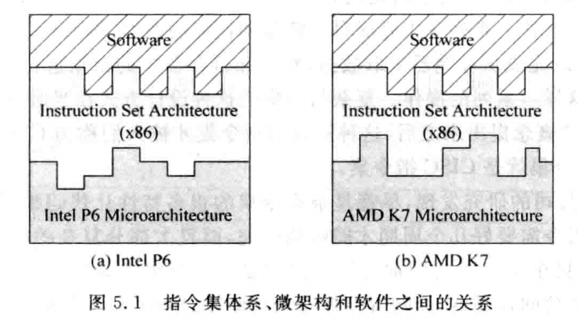
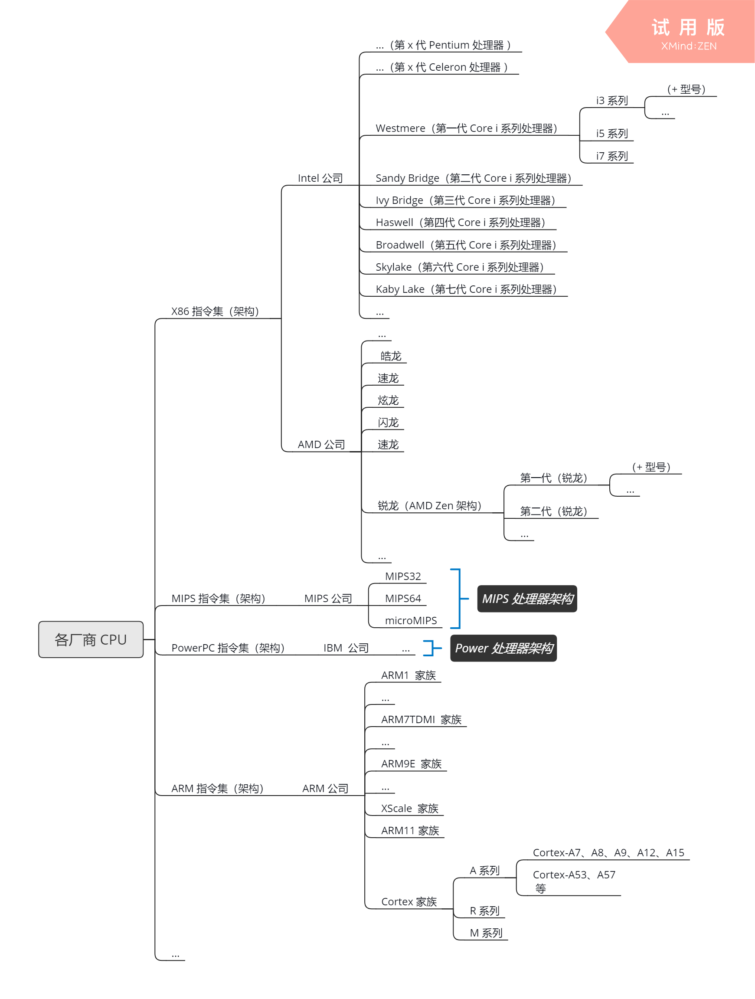

# 0x00. 导读

介绍 ISA 的概念。

# 0x01. 简介

**指令集体系(InstructionSetArchitecture, ISA)** 是规定处理器的外在行为的一系列内容的统称，它包括基本数据类型(datatypes)、**指令集(instructions)**，寄存器(registers)，寻址模式(addressing modes)、存储体系(memory architecture)、中断(interrupt)、异常(exception)以及外部I/O(external I/O)等内容。

> 指令构成的集合称为指令集，它规定了 CPU 可执行的所有操作，也是一种规范。用饭店的比喻就是菜谱，它定义了这个厨房能做什么菜，这个菜做出来是什么样什么味道，使得顾客在这家连锁店的任何一间都能叫到相同的菜，吃到相同的味道。

在指令集体系中规定了处理器的行为，它是处理器使用的语言。正如两个中国人使用汉语交谈的时候可以懂得对方表达的意思一样，使用同样指令集体系的不同处理器也可以懂得彼此，在这种情况下，一个软件可以运行在任何支持同一个指令集体系的不同处理器上面。

指令集体系是软件人员和处理器设计师之间的桥梁，软件人员可以不必关心处理器的硬件实现细节，只需要根据指令集体系就可以开发软件，而处理器设计人员则需要设计出符合指令集体系的处理器。对于同一个指令集体系来说，有很多的实现方式，可以做得很简单但是速度很慢，也可以做得很复杂但是速度很快。**对一个指令集体系的硬件实现方式称为微架构(microarchitecture)**，不同的设计师、不同的市场需求都会导致不同的微架构，例如 Intel 的 P6微架构（代表作品是 PentiumⅢ 处理器）和 AMD 的 K7微架构（代表作品是 Athlon 处理器），两者都是基于 x86 指令集体系而设计的，但是它们在内部结构上并不相同，在性能表现上也是不同的，这可以用下图来表示。

# 0x02. 

 

这张图描述了整个计算机系统从上到下的抽象层。首先最顶层的是应用程序（Application），那么应用程序在计算机里是由什么构成的呢？是由它的下一层级，算法（Algorithm）构成的。算法也依赖于所实现它的编程语言（Programming Language），然而编程语言也需要操作系统（Operating System）的支持才能正确工作。那什么东西支持操作系统呢？再往下一层就是 指令集架构（Instruction Set Architecture, 以下简称 ISA ）。

## 2.1 指令

当我们给 CPU 的一些指定端口传入 特殊 的高低电平时，CPU 内部的逻辑电路就会按照 “事先设计的规则” 进行运转，并在一些端口输出最终 “计算的结果” 。这些特殊的高低电平就是所谓的 **指令**。

指令其实有两个鲜明的特征：
- 事先约定
- CPU实现。  
  
也就是说这些指令是在创造 CPU 之前就已经约定好的，而后实现的 CPU 必须按照指令来实现相应的功能。

## CISC 和 RISC

指令集架构从本质上可以分为：

- 复杂指令集运算（Complex Instruction Set Computing，CISC）
  
    CISC 的特点是能够在一条指令内完成很多事情。

    X86 属于 CISC.

- 精简指令集运算（Reduced Instruction Set Computing，RISC）

    RISC 最初起源于加州伯克利分校的一个4人团队，RISC-V 是研究团队在2010年推出的第五代 RISC 体系，读作 risk-five ，由于它的免费、开源和高效，RISC-V 很快便引来越来越多的科技巨头的加入。

    当前比较流行的 RISC 有 ARM、MIPS和 PowerPC 等。

