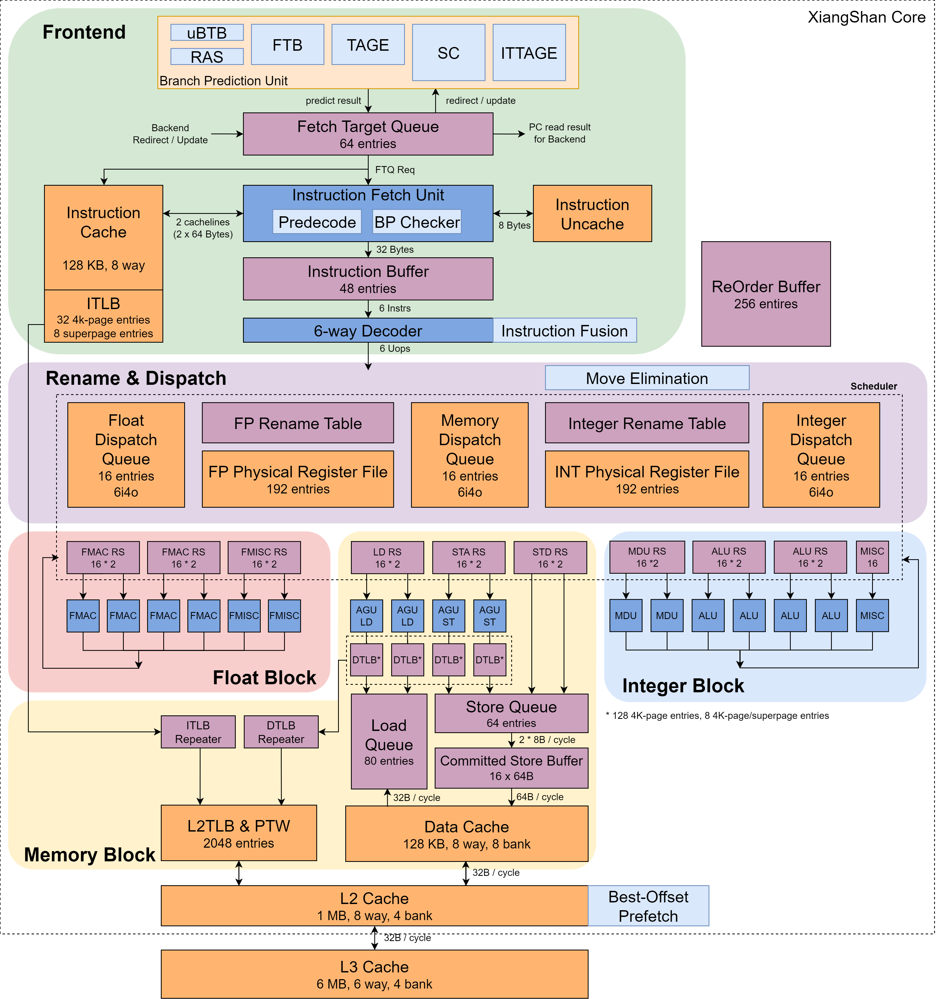

# 0x00. 导读

一个事实：顺序执行的处理器有瑕疵。假想这么一个情况，lw(load word) 指令后面紧跟着一连串的计算指令，且这些计算指令和 lw 指令没有关系，在这种情况下，如果 lw 指令发生 data cache miss，那么它可能会被卡在访存阶段几十上百个周期，而因为处理器是顺序执行的，所以后面的一连串计算指令也都被阻塞住。这里面就出现了一个问题，lw 后面的一连串指令完全不依赖 lw 指令，但是却因为 lw 指令而没办法继续执行。在理想情况下，我们肯定希望在 lw 指令阻塞的时候，别的可以执行的指令继续执行，不要受 lw 的影响。也就是需要处理器支持乱序。

乱序的意思也就是指令在执行过程中不按照指令顺序执行，在乱序情况下，只要一条指令所需要的数据准备好了，那么就执行这条指令，而不用像顺序执行一样既要准备好数据，又要前面的指令把“路”让出来。

现在的问题就是，如何判断指令是否可提前执行。更具体的说，就是几个冲突问题：
- 结构冲突
  - 例如对于硬件资源争夺
- 数据冲突/冒险（data hazard）
  - WAR（Write-After-Read）读后写冲突。
  - WAW（Write-After-Write）写后写冲突。
  - RAW（Read-After-Write）写后读冲突。
- 控制冲突
  - 主要是分支指令导致的冲突
  
结构冲突和控制冲突无法避免，我们需要想办法消除数据冲突。

# 0x01. 简介

Tomasulo 算法是一种动态调度技术，用于提高现代处理器中的指令执行效率，特别是在超标量和乱序执行的架构中。它通过解决数据依赖问题，使得指令可以在不同步的情况下并行执行。

基础的 Tomasulo 算法不能保证 Precise Exception 和 Speculation，带有 Reorder buffer 的 Tomasulo 扩展算法可以解决这个问题。

# 0x02. 算法概述

Tomasulo 算法通过寄存器重命名、保留站和重排序缓冲区等机制，支持指令的动态调度和乱序执行，显著提高了现代处理器的性能。它是许多现代处理器设计的重要组成部分。

精确异常即处理完当前指令异常后可以无障碍执行下一条指令。但是在乱序提交的情况下，下一条指令可能先于当前指令提交。为了解决这个问题，提出了ROB。

## 2.1 关键组成部分

- 寄存器重命名

    Tomasulo 算法使用物理寄存器来替代逻辑寄存器，从而消除伪依赖（WAR 和 WAW），允许指令安全并行执行。（RAW 问题会通过算法规则解决）

- 保留站（RS, Reservation Stations）：

    每个执行单元都有保留站，用于存储待执行指令的信息，包括操作码、操作数以及指令的源寄存器。如果操作数尚未准备好，保留站会记录这些依赖关系。

- 寄存器文件：

    存储物理寄存器，指令在执行时会从中读取输入数据。

- 重排序缓冲区（ROB, Reorder Buffer）：

    用于跟踪指令的执行状态，确保指令在提交时按照原始顺序进行。

- CDB, Common Data Bus
  
    用于广播指令执行结果。当一条指令执行完成时，其结果会通过 CDB 广播给所有等待该结果的指令。

# 2.2 工作流程

1. 指令提取：

    处理器从指令队列中提取指令，进入解码阶段。

2. 寄存器重命名：

    在解码后，逻辑寄存器被映射到新的物理寄存器，以消除伪依赖。

3. 分发和发射：

    解码后的指令被发送到相应的保留站。如果指令的操作数可用，它会被发射到对应的执行单元。

4. 执行：

    一旦所有操作数在保留站中准备就绪，指令就会被执行单元调度并执行。

5. 写回和提交：

    执行结果被写入重排序缓冲区。指令在完成执行后，等待其他指令提交以保持程序顺序。最终，结果会按照指令的原始顺序写回寄存器文件。

