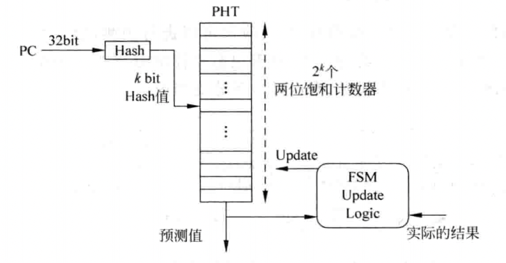

# 0x00. 导读

在处理器中，除了 Cache 之外，另外一个重要的内容就是分支预测，它和 Cache 一起左右着处理器的性能。

本文讲的是 分支指令的方向预测。

# 0x01. 简介

对于超标量处理器来说，准确度高的分支预测更为重要，**在取指令阶段，除了需要从 I-Cache 中取出多条指令，同时还需要决定下个周期取指令的地址**，如果这个阶段只是简单地顺序取指令，也就是预测所有的分支指令都是不执行的，那么等到在流水线的后续阶段例如执行阶段，发现了一条可以执行的分支指令时，就需要将流水线中，执行阶段之前的全部指令都从流水线中清除，并重新从正确的地址开始取指令。这些从流水线中被抹掉的指令都做了无用功，浪费了处理器的功耗，并且降低了执行效率。如果能够在取指令阶段，就可以预知本周期所取出的指令中是否存在分支指令（**条件一**），并且可以知道它的方向(跳转或者不跳转)（**条件二**），以及目标地址(target address)（**条件三**）的话，那么就可以在下个周期从分支指令的目标地址开始取指令，这样就不会对流水线产生影响，也就避免了做无用功，提高了处理器的执行效率。

这种不用等到分支指令的结果真的被计算出来，而是提前就预测结果的过程就是**分支预测**。分支预测之所以能够实现，是由分支指令的特性决定的，因为分支预测本质上是对分支指令的结果进行预测，而在一般的 RISC 指令集中，分支指令包含两个要素。

1. 方向
   
   对于一个分支指令来说，它的方向只可能有两种，一种是发生跳转(这称为taken)，另一种是不发生跳转(称为nottaken)。有些分支指令是无条件执行的，例如MIPS中的jump指令，它的方向总是发生跳转的，而对于其他的分支指令，则需要根据指令中携带的条件是否成立来决定是不是发生跳转，例如MIPS中的BEQ指令，只有当指定的两个值相等的时候，才会发生跳转。

2. 目标地址
   
   如果分支指令的方向是发生跳转，就需要知道它跳到哪里，也就是它跳转的目标地址，这个目标地址也是携带在指令中，一般来说，对于 RISC 指令集来说，目标地址在指令中可以有两种存在形式。

   - PC relative, 也叫直接跳转。在指令中直接以立即数的形式给出一个相对于 PC 的偏移值。
  
   - Absolute, 也叫间接跳转。分支指令的目标地址来自于一个通用寄存器的值。但是，这个通用寄存器的值一般来自于其他指令的结果因此对于分支指令来说，可能需要等待一段时间才可以得到这个目标地址，例如需要等到流水线的执行(execute)阶段，在这段时间内进入到流水线中的指令都是有可能不正确的，这就增大了分支预测失败时的惩罚(misprediction penalty)。而且，由于寄存器的值是会经常变化的，因此这种类型的分支指令很难对目标地址进行预测，但是庆幸的是，程序当中大部分间接跳转的分支指令都是用来调用子程序的 CALL/Return 类型的指令，而这种类型的指令由于有着很强的规律性，是容易被预测的。除了 CALL/Return 指令之外，一般的处理器都不会推荐使用间接跳转类型的分支指令。

要对一条分支指令进行预测，就需要对它的方向和目标地址都进行预测。对于方向预测来说，需要预测这条分支指令是否会发生跳转；对于目标地址的预测来说，需要预测这条分支指令在发生跳转时的目标地址。

静态预测（Static prediction）是最简单的分支预测技术，因为它不依赖于代码执行的动态历史信息。相反，它仅依赖于分支指令自身。最简单的静态分支预测方法就是任选一条分支。

动态预测利用分支指令发生转移的历史来进行预测，并根据实际执行情况动态调整预测位，准确率可达90%，现在几乎所有处理器都采用动态预测。

后续内容我们做两个符号约定，not taken 和 taken :
- 不采取（not taken）跳转，顺序执行后面紧挨 JMP 的指令；
- 采取（taken）跳转到另一块程序内存去执行那里的指令。

## 1.1 分支延迟槽

了解一下就好，逐渐废弃了。

解释一：分支延迟槽就是紧跟在分支指令后面的一条指令，不管分支是否发生，这条指令都会被执行。
解释二：指在分支指令（如跳转、分支等）后，处理器在分支决定生效之前，依旧会执行一条指令。这条指令就位于所谓的分支延迟槽中。

例如
```asm
BEQ $t0, $t1, label   # 如果$t0 == $t1，则跳转到label
ADD $t2, $t3, $t4     # 位于分支延迟槽的指令
label:
```

为了更好地理解分支延迟槽，我们先来回顾一下指令流水线。在指令流水线中，指令的执行被分成多个阶段，比如取指、译码、执行、访存等。当遇到分支指令时，处理器需要根据分支条件来决定下一条指令的地址，这会导致流水线出现停顿，因为后续的指令无法在分支结果确定之前被执行。

为了减少这种停顿带来的性能损失，处理器设计者引入了分支延迟槽。通过在分支指令后放置一条指令，处理器可以在等待分支结果的同时，继续执行这条指令，从而提高流水线的利用率。

分支延迟槽的工作原理
- 分支指令: 当处理器遇到分支指令时，它会先将分支指令和紧随其后的延迟槽指令都取出来。
- 延迟槽指令执行: 无论分支条件是否满足，延迟槽指令都会被执行。
- 分支判断: 在延迟槽指令执行的同时，处理器会根据分支条件来判断是否进行跳转。
- 跳转或继续执行: 如果分支条件满足，处理器就会跳转到新的地址；如果不满足，处理器就会继续执行下一条指令。

## 1.2 找出分支指令

分支预测的三个条件第一条就是：如何从 I-Cache 取出来的指令中，找出分支指令。对于每周期取出多条指令的超标量处理器来说，更加复杂了，需要从指令组（fetch group, 一个周期内，从 I-Cache 中取出的所有指令）中找出分支指令。**找到分支指令，就可以将其对应的 PC 值送到分支预测器（branch predictor）中，就可以对分支指令进行预测了。**

一般都是在指令从 L2 Cache 写入到 I-Cache 之前进行快速解码，这也称为 预解码（pre-decode），然后将指令是否是分支指令的信息和指令一起写入到 I-Cache 中。但是，取指令直到分支预测得到结果，这两个阶段的间隔时间仍然是过长的，无法得到解决。

下面重点说分支指令的方向和目标地址。

# 0x02. 两位饱和计数器（saturating counter）

在现代处理器中，动态分支预测技术在提升处理器 IPC 方面非常重要。

## 2.1 最简单的方法——直接使用上次分支的结果

```c
for(i = 0;i < 1000;i++)
{
    一些语句;
}
```

我们假设第一次结果为不跳转（结果错了，因为会跳转，由于我们的规则是直接使用上次分支的结果，所以后续我们的预测是跳转），那么第二次、第三次...第 1000 次预测为跳转，很明显，在使用该方法时，只有两次预测错误（即第一次和最后一次，即 1000 次），因此预测的成功率为998/1000=99.8%。

但假设对于一个分支，其方向变化规律为（T表示跳转，N表示不跳转）：T N T N T N T N T N...，那么将会导致每次预测都失败，其成功率为0%。

由于这种方法的准确度波动过大，难以被接受，因此并没有在现代处理器中被采纳。目前应用最广泛的分支预测方法都是基于两位饱和计数器的方法。

## 2.2 基于两位饱和计数器的分支预测

两位饱和计数器，顾名思义，用两个比特位来存储预测结果，而这两个比特位分别表示如下四种状态：

- Strongly taken, 11：计数器处于饱和状态，分支指令本次会被预测发生跳转
- Weakly taken, 10：计数器处于不饱和状态，分支指令本次会被预测发生跳转
- Weakly not taken, 01：计数器处于不饱和状态，分支指令本次会被预测不发生跳转
- Strongly not token, 00：计数器处于饱和状态，分支指令本次会被预测不发生跳转


例如上图最左侧是 `00` ，当处于这个状态的时候，分支结果都是不跳转。这个时候如果预测错了（给出的结果是不跳转，结果是要跳转），状态变为 `01` ，当处于这个状态的时候，分支结果都是不跳转，如果这个时候预测错了（给出的结果是不跳转，结果是要跳转），状态变为 `10` ，当处于这个状态的时候，分支结果都是跳转，这个时候如果预测正确（给出的结果是跳转，结果也是要跳转），状态变为 `11` ，当处于这个状态的时候，分支结果都是跳转。

**当状态机处于饱和状态的时候，只有两次连续的预测失败才会改变预测结果。该状态机的初始状态通常采用 Strongly not taken 或者 Weakly not taken。**

```c
for(i = 0;i < 1000;i++)
{
    一些语句
}
```

可以看到，假设状态机初态是 Weakly not token 时，利用饱和计数器方法，其预测准确率是 99.8%。

这种方式的优点在于，对于偶尔的、瞬间的分支方向变化不敏感（比如只是偶尔出现一次方向的改变，预测值很可能不会改变），不过对于 `T-N-T-N-T-N` 型的分支而言，其还是存在成功率过低（根据初态不同，最差为0%，最好为50%）的问题。

# 0x03. 模式历史表, PHT, Pattern History Table

**分支预测都是以 PC 值为基础的，所以正常来说，每个 PC 值都对应一个两位的 饱和计数器。**因此，对于 32 位的 PC 值来说，共需要 2^32 / 2^2 * 2b 大小的存储器来存储这些计数器的值，考虑到并不是所有的指令都是分支指令，通常我们会从 PC 的中部取一段作为两位饱和计数器存储器的 key.


PHT（Pattern History Table）是一个表格，在其中存放着所有 PC 值（此处是 PC 值的一部分）对应的两位饱和计数器的值，这个 PHT 使用 PC 值的一部分来寻址。

但是这样做，可能会导致多条分支指令共享一个 PHT 项，这会导致别名问题（两个 k 值相同的分支指令 PC 值寻址到同一个表项），会降低分支预测的准确率。为了解决这个问题，可以采用哈希的方法，对 PC 值进行哈希处理后再去寻址 PHT。



这种分支预测方法很难达到98%以上的正确率，因此现代处理器都不会直接使用这种方法了。

PHT 的作用就是，给定一条跳转指令，hash 出来的值裁剪后传入 PHT ，得到一个结果，跳转 或者 不跳转，后面根据预测的正确或者错误还需要更新 PHT 对应的值。

# 0x04. 基于局部历史的分支预测-又称自适应两级分支预测（Adaptive Two-level Predictor）

考虑上文提到的 `T-N-T-N-T-N` 情况，此时即使用上了两位饱和计数器，分支预测准确率还是会为 0，当然这与计数器初始状态相关。但是这个跳转的情况其实是规律的，既然有规律，那么肯定是可以被预测的，如何对它进行预测呢？可以使用一个寄存器来记录一条分支指令在过去的历史状态，当这个历史状态很有规律时，就可以为分支预测提供有利帮助，这样的寄存器称为 分支历史寄存器（Branch History Register-BHR），这种预测方法称为基于局部历史的预测方法。

对一条分支指令来说，通过将它每次的结果（发生跳转或者不发生跳转，用 1 或 0 表示）移入 BHR 寄存器，就可以记录这条分支指令的历史状态了，如果这条分支指令很有规律，那么就可以使用 BHR 寄存器对这条分支指令进行预测。

一个位宽为 n 位的 BHR 寄存器可以记录一条分支指令过去 n 次的结果（即发生跳转或者不发生跳转），对 BHR 使用一个两位的饱和计数器来捕捉它的规律，此处的 PHT 仍旧是一个表格，大小是 2^n * 2bit, PHT 当中存有 BHR 的每种取值对应的两位饱和计数器的值。

## 4.1 例子

假设 BHR 位宽为 3, 对应一个 8 个表项的 PHT, 假设分支序列是 T -> T -> NT -> NT -> T -> T -> NT -> NT -> T -> T -> NT -> NT -> T -> T -> NT -> NT ->  ...

BHR 是一个移位寄存器, 每次结果假设是从右边移位进来：

- 那么初始的时候，BHR 的值是 000
- 第一个来的是 T, BHR 的值是 001
- 第二个来的是 T, BHR 的值是 011
- 第三个来的是 NT, BHR 的值是 110
- 第四个来的是 NT, BHR 的值是 100
- 第五个来的是 T, BHR 的值是 001
- 第六个来的是 T, BHR 的值是 011
- 第七个来的是 NT, BHR 的值是 110
- 第八个来的是 NT, BHR 的值是 100
- 第九个来的是 T, BHR 的值是 001
- 第十个来的是 T, BHR 的值是 011
- 第十一个来的是 NT, BHR 的值是 110
- 第十二个来的是 NT, BHR 的值是 100
- 第十三个来的是 T, BHR 的值是 001
- 第十四个来的是 T, BHR 的值是 011
- 第十五个来的是 NT, BHR 的值是 110
- 第十六个来的是 NT, BHR 的值是 100
- ....

PHT 中有 8 个表项，key 分别是 000 001 010 011 100 101 110 111 ，其实用到的就 5 个，000 001 011 110 100 。有 key 就有 value ，value 就是前面的 两位饱和计数器 状态机，假设 8 个 value 初始状态都是 01, Weakly not taken 吧，假定 8 个 value 代号分别是 entry0-7 ，随着时间的推移，每次都会自我学习和纠正，最后稳定：

- 初始的时候，BHR 的值是 000, entry0 = 01, 给出的结果是不跳转，实际下一个来的是跳转，所以 entry0 = 10
- 第一个来的是 T, BHR 的值是 001, entry1 = 01, 给出的结果是不跳转，实际下一个来的是跳转，所以更新 entry1 = 10
- 第二个来的是 T, BHR 的值是 011, entry2 = 01, 给出的结果是不跳转，实际下一个来的是不跳转，所以更新 entry2 = 00
- 第三个来的是 NT, BHR 的值是 110, entry3 = 01, 给出的结果是不跳转，实际下一个来的是不跳转，所以更新 entry3 = 00
- 第四个来的是 NT, BHR 的值是 100, entry4 = 01, 给出的结果是不跳转，实际下一个来的是跳转，所以更新 entry4 = 10
- 第五个来的是 T, BHR 的值是 001, entry1 = 10, 给出的结果是跳转，实际下一个来的是跳转，所以更新 **entry1** = 11
- 第六个来的是 T, BHR 的值是 011, entry2 = 00, 给出的结果是不跳转，实际下一个来的是不跳转，所以 **entry2** = 00, 保持不变
- 第七个来的是 NT, BHR 的值是 110, entry3 = 00, 给出的结果是不跳转，实际下一个来的是不跳转，所以 **entry3** = 00, 保持不变
- 第八个来的是 NT, BHR 的值是 100, entry4 = 10, 给出的结果是跳转，实际下一个来的是跳转，所以更新 **entry4** = 11

- 至此，用到的 entry 都已达到饱和状态，下面继续看看，验证一下。

- 第九个来的是 T, BHR 的值是 001, entry1 = 11, 给出的结果是跳转，实际下一个来的是跳转，所以 entry1 = 11, 保持不变
- 第十个来的是 T, BHR 的值是 011, entry2 = 00, 给出的结果是不跳转，实际下一个来的是不跳转，所以 entry2 = 00, 保持不变
- 第十一个来的是 NT, BHR 的值是 110, entry3 = 00, 给出的结果是不跳转，实际下一个来的是不跳转，所以 entry3 = 00, 保持不变
- 第十二个来的是 NT, BHR 的值是 100, entry4 = 11, 给出的结果是跳转，实际下一个来的是跳转，所以 entry4 = 11, 保持不变
- 第十三个来的是 T, BHR 的值是 001, entry1 = 11, 给出的结果是跳转，实际下一个来的是跳转，所以 entry1 = 11, 保持不变
- 第十四个来的是 T, BHR 的值是 011, entry2 = 00, 给出的结果是不跳转，实际下一个来的是不跳转，所以 entry2 = 00, 保持不变
- 第十五个来的是 NT, BHR 的值是 110, entry3 = 00, 给出的结果是不跳转，实际下一个来的是不跳转，所以 entry3 = 00, 保持不变
- 第十六个来的是 NT, BHR 的值是 100, entry4 = 11, 给出的结果是跳转，实际下一个来的是跳转，所以 entry4 = 11, 保持不变
- ....

上面的例子其实 BHR 位宽为 2 就够了，因为相邻的两位 11 10 00 01 后面跟的值都是不一样的，为了例子容易明白，才用 3 位来举例。

序列中，连续相同的数最多有 p 位，则这个序列的循环周期位 p ，例如序列 "11000_11000_11000..." ，因为有 3 个连续的 0 ，2 个连续的 1 ，所以循环周期是 3 而不是 2 ，更不是 5 。只要 BHR 的宽度 n 大于等于 p ，就可以对该序列进行完美的预测。

## 4.2 例子

假如一个 for 循环的次数为 4 ，那么当被编译为汇编指令后，肯定有一条分支指令，这条分支指令就会有类似 TTTNTTTNTTTN... 的行为，我们用 1110_1110_1110_... 表示，1 表示发生了跳转，0 表示没有发生跳转。这个序列的循环周期是 3 ，我们用一个 4 位宽的 BHR ，那么 PHT 中就会有 16 个表项。

我们会发现，BHR 中会循环出现 1110 1101 1011 0111, 并且 
- 1110 后面一定跟着 1 ，所以 PHT 中 1110 对应的计数器会停在 strongly taken 的饱和状态，也就是 11
- 1101 后面一定跟着 1 ，所以 PHT 中 1101 对应的计数器会停在 strongly taken 的饱和状态，也就是 11
- 1011 后面一定跟着 1 ，所以 PHT 中 1011 对应的计数器会停在 strongly taken 的饱和状态，也就是 11
- 0111 后面一定跟着 0 ，所以 PHT 中 0111 对应的计数器会停在 strongly not taken 的饱和状态，也就是 00

PHT 中只用了 4 个表项，其余的 12 个表项都浪费了。

**注意：目前为止，每个分支指令都有自己的 BHR 和 PHT 。**这样需要非常大的存储空间，是不现实的。

BHR 组合在一起的表称作 分支历史寄存器表（Branch History Register Table, BHRT 或 BHT），实际一般都会将 PC 的哈希值作为 BHT 的索引，通过对 BHR 进行复用从而缩小 BHT 的体积。

PHT 的体积也是一个大问题，在最开始的方法中，每一条指令仅仅对应一个 2bit 饱和计数器，而这里却对应若干个 2bit 饱和计数器，其数量和 BHR 的位宽直接相关，也就是说 PHT 变成了 PHTs ，为了解决这个问题，我们可以让所有的指令共用一个 PHT ，然后将 PC 的值与 BHT 输出的值进行处理（如拼接、XOR、哈希等方法）作为PHT的索引，即可大大缩小PHT的大小。

# 0x05. 基于全局历史的分支预测

```c
if(aa == 2) //b1
{
    aa = 0;
}

if(bb == 2) //b2
{
    bb = 0;
}

if(aa != bb) //b3
{
    一些语句
}
```

可以看到，如果分支 b1 和 b2 都执行了，那么分支b3就不会执行，只依靠分支b3的局部历史进行分支预测，是永远不会发现这个规律的，因此需要在预测b3时同时考虑b1与b2的跳转结果，为了实现方法，我们需要一个 全局历史寄存器（Global History Register, GHR），这是一个有限位宽的寄存器，来记录最近若干条分支指令的跳转结果，每当遇到一条跳转指令时，就会将其结果移入 GHR 。

使用 GHR 最简单的方法，便是采用 PHTs，由 PC 选择具体的 PHT，再由 GHR 的值选择 PHT 的某一项，但是这存问题：PHT过大，因此我们可以采用和0x03类似的优化方法：只使用一个PHT，并将GHR的值与PC做某种混合处理后再作为PHT的索引，这样便大大减少了PHT使用的存储空间。

我们可以注意到，由于这种方法仅考虑了全局历史，却没有考虑局部历史，因此对于TNTN这种有规律的分支，反而可能会出现预测准确度下降的问题。其本质原因在于有些分支指令适合使用基于全局历史的分支预测方法，而另一些则更适合使用句历史的分支预测方法，这就引出了下面的方法。

# 0x06. 竞争的分支预测

对于基于局部历史的分支预测和基于全局历史的分支预测，两种预测方法都有着自身的局限性，因此可以设计一种自适应的分支预测方法，根据不同的分支指令和执行情况自动地选择这两种分支预测方法，称为竞争的分支预测。