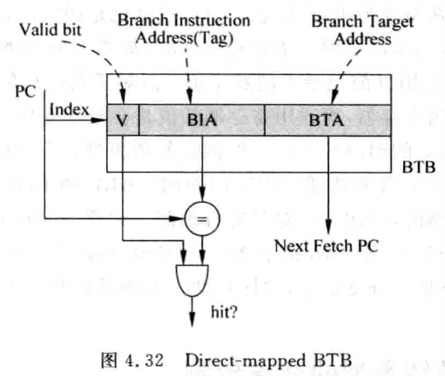
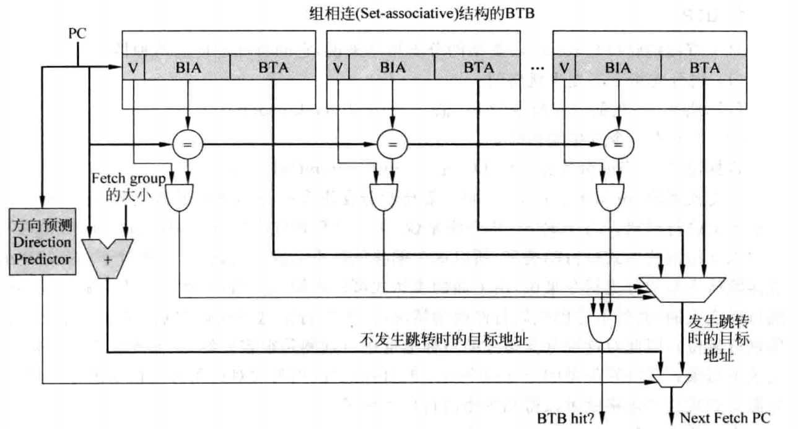
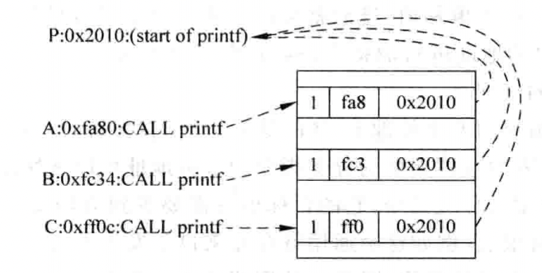

# 0x00. 导读

本文讲的是 分支指令的目标地址预测。

# 0x01. 简介

分支指令的目标地址(target address)可以分为两种，即直接跳转(PC-relative)和间接跳转(absolute)。

对于直接跳转的分支指令，由于它的偏移值(offset)是以立即数的形式固定在指令当中，所以它的目标地址也是固定的，只要记录下这条分支指令的目标地址就可以了，当再次遇到这条分支指令时，如果方向预测的结果是发生跳转，那么它的目标地址就可以使用以前记录下的那个值;

而对于间接跳转的分支指令来说，由于它的目标地址来自于通用寄存器，而通用寄存器的值是会经常变化的，所以对这种类型的分支指令来说，进行目标地址的预测并不是一件很容易的事情，但是庆幸的是，程序中大部分间接跳转类型的分支指令是用来处理子程序调用的 **CALL** 和 **Return** 指令，而这两种指令的目标地址是有规律可循的，因此可以对其进行预测。大部分超标量处理器都会推荐编译器的设计者，除了使用 CALL/Return 指令之外，尽量减少使用其他间接跳转类型的分支指令，而多使用直接跳转类型的分支指令，这样有助于处理器提高分支预测的准确度，从而提高处理器的性能，

# 0x02. 直接跳转类型的分支预测

对于直接跳转(PC-relative)类型的分支指令来说，它的目标地址有两种情况
- (1)当分支指令不发生跳转时，  
    目标地址 = 当前分支指令的 PC 值 + Sizeof(fetchgroup)。
- (2)当分支指令发生跳转时，  
    目标地址 = 当前分支指令的 PC 值 + Sign_extend(offset)

分支预测器(branchpredictor)除了需要对分支指令的方向进行预测之外，还需要对目标地址也进行预测。对于RISC指令集来说，由于计算地址所需要的偏移值(offset)是在指令中以立即数的形式进行的携带，所以这个偏移值是不会发生变化的，因此对于一条特定的直接跳转类型的分支指令来说，由上面的表达式可以得知，它的目标地址是不会随着程序的执行而变化的，因此对这种分支指令的目标地址进行预测是很容易的，只需要使用一个表格记录下每条直接跳转类型的分支指令对应的目标地址，当再次对这条分支指令进行预测时，只需要查找这个表格就可以得到预测的目标地址了。

由于分支预测是基于PC值进行的，不可能对每一个PC值都记录下它的目标地址，所以一般都使用 Cache 的形式，使多个PC值共用一个空间来存储目标地址，这个 Cache 称为 **BTB(Branch TargetBuffer)**，如图表示了采用 直接映射 结构的 BTB 的示意图。



BTB 本质上是 Cache，所以它的结构和 Cache 也是一样的，使用PC值的一部分来寻址 BTB(这部分称为 index)，PC 值的其他部分作为 Tag。BTB 中存放着分支指令的 目标地址(Branch Target Address，BTA) ，因为 Index 部分相同的多个PC值会查找到 BTB中的同一个地方，所以使用 Tag 来进行区分，当这些PC值中存在多于一条的分支指令时，就产生了冲突，这样会造成BTB中对应的内容被频繁地替换，影响了分支预测的准确度。为了解决这个问题，可以采用组相连结构的BTB，当有多条分支指令都指向BTB的同一个地方时(也就是它们的PC值的Index部分相同)，可以将它们的BTA放到不同的way中，如图所示。



由于组相连结构增加了设计的复杂度、使 BTB 占用的硅片面积增大、降低了 BTB 的访问速度，因此在现实世界的处理器中，BTB 中 way 的个数一般都比较小。

## 2.1 BTB 缺失的处理

当一条分支指令的方向是预测发生跳转，而此时 BTB 发生了缺失，例如在直接映射结构的BTB中，多条分支指令对应着同一个表项，那么此时这条分支指令的目标地址就有可能不在BTB中，当然就无法对这条分支指令的目标地址进行预测，这时候应该怎么办呢?处理器可以采用两种方法来解决这个问题：

1. 停止执行
   
   对于直接跳转类型的分支指令，在流水线的解码阶段就可以从指令中分离出偏移值，此时就可以将这条分支指令的目标地址计算出来。在分支指令的目标地址被计算出来之前，暂停取指令会导致流水线中出现一些 **气泡**。

2. 继续执行

    对于方向预测会发生跳转的分支指令来说，如果发生了 BTB 的缺失，此时可以使流水线继续使用顺序的 PC 值来取指令。之所以这样做，是考虑到分支指令的方向可能会预测错误，所以当 BTB 发生缺失时，采用顺序的PC值来取指令，也存在正确的可能性。

# 0x03. 间接跳转类型的分支预测

## 3.1 CALL/Return 指令的分支预测

在一般的程序中，CALL 指令用来调用子程序，使流水线从子程序中开始取指令执行而在子程序中，Return指令一般是最后一条指令，它将使流水线从子程序中退出，返回到主程序中的 CALL 指令之后，继续执行。对于程序中的一条指定的 CALL 指令来说，它每次调用的子程序都是固定的，也就是说，一条 CALL 指令对应的目标地址是固定的，因此可以使用BTB对CALL指令的目标地址进行预测：



printf 函数的起始地址是 `0x2010`, 三条不同的 CALL 指令都调用了 printf 函数，因为这三条指令的PC值不同，所以它们占据了 BTB 中的不同地方，由于被调用的 printf 函数的地址是固定的，所以这三条 CALL，指令都可以使用 BTB 对目标地址进行正确的预测。

但是 Return 指令的目标地址是不确定的，因此无法使用BTB对它的目标地址进行预测，但是可以看出，**Return 指令的目标地址总是等于最近一次执行的CALL指令的下一条指令的地址**，因此，可以设计一个存储器，保存最近执行的CALL指令的下一条指令的地址，这个存储器是后进先出的，即最后一次进入的数据将最先被使用，称为 **RAS(Return Address Stack)**。

**使用 BTB 对 CALL 指令的目标地址进行预测，使用 RAS 对 Return 指令的目标地址进行预测**。

## 3.2 其它间接跳转分支指令

例如 `case`:
```c
switch c:
    case 1:
        go A; break;
    case 2:
        go B; break;
    case 3:
        go C; break;
    case 4:
        go D; break;
    ...
``` 

它的目标地址也可能和过去的执行情况有关系，因此可以利用基于局部历史的分支预测方法中使用 BHR 对目标地址进行预测。